# AUD-BILLING-NOTIF-01 — Auditoria Completa: Billing e Notificações de Inadimplência

**Data:** 2026-06-19  
**Origem:** AUD-WORKERS-01 · AUD-WORKERS-01-PHASE2 · AUD-NOTIFICATION-CENTER-01 · AUD-NOTIFICATION-CENTER-02-FIX · NC-03-BRIDGE  
**Repositório:** `/var/www/impetus-completa`  
**Modo:** read-only — nenhuma implementação, alteração de código, BD, worker ou notificação

---

## Modo de auditoria (confirmado)

```json
{
  "audit_mode": true,
  "read_only": true,
  "no_code_changes": true,
  "no_database_changes": true,
  "no_notification_creation": true,
  "no_scheduler_creation": true,
  "no_worker_creation": true,
  "no_zapi": true,
  "no_whatsapp": true,
  "no_behavior_changes": true
}
```

---

## Resumo executivo

O IMPETUS possui **integração Asaas madura para ciclo de vida de assinatura** (criação, confirmação, overdue, cancelamento, link de boleto, suspensão pós-carência). Desde a remoção do par `subscription_worker.js` + `subscriptionNotifications.js` (commits `5921bb23e` / `4a2aa4a6b`, Mar/2026), **não existe camada proactiva de comunicação** nos dias 3, 5 e 7 de inadimplência.

A infraestrutura moderna de notificações (**Notification Center operacional** pós NC-02-FIX, **App Impetus outbox**, **email SMTP**) está **disponível mas desconectada** do domínio billing. A tabela `subscription_notifications` **existe na BD**, está vazia, e não tem writer activo.

**Classificação:** billing **reactivo parcial** + proactivo **ausente**.  
**Próxima fase recomendada:** BILLING-NOTIF-02 (implementação aditiva, sem novo worker PM2).

---

## Diagrama — fluxo actual vs legado

```mermaid
flowchart TB
  subgraph asaas [Asaas]
    WH[PAYMENT_OVERDUE webhook]
    WH2[PAYMENT_CONFIRMED / RECEIVED]
  end

  subgraph backend [Backend actual]
    WH --> HPO[asaasService.handlePaymentOverdue]
    HPO --> BD1[(subscriptions.status=overdue)]
    HPO --> BD2[(companies.subscription_status=overdue)]
    HPO --> AUD[audit log only]

    WH2 --> HPC[handlePaymentConfirmed]
    HPC --> ACT[active + clear overdue_since_date]

    CRON[subscriptionGovernanceScheduler<br/>flag OFF default]
    CRON --> SUSP[checkGracePeriodAndSuspend]
    SUSP --> BD3[(status=suspended, active=false)]

    PLINK[GET /subscription/payment-link]
  end

  subgraph ux [UX reactiva]
    BAN[Layout banner overdue]
    SE[SubscriptionExpired.jsx]
    MT[requireCompanyActive 403]
  end

  BD2 -.->|companies.getMe MISSING| BAN
  BD3 --> MT
  PLINK --> SE

  subgraph legacy [Legado removido]
    SW[subscription_worker hourly]
    SN[processProgressiveNotifications]
    SW --> SN
    SN --> D3[Day 3 Email]
    SN --> D5[Day 5 App Impetus]
    SN --> D7[Day 7 flag + banner]
    SN --> DED[(subscription_notifications)]
  end

  style legacy fill:#1a1a2e,stroke:#ff4040
  style SN fill:#331111
```



---

## ETAPA 1 — Mapeamento billing completo

### Artefactos auditados

| Artefacto | Caminho | Papel |
|-----------|---------|-------|
| Serviço Asaas | `backend/src/services/asaasService.js` | Cliente, assinatura, webhooks handlers, suspensão, payment link |
| Webhook | `backend/src/routes/webhooks/asaas.js` | Switch de eventos Asaas |
| Rotas UX | `backend/src/routes/subscription.js` | `GET /payment-link` |
| Governança | `backend/src/services/subscription/subscriptionGovernanceScheduler.js` | Cron horário → suspensão |
| Email | `backend/src/services/emailService.js` | `sendOverdueNotificationEmail` (órfão) |
| Tokens IA | `backend/src/services/billingTokenService.js` | Billing de consumo — **domínio separado** da assinatura base |

### Mapa por evento de negócio

```json
{
  "payment_created": {
    "trigger": "asaasService.activateCompanySubscription() — POST Asaas customers + subscriptions",
    "webhook_handler": "none — PAYMENT_CREATED não tratado",
    "db_effects": [
      "subscriptions INSERT status=pending, grace_period_days=10",
      "companies subscription_status=pending, active=false"
    ],
    "notifications": "none",
    "evidence": "asaasService.js:125-166"
  },
  "payment_pending": {
    "trigger": "Asaas gera cobrança BOLETO MONTHLY — estado implícito PENDING no Asaas",
    "webhook_handler": "none — PAYMENT_PENDING não tratado",
    "db_effects": "subscriptions.status permanece pending até confirmação",
    "notifications": "none",
    "evidence": "webhooks/asaas.js switch — só CONFIRMED/RECEIVED/OVERDUE/CANCELED"
  },
  "payment_overdue": {
    "trigger": "Webhook PAYMENT_OVERDUE",
    "handler": "asaasService.handlePaymentOverdue",
    "db_effects": [
      "subscriptions.status=overdue, overdue_since_date=payment due date",
      "companies.subscription_status=overdue"
    ],
    "notifications": "audit log subscription_payment_overdue only — severity warning",
    "evidence": "asaasService.js:212-247, webhooks/asaas.js:50-52"
  },
  "payment_received": {
    "trigger": "Webhooks PAYMENT_RECEIVED ou PAYMENT_CONFIRMED",
    "handler": "handlePaymentReceived → handlePaymentConfirmed",
    "db_effects": [
      "subscriptions.status=active, overdue_since_date=NULL",
      "companies.active=true, subscription_status=active"
    ],
    "notifications": "audit log subscription_payment_confirmed only",
    "evidence": "asaasService.js:171-207, 252-254"
  },
  "subscription_suspended": {
    "trigger": "checkGracePeriodAndSuspend — overdue_since + grace_period_days < now()",
    "executor": "subscriptionGovernanceScheduler (se ENABLE_SUBSCRIPTION_GOVERNANCE_CRON=true)",
    "db_effects": [
      "subscriptions.status=suspended",
      "companies.active=false, subscription_status=suspended"
    ],
    "notifications": "audit log subscription_suspended only — severity critical",
    "not_asaas_webhook": true,
    "evidence": "asaasService.js:318-347, subscriptionGovernanceScheduler.js:64-75"
  },
  "subscription_reactivated": {
    "trigger": "Pagamento confirmado após overdue/suspended",
    "handler": "handlePaymentConfirmed (mesmo fluxo que payment_received)",
    "db_effects": "active=true, subscription_status=active",
    "notifications": "none — sem evento SUBSCRIPTION_REACTIVATED explícito",
    "evidence": "asaasService.js:171-207"
  }
}
```

### Detalhe `asaasService.js`

| Função | Comunicação externa | Notificação |
|--------|---------------------|-------------|
| `createCustomer` | API Asaas — email de `data_controller_email \|\| config.billing_email` | Não |
| `activateCompanySubscription` | Cria cliente + assinatura | Não |
| `handlePaymentOverdue` | — | Não |
| `handlePaymentConfirmed` | — | Não |
| `checkGracePeriodAndSuspend` | — | Não |
| `getSubscriptionPaymentLink` | GET payments + invoiceUrl/bankSlipUrl | Não (on-demand API) |

### Detalhe webhook `POST /api/webhooks/asaas`

- Responde `200 { received: true }` imediatamente; processamento em `setImmediate`.
- Segurança: token `ASAAS_WEBHOOK_TOKEN`, IP `177.93.*`.
- Persiste em `asaas_webhook_logs`.
- **Eventos tratados:** `PAYMENT_CONFIRMED`, `PAYMENT_RECEIVED`, `PAYMENT_OVERDUE`, `SUBSCRIPTION_CANCELED`, `SUBSCRIPTION_DELETED`.
- **Eventos ignorados (log only):** todos os restantes, incluindo `PAYMENT_CREATED`, `PAYMENT_PENDING`.

### Rotas subscription

| Rota | Middleware | Função |
|------|------------|--------|
| `GET /api/subscription/payment-link` | `requireAuth` — **sem** `requireCompanyActive` | Permite utilizador bloqueado obter boleto |

### UX frontend reactiva

| Componente | Comportamento | Limitação auditada |
|------------|---------------|-------------------|
| `Layout.jsx:230-236` | Chama `companies.getMe()` → banner se `subscription_status === 'overdue'` | **`GET /api/companies/me` não existe** em `routes/companies.js` (só `POST /`) |
| `SubscriptionExpired.jsx` | Boleto via API, mailto/wa.me estático | Contacto manual, não mensageria integrada |
| `api.js:122-124` | Redirect 403 `COMPANY_INACTIVE` → `/subscription-expired` | **`multiTenant.js` não emite `COMPANY_INACTIVE`** — usa `TENANT_BLOCKED` ou mensagem genérica |

---

## ETAPA 2 — Inventário de eventos

### Eventos solicitados vs realidade

```json
{
  "events": {
    "PAYMENT_CREATED": {
      "exists_in_asaas": true,
      "handled_in_impetus": false,
      "notes": "Criação local via activateCompanySubscription; webhook ignorado"
    },
    "PAYMENT_PENDING": {
      "exists_in_asaas": true,
      "handled_in_impetus": false,
      "notes": "Estado implícito no Asaas; sem handler"
    },
    "PAYMENT_OVERDUE": {
      "exists_in_asaas": true,
      "handled_in_impetus": true,
      "handler": "asaasService.handlePaymentOverdue"
    },
    "PAYMENT_CONFIRMED": {
      "exists_in_asaas": true,
      "handled_in_impetus": true,
      "handler": "asaasService.handlePaymentConfirmed"
    },
    "PAYMENT_RECEIVED": {
      "exists_in_asaas": true,
      "handled_in_impetus": true,
      "handler": "asaasService.handlePaymentReceived → handlePaymentConfirmed"
    },
    "SUBSCRIPTION_CANCELED": {
      "exists_in_asaas": true,
      "handled_in_impetus": true,
      "handler": "asaasService.handleSubscriptionCanceled"
    },
    "SUBSCRIPTION_DELETED": {
      "exists_in_asaas": true,
      "handled_in_impetus": true,
      "handler": "same as SUBSCRIPTION_CANCELED"
    },
    "SUBSCRIPTION_SUSPENDED": {
      "exists_in_asaas": false,
      "handled_in_impetus": true,
      "internal_only": true,
      "handler": "checkGracePeriodAndSuspend — não é webhook Asaas"
    },
    "SUBSCRIPTION_REACTIVATED": {
      "exists_in_asaas": false,
      "handled_in_impetus": "implicit via PAYMENT_CONFIRMED",
      "no_dedicated_handler": true
    }
  },
  "confirmed_webhook_events": [
    "PAYMENT_CONFIRMED",
    "PAYMENT_RECEIVED",
    "PAYMENT_OVERDUE",
    "SUBSCRIPTION_CANCELED",
    "SUBSCRIPTION_DELETED"
  ]
}
```

---

## ETAPA 3 — Destinatários de comunicação

### Campos de empresa (código vs BD auditada)

| Campo (código) | Uso previsto | BD auditada (2026-06-19) |
|----------------|--------------|--------------------------|
| `data_controller_email` | Email Asaas + dia 3 | **Coluna inexistente** — query falha |
| `config.billing_email` | Fallback email | **Coluna `config` inexistente** |
| `data_controller_phone` | App Impetus dia 5 | **Inexistente** |
| `email_responsavel` | Admin portal / onboarding | **Presente** |
| `telefone_responsavel` | — | **Presente** |
| `nome_responsavel` | — | **Presente** |

**Achado crítico:** deriva de schema entre `asaasService.js`, `admin/settings.js` (referenciam `data_controller_*`) e schema real com colunas comerciais `email_responsavel` / `telefone_responsavel` (`admin_portal_migration.sql`). BILLING-NOTIF-02 deve **unificar resolução de destinatário** antes de enviar.

### Utilizadores internos (padrões existentes no codebase)

| Padrão | Onde | Critério |
|--------|------|----------|
| Admins hierárquicos | `dsrNotificationService.notifyDpoTeam` | `hierarchy_level <= 1`, active |
| Supervisores NC | `notificationBridgeService.findSupervisorNcRecipients` | `hierarchy_level <= 2` OR role admin/manager/gerente/supervisor/ceo/diretor |
| Tenant admin | `auth.js`, `tenantAdminService` | `is_tenant_admin === true` |

### Resposta estruturada

```json
{
  "billing_recipients": [
    {
      "type": "financial_email",
      "priority": 1,
      "resolution": "companies.data_controller_email OR companies.config.billing_email",
      "code_evidence": "asaasService.js:63, subscriptionNotifications legado dia 3",
      "day": 3,
      "channel": "email"
    },
    {
      "type": "financial_phone",
      "priority": 1,
      "resolution": "companies.data_controller_phone",
      "code_evidence": "subscriptionNotifications legado dia 5",
      "day": 5,
      "channel": "app_impetus"
    }
  ],
  "fallback_recipients": [
    {
      "type": "commercial_contact",
      "resolution": "companies.email_responsavel",
      "evidence": "impetusAdmin/companies.js, admin_portal_migration.sql",
      "note": "Único email empresarial confirmado na BD auditada"
    },
    {
      "type": "tenant_admins",
      "resolution": "users WHERE hierarchy_level <= 1 AND active",
      "evidence": "dsrNotificationService.js:133-136",
      "day": 7,
      "channel": "notification_center"
    },
    {
      "type": "executive_supervisors",
      "resolution": "notificationBridgeService.findSupervisorNcRecipients(limit=5)",
      "evidence": "notificationBridgeService.js:91-115",
      "day": 7,
      "channel": "notification_center"
    }
  ],
  "mobile_recipients": [
    {
      "type": "financial_phone",
      "resolution": "data_controller_phone OR telefone_responsavel",
      "channel": "app_impetus_outbox",
      "day": 5
    },
    {
      "type": "user_by_phone",
      "resolution": "users.whatsapp_number OR users.phone → unifiedMessaging.sendToUserByPhone",
      "channel": "notification_center",
      "day": 7,
      "optional": true
    }
  ]
}
```

---

## ETAPA 4 — Canais disponíveis

| Canal | Disponível | Usado para billing hoje | Pronto para uso futuro | Evidência |
|-------|------------|-------------------------|------------------------|-----------|
| `emailService.sendOverdueNotificationEmail` | Sim (requer SMTP_*) | **Não** — 0 callers | Sim — template HTML pronto | `emailService.js:108-156` |
| `unifiedMessagingService.sendToUser` | Sim | **Não** para billing | Sim — NC operacional NC-02 | `unifiedMessagingService.js:27-81` |
| `appImpetusService.sendMessage` | Sim | **Não** para billing | Sim — `originatedFrom: 'subscription'` suportado | `appImpetusService.js:26-51` |
| Notification Center | Sim (NC-02-FIX) | **Não** — NC-03 explícito fora billing | Sim | `notificationCenterService.js`, NC-03 report |

```json
{
  "emailService.sendOverdueNotificationEmail": {
    "available": true,
    "currently_used_for_billing": false,
    "ready_for_future_use": true,
    "smtp_required": ["SMTP_HOST", "SMTP_USER"]
  },
  "unifiedMessagingService.sendToUser": {
    "available": true,
    "currently_used_for_billing": false,
    "ready_for_future_use": true,
    "writes_to": "app_notifications + socket app_notification"
  },
  "appImpetusService.sendMessage": {
    "available": true,
    "currently_used_for_billing": false,
    "ready_for_future_use": true,
    "writes_to": "app_impetus_outbox"
  },
  "Notification Center": {
    "available": true,
    "currently_used_for_billing": false,
    "ready_for_future_use": true,
    "bridges_billing": false,
    "evidence": "NC_03_BRIDGE_REPORT.md — billing fora de escopo"
  }
}
```

---

## ETAPA 5 — Tabela `subscription_notifications`

### Confirmação BD (query read-only 2026-06-19)

```json
{
  "exists": true,
  "schema": {
    "id": "uuid NOT NULL",
    "subscription_id": "uuid NULL",
    "company_id": "uuid NULL",
    "notification_type": "text NOT NULL",
    "sent_at": "timestamptz NULL",
    "metadata": "jsonb NULL"
  },
  "writers": [],
  "readers": [],
  "currently_active": false,
  "can_be_reused": true,
  "row_count": 0,
  "retention": {
    "registry": "retentionPolicyRegistry.js:171",
    "ttl_days": 180,
    "action": "PURGE"
  },
  "legacy_types": ["email_day3", "whatsapp_day5", "dashboard_day7"],
  "migration_in_repo": false,
  "notes": "Schema inferido de git db1d1ae7d:subscriptionNotifications.js + information_schema"
}
```

### Lógica de dedupe legada (referência)

```sql
SELECT 1 FROM subscription_notifications
WHERE subscription_id = $1 AND notification_type = $2 LIMIT 1
```

Writer removido com `subscriptionNotifications.js` (commit `4a2aa4a6b`).

---

## ETAPA 6 — Fluxo antigo (Git)

### Fontes

| Artefacto | Commit de referência | Estado actual |
|-----------|---------------------|---------------|
| `subscriptionNotifications.js` | `db1d1ae7d` | **Removido** (`4a2aa4a6b`) |
| `subscription_worker.js` | `5921bb23e^` | **Removido** (`5921bb23e`) |
| `messages.js` SUBSCRIPTION | `db1d1ae7d` | **Removido** — ficheiro actual só AUTH/ERRORS |

### Worker legado

```javascript
// scripts/subscription_worker.js (5921bb23e^)
await subscriptionNotifications.processProgressiveNotifications();
await asaasService.checkGracePeriodAndSuspend();
// Cron sugerido: 0 * * * * ou 0 9 * * *
```

### Extracção da lógica (não restaurar)

```json
{
  "day_3": {
    "condition": "daysSinceOverdue(overdue_since_date) >= 3",
    "action": "sendOverdueNotificationEmail(to=data_controller_email || config.billing_email)",
    "dedupe_type": "email_day3",
    "on_success": "INSERT subscription_notifications + audit subscription_notification_day3"
  },
  "day_5": {
    "condition": "days >= 5",
    "action": "appImpetusService.sendMessage(companyId, phone, SUBSCRIPTION.OVERDUE_WHATSAPP_DAY5(diasRestantes), { originatedFrom: 'subscription' })",
    "phone": "data_controller_phone normalizado 55+",
    "dedupe_type": "whatsapp_day5",
    "note": "Nome legado whatsapp_day5 — implementação real era App Impetus, não Z-API"
  },
  "day_7": {
    "condition": "days >= 7",
    "action": "UPDATE companies SET config = jsonb_set(..., '{overdue_alert_day7}', 'true')",
    "dedupe_type": "dashboard_day7",
    "frontend": "banner quando subscription_status=overdue (hoje genérico, não gated por flag)"
  },
  "dedupe_strategy": {
    "table": "subscription_notifications",
    "key": "(subscription_id, notification_type)",
    "check_before_send": "wasNotificationSent()",
    "record_after_success": "recordNotificationSent(subscriptionId, companyId, type, metadata)",
    "notification_days_array": [3, 5, 7],
    "grace_default": 10,
    "suspension_day": "grace_period_days (default 10) via checkGracePeriodAndSuspend — separado do loop 3/5/7"
  }
}
```

### Timeline Git

| Commit | Data aprox. | Alteração |
|--------|-------------|-----------|
| `5921bb23e` | 2026-03-13 | Remove `subscription_worker.js` |
| `4a2aa4a6b` | posterior | Remove `subscriptionNotifications.js` |
| FIX-SUBSCRIPTION | 2026-06-19 | Reintroduz só `checkGracePeriodAndSuspend` via scheduler |

---

## ETAPA 7 — Compatibilidade com arquitectura moderna

| Componente | Estado | Aderência billing |
|------------|--------|-------------------|
| Notification Center | Operacional (NC-02-FIX) | Escrita via `unifiedMessagingService` — **plugável dia 7** |
| App Impetus | Outbox activo | **Canónico dia 5** (já era no legado) |
| Email SMTP | Função órfã pronta | **Canónico dia 3** |
| Subscription Governance Scheduler | Existe; flag default false | **Ponto de extensão** — adicionar ciclo notificações no mesmo cron |
| NC-03 Bridge | Activo; billing excluído | Billing deve usar `unifiedMessaging` directamente ou bridge dedicado futuro |

```json
{
  "modern_architecture_ready": true,
  "requires_new_tables": false,
  "requires_new_workers": false,
  "requires_new_services": true,
  "requires_new_scheduler": false,
  "rationale": {
    "tables": "subscription_notifications reutilizável",
    "workers": "Estender subscriptionGovernanceScheduler no processo PM2 existente",
    "services": "Novo subscriptionBillingNotificationService aditivo na fase 2 — não existe hoje",
    "scheduler": "Cron 0 * * * * já definido; só acrescentar passo antes de suspensão"
  }
}
```

---

## ETAPA 8 — Gap analysis (dias 3 / 5 / 7)

```json
{
  "gap_exists": true,
  "missing_components": [
    "subscriptionBillingNotificationService (ou equivalente)",
    "Invocação de processProgressiveNotifications no ciclo de governança",
    "Writer activo em subscription_notifications",
    "Resolução unificada de destinatários (data_controller vs email_responsavel)",
    "Texto SUBSCRIPTION.OVERDUE_WHATSAPP_DAY5 (removido de messages.js)",
    "GET /api/companies/me ou correcção do banner Layout",
    "Código COMPANY_INACTIVE no middleware multiTenant (UX redirect)",
    "Flag ENABLE_SUBSCRIPTION_GOVERNANCE_CRON=true em produção (suspensão)"
  ],
  "available_components": [
    "asaasService.handlePaymentOverdue (marca overdue_since_date)",
    "emailService.sendOverdueNotificationEmail",
    "appImpetusService.sendMessage",
    "unifiedMessagingService.sendToUser",
    "notificationCenterService (leitura/mark-read)",
    "subscriptionGovernanceScheduler.runSubscriptionGovernanceCycle",
    "subscription_notifications table + retention policy",
    "GET /api/subscription/payment-link",
    "SubscriptionExpired.jsx",
    "audit log via logAction"
  ],
  "recommended_reuse": [
    "subscriptionGovernanceScheduler — mesmo cron, novo passo",
    "subscription_notifications — dedupe idempotente",
    "sendOverdueNotificationEmail — dia 3",
    "appImpetusService — dia 5",
    "unifiedMessagingService — dia 7 para admins web",
    "notificationBridgeService.findSupervisorNcRecipients — resolver admins dia 7"
  ]
}
```

### Matriz dia-a-dia

| Dia | Legado | Actual | Gap |
|-----|--------|--------|-----|
| 0 | Vencimento Asaas | Webhook OVERDUE → BD | Sem comunicação |
| 3 | Email financeiro | Nada | **Total** |
| 5 | App Impetus mobile | Nada | **Total** |
| 7 | Flag config + banner | Banner genérico (API quebrada?) | **Parcial / quebrado** |
| 10 | Suspensão worker | Scheduler (flag off) | **Executor existe, desligado** |

---

## ETAPA 9 — Estratégia recomendada

```json
{
  "recommended_next_phase": "BILLING-NOTIF-02",
  "recommended_channels": {
    "day_3": ["email"],
    "day_5": ["app_impetus"],
    "day_7": ["notification_center", "dashboard_banner"]
  },
  "dedupe_strategy": "Antes de cada envio: SELECT em subscription_notifications por (subscription_id, notification_type). Após sucesso: INSERT com metadata { daysOverdue }. Tipos: email_day3, whatsapp_day5, nc_day7 (renomear dashboard_day7 para clareza).",
  "risk_level": "medium",
  "safe_for_production": true
}
```

### Plano BILLING-NOTIF-02 (recomendação — não implementado)

1. **Pré-requisitos**
   - Mapear destinatários: `COALESCE(data_controller_email, config->billing_email, email_responsavel)`.
   - Restaurar rota `GET /api/companies/me` com `subscription_status` **ou** migrar banner para `/dashboard/me`.
   - Alinhar `multiTenant` para emitir `code: COMPANY_INACTIVE` quando `active=false` por billing.

2. **Serviço aditivo** `subscriptionBillingNotificationService.js`
   - Port lógica de `db1d1ae7d:subscriptionNotifications.js` para APIs modernas.
   - Recriar constantes de mensagem dia 5 (ou inline no serviço).
   - Dia 7: `unifiedMessaging.sendToUser` para admins + opcional flag `overdue_alert_day7`.

3. **Integração scheduler**
   - Em `runSubscriptionGovernanceCycle`: `processBillingNotifications()` **antes** de `checkGracePeriodAndSuspend`.
   - Nova flag opcional: `ENABLE_BILLING_NOTIFICATIONS=true` (independente da suspensão).

4. **Observabilidade**
   - `GET /api/audit/billing-notifications/status` (read-only).
   - Métricas: tentativas, sucessos, dedupe skips.

5. **Proibições respeitadas**
   - Sem Z-API / WhatsApp directo.
   - Sem alterar webhooks Asaas.
   - Sem novo worker PM2.

---

## Perguntas obrigatórias — respostas explícitas

### 1. O Billing está hoje completamente silencioso?

**Quase completamente silencioso no proactivo.** Webhooks e scheduler actualizam BD e audit logs sem email, outbox ou NC. Comunicação reactiva limitada: página `/subscription-expired`, link boleto on-demand, possível HTTP 403. Banner overdue depende de `companies.getMe()` — **rota ausente no backend**.

### 2. Existe risco de churn por ausência de comunicação?

**Sim.** Cliente B2B pode permanecer em overdue dias sem aviso até suspensão (dia 10 default) ou tentativa de uso bloqueada. Sem lembretes 3/5/7 aumenta fricção e cancelamento involuntário.

### 3. Quais usuários devem receber notificações?

- **Dia 3 (email):** contacto financeiro da empresa.
- **Dia 5 (mobile):** telefone financeiro via App Impetus.
- **Dia 7 (web):** tenant admins / hierarchy ≤ 1–2 / roles administrativos.
- **Suspensão:** considerar email final opcional na fase 2+ (fora do escopo legado 3/5/7).

### 4. O Notification Center já está apto para Billing?

**Sim**, infraestrutura end-to-end operacional (NC-02-FIX). Falta apenas produtor billing — NC-03 não inclui bridge billing por desenho.

### 5. O App Impetus deve participar?

**Sim — dia 5.** Era o canal legado pós-migração Z-API; outbox `app_impetus_outbox` activo; `originatedFrom: 'subscription'` já previsto.

### 6. O Email deve participar?

**Sim — dia 3.** Função implementada; requer SMTP configurado.

### 7. A tabela subscription_notifications deve ser reutilizada?

**Sim.** Schema adequado, vazio, TTL definido; evita nova tabela e preserva dedupe histórico.

### 8. Existe necessidade de worker?

**Não.** Extensão do scheduler existente no processo `impetus-backend` PM2.

### 9. Existe necessidade de cron novo?

**Não.** Reutilizar expressão `0 * * * *` do `subscriptionGovernanceScheduler`.

### 10. Qual é a implementação correcta para a fase seguinte?

**BILLING-NOTIF-02:** serviço aditivo + integração no ciclo de governança + dedupe + correcção gaps UX/destinatários + flags de activação + testes de auditoria. Ver secção ETAPA 9.

---

## Evidências por ficheiro

| Ficheiro | Linhas / nota |
|----------|---------------|
| `backend/src/services/asaasService.js` | 57-166 activate; 171-247 handlers; 318-347 suspend |
| `backend/src/routes/webhooks/asaas.js` | 43-59 switch eventos |
| `backend/src/routes/subscription.js` | 18-52 payment-link |
| `backend/src/services/subscription/subscriptionGovernanceScheduler.js` | 64-75 ciclo; flag linha 28 |
| `backend/src/services/emailService.js` | 108-156 sendOverdueNotificationEmail |
| `backend/src/services/unifiedMessagingService.js` | 27-81 sendToUser |
| `backend/src/services/appImpetusService.js` | 26-51 sendMessage |
| `backend/src/governance/retentionPolicyRegistry.js` | 171 subscription_notifications |
| `frontend/src/components/Layout.jsx` | 230-236, 1077-1082 banner |
| `frontend/src/pages/SubscriptionExpired.jsx` | 13-14 contactos estáticos |
| Git `db1d1ae7d:subscriptionNotifications.js` | Lógica 3/5/7 completa |
| Git `5921bb23e^:subscription_worker.js` | Orquestração horária |

---

## Queries read-only executadas

```sql
-- Schema subscription_notifications (confirmado)
SELECT column_name, data_type FROM information_schema.columns
WHERE table_name = 'subscription_notifications';

-- Contagem
SELECT COUNT(*) FROM subscription_notifications;  -- 0

-- Subscriptions overdue nesta BD
SELECT COUNT(*) FROM subscriptions WHERE status = 'overdue';  -- 0
```

---

## Critério de sucesso

```json
{
  "audit_completed": true,
  "billing_flow_mapped": true,
  "recipients_identified": true,
  "channels_audited": true,
  "legacy_flow_understood": true,
  "modern_architecture_assessed": true,
  "implementation_recommendation_generated": true,
  "code_changed": false
}
```

---

## Documentos relacionados

- [AUD_BILLING_NOTIF_01_EXEC_SUMMARY.md](./AUD_BILLING_NOTIF_01_EXEC_SUMMARY.md)
- [AUD_WORKERS_01_PHASE2_NOTIFICATION_ARCHITECTURE.md](./AUD_WORKERS_01_PHASE2_NOTIFICATION_ARCHITECTURE.md)
- [AUD_WORKERS_01_FIX_SUBSCRIPTION_REPORT.md](./AUD_WORKERS_01_FIX_SUBSCRIPTION_REPORT.md)
- [AUD_NOTIFICATION_CENTER_02_FIX_REPORT.md](./AUD_NOTIFICATION_CENTER_02_FIX_REPORT.md)
- [NC_03_BRIDGE_REPORT.md](./NC_03_BRIDGE_REPORT.md)
