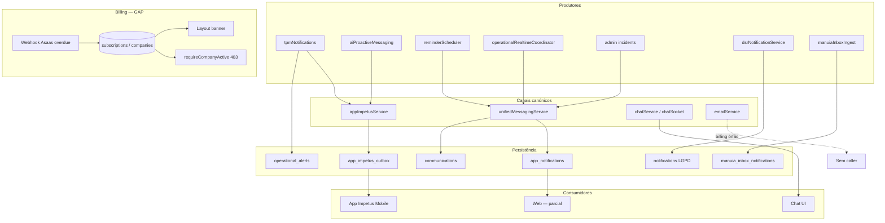

# AUD-WORKERS-01-PHASE2 — Auditoria da Camada Moderna de Notificações

**Data:** 2026-06-19  
**Origem:** [AUD_WORKERS_01_REPORT.md](./AUD_WORKERS_01_REPORT.md) · [AUD_WORKERS_01_FIX_SUBSCRIPTION_REPORT.md](./AUD_WORKERS_01_FIX_SUBSCRIPTION_REPORT.md)  
**Modo:** auditoria read-only — sem alteração de código, sem restauração de Z-API/WhatsApp legado  
**Repositório:** `/var/www/impetus-completa`

---

## Resumo executivo

A Z-API e o fluxo legado `subscriptionNotifications.js` **não são mais canónicos**. O IMPETUS migrou para um ecossistema interno composto por **App Impetus** (outbox + polling), **Unified Messaging** (`app_notifications` + Socket.IO), **Impetus Chat** (WebSocket) e módulos especializados (ManuIA inbox, DSR `notifications`).

| Pergunta-chave | Resposta |
|----------------|----------|
| O que substituiu a Z-API? | `appImpetusService` + `unifiedMessagingService` + `messagingAdapter` |
| Existe Notification Center? | **Parcial** — backend (`app_notifications`, API) + UI shell no header **não ligada** |
| Existe Chat interno utilizável? | **Sim** — `/api/chat` + Socket.IO + módulo `frontend/src/chat-module/` |
| Existe arquitetura pronta para cobrança? | **Parcial** — reactiva (webhook, banner, página bloqueio); **sem** notificações progressivas 3/5/7 |
| Existe perda funcional? | **Sim** — escalonamento proactivo de inadimplência removido com o worker |
| Estratégia correta | **`USE_EXISTING_ARCHITECTURE`** — reutilizar unified messaging + email + scheduler existente |

---

## Modo de auditoria (confirmado)

```json
{
  "audit_mode": true,
  "read_only": true,
  "no_behavior_change": true,
  "no_whatsapp_reintroduction": true,
  "no_zapi_reintroduction": true,
  "no_notification_creation": true,
  "no_worker_creation": true
}
```

---

## ETAPA 1 — Inventário da Comunicação Interna

### Áreas auditadas

| Caminho | Estado | Observação |
|---------|--------|------------|
| `backend/src/chat` | **Inexistente** | Chat vive em `services/chatService.js`, `socket/chatSocket.js`, `routes/chat.js` |
| `backend/src/services` | **Denso** | Camada canónica de mensagens e notificações |
| `backend/src/modules` | **Sem módulo de notificações** | Nenhum módulo dedicado |
| `backend/src/domains` | **Event bus industrial** | Emite `industrial.event` — **não** entrega notificações a utilizadores |
| `frontend/src` | **Chat + shell UI** | Notification bell sem integração API |

### Resultado estruturado

```json
{
  "communication_services": [
    {
      "name": "unifiedMessagingService",
      "path": "backend/src/services/unifiedMessagingService.js",
      "role": "Canal canónico in-app: INSERT app_notifications + communications; push Socket.IO event app_notification",
      "tenant_scoped": true
    },
    {
      "name": "messagingAdapter",
      "path": "backend/src/services/messagingAdapter.js",
      "role": "Facade único — delega sempre a unifiedMessagingService",
      "tenant_scoped": true
    },
    {
      "name": "appImpetusService",
      "path": "backend/src/services/appImpetusService.js",
      "role": "Canal App Impetus Mobile: outbox app_impetus_outbox; polling GET /api/app-impetus/outbox",
      "tenant_scoped": true
    },
    {
      "name": "appCommunicationService",
      "path": "backend/src/services/appCommunicationService.js",
      "role": "Processa mensagens do app (texto/áudio/vídeo) e responde via unifiedMessaging",
      "tenant_scoped": true
    },
    {
      "name": "emailService",
      "path": "backend/src/services/emailService.js",
      "role": "SMTP transacional; sendOverdueNotificationEmail existe mas sem caller activo",
      "tenant_scoped": false
    },
    {
      "name": "operationalRealtimeCoordinator",
      "path": "backend/src/services/operationalRealtimeCoordinator.js",
      "role": "Roteamento operacional em tempo real → unifiedMessaging.sendToUser por role",
      "tenant_scoped": true
    },
    {
      "name": "aiProactiveMessagingService",
      "path": "backend/src/services/aiProactiveMessagingService.js",
      "role": "Mensagens proactivas IA → appImpetusService.sendMessage",
      "tenant_scoped": true
    },
    {
      "name": "reminderSchedulerService",
      "path": "backend/src/services/reminderSchedulerService.js",
      "role": "Lembretes de tarefas agendadas → unifiedMessaging.sendToUser (cron interno server.js)",
      "tenant_scoped": true
    }
  ],
  "notification_services": [
    {
      "name": "unifiedMessagingService",
      "tables": ["app_notifications", "communications"],
      "delivery": ["db", "socket.io:app_notification"],
      "consumers": ["reminderScheduler", "operationalActionExecutor", "operationalRealtimeCoordinator", "appCommunicationService", "admin/incidents", "impetusAdmin/incidents"]
    },
    {
      "name": "dsrNotificationService",
      "path": "backend/src/services/dsrNotificationService.js",
      "tables": ["notifications"],
      "scope": "LGPD/DSR apenas — sem API pública de listagem no frontend web",
      "tenant_scoped": true
    },
    {
      "name": "manuiaInboxIngestService",
      "path": "backend/src/services/manuiaApp/manuiaInboxIngestService.js",
      "tables": ["manuia_inbox_notifications"],
      "delivery": ["inbox", "manuiaWebPushService (opcional VAPID)"],
      "scope": "ManuIA / Extension App — não plataforma global",
      "tenant_scoped": true
    },
    {
      "name": "tpmNotifications",
      "path": "backend/src/services/tpmNotifications.js",
      "tables": ["alerts"],
      "delivery": ["alerts table", "appImpetusService.sendMessage"],
      "tenant_scoped": true
    }
  ],
  "chat_services": [
    {
      "name": "chatService + chatSocket",
      "paths": ["backend/src/services/chatService.js", "backend/src/socket/chatSocket.js", "backend/src/routes/chat.js"],
      "tables": ["chat_conversations", "chat_messages", "chat_push_subscriptions"],
      "protocol": "Socket.IO (send_message, new_message, typing, mark_read)",
      "frontend": "frontend/src/chat-module/",
      "tenant_scoped": true
    },
    {
      "name": "internalChatService",
      "path": "backend/src/services/internalChatService.js",
      "route": "/api/internal-chat",
      "protocol": "HTTP REST only — sem WebSocket",
      "tables": ["internal_chat_conversations", "internal_chat_messages"],
      "tenant_scoped": true
    }
  ],
  "alert_services": [
    {
      "name": "operationalAlertsService",
      "path": "backend/src/services/operationalAlertsService.js",
      "table": "operational_alerts",
      "scope": "Alertas operacionais (máquina parada, tarefas atrasadas, motor de decisões)",
      "push_to_user": false,
      "tenant_scoped": true
    },
    {
      "name": "routes/alerts",
      "path": "backend/src/routes/alerts.js",
      "table": "alerts",
      "scope": "Legado Pró-Ação / TPM — listagem read-only",
      "tenant_scoped": true
    },
    {
      "name": "routes/plcAlerts",
      "path": "backend/src/routes/plcAlerts.js",
      "scope": "Alertas PLC/industriais",
      "tenant_scoped": true
    }
  ]
}
```

### Rotas HTTP relevantes (`server.js`)

| Rota | Middleware | Função |
|------|------------|--------|
| `/api/chat` | `requireAuth` | Impetus Chat API + push subscribe |
| `/api/internal-chat` | auth próprio | Chat interno HTTP |
| `/api/app-impetus` | `requireAuth`, `requireCompanyActive` | Entrada/saída App Mobile |
| `/api/app-communications` | `requireAuth`, `requireCompanyActive` | Comunicações app + **GET /notifications** |
| `/api/alerts` | `requireAuth` | Lista `alerts` |
| `/api/manutencao-ia/app/*` | guard ManuIA | Inbox + Web Push extensão |

### Tabelas de persistência (canónicas)

| Tabela | Papel |
|--------|-------|
| `app_notifications` | Notificações in-app por `recipient_id` (user UUID) |
| `communications` | Histórico unificado (`source`: app, app_impetus, …) |
| `app_impetus_outbox` | Fila outbox App Mobile (polling) |
| `notifications` | Notificações estruturadas (hoje: DSR/LGPD) |
| `operational_alerts` | Alertas operacionais tenant-scoped |
| `alerts` | Alertas legados (TPM, Pró-Ação worker) |
| `manuia_inbox_notifications` | Inbox ManuIA Extension |
| `chat_push_subscriptions` | Web Push Chat (registo existe; envio activo não encontrado em chatService) |
| `subscription_notifications` | Dedupe histórico billing — referenciada em retention policy; serviço removido |
| `zapi_*` | **Legado** — só retention registry; **zero código activo** em `backend/src` |

---

## ETAPA 2 — Mapear substitutos da Z-API

### Evidência: Z-API ausente do runtime

```bash
# grep em backend/src — zero ficheiros zapi*, zero rotas Z-API activas
# Retention apenas: zapi_configurations, zapi_sent_messages (retentionPolicyRegistry.js)
```

### Histórico vs actual (commit `db1d1ae7d`)

O `subscriptionNotifications.js` **já tinha migrado o Dia 5** de Z-API para App Impetus antes da remoção:

```javascript
// Dia 5 — última versão antes do delete (git db1d1ae7d)
await require('./appImpetusService').sendMessage(companyId, toSend, message, {
  originatedFrom: 'subscription'
});
```

### Resultado estruturado

```json
{
  "zapi_replaced": true,
  "replacement": "Ecossistema IMPETUS interno: App Impetus (outbox) + Unified Messaging (app_notifications/Socket.IO) + Impetus Chat (WebSocket). WhatsApp externo via Z-API foi descontinuado.",
  "replacement_services": [
    "backend/src/services/appImpetusService.js",
    "backend/src/services/unifiedMessagingService.js",
    "backend/src/services/messagingAdapter.js",
    "backend/src/services/chatService.js",
    "backend/src/socket/chatSocket.js"
  ],
  "legacy_residue": [
    "users.whatsapp_number — identificador de telefone reutilizado pelo App Impetus",
    "executiveMode.js — findCEOByWhatsApp (nome legado; canal actual: app_impetus)",
    "retentionPolicyRegistry: zapi_configurations, zapi_sent_messages, whatsapp_instances",
    "SubscriptionExpired.jsx — link wa.me manual para contacto financeiro (não integração Z-API)"
  ]
}
```

---

## ETAPA 3 — Auditoria de Notificações

### Arquitectura actual

```text
                    ┌─────────────────────────────────────────┐
                    │           Produtores de evento           │
                    │  TPM, IA proactiva, tarefas, incidentes, │
                    │  operational coordinator, DSR, ManuIA    │
                    └───────────────┬─────────────────────────┘
                                    │
          ┌─────────────────────────┼─────────────────────────┐
          ▼                         ▼                         ▼
 ┌─────────────────┐    ┌──────────────────────┐   ┌─────────────────┐
 │ appImpetusService│    │ unifiedMessagingService│   │ dsrNotification │
 │ → outbox table   │    │ → app_notifications   │   │ → notifications │
 │ → App polling    │    │ → communications      │   │   (LGPD only)   │
 └────────┬─────────┘    │ → Socket.IO emit      │   └─────────────────┘
          │              └──────────┬───────────┘
          │                         │
          ▼                         ▼
   App Impetus Mobile          Web (parcial)
   GET /outbox                 GET /app-communications/notifications
                               Layout bell (UI shell — count=0 fixo)
                               Socket app_notification (room user_{id} — ver gap)
```

### Canais de entrega identificados

| Canal | Mecanismo | Estado |
|-------|-----------|--------|
| **App Impetus Mobile** | `app_impetus_outbox` + polling | **Funcional** — TPM, CEO, IA proactiva |
| **In-app DB** | `app_notifications` | **Funcional** — escrita activa; leitura via API |
| **Socket.IO real-time** | `app_notification` → room `user_{id}` | **Parcial** — emit existe; **nenhum `socket.join('user_*')` encontrado** no backend nem frontend |
| **Impetus Chat** | WebSocket `new_message` | **Funcional** — conversas tenant-scoped |
| **Email SMTP** | `emailService` | **Funcional se SMTP_* configurado**; billing overdue **órfão** |
| **Dashboard banner** | `Layout.jsx` + `subscription_status=overdue` | **Funcional** — reactivo ao login |
| **ManuIA Web Push** | VAPID + `manuiaWebPushService` | **Funcional** — módulo ManuIA apenas |
| **Chat Web Push** | `chat_push_subscriptions` + `/api/chat/push/subscribe` | **Registo existe**; envio automático em nova mensagem **não encontrado** |
| **Event Bus** | `eventPipeline/eventBus` | **Industrial events only** — não notifica utilizadores |

### Resultado estruturado

```json
{
  "notification_architecture": "Multi-canal ad-hoc centrado em unifiedMessagingService (web/in-app) e appImpetusService (mobile outbox). Sem bus de notificações unificado nem fila dedicada global. ManuIA tem pipeline próprio (ingest → inbox → push opcional). DSR usa tabela notifications separada.",
  "delivery_channels": [
    "app_impetus_outbox (mobile polling)",
    "app_notifications (persistência in-app)",
    "communications (histórico)",
    "socket.io app_notification (push web — incompleto)",
    "impetus_chat websocket",
    "email smtp",
    "dashboard ui banner",
    "manuia_inbox + web push vapid",
    "audit_logs (observabilidade, não UX)"
  ],
  "tenant_scoped": true,
  "notification_center": {
    "exists": "partial",
    "backend_api": "GET /api/app-communications/notifications",
    "frontend_wired": false,
    "evidence": "Layout.jsx notificationCount useState(0) fixo; zero listeners app_notification no frontend"
  },
  "message_bus": {
    "exists": true,
    "path": "backend/src/eventPipeline/eventBus",
    "used_for_user_notifications": false
  },
  "notification_queue": {
    "exists": "partial",
    "pattern": "app_impetus_outbox (outbox mobile); sem fila Redis/RabbitMQ para notificações web"
  }
}
```

---

## ETAPA 4 — Billing Communication Mapping

### Fluxo actual por evento

| Evento | Quem comunica | Canal | Evidência |
|--------|---------------|-------|-----------|
| `PAYMENT_OVERDUE` (webhook Asaas) | `asaasService.handlePaymentOverdue` | **BD only** — `subscriptions.status=overdue`, `companies.subscription_status=overdue`, audit log | `routes/webhooks/asaas.js`, `asaasService.js:212-247` |
| Utilizador autenticado com overdue | Frontend `Layout.jsx` | **Banner** + link `/subscription-expired` | `companies.getMe()` → `subscription_status === 'overdue'` |
| Tenant bloqueado (`active=false` / suspenso) | `requireCompanyActive` middleware | **HTTP 403** JSON | `middleware/multiTenant.js` |
| Fim de carência | `subscriptionGovernanceScheduler` (se flag activa) | **BD** — `subscription_status=suspended`, `active=false` | FIX-SUBSCRIPTION; **sem notificação proactiva** |
| Regularização | Webhook `PAYMENT_CONFIRMED` | **BD** — reactivação automática | `asaasService.handlePaymentConfirmed` |
| Link de pagamento | `GET /api/subscription/payment-link` | **API** — URL Asaas on-demand | `routes/subscription.js` |
| Contacto manual | `SubscriptionExpired.jsx` | **mailto:** + **wa.me** estático (env vars) | Não é integração de mensageria |

### Fluxo antigo removido (`subscriptionNotifications.js`, git `db1d1ae7d`)

| Dia | Canal antigo | Canal canónico equivalente hoje |
|-----|--------------|--------------------------------|
| 3 | Email (`sendOverdueNotificationEmail`) | Função existe; **sem invocação** |
| 5 | App Impetus (`originatedFrom: 'subscription'`) | Serviço existe; **sem invocação billing** |
| 7 | Flag `config.overdue_alert_day7` + dashboard | Banner mostra em **qualquer** overdue (não dia 7 específico) |
| 10+ | Suspensão (`checkGracePeriodAndSuspend`) | Scheduler FIX-SUBSCRIPTION (flag off por default) |

### Resultado estruturado

```json
{
  "billing_notification_exists": false,
  "billing_notification_partial": true,
  "billing_notification_service": "Nenhum serviço dedicado activo. Componentes disponíveis: emailService.sendOverdueNotificationEmail (órfão), appImpetusService.sendMessage, unifiedMessagingService.sendToUser, subscriptionGovernanceScheduler (só suspensão).",
  "billing_notification_channel": "Reactivo: webhook Asaas → BD; UX: banner Layout + página SubscriptionExpired + API payment-link. Proactivo: AUSENTE.",
  "billing_communication_gaps": [
    "Sem email automático dia 3",
    "Sem mensagem App Impetus dia 5",
    "Sem escalonamento dia 7 via Notification Center",
    "Tabela subscription_notifications sem writer activo"
  ]
}
```

---

## ETAPA 5 — Gap Analysis

### Comparação: fluxo antigo vs arquitectura IMPETUS

```text
ANTIGO (subscription_worker + subscriptionNotifications)
─────────────────────────────────────────────────────
Dia 3  → Email SMTP
Dia 5  → App Impetus (já migrado de Z-API antes do delete)
Dia 7  → Flag dashboard + banner
Dia 10 → Suspensão (checkGracePeriodAndSuspend)
Dedupe → subscription_notifications

ACTUAL (pós-remoção)
────────────────────
Webhook → overdue em BD
Login   → banner (se overdue)
Fim carência → suspensão (scheduler FIX-SUBSCRIPTION, flag default false)
         → SEM emails, SEM outbox, SEM dedupe, SEM dia 7 específico
```

### Resultado estruturado

```json
{
  "functional_gap_exists": true,
  "gap_type": "MISSING_PROGRESSIVE_BILLING_NOTIFICATIONS",
  "impact": "Tenants em inadimplência não recebem avisos proactivos (email, app, in-app) nos dias 3/5/7. Dependem de login espontâneo, contacto manual ou bloqueio HTTP 403. Risco comercial e de churn silencioso. Funções de envio existem no código base mas estão desconectadas do ciclo de billing.",
  "non_gaps": [
    "Substituição Z-API → App Impetus já estava feita antes da remoção",
    "Suspensão pós-carência tem caminho de remediação (FIX-SUBSCRIPTION)",
    "Banner overdue e página de regularização funcionam quando utilizador acede"
  ],
  "secondary_gaps": [
    "Notification Center UI não consome GET /app-communications/notifications",
    "Socket.IO room user_{id} nunca joined — push web in-app incompleto",
    "notifications table (DSR) não generalizada para billing"
  ]
}
```

---

## ETAPA 6 — Estratégia Correta

### Avaliação dos cenários

| Cenário | Critério | Veredicto |
|---------|----------|-----------|
| **A** — Notification Center moderno | UI + API + delivery unificados | **Parcial** — infra backend existe; frontend desligado |
| **B** — IMPETUS Chat Messaging | Canal conversacional tenant-scoped | **Existe** — adequado para comunicação humana, não para billing automatizado |
| **C** — Design new layer | Zero substituto | **Falso** — substitutos existem |

### Decisão

```json
{
  "status": "USE_EXISTING_ARCHITECTURE",
  "rationale": "Reintroduzir billing progressivo via serviços já canónicos — NÃO restaurar Z-API, subscriptionNotifications.js literal, nem subscription_worker.js. Estender o padrão subscriptionGovernanceScheduler (FIX-SUBSCRIPTION) ou criar subscriptionBillingNotificationService aditivo que orquestre canais existentes.",
  "recommended_channels_by_day": {
    "day_3": "emailService.sendOverdueNotificationEmail → data_controller_email / billing_email",
    "day_5": "unifiedMessagingService.sendToUser (tenant admins hierarchy_level<=1) + appImpetusService.sendMessage (mobile, data_controller_phone)",
    "day_7": "unifiedMessagingService + reforço banner (subscription_status overdue já activo)",
    "post_grace": "subscriptionGovernanceScheduler.checkGracePeriodAndSuspend (já implementado)"
  },
  "dedupe_table": "subscription_notifications (reutilizar schema existente)",
  "explicitly_forbidden": [
    "Restaurar Z-API / WhatsApp API externa",
    "Restaurar subscriptionNotifications.js byte-a-byte",
    "Criar worker PM2 separado subscription-worker"
  ],
  "frontend_follow_up": "Ligar Layout notification bell a GET /api/app-communications/notifications + socket app_notification (requer join user room — fora desta fase)"
}
```

---

## ETAPA 7 — Respostas Objetivas

### 1. O que substituiu a Z-API?

**`appImpetusService`** (canal mobile via outbox + polling) e **`unifiedMessagingService`** (canal web/in-app via `app_notifications` + Socket.IO), expostos pelo **`messagingAdapter`**. Impetus Chat cobre mensagens conversacionais internas. Resíduos Z-API limitam-se a tabelas de retention e campos `whatsapp_number` reutilizados como identificador telefónico.

### 2. Como o IMPETUS comunica eventos hoje?

Por **produtores ad-hoc** que escrevem em tabelas (`app_notifications`, `app_impetus_outbox`, `operational_alerts`, `notifications`, `manuia_inbox_notifications`) e, quando aplicável, emitem Socket.IO ou Web Push. Não há orquestrador central de notificações. Schedulers internos (`reminderSchedulerService`, jobs proactivos) usam `unifiedMessaging`. Billing comunica apenas via **estado BD + UX reactiva**.

### 3. Existe Notification Center?

**Parcialmente.** Backend: `GET /api/app-communications/notifications` lê `app_notifications` por `recipient_id`. Frontend: ícone de sino em `Layout.jsx` com estado vazio hardcoded (`notificationCount = 0`), sem fetch nem listener Socket.IO.

### 4. Existe Chat interno utilizável?

**Sim.** Impetus Chat completo (`/api/chat`, Socket.IO, `frontend/src/chat-module/`). Chat interno HTTP alternativo em `/api/internal-chat` (sem WebSocket). Ambos tenant-scoped.

### 5. Existe arquitetura pronta para cobrança?

**Parcial — reactiva only.** Webhooks Asaas, banner overdue, página `SubscriptionExpired`, API `payment-link`, middleware `requireCompanyActive`, scheduler de suspensão (FIX-SUBSCRIPTION). **Falta** camada proactiva de escalonamento 3/5/7, embora as peças (`emailService`, `appImpetusService`, `unifiedMessagingService`, tabela `subscription_notifications`) existam desconectadas.

### 6. Existe perda funcional?

**Sim.** Remoção de `subscriptionNotifications.js` e `subscription_worker.js` eliminou notificações progressivas de inadimplência. A migração Z-API→App Impetus no Dia 5 **já estava feita**; a perda não é “falta de WhatsApp”, é **falta de orquestração billing** no stack moderno.

### 7. Forma correta de implementar notificações progressivas no IMPETUS moderno?

1. **Não** restaurar arquitectura legada (Z-API, worker PM2, ficheiro antigo).
2. **Sim** — serviço aditivo `subscriptionBillingNotificationService` (nome sugerido) invocado pelo **mesmo scheduler** de governance ou ciclo cron dedicado, com flag `ENABLE_SUBSCRIPTION_BILLING_NOTIFICATIONS`.
3. Reutilizar canais canónicos:
   - Dia 3 → `emailService.sendOverdueNotificationEmail`
   - Dia 5 → `unifiedMessagingService.sendToUser` + `appImpetusService.sendMessage`
   - Dia 7 → reforço in-app + banner (já parcialmente activo)
4. Dedupe via tabela `subscription_notifications` (já prevista em retention policy).
5. Fase posterior: ligar Notification Center web (frontend + `socket.join('user_'+userId)`).
6. Manter suspensão via `subscriptionGovernanceScheduler` (FIX-SUBSCRIPTION) — orthogonal às notificações.

---

## Diagrama de referência — stack moderno



---

## Ficheiros-chave (evidência)

| Ficheiro | Linhas / nota |
|----------|---------------|
| `backend/src/services/unifiedMessagingService.js` | Canal in-app + Socket `app_notification` |
| `backend/src/services/appImpetusService.js` | Outbox mobile; `originatedFrom: 'subscription'` previsto |
| `backend/src/services/messagingAdapter.js` | Facade canónica |
| `backend/src/services/emailService.js:108` | `sendOverdueNotificationEmail` — sem caller |
| `backend/src/routes/appCommunications.js:129` | `GET /notifications` |
| `backend/src/routes/app_impetus.js:56` | `GET /outbox` |
| `backend/src/socket/chatSocket.js` | Impetus Chat WebSocket |
| `frontend/src/components/Layout.jsx:142,935` | Bell UI — count fixo 0 |
| `frontend/src/pages/SubscriptionExpired.jsx` | UX bloqueio billing |
| `backend/src/services/asaasService.js:212` | `handlePaymentOverdue` — só BD |
| `backend/src/services/subscription/subscriptionGovernanceScheduler.js` | Suspensão pós-carência |
| `backend/src/governance/retentionPolicyRegistry.js:171` | `subscription_notifications` |

---

## Comandos de verificação executados

```bash
# Inventário serviços
grep -ri "notification\|messaging\|chat" backend/src/services --include="*.js" | head

# Z-API activa
find backend/src -name "*zapi*"
grep -ri "zapi\|Z-API" backend/src

# Callers billing email
grep -r "sendOverdueNotificationEmail" backend/src

# Frontend notification center
grep -r "app_notification\|app-communications/notifications" frontend/src

# Histórico subscriptionNotifications
git show db1d1ae7d:backend/src/services/subscriptionNotifications.js
```

---

## Relacionamento com outras fases AUD-WORKERS-01

| Fase | Estado | Relação |
|------|--------|---------|
| AUD-WORKERS-01 | Concluída | Identificou workers ausentes |
| FIX-SUBSCRIPTION | Concluída | Suspensão pós-carência — **notificações fora de escopo** |
| **PHASE2 (este documento)** | Concluída | Mapeia arquitectura moderna; define estratégia sem implementar |
| Fase futura sugerida | Pendente | `subscriptionBillingNotificationService` + wiring Notification Center |

---

*Documento gerado em modo auditoria read-only. Nenhum código, worker, integração Z-API ou fluxo legado foi alterado ou restaurado.*
