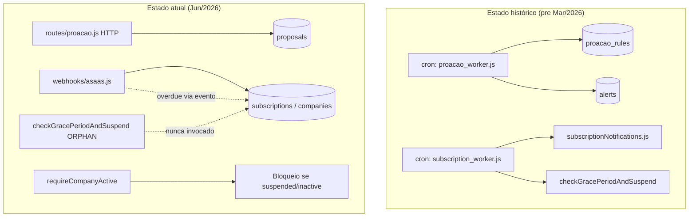

# AUD-WORKERS-01 — Inventário Completo de Processamento Assíncrono

**Data:** 2026-06-19  
**Modo:** auditoria técnica read-only (sem alteração de código)  
**Escopo:** `proacao-worker` / `subscription-worker` e substitutos no ecossistema IMPETUS  
**Repositório:** `/var/www/impetus-completa/backend`

---

## Resumo executivo

| Worker | Arquivo | Estado no disco | Última presença no Git | Substituto identificado | Perda funcional |
|--------|---------|-----------------|------------------------|-------------------------|-----------------|
| `proacao-worker` | `scripts/proacao_worker.js` | **AUSENTE** | Removido em `5921bb23e` (2026-03-13) | **Nenhum equivalente** | **Parcial** — automação de regras/alertas Pró-Ação e TPM |
| `subscription-worker` | `scripts/subscription_worker.js` | **AUSENTE** | Removido em `5921bb23e` (2026-03-13) | **Parcial** — webhooks Asaas + `requireCompanyActive` | **Sim** — notificações progressivas e suspensão pós-carência |

**Causa raiz:** exclusão acidental ou intencional durante merges de interface (`5921bb23e`, `4a2aa4a6b`) sem internalização equivalente no `server.js`. Os aliases em `package.json` **não foram removidos**, gerando resíduo operacional.

**Recomendação imediata (sem implementar nesta fase):** tratar como **dívida técnica confirmada**; remover aliases órfãos após remediação; internalizar `checkGracePeriodAndSuspend` no backend principal; decidir destino da automação Pró-Ação com base em uso real de `proacao_rules` na BD de produção.

---

## Respostas objetivas (critério de sucesso)

| # | Pergunta | Resposta |
|---|----------|----------|
| 1 | Os workers realmente desapareceram? | **Sim.** Arquivos ausentes no disco; removidos no Git. |
| 2 | Foram substituídos? | **Parcialmente.** Subscription: webhooks Asaas cobrem eventos de pagamento; Pró-Ação: **não** há substituto para regras agendadas. |
| 3 | Foram incorporados ao backend? | **Não.** `checkGracePeriodAndSuspend` existe em `asaasService.js` mas **nunca é invocado** em runtime. Nenhum scheduler Pró-Ação no `server.js`. |
| 4 | Existe perda funcional? | **Sim** (subscription: alta); **parcial** (proacao: automação de alertas; CRUD PDCA continua via API). |
| 5 | Devemos remover os aliases? | **Sim**, após remediação — hoje são **resíduos históricos** que falham se executados (`ENOENT`). |
| 6 | Devemos restaurar os workers? | **Subscription:** preferir **internalização** no `server.js` (padrão Nexus billing). **Pró-Ação:** restaurar **somente se** `proacao_rules` existir em produção e a automação for requisito; caso contrário, remover alias e documentar fluxo manual. |
| 7 | Solução correta para o IMPETUS? | Consolidar schedulers no processo `impetus-backend` (PM2), eliminar scripts órfãos, reativar lógica de carência/suspensão via cron interno, e replanejar automação Pró-Ação alinhada ao status canônico (`nova`, não `submitted`). |

---

## ETAPA 1 — Mapeamento de referências

### Comandos executados

```bash
grep -R "proacao-worker" .
grep -R "subscription-worker" .
grep -R "proacao_worker" .
grep -R "subscription_worker" .
```

### Resultado estruturado

```json
{
  "references_found": [
    {
      "file": "backend/package.json",
      "lines": "16-17",
      "type": "npm_script_alias",
      "content": "\"proacao-worker\": \"node scripts/proacao_worker.js\", \"subscription-worker\": \"node scripts/subscription_worker.js\""
    },
    {
      "file": "backend/docs/IMPETUS_MANUAL_MASTER_ENGENHARIA_IMPLANTACAO_SUPORTE_OPERACAO.md",
      "type": "documentation",
      "note": "LACUNA documentada (ER.3, ER.7, ER.28)"
    },
    {
      "file": "backend/docs/AIOI_QUEUE_SOVEREIGNTY_AUDIT.md",
      "line": 23,
      "type": "documentation",
      "content": "Filas internas de workers (proacao_worker, outbox genérico)"
    },
    {
      "file": "backend/docs/production-runtime-audit.md",
      "line": 52,
      "type": "documentation",
      "content": "Workers npm não aparecem como processos PM2"
    }
  ],
  "callers": [],
  "scripts": [
    {
      "name": "proacao-worker",
      "target": "backend/scripts/proacao_worker.js",
      "exists": false
    },
    {
      "name": "subscription-worker",
      "target": "backend/scripts/subscription_worker.js",
      "exists": false
    }
  ],
  "pipelines": []
}
```

**Observações:**

- **Nenhum caller em código** importa ou invoca estes workers.
- **Nenhum PM2 ecosystem** referencia estes processos (confirmado em `production-runtime-audit.md`).
- **Nenhum CI/GitHub Actions** referencia os aliases (`.github/` ausente no repositório).
- **Nenhum cron do sistema** documentado no repositório para estes scripts.

### Histórico Git (causa da remoção)

| Commit | Data | Ação |
|--------|------|------|
| `5921bb23e` | 2026-03-13 | **Delete** `backend/scripts/proacao_worker.js` e `backend/scripts/subscription_worker.js` (commit: *save: local state before merge Wellington*) |
| `4a2aa4a6b` | — | **Delete** `backend/src/services/subscriptionNotifications.js` (dependência do subscription worker) |
| `d2769829b` | 2026-03-10 | Delete cópias legadas em `impetus_complete/` |

O worker Pró-Ação tinha **126 linhas**; o subscription worker tinha **~25 linhas** (orquestrador fino).

---

## ETAPA 2 — Procurar substitutos

### Diretórios auditados

| Caminho | Conteúdo relevante |
|---------|-------------------|
| `backend/src/workers/` | `retentionWorker`, `mesErpConsumer`, `aiAnonymizationWorker`, `sz5CrossThreadAnonymizerWorker`, etc. — **nenhum** Pró-Ação ou Subscription |
| `backend/src/jobs/` | `proactiveAI.js` — IA proativa genérica; **não** wired no `server.js` |
| `backend/src/services/` | `asaasService.checkGracePeriodAndSuspend` — **órfão**; `proacao.js` — só HTTP síncrono |
| `backend/src/cron/` | **Não existe** |
| `backend/src/schedulers/` | **Não existe** |
| `backend/src/domains/` | Domínios industriais; sem automação Pró-Ação/subscription |

### Resultado por worker

#### `proacao-worker`

```json
{
  "replacement_found": false,
  "replacement_location": null,
  "replacement_type": null,
  "notes": "operationalBrainEngine.checkAlerts (5 min) cobre máquinas/tarefas/paradas — NÃO propostas PDCA nem proacao_rules"
}
```

#### `subscription-worker`

```json
{
  "replacement_found": true,
  "replacement_location": "backend/src/routes/webhooks/asaas.js + backend/src/services/asaasService.js",
  "replacement_type": "event-driven webhook (parcial)",
  "gaps": [
    "checkGracePeriodAndSuspend nunca invocado",
    "subscriptionNotifications.js removido",
    "notificações progressivas dias 3/5/7 inexistentes"
  ]
}
```

---

## ETAPA 3 — Execução agendada no projeto

### Schedulers e consumers ativos no `server.js` (processo único PM2)

| Componente | Mecanismo | Intervalo / trigger | Relacionado a AUD-WORKERS? |
|------------|-----------|---------------------|----------------------------|
| `reminderSchedulerService` | `setInterval` | configurável | Não (tarefas/lembretes) |
| `machineMonitoringService` | start no boot | contínuo | Não |
| `operationalBrainEngine.checkAlerts` | `setInterval` | 5 min | **Parcial** (alertas operacionais, não Pró-Ação) |
| `dataLifecycleService` | `setInterval` | 24h (default) | Não |
| `retentionShadowWorker` / `retentionPilotWorker` / `retentionEnforceWorker` / `retentionWorker` | `setInterval` | flags | Não |
| `aiAnonymizationWorker` | `setInterval` | flags | Não |
| `sz5CrossThreadAnonymizerWorker` | `setInterval` | flags | Não |
| `aioiOutboxWorkerService` | `setInterval` | flag `IMPETUS_AIOI_OUTBOX_WORKER_ENABLED` | Não |
| `aioiContinuousWorkerService` | `setInterval` | flag `IMPETUS_AIOI_CONTINUOUS_RUNTIME_ENABLED` | Não |
| `mesErpConsumer` | `setInterval` | flag MES/ERP | Não |
| `kmsGovernanceService.startRotationScheduler` | `setInterval` | KMS | Não |
| Nexus token billing | `node-cron` | dia 1, 08:00 | **Modelo** para internalizar subscription |
| Runtimes MQTT/OPC-UA/Modbus | `setInterval` | industrial | Não |
| `industrialBackboneScheduler` | `setInterval` | event backbone | Não |

### Resultado consolidado

```json
{
  "schedulers_found": [
    "reminderSchedulerService",
    "machineMonitoringService",
    "operationalBrainEngine (5 min)",
    "dataLifecycleService",
    "retention* workers",
    "aioiOutboxWorkerService",
    "aioiContinuousWorkerService",
    "nexusTokenBilling cron (node-cron, opt-in)",
    "kmsGovernanceService rotation",
    "industrial protocol runtimes"
  ],
  "background_jobs_found": [
    "scripts/maintenance.js (CLI/cron externo)",
    "scripts/nexusTokenMonthlyBilling.js (CLI/cron externo)",
    "src/jobs/proactiveAI.js (módulo sem runner — scripts/proactive-ai-worker.js também AUSENTE)"
  ],
  "active_consumers_found": [
    "mesErpConsumer",
    "aioiClassificationConsumer (via outbox worker)",
    "industrial event backbone recovery/replay (boot + rotas internas)"
  ]
}
```

**Conclusão ETAPA 3:** o IMPETUS consolidou a maioria do processamento assíncrono no **processo Node principal** (`impetus-backend`). Os dois workers auditados **não foram internalizados** nessa consolidação.

---

## ETAPA 4 — Auditoria funcional Pró-Ação

### O que o worker histórico fazia (`5921bb23e^:backend/scripts/proacao_worker.js`)

1. Lia regras de `proacao_rules WHERE enabled = true`.
2. Tipos de regra:
   - `proposal_pending_days` — propostas com `status = 'submitted'` acima de N dias → INSERT em `alerts`.
   - `proposals_high_urgency` — propostas `submitted` com `urgency <= 2` → alertas.
   - `tpm_shift_high_losses` — consulta `tpm_shift_totals`.
   - `tpm_component_repeated` — consulta `tpm_incidents` agrupados.
3. Deduplicação via `metadata->>'rule_key'` em `alerts`.
4. Execução prevista: **cron horário** (`0 * * * *`).

### O que existe hoje

| Função | Executor atual | Evidência |
|--------|----------------|-----------|
| CRUD / PDCA / IA enrich/evaluate | `routes/proacao.js` + `services/proacao.js` | HTTP síncrono |
| Escalonamento manual | `POST /:id/escalate` | `escalateToProjects()` |
| Atribuição | `POST /:id/assign` | `assignToAdministrative()` |
| Indicadores agregados | `GET /` → `getProacaoSummary()` | Calculado on-demand |
| SLA automático | **Ausente** | Nenhum scheduler |
| Notificações automáticas de proposta pendente | **Ausente** | Worker removido; `proacao_rules` **zero referências** no repo |
| Alertas TPM por regra configurável | **Parcial** | `tpmNotifications.js` (incidentes); `tpmFormService` popula `tpm_shift_totals`; sem regras `proacao_rules` |
| Atualização de indicadores | On-demand via API | Sem job batch |

### Incompatibilidade de status

O worker histórico filtrava `status = 'submitted'`. O serviço atual usa status canônico **`nova`** com alias `submitted → nova` (`services/proacao.js`). Restauração literal exigiria **atualização de queries**.

### Tabela `proacao_rules`

- **Zero ocorrências** no repositório atual (código, migrations, docs técnicos).
- Existiu em commits antigos (`git log -S "proacao_rules"`).
- **Risco:** tabela pode ainda existir em BD de produção sem código que a alimente.

### Resultado ETAPA 4

```json
{
  "proacao_automation_exists": false,
  "current_executor": "HTTP síncrono (routes/proacao.js); operationalBrainEngine para alertas operacionais genéricos (não Pró-Ação)",
  "worker_required": "condicional — true se automação de regras/SLA for requisito de negócio; false se operação for 100% manual via UI",
  "classification": "MISSING_CRITICAL_FUNCTION (automação) — core PDCA intacto"
}
```

---

## ETAPA 5 — Auditoria funcional Subscription

### O que o worker histórico fazia (`5921bb23e^:backend/scripts/subscription_worker.js`)

```javascript
await subscriptionNotifications.processProgressiveNotifications();
await asaasService.checkGracePeriodAndSuspend();
```

Cron sugerido: horário ou diário às 9h.

### O que `subscriptionNotifications.js` fazia (removido em `4a2aa4a6b`)

| Dia de atraso | Ação |
|---------------|------|
| 3 | Email (`sendOverdueNotificationEmail`) |
| 5 | WhatsApp via `appImpetusService` |
| 7 | Alerta dashboard |
| 10 | Bloqueio (via `checkGracePeriodAndSuspend`) |

Persistência: tabela `subscription_notifications` (ainda referenciada em `retentionPolicyRegistry.js`).

### O que existe hoje

| Função | Executor atual | Evidência |
|--------|----------------|-----------|
| Criação assinatura Asaas | `asaasService.activateCompanySubscription` | HTTP/admin |
| Confirmação pagamento | Webhook `PAYMENT_CONFIRMED` → `handlePaymentConfirmed` | `routes/webhooks/asaas.js` |
| Marcar overdue | Webhook `PAYMENT_OVERDUE` → `handlePaymentOverdue` | Atualiza `subscriptions.status = overdue`, `companies.subscription_status` |
| Regularização | `GET /api/subscription/payment-link` | `asaasService.getSubscriptionPaymentLink` |
| Suspensão pós-carência (10 dias default) | **`checkGracePeriodAndSuspend` — NUNCA CHAMADO** | Exportado em `asaasService.js`; grep: só module.exports |
| Notificações progressivas 3/5/7 | **Ausente** | `subscriptionNotifications.js` removido |
| Bloqueio de acesso | `requireCompanyActive` | Bloqueia `tenant_status` ∉ `teste|ativo` ou `active !== true` |
| Billing tokens IA | `billingTokenService` + cron Nexus | Separado da assinatura base |
| Renovação mensal | **Asaas** (ciclo `MONTHLY`) | Externo; webhook confirma |

### Resultado ETAPA 5

```json
{
  "subscription_automation_exists": true,
  "current_executor": "Webhooks Asaas (event-driven) + middleware requireCompanyActive (gate de acesso)",
  "worker_required": true,
  "gaps_critical": [
    "Suspensão automática após grace_period_days sem execução periódica",
    "Notificações progressivas de inadimplência eliminadas com subscriptionNotifications.js"
  ],
  "classification": "MISSING_CRITICAL_FUNCTION (automação de carência e comunicação)"
}
```

---

## ETAPA 6 — Análise de impacto

### `proacao-worker`

```json
{
  "status": "MISSING_CRITICAL_FUNCTION",
  "subtype": "automation_layer_only",
  "action": "prepare_restoration_plan OR remove_package_alias_if_abandoned",
  "rationale": "Core Pró-Ação (API PDCA) funciona; camada de regras agendadas e alertas automáticos foi removida sem substituto. Tabela proacao_rules ausente do código."
}
```

**Impacto operacional:**

- Gestores **não recebem alertas automáticos** de propostas paradas ou alta urgência.
- Regras TPM agregadas no worker (perdas por turno, componentes repetidos) **não rodam**.
- **Risco baixo/médio** se equipes monitoram manualmente; **risco médio/alto** em operação TPM com dependência de alertas proativos.

**Risco por ausência do alias PM2:** **Baixo** — nunca esteve no PM2 de produção documentado.

**Risco por ausência da funcionalidade:** **Médio** — degradação de proatividade, não de core.

### `subscription-worker`

```json
{
  "status": "MISSING_CRITICAL_FUNCTION",
  "subtype": "billing_governance_gap",
  "action": "prepare_restoration_plan",
  "rationale": "Webhooks cobrem transições de pagamento, mas suspensão pós-carência e notificações progressivas dependiam exclusivamente do worker + subscriptionNotifications (ambos removidos)."
}
```

**Impacto operacional:**

- Empresas em `overdue` **podem permanecer ativas** além do `grace_period_days` se ninguém chamar `checkGracePeriodAndSuspend` manualmente.
- Financeiro **não dispara** emails/WhatsApp/alertas nos dias 3/5/7 automaticamente.
- **Risco financeiro/compliance:** médio — inadimplência detectada via webhook, mas **enforcement temporal** pode falhar.

**Risco por alias órfão:** **Médio** — operador que executa `npm run subscription-worker` recebe erro imediato.

---

## ETAPA 7 — Plano de remediação

> **Esta fase é plano apenas.** Nenhuma implementação foi feita nesta auditoria.

| Item | Estado | Impacto | Risco | Ação recomendada | Prioridade |
|------|--------|---------|-------|------------------|------------|
| Alias `proacao-worker` | Órfão (`ENOENT`) | Confusão operacional | Baixo | Remover alias após decisão de produto | P2 |
| Alias `subscription-worker` | Órfão (`ENOENT`) | Confusão operacional | Médio | Remover alias após internalizar lógica | P1 |
| `checkGracePeriodAndSuspend` | Código morto | Tenants overdue não suspensos automaticamente | **Alto** | Internalizar: `node-cron` horário no `server.js` (espelhar Nexus billing) | **P0** |
| `subscriptionNotifications.js` | Removido | Sem comunicação progressiva inadimplência | Médio | Restaurar serviço modernizado OU integrar notificações no cron interno | P1 |
| `proacao_rules` + worker | Removidos | Sem SLA/alertas Pró-Ação | Médio | Auditar BD produção; se tabela vazia/inexistente → **ABANDONED** + remover alias; se ativa → worker moderno em `backend/src/workers/proacaoRulesWorker.js` com status `nova` | P2 |
| Status `submitted` vs `nova` | Drift | Worker histórico incompatível | Médio | Atualizar queries se restaurar automação | P2 |
| `proactive-ai-worker.js` | Também ausente | IA proativa (`src/jobs/proactiveAI.js`) sem runner | Baixo | Incluir no backlog AUD-WORKERS-02 ou internalizar | P3 |
| Documentação manual | Atualizada (ER.28) | — | — | Manter; referenciar este relatório | — |

### Opções técnicas (sem preferência de implementação nesta fase)

**Subscription — opção A (recomendada): INTERNALIZED**

- Adicionar bloco no `server.js` (após boot, flag `ENABLE_SUBSCRIPTION_CRON=true`):
  - `cron.schedule('0 * * * *', ...)` ou `'0 9 * * *'`
  - Chamar `checkGracePeriodAndSuspend()` diretamente
  - Reintroduzir `subscriptionNotifications` como módulo em `backend/src/services/` (recuperável do Git `4a2aa4a6b^`)
- Remover alias `subscription-worker` do `package.json`.

**Subscription — opção B: RESTORE WORKER**

- Restaurar `scripts/subscription_worker.js` + `subscriptionNotifications.js` do Git
- Agendar via cron do SO ou PM2 processo separado
- Menos alinhado ao padrão atual (consolidação no backend).

**Pró-Ação — opção A: ABANDONED (se BD sem regras)**

- Remover alias; documentar que alertas Pró-Ação são manuais ou via dashboard.
- Considerar integração futura com AIOI/adapters se necessário.

**Pró-Ação — opção B: RESTORE MODERN**

- Novo `backend/src/workers/proacaoRulesWorker.js` booted from `server.js`
- Queries com status canônico (`nova`, `analise`, etc.)
- Migration condicional se `proacao_rules` não existir na BD

---

## ETAPA 8 — Conteúdo técnico de referência

### Conteúdo recuperado do Git — `subscription_worker.js`

```javascript
await subscriptionNotifications.processProgressiveNotifications();
await asaasService.checkGracePeriodAndSuspend();
```

### Função órfã — `checkGracePeriodAndSuspend` (`asaasService.js`)

- Seleciona `subscriptions` com `status = 'overdue'` onde `overdue_since_date + grace_period_days < now()`.
- Atualiza para `suspended`; `companies.active = false`, `subscription_status = 'suspended'`.
- Registra `audit_logs` com action `subscription_suspended`.

### Schedulers internos no padrão IMPETUS (referência para remediação)

```javascript
// server.js ~2395 — Nexus billing (modelo existente)
if (String(process.env.ENABLE_NEXUS_TOKEN_BILLING_CRON || '').toLowerCase() === 'true') {
  const cron = require('node-cron');
  cron.schedule('0 8 1 * *', () => billingTokenService.runMonthlyTokenBilling());
}
```

---

## Aliases npm órfãos relacionados (contexto)

Auditoria adicional encontrou **outros scripts** em `package.json` apontando para arquivos ausentes (fora do escopo AUD-WORKERS-01, mas relevante para higiene):

- `proactive-ai` → `scripts/proactive-ai-worker.js` (módulo `src/jobs/proactiveAI.js` existe)
- `build:obfuscated`, `health-check`, `check-schema`, `tpm-migrate`, `seed`, `setup:ativacao`

Recomenda-se auditoria irmã **AUD-WORKERS-02** para aliases npm globalmente.

---

## Diagrama — estado atual vs histórico



---

## Aprovação e próximos passos

| Passo | Responsável sugerido | Bloqueio |
|-------|---------------------|----------|
| 1. Confirmar existência de `proacao_rules` e `subscription_notifications` na BD produção | DevOps / DBA | Query read-only |
| 2. Decidir P0: internalizar `checkGracePeriodAndSuspend` | Arquitetura + Backend | Aprovação produto |
| 3. Decidir P1: restaurar notificações progressivas | CS + Backend | Política de comunicação |
| 4. Remover aliases órfãos do `package.json` | Backend | Após passos 2–3 ou paralelo com flags |
| 5. Atualizar runbook de deploy/PM2 | DevOps | Documentação |

---

## Anexo — JSON consolidado da auditoria

```json
{
  "audit_id": "AUD-WORKERS-01",
  "audit_mode": "read_only",
  "workers": {
    "proacao-worker": {
      "file": "backend/scripts/proacao_worker.js",
      "exists": false,
      "deleted_commit": "5921bb23e",
      "deleted_date": "2026-03-13",
      "scenario": "MISSING_CRITICAL_FUNCTION",
      "superseded": false,
      "internalized": false,
      "package_alias_stale": true,
      "pm2_process": false
    },
    "subscription-worker": {
      "file": "backend/scripts/subscription_worker.js",
      "exists": false,
      "deleted_commit": "5921bb23e",
      "deleted_date": "2026-03-13",
      "dependency_deleted": "backend/src/services/subscriptionNotifications.js",
      "dependency_deleted_commit": "4a2aa4a6b",
      "scenario": "MISSING_CRITICAL_FUNCTION",
      "partial_replacement": "webhooks/asaas + requireCompanyActive",
      "orphan_function": "asaasService.checkGracePeriodAndSuspend",
      "package_alias_stale": true,
      "pm2_process": false
    }
  },
  "recommendation": {
    "remove_aliases_after_remediation": true,
    "restore_workers_as_is": false,
    "preferred_approach": "internalize subscription grace cron in server.js; assess proacao automation against production DB"
  }
}
```

---

*Relatório gerado em modo AUD-WORKERS-01. Nenhum arquivo de código ou configuração de runtime foi alterado durante esta auditoria.*
