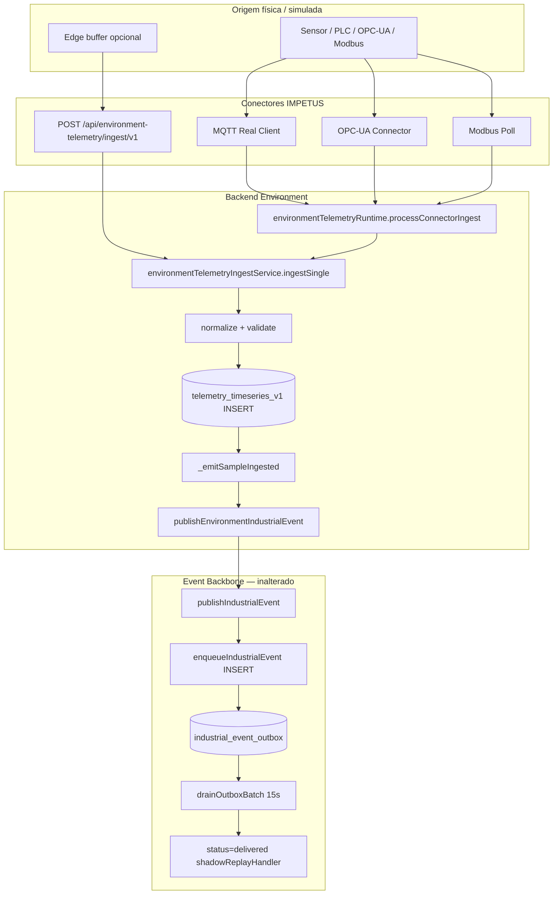

# CERT-OUTBOX-DEPENDENCY-01 — Mapeamento Funcional das Dependências de `environment.telemetry.sample_ingested`

**Data:** 2026-06-30  
**Tipo:** Auditoria Arquitetural Forense (somente leitura)  
**Prioridade:** P0 (Arquitetura)  
**Pré-requisito:** [CERT-OUTBOX-FORENSICS-01](./CERT-OUTBOX-FORENSICS-01.md)  
**Status:** CERTIFICADO — laudo concluído sem alterações funcionais

---

## Resposta executiva (critérios de aceite)

| Pergunta | Resposta |
|----------|----------|
| Quem publica? | `environmentTelemetryIngestService._emitSampleIngested` → `publishEnvironmentIndustrialEvent` → `publishIndustrialEvent` → `enqueueIndustrialEvent` |
| Quem realmente consome? | **Ninguém por `event_name`** — apenas infraestrutura genérica do outbox (drain ACK, archive, enforce, UI bounded por domínio) |
| Quem depende dele? | **Nenhum módulo cognitivo**; dependência operacional indireta e fraca em KPIs ambientais (UI) |
| Necessário após ACK? | **NÃO** para operação — payload é ponteiro para `telemetry_timeseries_v1` já persistido |
| Timeseries substitui histórico? | **SIM** — fonte oficial da verdade com dados integrais (valor, unidade, labels, timestamps) |
| Duplicação de persistência? | **SIM** — Timeseries (dado completo) + Outbox (metadado/ponteiro pós-ingestão) |
| Justifica permanecer no Outbox? | **NÃO** após ACK, no estado atual da arquitetura |
| 25 GB tecnicamente justificável? | **NÃO** — consequência de espelhamento assistivo sem remoção proporcional |
| Seguro pensar em remediação futura? | **SIM**, com certificação dedicada e validação de UI/archive — **não nesta etapa** |

### Classificação final: **Hipótese D — Arquitetura híbrida**, com recomendação futura alinhada à **Hipótese C** (pós-ACK: permanência apenas na Timeseries + archive governado se necessário)

---

## FASE 1 — Origem do evento

### Ponto único de criação (produção)

| Campo | Valor |
|-------|-------|
| **Arquivo** | `backend/src/domains/environment/telemetry/environmentTelemetryIngestService.js` |
| **Função** | `_emitSampleIngested` (invocada por `ingestSingle` linha 217) |
| **Serviço** | Environment Telemetry Ingest |
| **Contexto** | Após persistência bem-sucedida em Timeseries/Industrial |
| **Momento** | Imediatamente após `_persist(coerced.sample)` retornar `ok: true` |
| **Flag gate** | `IMPETUS_ENVIRONMENT_TELEMETRY_BACKBONE_EVENTS_ENABLED=true` (requer runtime enabled) |

### Payload produzido (amostra real 2026-06-30)

```json
{
  "table": "telemetry_timeseries_v1",
  "row_id": "5409e5e5-5c24-42e5-9b67-eb04c9032942",
  "metric_key": "opcua.ns_1_i_1002",
  "telemetry_type": "generic",
  "environmental_area": "utilities"
}
```

**Observação crítica:** o payload **não contém** `value`, `unit`, `labels` completos nem série temporal — apenas **ponteiro** (`table`, `row_id`) + metadados leves.

### Motivo arquitetural original (evidência código + docs)

1. **Integração WAVE 1+3:** espelhar ingestões de telemetria no Industrial Event Backbone para observabilidade, correlação e futuros consumidores.
2. **Catálogo:** `industrialEventCatalog.js` — `critical: false`, `version: 1`.
3. **Contrato de domínio:** `environmentDomainContract.js` lista o tipo como evento canónico do domínio Environment.
4. **Assistive-only:** resposta de `ingestSingle` declara `assistive_only: true`, `blocks_operation: false`.
5. **WAVE 3 plan:** `wave3-storage-temporal-foundation-plan.md` define `telemetry_timeseries_v1` como fonte de série temporal; outbox com **retenção curta + arquivo** — não armazenamento de telemetria densa.

### Frequência de geração

| Métrica | Valor (evidência SQL 2026-06-30) |
|---------|----------------------------------|
| Por minuto | **~288** (média estável) |
| Por hora | **~17.270** |
| Por dia | **~414.000** (desde 24/Jun) |
| Crescimento mensal (projeção) | **~12,4M eventos/mês** |
| Projeção anual | **~151M eventos/ano** |

### Caminhos que **não** emitem `sample_ingested`

| Caminho | Motivo |
|---------|--------|
| `ingestBatch` | `emit_sample_event: false` |
| `ingestRealtimeStream` | `emit_sample_event: false` |
| `syncEdgeQueue` | `emit_sample_event: false` |
| Edge sync agregado | emite `environment.telemetry.edge_synced` (batch), não por amostra |

**Implicação:** MQTT/OPC-UA single-sample via `processConnectorIngest` → `ingestSingle` **emite**; batch paths **não**.

---

## FASE 2 — Cadeia completa de publicação



### Onde entra no Backbone

Entrada exata: `industrialOutboxService._persistRow` — `INSERT INTO industrial_event_outbox` com `event_name = 'environment.telemetry.sample_ingested'`, `domain = 'environment'`.

---

## FASE 3 — Todos os consumidores

### Matriz Consumidor × Obrigatoriedade

| Consumidor | Arquivo | Filtra `sample_ingested`? | Obrigatório | Opcional | Monitoramento |
|------------|---------|---------------------------|-------------|----------|---------------|
| Outbox drain | `industrialOutboxService.js` | Não (todos pending) | — | — | ✅ ACK estrutural |
| Shadow replay | `shadowReplayWorker.js` | Não | — | — | ✅ validação envelope |
| Industrial archive | `industrialArchiveService.js` | Não (delivered) | — | — | ✅ arquivo frio |
| Retention enforce | `retentionEnforceWorker.js` | Não (TTL created_at) | — | — | ✅ purge genérico |
| Event retention engine | `eventRetentionEngine.js` | Não (delega archive) | — | — | ✅ lifecycle archive |
| Backpressure | `backpressureController.js` | Não (só pending) | — | — | ✅ (não afeta delivered) |
| Stream recovery | `streamRecoveryWorker.js` | Não (só pending stale) | — | — | ✅ |
| Replay orchestrator | `industrialReplayOrchestrator.js` | Não | — | — | ✅ audit/replay |
| Environment UI summary | `environmentOperational.js` | **Parcial** — domínio `environment`, KPIs excluem telemetria | — | ✅ | ✅ bounded 5000 |
| Environment UI list | `environmentOperational.js` | Não — últimos N por domínio | — | ✅ | ✅ LIMIT 15 |
| Summarization hooks | `summarizationHooks.js` | Por domínio `environment` | — | — | ⚠️ nenhum hook registado |
| Frontend panel | `EnvironmentOperationalEventsPanel.jsx` | Não — mostra últimos eventos domínio | — | ✅ | ✅ |

**Conclusão FASE 3:** **zero consumidores** implementam lógica de negócio específica para `environment.telemetry.sample_ingested`. Todos os consumidores são **genéricos de infraestrutura** ou **consultas UI bounded por domínio**.

---

## FASE 4 — Dependência funcional por consumidor

| Consumidor | Se o evento deixasse de ser publicado amanhã | Classificação |
|------------|-----------------------------------------------|---------------|
| Timeseries ingest | **Nada** — persistência independente, ocorre antes | N/A (produtor upstream) |
| Outbox drain / ACK | Menos volume; sem impacto funcional | OBSOLETO (para este evento) |
| Shadow replay / archive / enforce | Menos carga I/O | OBSOLETO |
| Environment UI summary KPIs | KPIs emission/waste/water/field **inalterados** (filtros LIKE excluem telemetria) | OPCIONAL |
| Environment UI list (15 últimos) | Lista pode mostrar mais eventos operacionais relevantes | OPCIONAL (melhoria UX) |
| Pulse / ANAM / Gêmeo / Controller | **Nada** | OBSOLETO |
| Módulos cognitivos | **Nada** | OBSOLETO |

| Se registos **deixassem de permanecer** no outbox após ACK (simulação) | Impacto |
|------------------------------------------------------------------------|---------|
| Telemetria operacional | **Nenhum** — dados em Timeseries |
| KPIs ambientais específicos | **Nenhum** |
| Lista UI últimos eventos | Pode deixar de mostrar ruído de telemetria |
| Auditoria via outbox | Perde ponteiro redundante; Timeseries + archive mantêm trilha |

---

## FASE 5 — Relação com `telemetry_timeseries_v1`

### Comparativo de volume (2026-06-30)

| Armazenamento | Registos environment | Tamanho |
|---------------|---------------------|---------|
| `industrial_event_outbox` (`sample_ingested`) | 9.285.252 | ~25 GB (tabela total) |
| `telemetry_timeseries_v1` (`domain=environment`) | 9.635.940 | ~5,3 GB |

**Diferença +350k na Timeseries:** explicada por ingestões via batch/realtime/edge com `emit_sample_event: false`, e possíveis amostras persistidas antes da flag backbone events.

### O dado existe integralmente na Timeseries?

**SIM.** A Timeseries armazena: `company_id`, `domain`, `metric_key`, `value`, `unit`, `labels` (JSONB), `recorded_at`.

### Informação exclusiva do Outbox

| Campo outbox | Exclusivo? |
|--------------|------------|
| `correlation_id` | Parcial — também em labels Timeseries quando fornecido |
| `trace_id`, `workflow_id` | Sim no envelope industrial |
| `metadata` (origin_layer, audience) | Sim — metadado de publicação |
| `payload.row_id` | Ponteiro — **derivável** da Timeseries |
| Valor da medição | **Não** — exclusivo da Timeseries |

### Fonte oficial da verdade

**`telemetry_timeseries_v1`** — confirmado por:

- `telemetryIsolationService.getIsolationStrategy().primary_table`
- `m1PlatformClosureAuditService`: *"fonte oficial audit: telemetry_timeseries_v1"*
- `environmentTelemetryEnterpriseRouting`: primary `timeseries` por defeito
- Payload do evento referencia explicitamente `table: telemetry_timeseries_v1`

---

## FASE 6 — Redundância de persistência

### Fluxo real (evidência código)

```
Sensor / Conector
        ↓
ingestSingle
        ↓
telemetry_timeseries_v1  ← FONTE OFICIAL (valor + labels + timestamp)
        ↓
_emitSampleIngested (se flag ON)
        ↓
industrial_event_outbox  ← ESPELHO / PONTEIRO (pós-persistência)
        ↓
ACK delivered (permanece)
        ↓
archive / enforce (lento)
        ↓
industrial_event_archive (parcial ~122k)
```

**Não é:** Sensor → Outbox → Timeseries  
**É:** Sensor → **Timeseries** → Outbox (notificação redundante)

### Duplicação confirmada

| Aspecto | Timeseries | Outbox |
|---------|------------|--------|
| Valor numérico | ✅ | ❌ |
| metric_key | ✅ | ✅ (payload) |
| company_id | ✅ | ✅ (envelope) |
| timestamp | `recorded_at` | `created_at` (ingestão evento) |
| labels completos | ✅ JSONB | ❌ |
| Ponteiro row_id | id próprio | ✅ payload |

---

## FASE 7 — Necessidade de histórico

| Consumidor | Tempo real | Histórico antigo | Onde consulta |
|------------|------------|------------------|---------------|
| Environment ingest | Sim (correlação in-memory) | Não via outbox | `environmentRealtimeCorrelationRuntime` |
| UI operacional | Lista recente | Bounded 30d / LIMIT | outbox `domain=environment` |
| Auditoria M1 | Não | Sim | **`telemetry_timeseries_v1`** |
| Pulse / cognitivos | Não | Não | — |
| Archive | Não | Sim (frio) | `industrial_event_archive` |

**Conclusão:** nenhum consumidor **precisa** do histórico de `sample_ingested` no outbox. Consultas históricas de telemetria devem usar **Timeseries** (ou rollups futuros WAVE 3).

---

## FASE 8 — Módulos cognitivos

| Módulo | Uso de `sample_ingested` | Veredito | Justificativa |
|--------|---------------------------|----------|---------------|
| Pulse Cognitivo | Não | **NÃO** | Zero referências em `services/pulseCognitive/` |
| Controller Cognitivo | Não | **NÃO** | Sem leitura outbox/telemetria deste evento |
| Gêmeo Digital | Não | **NÃO** | Sem referências no codebase |
| ANAM | Não | **NÃO** | Sem referências em routes/anam |
| Dashboard Cognitivo | Não | **NÃO** | — |
| Executive Boardroom | Não | **NÃO** | — |
| ManuIA | Não | **NÃO** | — |
| SmartPanel | Não | **NÃO** | — |
| Mapping Industrial | Não | **NÃO** | — |
| Environment Operational UI | Indireto | **INDIRETAMENTE** | Lê outbox por domínio; KPIs excluem telemetria; lista pode incluir ruído |

---

## FASE 9 — Volume e compatibilidade com fila transacional

### Estatísticas

| Granularidade | Valor |
|---------------|-------|
| Por minuto | ~288 |
| Por hora | ~17.270 |
| Por dia | ~414.000 |
| Mensal (projeção) | ~12,4M |
| Anual (projeção) | ~151M |
| Crescimento disco outbox (projeção) | ~189 GB/ano (@ 1,25 KB/evento) |

### Salto de volume (18–24 Jun)

| Dia | Eventos |
|-----|---------|
| 23 Jun | 86.184 |
| 24 Jun+ | ~414.000/dia |

Correlaciona com escala de conectores industriais (MQTT/OPC-UA/Modbus) e flag `IMPETUS_ENVIRONMENT_TELEMETRY_BACKBONE_EVENTS_ENABLED=true`.

### Compatível com fila transacional?

**NÃO** nesta frequência. Telemetria densa de alta cardinalidade é **anti-padrão** para Transactional Outbox — deveria usar Timeseries + eventos de exceção (threshold, anomaly, drift) apenas.

---

## FASE 10 — Transactional Outbox (caso específico)

| Pergunta | Resposta |
|----------|----------|
| Após ACK, finalidade operacional? | **NÃO** |
| Justificativa | Dado já em Timeseries; payload é ponteiro; nenhum consumer pós-ACK; `critical: false` |

**Veredito:** **NÃO** — após ACK, o evento `sample_ingested` não possui finalidade operacional no estado atual do IMPETUS.

---

## FASE 11 — Classificação arquitetural

### Hipótese D — Arquitetura híbrida (veredito)

| Camada | Papel atual |
|--------|-------------|
| **Design intencional** | Notificação assistiva de ingestão no Backbone (Hipótese A parcial — deveria transitar) |
| **Operação real** | Repositório redundante pós-ACK (comportamento Hipótese B) |
| **Fonte de verdade** | Timeseries (Hipótese C para dado; Outbox não deveria reter) |

### Recomendação arquitetural futura (não implementada)

Alinhar operação à **Hipótese C**: após ACK, permanência apenas em `telemetry_timeseries_v1`; outbox/archive apenas para eventos **críticos** ou **exceções** (threshold, anomaly, incident).

---

## FASE 12 — Simulação de impacto (sem alterações)

### Cenário A: Parar de publicar `sample_ingested`

| Módulo | Impacto |
|--------|---------|
| Telemetria / Timeseries | ✅ Intacto |
| MQTT/OPC-UA/Modbus ingest | ✅ Intacto |
| Threshold / anomaly events | ✅ Intactos (eventos separados) |
| Outbox volume | ↓ ~99% crescimento |
| Environment UI KPIs | ✅ Intacto |
| Environment UI lista | Menos ruído de telemetria |
| Pulse / ANAM / Gêmeo | ✅ Intacto |
| Event Backbone | ✅ Intacto (outros eventos preservados) |

### Cenário B: Remover do outbox após ACK (sem parar publicação)

| Módulo | Impacto |
|--------|---------|
| Telemetria | ✅ Intacto |
| UI lista histórica outbox | Perde entradas de telemetria na lista |
| Auditoria outbox | Perde ponteiro redundante |
| Archive backlog | Reduz drasticamente |
| Cognitivos | ✅ Intacto |

### Cenário C: Desabilitar apenas flag `IMPETUS_ENVIRONMENT_TELEMETRY_BACKBONE_EVENTS_ENABLED`

| Aspecto | Efeito |
|---------|--------|
| Código | Zero alteração |
| Backbone | Preservado para outros eventos |
| Risco | Mínimo — caminho já usado em batch/edge |
| Reversível | Sim (flag) |

**Nenhum cenário simulado quebra módulos cognitivos ou ingestão de telemetria.**

---

## FASE 13 — Explainability: por que ~25 GB?

```
25 GB (industrial_event_outbox)
    │
    └── 99,999% environment.telemetry.sample_ingested (9.285.252)
            │
            ├── Motivo de existência: flag BACKBONE_EVENTS_ENABLED
            │       └── espelhar ingestão já persistida em Timeseries
            │
            ├── Motivo de volume: ~414k eventos/dia (telemetria densa)
            │       └── conectores MQTT/OPC-UA/Modbus + API ingest
            │
            ├── Motivo de permanência: ACK sem DELETE
            │       └── shadowReplayHandler → delivered → fica na tabela
            │
            ├── Motivo de não-arquivamento proporcional
            │       └── archive 200/h + enforce 500/d << ingestão
            │
            └── Motivo de não-ser necessário
                    └── Timeseries já tem 9,6M registos (fonte oficial)
                    └── nenhum consumidor lê sample_ingested por nome
```

---

## FASE 14 — Recomendações (propostas, não implementadas)

### R1 — Desacoplar telemetria densa do Outbox (prioridade máxima)

| Aspecto | Detalhe |
|---------|---------|
| Benefício | Elimina ~99% do crescimento outbox |
| Risco | Baixo — Timeseries preserva tudo |
| Backbone | Preservado para eventos de exceção |
| Event Retention | Reduz conflito archive/enforce |
| LGPD | Telemetria industrial sem PII direto no envelope |
| Cognitivos | Zero impacto |

**Ação futura sugerida:** `IMPETUS_ENVIRONMENT_TELEMETRY_BACKBONE_EVENTS_ENABLED=false` em certificação `CERT-OUTBOX-REMEDIATION-01`, ou emitir apenas `threshold_exceeded` / `anomaly_detected`.

---

### R2 — Manter Timeseries como única fonte histórica de amostras

| Aspecto | Detalhe |
|---------|---------|
| Benefício | Arquitetura alinhada WAVE 3 |
| Risco | Nenhum — já é a prática de auditoria M1 |
| UI | Migrar consultas de telemetria para API Timeseries |

---

### R3 — Não usar outbox para KPIs de telemetria

| Aspecto | Detalhe |
|---------|---------|
| Benefício | UI já exclui telemetria nos KPIs LIKE |
| Risco | Lista de 15 eventos pode mostrar ruído |
| Ação futura | Filtrar `event_name NOT LIKE '%.telemetry.sample_ingested%'` na UI |

---

### R4 — Coordenar remediação com CERT-EVENT-RETENTION-01

| Aspecto | Detalhe |
|---------|---------|
| Benefício | Archive focado em eventos com valor de trilha |
| Risco | Médio se enforce DELETE antes de archive |
| Ação futura | Suspend enforce outbox até política unificada |

---

### R5 — Investigar salto 23→24 Jun antes de qualquer purge

| Aspecto | Detalhe |
|---------|---------|
| Benefício | Confirmar se taxa ~17k/h é produção real ou lab |
| Risco | Evita remediação baseada em dados simulados |

---

## Entregáveis

### Diagrama do fluxo

Ver FASE 2 (Mermaid).

### Matriz Produtor × Consumidor × Dependência

| Produtor | Consumer | Dependência real |
|----------|----------|------------------|
| `ingestSingle` → `_emitSampleIngested` | `enqueueIndustrialEvent` | Publicação |
| — | `drainOutboxBatch` | ACK genérico — **não usa payload** |
| — | `industrialArchiveService` | Arquivo genérico |
| — | `retentionEnforceWorker` | Purge genérico |
| — | `environmentOperational` UI | **Opcional** — domínio bounded |
| — | Pulse/ANAM/Gêmeo | **Nenhuma** |

### Mapa de persistência

```
┌─────────────────────┬──────────────────┬─────────────────────────┐
│ Camada              │ Dado             │ Papel                   │
├─────────────────────┼──────────────────┼─────────────────────────┤
│ telemetry_timeseries│ Valor completo   │ FONTE OFICIAL           │
│ industrial_event_   │ Ponteiro + meta  │ REDUNDANTE pós-ingest   │
│   outbox            │                  │                         │
│ industrial_event_   │ Cópia envelope   │ Arquivo frio parcial    │
│   archive           │                  │                         │
└─────────────────────┴──────────────────┴─────────────────────────┘
```

### Simulação de impacto

Ver FASE 12.

---

## Conclusão para decisão de remediação

O evento `environment.telemetry.sample_ingested` **existe por design assistivo** de integração Backbone, mas **não possui dependência funcional** em módulos cognitivos nem consumidores que processem seu payload após ACK.

A **Timeseries já substitui** completamente seu uso histórico e operacional.

A permanência de ~9,28M registos no outbox é **consequência arquitetural evolutiva** (espelhamento + ACK sem remoção + throughput de saída insuficiente), **não uma necessidade de negócio comprovada**.

**É seguro planejar `CERT-OUTBOX-REMEDIATION-01`**, começando por desacoplamento via flag ou cessação de publicação de `sample_ingested`, **sem alterar Event Backbone, consumidores cognitivos ou contratos existentes** nesta etapa.

---

## Metodologia

- Análise estática: 15 ficheiros com referência a `sample_ingested`
- SQL somente leitura: contagens, amostras de payload, séries temporais
- Zero alterações em código, BD, flags ou schedulers
- Pré-requisito forense: CERT-OUTBOX-FORENSICS-01

---

## Status Atual

**Status deste certificado:** Concluído (mapeamento de dependências somente leitura)

**Status do programa Outbox Validation:** IMPLEMENTADO — AGUARDANDO VALIDAÇÃO OPERACIONAL

- Arquitetura implementada; laudo de dependências documentado.
- Validação operacional em produção ainda **pendente**.
- **Nenhuma remediação definitiva iniciada**.
- Próxima certificação prevista: **CERT-OUTBOX-REMEDIATION-01** (condicionada à validação operacional).
