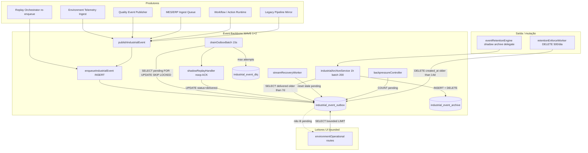
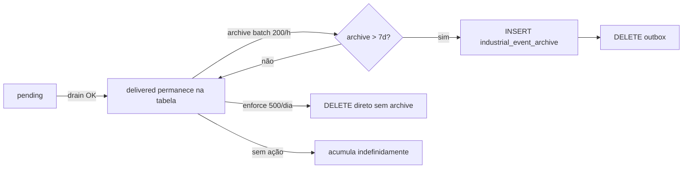

# CERT-OUTBOX-FORENSICS-01 — Auditoria Arquitetural do `industrial_event_outbox`

**Data:** 2026-06-30  
**Tipo:** Auditoria Forense de Arquitetura (somente leitura)  
**Prioridade:** P0 (Arquitetura)  
**Status:** CERTIFICADO — diagnóstico concluído sem alterações funcionais

---

## Declaração de escopo

Esta certificação foi executada em modo **100% somente leitura**. Nenhum registo foi excluído, nenhuma tabela alterada, nenhum consumidor modificado, nenhum scheduler ou política de retenção alterada.

**Objetivo:** responder com evidências se o `industrial_event_outbox` cumpre o papel de **fila operacional transitória (Transactional Outbox)** ou se tornou **armazenamento permanente de eventos**.

---

## Resposta executiva (FASE 12 / FASE 14)

| Pergunta | Resposta |
|----------|----------|
| O Outbox é fila ou armazenamento? | **Cenário C — Arquitetura híbrida**: desenhado como fila transitória; **operacionalmente comporta-se como repositório permanente** |
| Existe ACK? | **Sim** — `status = 'delivered'` + `delivered_at` (100% dos registos atuais) |
| Existe consumidor? | **Sim** — `drainOutboxBatch` via scheduler industrial (handler shadow noop) |
| Existe arquivamento? | **Sim** — `industrialArchiveService.archiveDeliveredBatch` (copia + DELETE) |
| Existe remoção? | **Sim, parcial** — archive DELETE + `retentionEnforceWorker` DELETE; **throughput insuficiente** |
| Política de retenção específica? | **Sim, múltiplas camadas** (registry 14d TTL, archive 7d, CERT-EVENT-RETENTION-01 workflow_outbox) |
| Crescimento esperado ou desvio? | **Desvio operacional** — ingestão ~400k eventos/dia vs saída ~5,3k/dia |
| Módulos dependentes? | **Poucos leem diretamente**; Environment escreve e lê; backbone gerencia |
| CERT-EVENT-RETENTION-01 resolve? | **Parcialmente** — delega archive mas não corrige o desequilíbrio de throughput |
| Causa raiz dos ~25 GB? | **Telemetria ambiental** (`environment.telemetry.sample_ingested`) sem remoção pós-ACK proporcional à ingestão |

---

## FASE 1 — Mapeamento arquitetural

### Origem da tabela

| Item | Evidência |
|------|-----------|
| Migration WAVE 1 | `migrations/industrial_event_backbone_migration.sql` |
| Extensões WAVE 2 | `migrations/industrial_event_backbone_wave2_migration.sql` (`partition_month`, índices stale) |
| Lifecycle CERT-RETENTION | `migrations/event_backbone_retention_lifecycle_migration.sql` (`lifecycle_state`, `event_category`) |

### Diagrama real do fluxo



### Etapas ausentes ou incompletas

| Etapa esperada (Transactional Outbox) | Estado real |
|----------------------------------------|-------------|
| Consumer com efeito lateral real | **Ausente** — handler default é `shadowReplayHandler` (noop) |
| Remoção imediata pós-ACK | **Ausente** — ACK apenas atualiza status |
| Archive proporcional à ingestão | **Insuficiente** — 200 registos/hora vs ~17k/hora ingresso |
| Leitura operacional por módulos cognitivos | **Ausente** — Pulse/ANAM não consultam outbox |

---

## FASE 2 — Produtores (INSERT / publish / enqueue)

| # | Arquivo | Função | Módulo | Evento típico | Mecanismo |
|---|---------|--------|--------|---------------|-----------|
| 1 | `eventPipeline/outbox/industrialOutboxService.js` | `enqueueIndustrialEvent` / `_persistRow` | Backbone | * | `INSERT … ON CONFLICT DO NOTHING` |
| 2 | `eventPipeline/industrialEventBackbone.js` | `publishIndustrialEvent` | Backbone | * | chama enqueue |
| 3 | `domains/environment/events/environmentEventPublisher.js` | `publishEnvironmentIndustrialEvent` | Environment | `environment.*` | publishIndustrialEvent |
| 4 | `domains/environment/telemetry/environmentTelemetryIngestService.js` | `_emitSampleIngested` | Environment | **`environment.telemetry.sample_ingested`** | publish (volume dominante) |
| 5 | `domains/environment/telemetry/environmentTelemetryOrchestrator.js` | várias | Environment | telemetry | publish |
| 6 | `domains/environment/telemetry/environmentEdgeTelemetryRuntime.js` | ingest edge | Edge Agent | telemetry | publish |
| 7 | `domains/quality/events/qualityEventPublisher.js` | publish | Quality | `quality.*` | publishIndustrialEvent |
| 8 | `services/mesErpIngestQueueService.js` | ingest | MES/ERP | industrial | publishIndustrialEvent |
| 9 | `workflowEngine/integration/workflowBackboneEvents.js` | deferred | Workflow | workflow | publishIndustrialEventDeferred |
| 10 | `actionRuntime/integration/governanceBackboneEvents.js` | deferred | Action Runtime | governance | publishIndustrialEventDeferred |
| 11 | `eventPipeline/pipeline.js` | `_maybeMirrorIndustrial` | Pipeline legado | mirror | mirrorLegacyEventToIndustrial |
| 12 | `shared/events-core/industrialEventClient.js` | `publish` / `publishDeferred` | Shared | * | wrapper backbone |
| 13 | `routes/environmentOperational.js` | POST events | Environment UI | operational | publishEnvironmentIndustrialEvent |
| 14 | `eventPipeline/replay/industrialReplayOrchestrator.js` | replay mode `on` | Backbone | replay | re-enqueue |
| 15 | `eventPipeline/dlq/industrialDlqService.js` | redrive | Backbone | DLQ | re-enqueue |

**Flag produtora crítica (evidência `.env`):**

```
IMPETUS_ENVIRONMENT_TELEMETRY_RUNTIME_ENABLED=true
IMPETUS_ENVIRONMENT_TELEMETRY_BACKBONE_EVENTS_ENABLED=true
```

Cada amostra de telemetria ambiental persistida pode emitir um evento `sample_ingested` para o outbox **além** da persistência em timeseries.

---

## FASE 3 — Consumidores (SELECT / drain / worker)

| # | Arquivo | Função | Critério de leitura | Batch | Concorrência |
|---|---------|--------|---------------------|-------|--------------|
| 1 | `outbox/industrialOutboxService.js` | `drainOutboxBatch` | `status='pending' AND next_attempt_at <= now()` | 50 (env) | `FOR UPDATE SKIP LOCKED` |
| 2 | `scheduler/industrialBackboneScheduler.js` | intervalo 15s | dispara drain | — | setInterval |
| 3 | `replay/shadowReplayWorker.js` | `runShadowReplay` | `status IN ('pending','delivered')` readonly | 100 | audit |
| 4 | `archive/industrialArchiveService.js` | `archiveDeliveredBatch` | `status='delivered' AND delivered_at < cutoff` | 200 | sequencial |
| 5 | `recovery/streamRecoveryWorker.js` | `runStreamRecovery` | pending stale por `updated_at` | 500 | reset next_attempt |
| 6 | `backpressure/backpressureController.js` | publish gate | `COUNT pending` | — | observe/enforce |
| 7 | `replay/industrialReplayOrchestrator.js` | governed replay | delivered/pending | 100–500 | shadow/audit/on |
| 8 | `routes/environmentOperational.js` | `queryEnvironmentEvent*` | `domain='environment'` bounded | 5000/50 | UI KPI |
| 9 | `retention/eventRetentionEngine.js` | `runRetentionCycle` | delega archive (não SELECT direto) | 200 | shadow/active |
| 10 | `workers/retentionEnforceWorker.js` | `_enforceTable` | `created_at < TTL` DELETE | 100×5 | diário |

**Handler efetivo do drain (evidência código):**

```javascript
// industrialBackboneScheduler.js → drainOutboxBatch(shadowReplayHandler)
// shadowReplayWorker.js — valida envelope, retorna { ok: true, shadow: true }
```

O consumidor **confirma entrega** mas **não executa processamento de negócio** — apenas ACK estrutural.

---

## FASE 4 — Confirmação de processamento (ACK)

### Campos existentes

| Campo | Papel |
|-------|-------|
| `status` | `pending` → `delivered` / `dlq` / retry |
| `delivered_at` | timestamp de ACK |
| `attempts` | contador de retry |
| `next_attempt_at` | agendamento retry |
| `last_error` | erro da última tentativa |
| `updated_at` | mutação |

**Não existem:** `processed`, `consumed`, `ack`, `acknowledged`, `completed` como campos separados — o ACK é modelado via `status` + `delivered_at`.

### Quem altera o ACK

| Componente | Quando | Como |
|------------|--------|------|
| `industrialOutboxService._markDelivered` | handler retorna `ok: true` | `UPDATE status='delivered', delivered_at=now()` |
| `industrialOutboxService._markRetry` | falha transitória | incrementa attempts, agenda next_attempt_at |
| `industrialOutboxService._markFailed` | max attempts | status dlq |

### Evidência estatística (2026-06-30)

| Métrica | Valor |
|---------|-------|
| Total registos | **9.285.341** |
| `status = delivered` | **100%** (9.285.341) |
| `status = pending` | **0** |
| `delivered_at` preenchido | **100%** |
| Idade média | **13,56 dias** |
| Idade máxima | **33,35 dias** |

**Conclusão:** o pipeline de ACK funciona; o problema **não** é falta de consumo — é **falta de remoção/arquivamento proporcional** após ACK.

---

## FASE 5 — Destino dos eventos pós-consumo



| Destino | Ocorre? | Evidência |
|---------|---------|-----------|
| Permanece após ACK | **Sim — padrão dominante** | 9,28M delivered ainda no outbox |
| Movido | Parcial | archive copia para `industrial_event_archive` |
| Copiado | Sim | ~122k em archive (290 MB) |
| Arquivado | Sim, lento | 200/hora scheduler |
| Apagado | Sim, lento | archive DELETE + enforce DELETE |
| Indefinidamente | **Sim — desvio operacional** | backlog 6,45M elegíveis archive >7d |

---

## FASE 6 — Cruzamento com CERT-EVENT-RETENTION-01

| Pergunta | Resposta |
|----------|----------|
| Scheduler de retenção consulta outbox? | **Indiretamente** — `eventRetentionEngine.runRetentionCycle` chama `eventArchive.archiveWithLifecycle` → `industrialArchiveService` |
| Ignora outbox? | **Não** — archive lê `delivered` do outbox |
| Arquiva registros do outbox? | **Sim**, quando engine ativo e archive habilitado |
| Política específica? | `policy_workflow_outbox` — 14d ativo, 365d arquivo |
| Conflito? | **Sim — potencial** |
| Duplicação? | **Sim — três mecanismos paralelos** |

### Mecanismos de saída sobrepostos

| Mecanismo | Modo produção | Throughput observado | Comportamento |
|-----------|---------------|----------------------|---------------|
| `industrialArchiveService` | `IMPETUS_INDUSTRIAL_ARCHIVE_ENABLED=true` | ~200/hora | archive + DELETE |
| `retentionEnforceWorker` | `IMPETUS_RETENTION_MODE=enforce` | 500/dia/outbox | DELETE direto (sem archive) |
| `eventRetentionEngine` | shadow (defeito) | delega archive | lifecycle em archive, não purge outbox |

**Conflito crítico:** `retentionEnforceWorker` executa `DELETE FROM industrial_event_outbox WHERE created_at < $1` **sem** passar por archive — incompatível com princípio “nunca perder evento” do CERT-EVENT-RETENTION-01, embora limitado a 500/dia.

**CERT-EVENT-RETENTION-01 não resolve o problema:** mesmo com archive delegado, o throughput (~4.800/dia) é **~86× menor** que a ingestão (~414.000/dia desde 18/06).

---

## FASE 7 — Estatísticas reais

### Volume e armazenamento

| Métrica | Valor |
|---------|-------|
| Total registos | 9.285.341 |
| Tamanho tabela | **25 GB** |
| Tamanho médio envelope (amostra 0,1%) | **~1.245 bytes** |
| Archive registos | ~122.779 (~290 MB) |

### Por status

| status | count | % |
|--------|-------|---|
| delivered | 9.285.341 | 100% |
| pending | 0 | 0% |

### Por domínio (top)

| domain | count | % |
|--------|-------|---|
| environment | 9.285.285 | 99,999% |
| quality | 56 | 0,001% |

### Por event_name (top)

| event_name | count |
|------------|-------|
| **environment.telemetry.sample_ingested** | **9.285.252** |
| quality.spc.violation_detected | 14 |
| demais | < 15 cada |

### Por empresa

| company_id | count |
|------------|-------|
| 21dd3cee-2efa-4936-908f-9ff1ba04e2a3 | 6.642.824 |
| 511f4819-fc48-479e-b11e-49ba4fb9c81b | 2.642.517 |

### Ingestão diária (últimos 30 dias)

| Período | eventos/dia (média) |
|---------|---------------------|
| 01–17 Jun 2026 | ~200.000 |
| **18 Jun em diante** | **~414.000** (salto +107%) |
| 30 Jun (parcial) | ~263.000 |

### Backlog e elegibilidade

| Métrica | Valor |
|---------|-------|
| delivered > 7d sem archive | **6.455.094** |
| created_at > 14d (purge enforce) | **3.783.358** |
| Duplicatas idempotency_key | **0** |
| pending órfão > 7d | **0** |

### Taxa de saída observada (logs PM2 2026-06-30)

| Mecanismo | Throughput |
|-----------|------------|
| INDUSTRIAL_ARCHIVE | 200 registos/execução, ~1h intervalo → **~4.800/dia** |
| RETENTION_ENFORCE outbox | **500/dia** (max_per_table) |
| **Total saída máxima** | **~5.300/dia** |
| **Ingestão atual** | **~414.000/dia** |
| **Déficit líquido** | **~408.700/dia** |

---

## FASE 8 — Aderência ao padrão Transactional Outbox

| Requisito | Classificação | Evidência |
|-----------|---------------|-----------|
| Produção transacional | 🟢 VERDE | INSERT com `idempotency_key` UNIQUE |
| Persistência | 🟢 VERDE | Postgres + envelope JSONB |
| Consumo assíncrono | 🟢 VERDE | Scheduler 15s + SKIP LOCKED |
| ACK | 🟡 AMARELO | Existe mas handler é noop shadow |
| Idempotência | 🟢 VERDE | ON CONFLICT DO NOTHING |
| Retry | 🟢 VERDE | attempts + backoff exponencial |
| Dead Letter | 🟢 VERDE | `industrial_event_dlq` |
| Remoção pós-ACK | 🔴 VERMELHO | Não remove; enforce/archive insuficientes |
| Arquivamento | 🟡 AMARELO | Implementado, throughput inadequado |
| Expurgo | 🔴 VERMELHO | Enforce DELETE sem governança unificada |

**Veredito padrão:** implementação **estruturalmente correta** como Transactional Outbox, com **falha operacional na fase de retire/archive**.

---

## FASE 9 — Gargalos identificados

| Gargalo | Severidade | Evidência |
|---------|------------|-----------|
| Ingestão telemetria >> archive | **Crítico** | 414k/dia vs 4,8k/dia archive |
| Handler shadow noop | Alto | Nenhum consumer de negócio real |
| Archive batch fixo 200 | Alto | `industrialArchiveService` LIMIT 200 |
| Enforce purge 500/dia | Alto | `IMPETUS_RETENTION_MAX_PER_RUN=500` |
| Dupla política de saída | Médio | archive vs enforce sem coordenação |
| UI lê outbox diretamente | Médio | `environmentOperational.js` bounded mas pressiona BD |
| Spike 18/Jun | Médio | correlação com escala telemetria/backbone events |
| pending = 0 | Informativo | drain eficiente; problema é pós-ACK |

**Não observado:** consumidores travados, loops de reprocessamento, duplicatas idempotency.

---

## FASE 10 — Dependências por módulo

| Módulo | Escrita | Leitura | Evidência |
|--------|---------|---------|-----------|
| **Environment / Telemetria** | ✅ | ✅ | produtor dominante + routes operacionais |
| **Quality** | ✅ | ❌ | `qualityEventPublisher.js` |
| **MES/ERP** | ✅ | ❌ | `mesErpIngestQueueService.js` |
| **Industrial Event Backbone** | ✅ | ✅ | core outbox/archive/drain |
| **Edge Agent** | ✅ (via env telemetry) | ❌ | `environmentEdgeTelemetryRuntime.js` |
| **Workflow Engine** | ✅ deferred | ❌ | `workflowBackboneEvents.js` |
| **Action Runtime** | ✅ deferred | ❌ | `governanceBackboneEvents.js` |
| **Pipeline legado** | ✅ mirror | ❌ | `pipeline.js` |
| **Dashboard Environment UI** | ❌ | ✅ bounded | `environmentOperational.js` + frontend panel |
| **Pulse Cognitivo** | ❌ | ❌ | sem referência a outbox |
| **ANAM** | ❌ | ❌ | sem referência a outbox |
| **Gêmeo Digital** | ❌ | ❌ | sem referência a outbox |
| **Controller Cognitivo** | ❌ | ❌ | via pipeline, não outbox |
| **ManuIA** | ❌ | ❌ | — |
| **TPM** | ❌ | ❌ | — |
| **SST** | ❌ | ❌ | — |
| **Comunicação** | ❌ | ❌ | pipeline mirror apenas |
| **Registro Inteligente** | ❌ | ❌ | — |
| **AIOI** | ❌ | ❌ | usa `aioi_outbox` / `industrial_operational_events` separados |

---

## FASE 11 — Explainability: por que ~25 GB?

### Árvore causal (baseada em evidências)

```
25 GB (industrial_event_outbox)
    │
    ├── 9.285.341 eventos (~1,25 KB/envelope médio)
    │       │
    │       ├── 99,999% environment.telemetry.sample_ingested
    │       │       │
    │       │       ├── IMPETUS_ENVIRONMENT_TELEMETRY_BACKBONE_EVENTS_ENABLED=true
    │       │       └── cada amostra telemetria → publishIndustrialEvent → INSERT outbox
    │       │
    │       └── 100% status=delivered (ACK completo)
    │               │
    │               ├── drainOutboxBatch a cada 15s com shadowReplayHandler
    │               ├── NÃO há DELETE no ACK
    │               └── registos permanecem após delivered_at
    │
    ├── Archive habilitado mas insuficiente
    │       ├── IMPETUS_INDUSTRIAL_ARCHIVE_ENABLED=true
    │       ├── batch 200/hora ≈ 4.800/dia
    │       └── backlog elegível >7d: 6.455.094 registos
    │
    ├── Enforce purge paralelo mas insuficiente
    │       ├── IMPETUS_RETENTION_MODE=enforce
    │       ├── max 500 DELETE/dia no outbox
    │       └── DELETE sem archive (risco de perda de trilha)
    │
    └── Ingestão acelerou em 18/Jun/2026
            ├── ~200k/dia → ~414k/dia (+107%)
            └── déficit líquido ~409k/dia → crescimento monotónico
```

---

## FASE 12 — Classificação arquitetural

### **Cenário C — Arquitetura híbrida**

| Dimensão | Classificação |
|----------|---------------|
| **Intenção de design** | Cenário A — Fila transitória (Transactional Outbox WAVE 1+2) |
| **Comportamento em produção** | Cenário B — Armazenamento permanente de eventos delivered |
| **Veredito integrado** | **Híbrido** — código correto para outbox; operação acumula por desequilíbrio ingestão/saída |

### Justificação técnica

1. O schema, ACK, retry, DLQ e archive seguem o padrão Transactional Outbox.
2. **Nenhum** registo está `pending` — a fila **não está congestionada** no sentido clássico.
3. Após ACK, **100%** dos eventos **permanecem** na tabela por falta de throughput de archive/remoção.
4. O volume é **dominado por um único evento de telemetria** espelhando amostras já persistidas em timeseries.
5. Módulos cognitivos (Pulse, ANAM) **não dependem** do outbox — o impacto é **infraestrutural/disco**, não funcional cognitivo.

---

## FASE 13 — Recomendações (sem implementação)

### R1 — Separar telemetria de alto volume do outbox industrial

| Aspecto | Detalhe |
|---------|---------|
| Impacto | Reduz ingestão ~99% no outbox |
| Risco | Baixo se telemetria já está em `telemetry_timeseries_v1` |
| Compatibilidade | Backbone preservado para eventos críticos |
| Pulse / ANAM / Gêmeo | Nenhum — não leem outbox |
| LGPD | Telemetria operacional sem PII direto no envelope |
| Retenção | Alinha com `policy_operational_telemetry` |

**Proposta:** desabilitar `IMPETUS_ENVIRONMENT_TELEMETRY_BACKBONE_EVENTS_ENABLED` para `sample_ingested` ou amostrar (1:N) antes de publicar.

---

### R2 — Unificar política de saída (archive antes de qualquer DELETE)

| Aspecto | Detalhe |
|---------|---------|
| Impacto | Elimina conflito archive vs enforce |
| Risco | Médio — requer certificação posterior |
| Event Backbone | Coordena archive + lifecycle |
| LGPD | Preserva trilha antes de purge |
| Retenção | Alinha CERT-EVENT-RETENTION-01 |

**Proposta:** suspender `retentionEnforceWorker` para `industrial_event_outbox` até política unificada (certificação separada).

---

### R3 — Aumentar throughput de archive proporcionalmente (certificação posterior)

| Aspecto | Detalhe |
|---------|---------|
| Impacto | Reduz backlog ao longo do tempo |
| Risco | Médio — carga I/O PostgreSQL |
| Cálculo | Backlog 6,45M ÷ 50k/dia ≈ 129 dias (exemplo) |

**Proposta:** batch adaptativo, intervalo configurável, métricas de backlog.

---

### R4 — Não tratar outbox como fonte de consulta operacional

| Aspecto | Detalhe |
|---------|---------|
| Impacto | UI Environment usa archive ou agregados |
| Risco | Baixo |
| Dashboard | Migrar KPIs para views materializadas |

**Evidência:** `environmentOperational.js` já usa `LIMIT 5000` por timeout — sintoma de tabela inadequada para consulta.

---

### R5 — Investigação do salto de 18/Jun antes de qualquer purge em massa

| Aspecto | Detalhe |
|---------|---------|
| Impacto | Entender se spike é simulação, edge lab ou produção real |
| Risco | Alto se purge sem entender origem |

**Proposta:** correlacionar com deploy, flags MQTT/Modbus/OPCUA, tenants piloto.

---

## FASE 14 — Matriz Produtores × Consumidores × Destino

| Produtor | Consumer / Mutador | Destino final |
|----------|-------------------|---------------|
| Environment telemetry | drain → delivered | **Permanece** (dominante) |
| Environment telemetry | archive (200/h) | archive + DELETE |
| Environment telemetry | enforce (500/d) | DELETE direto |
| Quality events | drain → delivered | Permanece |
| MES/ERP | drain → delivered | Permanece |
| Workflow/Action | drain → delivered | Permanece |
| Replay re-enqueue | drain → delivered | Permanece |
| DLQ redrive | drain → delivered | Permanece |
| — | environmentOperational UI | Leitura bounded (não remove) |

---

## Critérios de aceite — checklist

| Critério | Status |
|----------|--------|
| O Outbox é fila ou armazenamento? | ✅ Híbrido — fila no design, repositório na operação |
| Existe ACK? | ✅ Sim (`delivered` + `delivered_at`) |
| Existe consumidor? | ✅ Sim (shadow noop) |
| Existe arquivamento? | ✅ Sim (insuficiente) |
| Existe remoção? | ✅ Parcial (archive + enforce) |
| Política de retenção específica? | ✅ Sim (3 camadas) |
| Crescimento esperado ou desvio? | ✅ Desvio operacional |
| Módulos dependentes? | ✅ Documentado |
| CERT-EVENT-RETENTION-01 resolve? | ✅ Parcialmente |
| Causa raiz 25 GB? | ✅ Telemetria + ACK sem remoção proporcional |

---

## Entregáveis

| Entregável | Localização |
|------------|-------------|
| Relatório técnico | Este documento |
| Diagrama arquitetura | FASE 1 (Mermaid) |
| Fluxograma ciclo de vida | FASE 5 (Mermaid) |
| Matriz Prod×Cons×Destino | FASE 14 |
| Estatísticas reais | FASE 7 |
| Classificação | Cenário C — Híbrido |
| Aderência Transactional Outbox | FASE 8 |
| Recomendações sem implementação | FASE 13 |

---

## Próximo passo recomendado

**Nenhuma alteração nesta etapa.** Qualquer evolução deve ser tratada em certificação posterior (ex.: `CERT-OUTBOX-REMEDIATION-01`), somente após aprovação explícita das recomendações R1–R5 e validação de impacto em telemetria, LGPD e Event Backbone.

---

## Metodologia e integridade

- Análise de código: 18 ficheiros `backend/src` com referência direta a `industrial_event_outbox`
- Queries SQL: somente `SELECT` / `COUNT` / `pg_size_pretty` / `TABLESAMPLE`
- Logs: `impetus-backend-out.log` (INDUSTRIAL_ARCHIVE, RETENTION_ENFORCE)
- Flags: `backend/.env` (somente leitura)
- **Nenhuma modificação foi realizada no sistema**

---

## Status Atual

**Status deste certificado:** Concluído (auditoria forense somente leitura)

**Status do programa Outbox Validation:** IMPLEMENTADO — AGUARDANDO VALIDAÇÃO OPERACIONAL

- Arquitetura e diagnóstico documentados; mecanismo de validação implementado em certificação posterior.
- Validação operacional em produção ainda **pendente**.
- **Nenhuma remediação definitiva iniciada**.
- Próxima certificação prevista: **CERT-OUTBOX-REMEDIATION-01** (condicionada à validação operacional).
