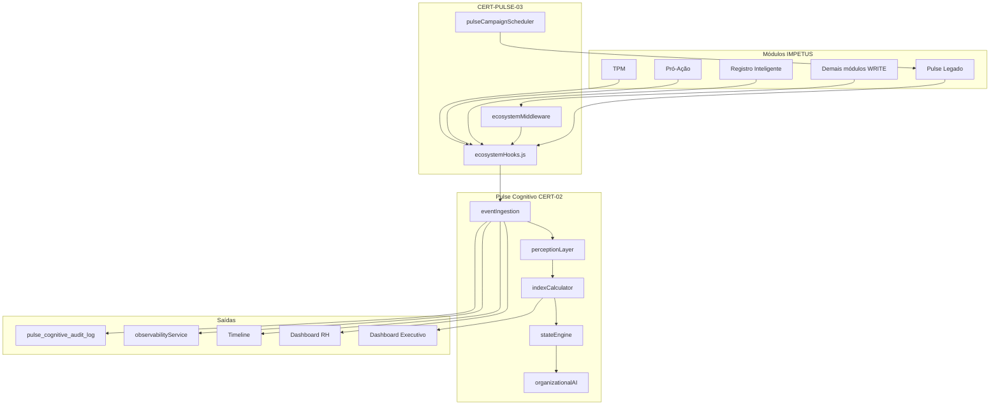
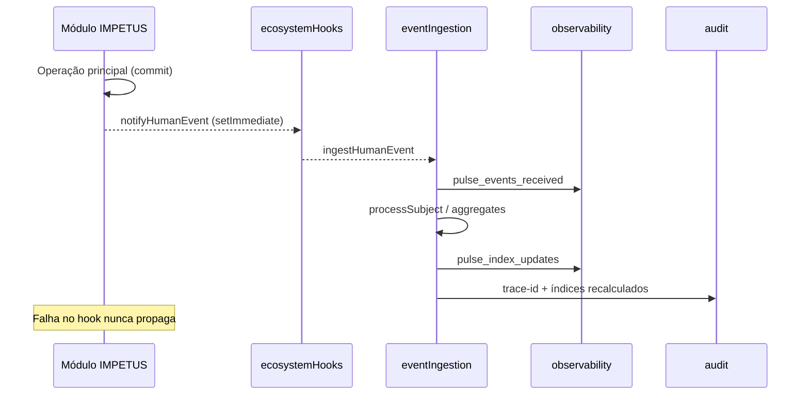
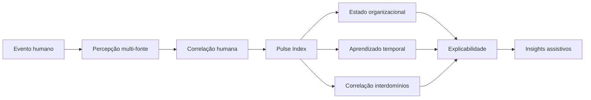

# CERT-PULSE-03 — Consolidação do Pulse Cognitivo Organizacional

**Data:** 2026-06-27  
**Status:** Certificado (integração ecossistema)  
**Pré-requisito:** CERT-PULSE-02 (arquitetura cognitiva preservada)

## Objetivo

Transformar o Pulse Cognitivo em componente nativo do ecossistema IMPETUS — integração, validação, observabilidade, enriquecimento de contexto e certificação. **100% aditivo:** nenhuma API legada `/api/pulse/*`, permissão ou fluxo existente foi alterado estruturalmente.

---

## Matriz de integração

| Módulo IMPETUS | Mecanismo | Evento cognitivo |
|----------------|-----------|------------------|
| TPM | Hook direto (`tpmFormService`) + HTTP bridge | `tpm_recorded` |
| Pró-Ação | Hook (`proacao.js`) + HTTP bridge | `proacao_submitted` |
| Qualidade | HTTP bridge | `quality_event` |
| SST | HTTP bridge | `sst_incident` |
| Comunicação | HTTP bridge | `communication` |
| Manu IA | HTTP bridge | `os_completed` |
| Biblioteca Técnica | HTTP bridge | `training_completed` |
| Registro Inteligente | Hook (`intelligentRegistrationService`) + bridge | `intelligent_registration` |
| Logística / Almoxarifado | HTTP bridge | `procedure_compliance` |
| Gestão de Ativos | Hook API (`assetManagement`) | `procedure_compliance` |
| Dashboard | Hook API (`dashboardInteraction`) | `internal_event` |
| Treinamentos / Reconhecimentos | Hook API | `training_completed` / `recognition` |
| Mudanças cargo/setor | `admin/users` PUT | `role_changed` / `sector_changed` |
| Mudanças hierárquicas | `userIdentitySync` | `hierarchy_changed` |
| Pulse legado | `pulseService` hooks CERT-02 | autoavaliação / supervisor |

Todos os hooks são **assíncronos fire-and-forget**; falhas são silenciosas e nunca interrompem o fluxo principal.

---

## Diagrama arquitetural (atualizado)

---

## Diagrama de eventos

---

## Diagrama fluxo cognitivo

---

## Fases implementadas

### FASE 1 — Hooks ecossistema
- `ecosystemHooks.js` — hooks por domínio
- `ecosystemMiddleware.js` — bridge HTTP em rotas WRITE `/api/*`
- Integrações diretas: TPM, Pró-Ação, Registro Inteligente, admin/users, userIdentitySync

### FASE 2 — Scheduler campanhas
- `pulseCampaignScheduler.js` — `frequency`, `next_run_at`, `last_run_at`
- Claim atômico antes do trigger (anti-duplicação)
- Boot em `server.js` (default 5 min, `IMPETUS_PULSE_SCHEDULER=off` para desligar)
- `createCampaign` define `next_run_at` inicial

### FASE 3 — Aprendizado temporal
- `temporalLearning.js` — melhora/queda/oscilação/estabilidade/mudança abrupta

### FASE 4 — Correlação interdomínios
- `crossDomainCorrelation.js` — Pulse × Operação × Qualidade × SST × RH × Gêmeo Digital (proxy)

### FASE 5 — Explicabilidade
- `explainability.js` — sinais, módulos, pesos, confiança, histórico, motivo

### FASE 6 — Dashboard executivo
- `executiveDashboard.js` + `GET /hr/executive`

### FASE 7 — Timeline cognitiva
- `timelineService.js` + `GET /hr/timeline`

### FASE 8 — Observabilidade
- `pulseCognitiveObservability.js` + métricas em `observabilityService`

### FASE 9 — Auditoria
- `pulseCognitiveAudit.js` + migration `pulse_cognitive_cert03_migration.sql`

### FASE 10 — Validação
- `npm run test:pulse-cognitive-regression` (CERT-02)
- `npm run test:pulse-cognitive-cert03` (CERT-03)

### FASE 11 — FUNCTIONAL_MATRIX
- Endpoints, flags, hooks e métricas documentados

---

## Lista de hooks implementados

Ver `backend/src/services/pulseCognitive/ecosystemHooks.js` e `FUNCTIONAL_MATRIX.md`.

---

## Evidências

| Tipo | Comando / artefato |
|------|-------------------|
| Regressão CERT-02 | `npm run test:pulse-cognitive-regression` |
| Integração CERT-03 | `npm run test:pulse-cognitive-cert03` |
| Compatibilidade | Pulse legado exporta API inalterada nos testes |
| Observabilidade | Métricas `pulse_*` em `ALLOWED_INCREMENT_METRICS` |
| LGPD / HITL | `GOVERNANCE` em todas as respostas cognitivas |

---

## Flags de ambiente

| Flag | Default | Descrição |
|------|---------|-----------|
| `IMPETUS_PULSE_COGNITIVE` | on | Desliga hooks e middleware |
| `IMPETUS_PULSE_SCHEDULER` | on | Desliga scheduler de campanhas |
| `IMPETUS_PULSE_SCHEDULER_INTERVAL_MS` | 300000 | Intervalo do cron |

---

## Migrations SQL (aplicar em produção)

1. `backend/src/models/pulse_cognitive_migration.sql` (CERT-02)
2. `backend/src/models/pulse_cognitive_cert03_migration.sql` (auditoria CERT-03)

Após aplicar: reiniciar PM2 com `--update-env` se flags alteradas.

---

## Critérios de certificação atendidos

- [x] Nenhuma funcionalidade removida
- [x] APIs legadas preservadas
- [x] Permissões inalteradas
- [x] Desenvolvimento 100% aditivo
- [x] Hooks assíncronos e resilientes
- [x] Insights explicáveis e rastreáveis
- [x] Human-in-the-loop e LGPD

---

## Próximas evoluções (fora do escopo Pulse)

Novos sinais do Gêmeo Digital Cognitivo, integrações ERP/MES e novos módulos passam a alimentar o mesmo `eventIngestion` sem alterar o núcleo CERT-02/03.
