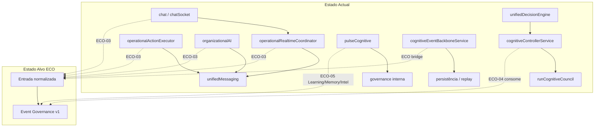

# ECO-01 — Mapa de Convergência (estado alvo)

**Fase:** 2 (preview) — baseado no inventário Fase 1  
**Nota:** Não implementado — apenas desenho arquitectural

---

## Fluxo canónico alvo

```text
Entrada (evento / pedido / sensor)
        ↓
Event Governance v1  ← infraestrutura congelada
  evaluateEvent → matching políticas
  evaluatePrepareAndExecute → executores
        ↓
Cognitive Controller  ← consome decisão EG (não compete)
  orquestra resposta LLM quando aplicável
        ↓
Execução (canais: NC, app, email, dashboard, chat)
        ↓
Observabilidade (métricas event_governance_*)
        ↓
Knowledge Base (referências institucionais)
```

---

## Diagrama por módulo (estado actual → alvo)



---

## Matriz módulo × fase ECO

| Módulo | Fase ECO | Acção |
|--------|----------|-------|
| operationalActionExecutor | ECO-03 | Eliminar bypass → adapter CHAT_OPERATIONAL |
| operationalRealtimeCoordinator | ECO-03 | Rotear chat operacional via EG |
| organizationalAI | ECO-03 | notifyRecipients via adapter |
| unifiedDecisionEngine | ECO-04 | Consumir decisão EG antes de council |
| cognitiveControllerService | ECO-04 | Controller consome EG |
| pulseCognitive | ECO-05 | Learning + Memory + Intelligence |
| conversationContext | ECO-06 | Knowledge Base context |
| Executive Dashboard / Boardroom | ECO-07 | Executive Insights API |
| Event Backbone | ECO-03/05 | Publisher → entrada EG |
| Manu IA | Parcial | Já tem adapter EG-10; web-push bypass |
| ANAM | Baixa | Context only — sem EG obrigatório |
| Registro Inteligente | ECO-03 | Dispatch escalation via EG |
| Workflow | Observação | Eventos workflow ≠ EG v1 |
| Digital Twin | ECO-07 | Métricas via Executive/KB |

---

## Sequência recomendada pós-Fase 1

```text
ECO-01 ✅ Inventário (esta fase)
ECO-02   Mapa detalhado + ADRs convergência
ECO-03   Eliminar bypasses P0/P1
ECO-04   Controller consome Governance
ECO-05   Pulse integra camadas cognitivas EG
ECO-06   Conversation Context + Knowledge Base
ECO-07   Executive dashboards → Executive Insights
ECO-08   Certificação ecossistema
```

---

## Infraestrutura congelada (não tocar)

- eventGovernanceService / eventGovernanceExecutionService
- governanceLearningService → governanceKnowledgeBaseService (Grupo A ONLINE)
- 11 adapters (comportamento shadow até PROMOTION domínios)
- APIs públicas / DTOs públicos

Convergência = **novos pontos de entrada** no pipeline existente, nunca reescrita do núcleo.
