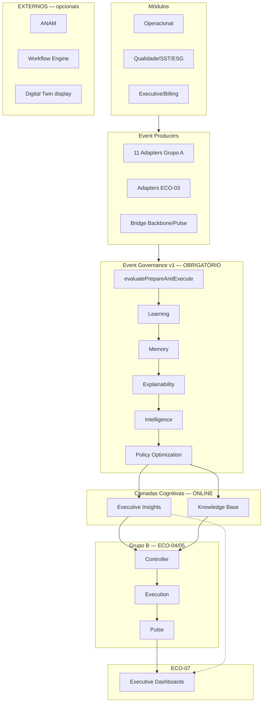

# ECO-02 — Convergence Architecture & ADR Certification

**Programa:** Cognitive Ecosystem Convergence  
**Fase:** 2 — Contrato arquitectural definitivo  
**Data:** 2026-07-02  
**Tipo:** Certificação arquitectural — **sem alterações de código**

---

## Decisão

**CONTRATO ARQUITECTURAL CERTIFICADO** — a partir desta fase, nenhuma integração do ecossistema cognitivo poderá ser implementada fora deste documento e dos ADRs ECO associados.

**Event Governance v1 permanece infraestrutura congelada.** ECO-02 não altera código, APIs públicas, DTOs, Controller, Pulse, Event Backbone nem Conversation Context Engine.

---

## Pré-requisitos (todos satisfeitos)

| Marco | Estado |
|-------|--------|
| Enterprise v1 | ✅ Certificado |
| Event Governance v1 | ✅ Certificado (EG-20) |
| INTEG-01 | ✅ Certificado com ressalvas |
| PROMOTION-02 | ✅ Grupo A ONLINE (8/8) |
| ECO-01 | ✅ Auditoria concluída |

---

## PARTE 1 — Arquitetura-Alvo

### Diagrama oficial de convergência

```text
┌─────────────────────────────────────────────────────────────────────────┐
│  MÓDULOS OPERACIONAIS (Qualidade, SST, ESG, TPM, Billing, ManuIA, …)  │
└───────────────────────────────────┬─────────────────────────────────────┘
                                    │ eventos / pedidos normalizados
                                    ▼
┌─────────────────────────────────────────────────────────────────────────┐
│  EVENT PRODUCERS                                                        │
│  • 11 adapters integrados (Grupo A)                                       │
│  • novos adapters ECO-03 (CHAT_OPERATIONAL, NC_BRIDGE_MIRROR)           │
│  • publishers futuros (Backbone bridge, Pulse ingress)                    │
└───────────────────────────────────┬─────────────────────────────────────┘
                                    │ evaluateEvent / evaluatePrepareAndExecute
                                    ▼
┌─────────────────────────────────────────────────────────────────────────┐
│  EVENT GOVERNANCE v1  ← INFRAESTRUTURA CONGELADA (baseline certificada) │
│  • Políticas · matching · executores · audit                            │
│  • Pipeline: AIOI → Learning → Memory → Explainability → Intelligence   │
│              → Policy Optimization                                        │
└───────────────────────────────────┬─────────────────────────────────────┘
                                    │
          ┌─────────────────────────┼─────────────────────────┐
          ▼                         ▼                         ▼
    ┌──────────┐            ┌──────────────┐           ┌──────────────┐
    │ Learning │───────────▶│    Memory    │──────────▶│Explainability│
    └──────────┘            └──────────────┘           └──────┬───────┘
                                                                ▼
                                                    ┌───────────────────┐
                                                    │   Intelligence    │
                                                    └─────────┬─────────┘
                                                              ▼
                                                    ┌───────────────────┐
                                                    │Policy Optimization│
                                                    └─────────┬─────────┘
                                                              │
          ┌───────────────────────────────────────────────────┘
          ▼
┌─────────────────────┐     ┌─────────────────────┐
│ Executive Insights  │     │   Knowledge Base    │  ← Grupo A ONLINE;
│ (audit API EG-18)   │     │   (audit API EG-19) │    fora do pipeline exec
└──────────┬──────────┘     └──────────┬──────────┘
           │                           │
           │         ┌─────────────────┘
           ▼         ▼
┌─────────────────────────────────────────────────────────────────────────┐
│  COGNITIVE CONTROLLER  ← consome decisão EG (ECO-04); não compete       │
│  • runCognitiveCouncil após decisão governada                           │
│  • orquestra LLM quando política permitir                               │
└───────────────────────────────────┬─────────────────────────────────────┘
                                    ▼
┌─────────────────────────────────────────────────────────────────────────┐
│  EXECUTION                                                              │
│  • notificationCenterExecutor · chatExecutor · canais unificados      │
│  • unifiedMessaging (único ponto de saída após EG)                      │
└───────────────────────────────────┬─────────────────────────────────────┘
                                    ▼
┌─────────────────────────────────────────────────────────────────────────┐
│  PULSE COGNITIVE  ← consome camadas EG (ECO-05); sem governança interna │
│  • eventIngestion · cognitiveMotor · organizationalAI                   │
└───────────────────────────────────┬─────────────────────────────────────┘
                                    ▼
┌─────────────────────────────────────────────────────────────────────────┐
│  EXECUTIVE DASHBOARDS  ← consomem Executive Insights (ECO-07)           │
│  • boardroom · pulse executive · runtime Z.27 unificado                 │
└─────────────────────────────────────────────────────────────────────────┘
```

### Diagrama Mermaid (referência)



---

### Classificação de fluxos

| Classificação | Componentes | Regra |
|---------------|-------------|-------|
| **Obrigatório** | Event Producers → Event Governance v1 → Learning → Memory → Explainability → Intelligence → Policy Optimization → Execution | Toda notificação/decisão operacional deve passar por EG antes de `unifiedMessaging` |
| **Obrigatório (pós-ECO-04)** | Controller consome decisão EG; não invoca council antes de `evaluatePrepareAndExecute` | ADR-ECO-001 |
| **Opcional (audit)** | Executive Insights, Knowledge Base | Serviços ONLINE; consumo via API audit; integração em ECO-06/07 |
| **Opcional (domínio)** | Workflow `governance.workflow.*`, Digital Twin display, ANAM token | Não substituem EG; observação apenas |
| **Externo** | Gemini/LLM providers, appImpetus push nativo, web-push ManuIA, MQTT/edge industrial | Fora do contrato EG; adapters normalizam entrada |

---

### Pontos de integração congelados

| Ponto | Contrato | Fase |
|-------|----------|------|
| Entrada normalizada | `GovernanceEvent` + `company_id` | ECO-03 |
| Pipeline exec | `eventGovernanceExecutionService.evaluatePrepareAndExecute` | Baseline |
| Saída notificação | Executores EG → `unifiedMessaging` | ECO-03 |
| Decisão cognitiva | Controller lê resultado EG | ECO-04 |
| Contexto institucional | Knowledge Base API | ECO-06 |
| Métricas executivas | Executive Insights API | ECO-07 |

---

## PARTE 4 — Classificação das NCs (reclassificação ECO-01)

| NC | Prioridade | Complexidade | Impacto operacional | Dependências | Fase | Rollback previsto |
|----|------------|--------------|---------------------|--------------|------|-------------------|
| NC-INT-004 | **P0** | Média | Alto — notificações autónomas sem política | CHAT_OPERATIONAL adapter | ECO-03 | Flag shadow + revert adapter |
| NC-ECO-P0-002 | **P0** | Média-Alta | Alto — chat operacional bypass | operationalRealtimeCoordinator | ECO-03 | Feature flag `ECO_CHAT_VIA_EG` |
| NC-ECO-P0-003 | **P0** | Média | Alto — escalation org sem EG | organizationalAI | ECO-03 | Flag + fallback notifyRecipients |
| NC-INT-005 | **P1** | Baixa | Médio — políticas sem adapter | ECO-03 adapters | ECO-03 | Catálogo inalterado; adapter OFF |
| NC-ECO-P1-002 | **P1** | Baixa | Médio — legacy catch fallbacks | Domínios shadow | ECO-03 | Shadow mode por domínio |
| NC-INT-001 | **P2** | Alta | Médio — council paralelo | ECO-03 completo | ECO-04 | Controller shadow consume |
| NC-ECO-P2-002 | **P2** | Alta | Médio-Alto — unifiedDecisionEngine | ECO-04 | ECO-04 | Flag `ECO_CONTROLLER_EG_FIRST` |
| NC-INT-003 | **P2** | Baixa | Baixo — UI audit EG | Frontend only | ECO-07 | Sem impacto runtime |
| NC-INT-007 | **P2** | Média | Médio — domínios shadow | PROMOTION domínios | ECO-03/08 | Flags domínio OFF |
| NC-INT-006 | **P3** | Alta | Médio — Pulse governança interna | ECO-04 | ECO-05 | Pulse GOVERNANCE flag |
| NC-INT-002 | **P3** | Média | Baixo-Médio — backbone sem subscriber | ECO-03 publishers | ECO-05 | Bridge publisher OFF |
| NC-ECO-P3-003 | **P3** | Média | Baixo — schedulers/admin bypass | ECO-03 | ECO-08 | Por módulo |

**Regra de sequência:** P0/P1 (ECO-03) **antes** de P2 Controller (ECO-04) **antes** de P3 Pulse/Backbone (ECO-05).

---

## Infraestrutura congelada (proibido alterar)

- `eventGovernanceService.js` / `eventGovernanceExecutionService.js`
- Serviços Grupo A: Learning, Memory, Explainability, Intelligence, Policy Optimization, Executive Insights, Knowledge Base
- 11 adapters existentes (comportamento até ECO-03)
- APIs públicas e DTOs públicos
- Event Governance flags baseline PROMOTION-02

---

## Documentação ECO-02

| Documento | Conteúdo |
|-----------|----------|
| [`ECO_02_CONVERGENCE_ARCHITECTURE.md`](./ECO_02_CONVERGENCE_ARCHITECTURE.md) | Este contrato |
| [`ECO_02_ADR_INDEX.md`](./ECO_02_ADR_INDEX.md) | Índice ADRs convergência |
| [`ECO_02_DEPENDENCY_MATRIX.md`](./ECO_02_DEPENDENCY_MATRIX.md) | Matriz produtor/consumidor |
| [`ECO_02_MIGRATION_PLAN.md`](./ECO_02_MIGRATION_PLAN.md) | Plano por módulo |
| [`ECO_02_EXECUTION_SEQUENCE.md`](./ECO_02_EXECUTION_SEQUENCE.md) | Sequência congelada + critérios de aceite |

---

## Critérios obrigatórios

```json
{
  "target_architecture_defined": true,
  "all_parallel_flows_classified": true,
  "all_adrs_created": true,
  "dependency_matrix_complete": true,
  "migration_plan_complete": true,
  "execution_order_frozen": true,
  "event_governance_v1_preserved": true,
  "no_code_changes": true
}
```

---

## Certificação

```bash
cd backend
node src/tests/audit/ECO_02_CONVERGENCE_ARCHITECTURE.test.js
```

Evidências: [`evidence/eco-02/`](./evidence/eco-02/)

---

## Próximo passo

**ECO-03** — Eliminar bypasses P0/P1 (única fase autorizada após ECO-02).
