# EVENT GOVERNANCE — Mapa de Dependências

**Certificação:** INTEG-01  
**Baseline:** Event Governance v1  
**Data:** 2026-07-02

---

## Diagrama de integração (ecossistema)

```mermaid
flowchart TB
  subgraph producers [Produtores IMPETUS]
    OA[operationalAlertsService]
    AI[aiProactiveMessagingService]
    TPM[tpmNotifications]
    EX[executiveMode]
    BILL[subscriptionBillingNotificationService]
    DSR[dsrNotificationService]
    MAN[manuiaInboxIngestService]
    QUA[qualityIntelligenceService]
    SST[sstNotificationService]
    ESG[esgNotificationService]
    OAE[operationalActionExecutor]
  end

  subgraph adapters [Governance Adapters EG-04..12]
    AD11[11 adapters em governanceAdapters/]
  end

  subgraph core [Event Governance v1 — CONGELADO]
    EV[eventGovernanceService.evaluateEvent]
    EPE[eventGovernanceExecutionService.evaluatePrepareAndExecute]
    CAT[eventPolicyCatalog]
    CH[channelRegistry]
    EXE[executorRegistry]
  end

  subgraph post [Camadas cognitivas EG-12..17]
    AIOI[aioiGovernanceIntegration]
    LEARN[Learning]
    MEM[Memory]
    XAI[Explainability]
    INTEL[Intelligence]
    OPT[Policy Optimization]
  end

  subgraph advisory [Consultivo EG-18..19]
    EXEC[Executive Insights]
    KB[Knowledge Base]
  end

  subgraph parallel [Ecossistemas paralelos — SEM EG]
    PULSE[Pulse Cognitive]
    CC[Cognitive Controller]
    EB[cognitiveEventBackboneService]
    FE[Frontend runtime governance UI]
  end

  subgraph audit [Auditoria]
    API["/api/audit/event-governance/*"]
  end

  OA -->|ESG/SST route| ESG
  OA -->|ESG/SST route| SST
  OA --> AD11
  AI --> AD11
  TPM --> AD11
  EX --> AD11
  BILL --> AD11
  DSR --> AD11
  MAN --> AD11
  QUA --> AD11
  SST --> AD11
  ESG --> AD11

  OAE -.->|bypass NC-INT-004| UM[unifiedMessagingService]

  AD11 --> EPE
  EPE --> EV
  EV --> CAT
  EPE --> CH
  EPE --> EXE
  EPE --> post
  AIOI --> AD11

  EXEC --> INTEL
  EXEC --> OPT
  KB --> EXEC
  KB --> post

  core --> API
  advisory --> API

  PULSE -.-x core
  CC -.-x core
  EB -.-x core
  FE -.-x API
```



---

## Dependências por camada

### Nível 0 — Event Backbone (EG-01)

```
eventGovernanceService
├── eventPolicyCatalog (declarativo)
├── severityNormalizer
├── governanceDecisionDto
└── observabilityService (métricas)
```

### Nível 1 — Execução (EG-02/03)

```
eventGovernanceExecutionService
├── eventGovernanceService
├── channelRegistry
├── executorRegistry
│   ├── notificationCenterExecutor
│   ├── appImpetusExecutor
│   ├── emailExecutor
│   ├── dashboardExecutor
│   └── chatExecutor
└── governanceExecutionContract
```

### Nível 2 — Adapters de domínio (EG-04..11C)

```
governanceAdapters/*
├── evaluatePrepareAndExecute (pipeline)
├── buildGovernanceEvent (normalização)
├── compareShadow (equivalência)
└── runLegacyDistribution (fallback shadow)
```

**Dependência unidireccional:** Adapter → Pipeline → Executores. Nunca inverso.

### Nível 3 — Cognição (EG-12..17)

```
evaluatePrepareAndExecute
├── aioiGovernanceIntegrationService → aioiGovernanceAdapter
├── governanceLearningIntegrationService → governanceLearningService
├── governanceMemoryIntegrationService → governanceOperationalMemoryService
├── governanceExplainabilityService
├── governanceIntelligenceService
└── governancePolicyOptimizationService
```

### Nível 4 — Consultivo (EG-18..19) — SEM pipeline

```
governanceExecutiveInsightsService
├── governanceIntelligenceService (read)
├── governancePolicyOptimizationService (read)
└── governanceLearningService (read)

governanceKnowledgeBaseService
├── EG-13..18 (referências read-only)
└── governanceExecutiveInsightsService (read)
```

---

## Matriz de dependência Adapter → Política → Canal

| Adapter | Política | Canais executores |
|---------|----------|-------------------|
| operationalAlerts | OPERATIONAL_CRITICAL / MEDIUM | NC, dashboard |
| aiProactive | AI_PROACTIVE | app_impetus, NC |
| tpm | TPM_CRITICAL | app_impetus, NC |
| executive | EXECUTIVE_ALERT | app_impetus, NC |
| billing | BILLING_* | email, app, NC |
| dsr | DSR_LIFECYCLE | NC, notifications_table |
| manuia | MANUIA_INBOX | manuia_inbox |
| quality | QUALITY_LIFECYCLE | NC, dashboard, chat, app |
| sst | SST_LIFECYCLE | NC, dashboard, chat, app |
| esg | ESG_LIFECYCLE | NC, dashboard, chat, app |
| aioi | AIOI_INSIGHT | NC, dashboard, chat, app |

---

## Consumidores órfãos / bypass (NCs)

| Origem | Destino | NC |
|--------|---------|-----|
| `operationalActionExecutor` | `unifiedMessagingService.sendToUser` | NC-INT-004 |
| `notificationBridgeService` | NC directo (shadow) | NC-INT-005 |
| `cognitiveEventBackboneService` | Pipeline industrial (sem EG) | NC-INT-002 |
| `cognitiveControllerService` | Orquestração cognitiva (sem EG) | NC-INT-001 |
| `pulseCognitive/*` | Governança assistiva interna | NC-INT-006 |
| Frontend | UI governance runtime (sem audit EG) | NC-INT-003 |

---

## Feature flags — dependência de activação

```
EVENT_GOVERNANCE_ENABLED          → decisão activa (senão shadow global)
EVENT_GOVERNANCE_EXECUTION_ENABLED → execução real (senão dry-run)
EVENT_GOVERNANCE_<DOMÍNIO>        → migração por adapter (senão shadow+legado)
EVENT_GOVERNANCE_LEARNING..KB     → camadas cognitivas (default OFF)
```

**Estado actual certificado:** todas as flags OFF por defeito — integração em modo shadow preservando legado.
