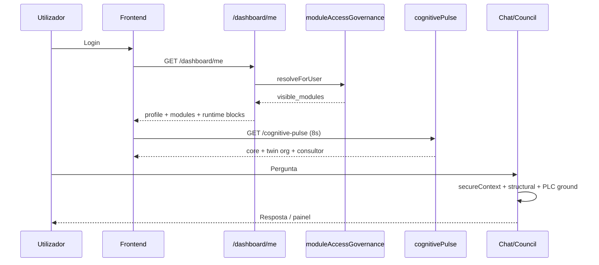

# Volume I — Arquitetura Cognitiva Global
## ICEB Enterprise Edition v1.0 · Rascunho estrutural

**Classificação geral:** mistura **AB** (implementado) e **N** (alvo unificado). Ver Volume 0.

---

## Capítulo 1 — Filosofia (resumo)

Ver [Volume-00-CARTA-MAGNA.md](./Volume-00-CARTA-MAGNA.md) §3–8.

---

## Capítulo 2 — Camadas cognitivas

### 2.1 Camada de identidade **AB**

| Componente | Ficheiro | Função |
|------------|----------|--------|
| Base Estrutural CRUD | `routes/admin/structural.js` | Master data empresa |
| Identidade organizacional | `organizationalIdentityEngine.js` | Valida cargo, hierarquia |
| Contexto org | `organizationalContextEngine.js` | Payload para IA/dashboard |
| Eixo funcional | `functionalAxisResolver.js` | `functional_area` canónico |
| Perfil dashboard | `dashboardProfileResolver.js` | `dashboard_profile` |
| Utilizador enriquecido | `structuralUserProfileService.js` | Join user ↔ cargo |

### 2.2 Camada de governança modular **AB**

| Componente | Ficheiro |
|------------|----------|
| Governança de acesso | `moduleAccessGovernanceEngine.js` |
| Cadastro → menu_keys | `structuralCadastroModuleResolver.js` |
| Isolamento domínio | `domainAuthority/`, `domainRegistry.js` |
| Módulos contextuais | `contextualModules/` |
| Filtro legacy | `structuralModuleResolver.js` |

**Pipeline `/api/dashboard/me` (ordem):** enrich user → profile → allowedModules → governança #1 → contextual enrich → runtimes K–Z → governança terminal → reconciliação (limitada se governança ON).

### 2.3 Camada de pulso e consciência **AB**

| Componente | Endpoint | Função |
|------------|----------|--------|
| Cognitive pulse | `GET /dashboard/cognitive-pulse` | Ecossistema vivo |
| Live surface SSE | `GET /dashboard/live-surface/stream` | Atualização 15s |
| Org intelligence | `organizationalIntelligenceEngine.js` | Core, twin org, agentes |
| Living enrichment | `cognitiveLivingEnrichment.js` | Densidade UI |
| Presence | `organizationalPresenceEngine.js` | Presença global |

### 2.4 Camada de decisão **AB**

| Componente | Ficheiro |
|------------|----------|
| Decisão unificada | `unifiedDecisionEngine.js` |
| Fachada decisão | `decisionFacadeService.js` |
| Conselho | `ai/cognitiveOrchestrator.js` |
| Políticas cognitivas | `cognitivePolicyFacadeService.js` |
| Verdade / closure | `cognitiveTruthClosureService.js` |

### 2.5 Camada de exposição **AB**

| Componente | Ficheiro |
|------------|----------|
| Dashboard composer | `dashboardComposerService.js` |
| KPIs | `dashboardKPIs.js` |
| Claude panel | `claudePanelService.js` |
| Smart panel | `smartPanelCommandService.js` |
| Chat consolidado | `chatAIService.consolidated.js` |

### 2.6 Runtime Z (SZ1–SZ5) **AB**

Montes em `server.js`: `runtime-z-sovereign`, `runtime-z-cognitive-os`, `runtime-z-maturation`, `runtime-z-operational-nervous-system`, SZ5 memória unificada.

Enriquecem `GET /dashboard/me` com blocos `runtime_z_*`.

### 2.7 Camada industrial / twin **AB parcial**

| Componente | Estado |
|------------|--------|
| Mapa fábrica | `industrialOperationalMapService.js` — AB |
| Twin layout+estado | `digitalTwinService.js` — AB backend |
| Twin applied manutenção | `digitalTwinApplied.js` — **não montado** |
| World model | **R** — inexistente |

---

## Capítulo 3 — Como o IMPETUS pensa (fluxo)

---

## Capítulo 4 — Motores Tier 1 (decisão) — fichas resumidas

| ID | Motor | AB | Ficheiro |
|----|-------|-----|----------|
| motor.decisao.unified | Unified Decision Engine | AB | `unifiedDecisionEngine.js` |
| motor.decisao.facade | Decision Facade | AB | `decisionFacadeService.js` |
| motor.decisao.council | Cognitive Council | AB | `cognitiveOrchestrator.js` |
| motor.decisao.operational | Operational Decision Engine | AB | `operationalDecisionEngine.js` |
| motor.politica.facade | Cognitive Policy Facade | AB | `cognitivePolicyFacadeService.js` |
| motor.verdade.closure | Truth Closure | AB | `cognitiveTruthClosureService.js` |
| motor.world | World Model | **R** | — |

*Ficha completa: [templates/TEMPLATE-MOTOR.md](./templates/TEMPLATE-MOTOR.md)*

---

## Capítulo 5 — Distinções normativas (N)

1. **Chat reactivo** ≠ **Pulse proactivo** — documentar em toda a UI.
2. **Twin organizacional** ≠ **Twin industrial** — não usar o mesmo ícone/label sem qualificador.
3. **Governança modular** é autoridade final de `visible_modules` quando `moduleAccessGovernanceEngine` ON.
4. Dados **seeded** (`cognitiveLivingEnrichment`) não devem alimentar decisões de acesso nem auditoria VERDE.

---

## Capítulo 6 — Pendências Volume I

- [ ] Diagrama completo runtime-z
- [ ] Ficha T1 para cada motor de decisão (15+)
- [ ] Mapeamento IMPETUS_DASHBOARD_ENGINE_V2 / cognitive composition gateway
- [ ] Cruzamento com AIOI queue sovereignty

---

*Volume I · esqueleto v1.0 · ~12 páginas equivalentes · expandir para 18–22*
