# IMPETUS — MANUAL MASTER DE ENGENHARIA, IMPLANTAÇÃO, SUPORTE E OPERAÇÃO

> Documento oficial de referência técnica e operacional do ecossistema **IMPETUS COMUNICA IA**.
> Registro INPI: **BR512025007048-9** — © Wellington Machado de Freitas & Gustavo Júnior da Silva.
> Classificação: **CONFIDENCIAL — USO INTERNO E PARCEIROS AUTORIZADOS**.

---

## METADADOS DO DOCUMENTO

| Campo | Valor |
|-------|-------|
| Título | IMPETUS — Manual Master de Engenharia, Implantação, Suporte e Operação |
| Versão | 1.0 |
| Data de emissão | 18/06/2026 |
| Última revisão | 18/06/2026 |
| Base de código | `/var/www/impetus-completa` |
| Backend oficial (produção/PM2) | `backend/` na raiz do repositório |
| Públicos | Engenharia, DevOps, Implantação, Suporte N1/N2/N3, Onboarding, CS, Parceiros, Consultores |
| Status | Documento vivo — sujeito a atualização controlada |
| Fonte | Auditoria direta do código, documentação técnica e estado de produção (PM2) |

### Princípio editorial

Este manual documenta **apenas o que existe ou está claramente implementado** no código-fonte e na infraestrutura de produção. Sempre que um componente estiver em estado de *shadow*, *foundation* ou *em consolidação*, isso é declarado explicitamente. Nenhuma capacidade fictícia é descrita como pronta.

---

## ÍNDICE NAVEGÁVEL

### PARTE 1 — ENGENHARIA E MANUTENÇÃO DO SOFTWARE
- [1. Visão Arquitetural Completa](#1-visão-arquitetural-completa)
- [2. Runtime Cognitivo (Z.18–Z.29, C0–C6, Runtime Z, Motor A, Engine V2)](#2-runtime-cognitivo)
- [3. Estrutura de Diretórios](#3-estrutura-de-diretórios)
- [4. Banco de Dados (tabelas, relações, RLS, multi-tenant, auditoria)](#4-banco-de-dados)
- [5. APIs (rotas, payloads, autenticação, autorização)](#5-apis)
- [6. PM2 (configuração, monitoramento, restart, troubleshooting)](#6-pm2)
- [7. Docker (containers, build, deploy)](#7-docker)
- [8. Variáveis de Ambiente](#8-variáveis-de-ambiente)
- [9. Observabilidade (logs, métricas, auditoria, telemetria)](#9-observabilidade)
- [10. Troubleshooting de Engenharia](#10-troubleshooting-de-engenharia)

### PARTE 2 — IMPLANTAÇÃO E INSTALAÇÃO
- [11. Pré-Requisitos](#11-pré-requisitos)
- [12. Instalação Completa](#12-instalação-completa)
- [13. Configuração Inicial](#13-configuração-inicial)
- [14. Integrações (MQTT, OPC-UA, Modbus, ERP, APIs externas)](#14-integrações)
- [15. Go Live — Checklist](#15-go-live)
- [16. Validação Pós-Go-Live — Checklist](#16-validação-pós-go-live)
- [17. Plano de Rollback](#17-plano-de-rollback)

### PARTE 3 — SUPORTE OPERACIONAL E CADASTRO
- [18. Fluxo de Atendimento (N1, N2, N3, Escalonamento)](#18-fluxo-de-atendimento)
- [19. Cadastro Completo do Cliente](#19-cadastro-completo-do-cliente)
- [20. Base Estrutural](#20-base-estrutural)
- [21. Configuração de Perfis](#21-configuração-de-perfis)
- [22. Parametrização dos Módulos](#22-parametrização-dos-módulos)
- [23. Treinamento do Cliente](#23-treinamento-do-cliente)
- [24. Problemas Frequentes (FAQ técnico)](#24-problemas-frequentes)
- [25. Boas Práticas](#25-boas-práticas)
- [26. Erros Comuns](#26-erros-comuns)
- [27. Indicadores de Sucesso](#27-indicadores-de-sucesso)

### CAPÍTULOS ESPECIAIS
- [28. Como o IMPETUS Funciona (linguagem simples)](#28-como-o-impetus-funciona)
- [29. Guia de Treinamento Interno](#29-guia-de-treinamento-interno)
- [30. Matriz de Conhecimento](#30-matriz-de-conhecimento)
- [31. Operação Enterprise do IMPETUS](#31-operação-enterprise-do-impetus)

### ANEXOS
- [A. Matriz de Responsabilidades (RACI)](#anexo-a--matriz-de-responsabilidades-raci)
- [B. Plano de Certificação Interna](#anexo-b--plano-de-certificação-interna)
- [C. Roadmap de Manutenção Documental](#anexo-c--roadmap-de-manutenção-documental)
- [D. Glossário Técnico](#anexo-d--glossário-técnico)

---

# PARTE 1 — ENGENHARIA E MANUTENÇÃO DO SOFTWARE

**Público:** Desenvolvedores, Arquitetos, DevOps, Suporte N3.

Esta parte descreve como o IMPETUS é construído, como roda em produção, e como diagnosticar e corrigir problemas no nível de engenharia.

---

## 1. Visão Arquitetural Completa

### 1.1 Conceito central

O IMPETUS **não é um ERP, nem um BI, nem um MES isolado**. É uma **camada de inteligência operacional industrial** que unifica sete domínios (Qualidade, Manutenção, Segurança do Trabalho, Meio Ambiente, Logística, Produção/MES e Gestão Executiva), entregando a informação certa, para a pessoa certa (por cargo), no momento certo, com governança de IA e memória operacional persistente.

A arquitetura tem **três camadas de inteligência**:

1. **Camada Determinística (~80% das respostas)** — classificação, SLA, detecção estatística de anomalias, roteamento por cargo. Não usa modelo generativo; não alucina.
2. **Conselho Cognitivo (tri-IA)** — GPT (OpenAI), Claude (Anthropic) e Gemini (Google) operando sob verificação de verdade (*truth enforcement*) e firewall de prompt.
3. **Runtime Cognitivo (Runtime Z)** — composição governada de dashboards, painéis e insights por perfil, com modos *shadow → controlled → active*.

### 1.2 Diagrama de arquitetura geral

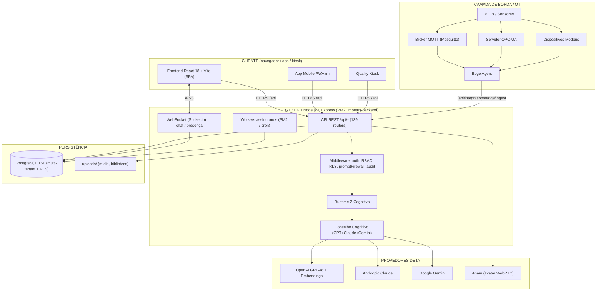

### 1.3 Backend

- **Runtime:** Node.js ≥ 18, Express.js.
- **Entrypoint oficial de produção:** `backend/src/server.js` (≈2.563 linhas), executado pelo PM2 como `impetus-backend`.
- **Porta padrão:** `4000` (configurável via `PORT`).
- **Routers montados:** 139 arquivos em `backend/src/routes/` (+ subpastas `aioi/`, `admin/`, `audit/`, `operations/`, `webhooks/`). Mais de 200 prefixos `/api/*` ativos.
- **Comunicação em tempo real:** Socket.io (chat interno, presença, alertas).
- **Workers/jobs assíncronos:** Pró-Ação, subscription, IA proativa, HR intelligence, detecção de anomalias, detecção de lotes, quality intelligence, logistics intelligence, billing de tokens Nexus.

> **Regra de ouro (workspace rule `backend-official-production`):** toda evolução do servidor é feita em `backend/` na raiz — o mesmo diretório que o PM2 usa em produção. Não usar `impetus_complete/backend` como base de produção.

### 1.4 Frontend

- **Stack:** React 18 + Vite, React Router 6, Recharts, Lucide React, Axios, date-fns, socket.io-client.
- **Arquitetura:** *domain-driven* + *feature-driven*.
  - `pages/` — 90 páginas/telas.
  - `features/` — dashboard (Centro de Comando + cognitiveEcosystem), smartPanel, biblioteca, pulse, governance, manutencao-ia, technical-library, proacao.
  - `domains/` — quality, safety, environment, logistics, admin (runtime operacional, governança, telemetria, cognitivo, rollout por domínio).
  - `modules/` — aioi (Portal Executivo), live-assistance, asset-management.
  - `components/` — biblioteca de UI (Layout, ImpetusChart, avatares, voz, etc.).
- **Design System:** Industrial 4.0 (`frontend/src/styles/tokens.css` + `styles.css`). Tema dark, acentos cyan/green/amber/red, fontes Rajdhani + Share Tech Mono, `border-radius ≤ 8px`, grade técnica no root.
- **Build:** `npm run build` gera `frontend/dist/`, servido por PM2 (`impetus-frontend`) ou nginx.

### 1.5 Banco de dados

- **PostgreSQL 15+**, com extensões `pgcrypto` (obrigatória) e `vector`/pgvector (opcional, para RAG/embeddings).
- Multi-tenant por `company_id` em todas as operações de negócio.
- **Row Level Security (RLS)** controlado por runtime de isolamento (`backend/src/tenant-isolation/`).
- Auditoria universal e triggers de imutabilidade.

### 1.6 Integrações

- **OT/IIoT:** MQTT (`industrial-mqtt/`), OPC-UA (`industrial-opcua/`), Modbus (`industrial-modbus/`), Edge agent (`industrial-edge/`).
- **MES/ERP:** webhook push com token (`/api/integrations/mes-erp/*`), Digital Twin, registro manual de turno.
- **Identidade enterprise:** Federation OIDC/SAML, SCIM v2.
- **Billing:** Asaas (assinaturas e boletos), NexusIA (tokens de IA).

### 1.7 IA

- **Provedores:** OpenAI (GPT-4o + embeddings), Anthropic Claude, Google Gemini, Anam (avatar de vídeo WebRTC), lipsync local (PM2 `lipsync-api`).
- **Governança:** `promptFirewall` (middleware), truth enforcement, registro de incidentes, HITL (human-in-the-loop) obrigatório para ações críticas.
- **Resiliência:** circuit breaker — a plataforma continua operando (camada determinística) mesmo se os provedores de IA ficarem indisponíveis.

---

## 2. Runtime Cognitivo

O Runtime Cognitivo é o coração diferenciador do IMPETUS. Ele decide **o que cada usuário vê**, **com qual confiança**, e **sob qual nível de governança**, sempre preservando a verdade operacional (não inventar dados).

### 2.1 Mapa de componentes (diretórios reais)

| Diretório (`backend/src/`) | Papel |
|----------------------------|-------|
| `cognitiveRuntime/` | Núcleo do runtime cognitivo: composição, confiança, drift, fallback, governança, soberania, fases Z (loggers Z18–Z26, ZP0). Subpastas `c3/`, `c4/`, `c5/`, `c6/`. |
| `cognitiveConvergence/` | Convergência de verdade: `governedAiOrchestrator`, `runtimeTruthResolver`, `contextualTruthAuthority`, resolvers unificados (KPI, summary, insight). |
| `cognitiveRegistry/` | Registro e ativação de capacidades cognitivas. |
| `cognitiveOperations/` | Operações cognitivas em runtime. |
| `cognitiveBudget/` | Orçamento/limite de uso cognitivo por tenant. |
| `runtime-z-sovereign/` | Runtime Z soberano (bootstrap, composition, hydration, identity, kpi, promotion, shadow, sz5). |
| `runtime-z-cognitive-os/` | "Sistema operacional" cognitivo (cognition, memory, reasoning, orchestration, continuity). |
| `runtime-z-operational-nervous-system/` | "Sistema nervoso operacional" (awareness, communication, execution, intelligence, internal-chat, reminders, tasks, workflows). |
| `runtime-z-maturation/` | Maturação progressiva do runtime Z. |
| `dashboardEngineV2/` | Engine V2 de composição de dashboard. |
| `domainAuthority/` | Autoridade por domínio (quem pode publicar/decidir o quê). |

### 2.2 Fases Z (Z.18 → Z.29)

As fases Z representam a **evolução incremental e auditável** do runtime cognitivo. Cada fase tem um *logger* dedicado (`phaseZNNLogger.js`) que registra evidências de comportamento, permitindo validação antes de promoção.

| Fase | Foco (conforme loggers e relatórios) |
|------|--------------------------------------|
| **ZP0** | Baseline/observação inicial do runtime cognitivo. |
| **Z.18** | Observação de composição cognitiva em shadow. |
| **Z.19** | Bridge para cockpit de qualidade / composição cognitiva. |
| **Z.20** | Validação de composição e promoção controlada. |
| **Z.21** | Estabilização de entrega contextual. |
| **Z.22** | Convergência de KPI/summary sob verdade. |
| **Z.23** | Soberania do runtime (decisão por domínio). |
| **Z.24** | Maturação operacional e utilidade. |
| **Z.25** | Escalonamento operacional do runtime. |
| **Z.26** | Sustentabilidade e governança consolidada. |
| **Z.27–Z.29** | Fases de evolução reservadas/lab — **não promovidas a produção sem certificação explícita** (ver Operação Enterprise). |

> **Importante:** o estado *promovido* de cada fase é controlado por feature flags e governança. Nem toda fase Z está `active` em produção; muitas operam em `shadow` para coletar evidência sem afetar a operação real.

### 2.3 Camadas C0 → C6

A nomenclatura C0–C6 descreve a **profundidade cognitiva** aplicada ao processar uma solicitação. Implementação em `cognitiveRuntime/c3..c6/` e orquestração na convergência.

| Camada | Descrição |
|--------|-----------|
| **C0** | Determinística pura — sem IA generativa (classificação, regras, SLA). |
| **C1** | Enriquecimento contextual determinístico (juntar dados do tenant). |
| **C2** | Recuperação semântica / memória operacional (RAG sobre documentos do tenant). |
| **C3** | Inferência cognitiva assistida (single-model, com truth check). |
| **C4** | Convergência multi-modelo (Conselho Cognitivo: GPT + Claude + Gemini). |
| **C5** | Composição governada de saída (dashboards/painéis por perfil, render promotion). |
| **C6** | Soberania e autoridade — decisão sobre o que entra em produção, com HITL e auditoria. |

### 2.4 Motor A, Engine V2 e Fachada de Decisão

- **Motor A (motor unificado):** núcleo de decisão comportamental com guardas de estabilidade, integridade de aprendizado, conservadorismo e *behavior drift*. Controlado por flags `UNIFIED_*` (default OFF em produção até validação explícita).
- **Engine V2 (`dashboardEngineV2/`):** segunda geração do compositor de dashboard, responsável por montar o cockpit por cargo a partir de dados reais.
- **Fachada de Decisão (`USE_DECISION_FACADE`):** quando ativa, dashboard e `/chat` encaminham a decisão ao motor via `decisionFacadeService`. `DECISION_FACADE_VALIDATE` habilita validação de coerência fachada-vs-motor em staging (logs `[DECISION_FACADE_COHERENCE]`).

### 2.5 Fallback, Governança, Authority e Sovereignty

- **Fallback (`cognitiveRuntime/fallback/`):** se a IA falhar ou a confiança ficar abaixo do limiar, o sistema cai para a camada determinística e devolve uma resposta segura ("não há dados suficientes" em vez de inventar).
- **Governança (`governance/`, `cognitiveConvergence/governedTruthRegistry`):** registra cada decisão, sua origem de dados e seu nível de confiança.
- **Authority (`domainAuthority/`):** define qual domínio/serviço tem autoridade sobre cada tipo de dado e publicação.
- **Sovereignty (`runtime-z-sovereign/`):** garante que o runtime só promove a produção (`active`) o que passou por shadow + validação + governança.

### 2.6 Fluxo cognitivo de uma pergunta

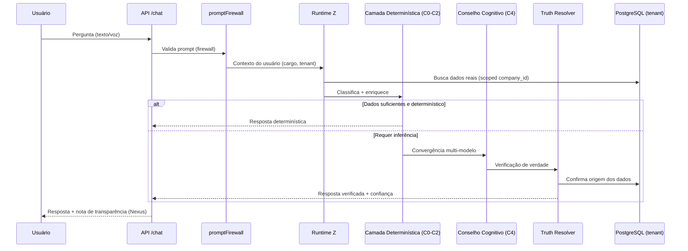

---

## 3. Estrutura de Diretórios

### 3.1 Raiz do repositório (`/var/www/impetus-completa/`)

```
impetus-completa/
├── backend/                     # BACKEND OFICIAL (produção / PM2)
│   ├── src/                     # Código-fonte
│   ├── migrations/              # Migrations SQL (31 arquivos + _rollback)
│   ├── scripts/                 # Migrations runner, workers, seeds, smoke tests
│   ├── docs/                    # 1000+ documentos técnicos (incl. este manual)
│   ├── tests/                   # Suites de teste e cenários
│   ├── config/                  # Configurações
│   ├── data/                    # Dados estáticos / conhecimento
│   ├── logs/                    # Logs locais
│   ├── uploads/                 # Mídia recebida
│   ├── ecosystem.industrial-lab.config.js  # PM2 lab industrial (Modbus/OPC-UA/edge/OIDC/SMTP)
│   └── package.json
├── frontend/                    # FRONTEND React + Vite
│   ├── src/                     # Código-fonte (pages, features, domains, modules)
│   ├── dist/                    # Build de produção
│   ├── public/                  # Assets estáticos
│   ├── serveDist.cjs            # Servidor estático do dist (PM2 impetus-frontend)
│   └── vite.config.js
├── admin-portal/                # Portal administrativo separado
├── lipsync/                     # Serviço de lipsync (PM2 lipsync-api)
├── infra/                       # Infraestrutura (nginx, deploy)
├── shared/                      # Código compartilhado
├── scripts/                     # Scripts de nível raiz
├── uploads/                     # Uploads compartilhados
├── backups/ , deploy_backups/   # Backups
├── ecosystem.lipsync.config.cjs # PM2 lipsync
├── start.sh                     # Script de subida
├── .env.production.example      # Modelo de variáveis de produção
└── docs/                        # Docs de nível raiz
```

> **Atenção a duplicações legadas:** `impetus_complete/` é uma pasta espelho/legada. **Não** é a base de produção. Toda alteração vai em `backend/` e `frontend/` da raiz.

### 3.2 `backend/src/` — diretórios principais

| Grupo | Diretórios | Função |
|-------|------------|--------|
| **Núcleo** | `server.js`, `routes/`, `controllers/`, `services/`, `middleware/`, `models/`, `db/`, `repositories/`, `config/`, `utils/`, `constants/`, `schemas/` | Espinha dorsal do backend. |
| **IA & Cognição** | `ai/`, `cognitive/`, `cognitiveRuntime/`, `cognitiveConvergence/`, `cognitiveRegistry/`, `cognitiveOperations/`, `cognitiveBudget/`, `explainability/`, `semanticGovernance/` | Camadas de IA e runtime cognitivo. |
| **Runtime Z** | `runtime-z-sovereign/`, `runtime-z-cognitive-os/`, `runtime-z-operational-nervous-system/`, `runtime-z-maturation/`, `phaseZ0/` | Runtime cognitivo evolutivo. |
| **Domínios** | `domains/`, `domainAuthority/`, `domainFoundation` (em convergência), `workspaces/` | Domínios industriais (quality, safety, environment, logistics). |
| **Dashboard/KPI** | `dashboardEngineV2/`, `dashboardGovernance/`, `dashboardDensity/`, `dashboardStabilization/`, dezenas de `kpi*/` e `summary*/` | Composição, governança e estabilidade de KPIs e resumos. |
| **Industrial/OT** | `industrial-mqtt/`, `industrial-opcua/`, `industrial-modbus/`, `industrial-edge/`, `eventPipeline/` | Telemetria e barramento de eventos. |
| **Governança & Compliance** | `governance*/`, `policyEngine/`, `oversight/`, `audit/`, `tenant-isolation/`, `mfa/`, `federation/`, `legacyDeprecation/`, `enterprise-hardening/` | Segurança, RBAC, RLS, MFA, auditoria, federação. |
| **Workflow & Ações** | `workflowEngine/`, `actionRuntime/`, `activation/`, `controlledActivation/`, `contextualActivation/` | BPMN industrial e ações HITL. |
| **Rollout & Pilotos** | `rolloutCenter/`, `pilotTenants/`, `enterprise-pilot-rollout/`, `tenantRollout/`, `certificationReadiness/`, `finalConsolidationAudit/` | Gestão de adoção e certificação. |
| **Observabilidade** | `observability/`, `runtimeObservation/`, `*Observability/` | Logs, métricas, tracing. |
| **Workers** | `workers/`, `jobs/` | Processamento assíncrono. |
| **Storage/Socket** | `storage/`, `socket/` | Arquivos e WebSocket. |

### 3.3 `frontend/src/` — diretórios principais

| Diretório | Função |
|-----------|--------|
| `pages/` | 90 telas (Login, Dashboard, ManuIA, Centro de Custos, etc.). |
| `features/` | dashboard (Centro de Comando + cognitiveEcosystem), smartPanel, biblioteca, pulse, proacao, governance, manutencao-ia, technical-library. |
| `domains/` | quality, safety, environment, logistics, admin (runtime/governança/telemetria/cognitivo/rollout). |
| `modules/` | aioi (Portal Executivo), live-assistance, asset-management. |
| `components/` | UI compartilhada (Layout, charts, avatares, voz, health, etc.). |
| `chat-module/` | Chat interno + Impetus IA. |
| `manuia-app/` | PWA de campo ManuIA. |
| `voice/`, `realtime/`, `realtimePresence/` | Voz, tempo real, presença. |
| `context/`, `hooks/`, `routing/`, `services/` | Estado global, hooks, rotas, cliente de API. |
| `runtime-z-*`, `runtimeGovernance*`, `policyEngine/`, `observability/` | Espelho frontend do runtime/governança. |
| `i18n/` | Internacionalização. |
| `styles/` | Design System Industrial 4.0 (tokens + globals). |

---

## 4. Banco de Dados

### 4.1 Tecnologia e extensões

- **PostgreSQL 15+** (mínimo 14 suportado em dev).
- Extensões: `pgcrypto` (obrigatória, para hashing/UUID), `vector`/pgvector (opcional, RAG/embeddings).
- Acesso via pool (`DB_POOL_MAX`, default 20 em produção) em `backend/src/db/`.

### 4.2 Famílias de tabelas

> O schema possui dezenas de tabelas. Abaixo, as famílias canônicas (nomes reais conforme README e migrations).

| Família | Tabelas representativas |
|---------|-------------------------|
| **Core / Multi-tenant** | `companies`, `departments`, `users`, `sessions` |
| **RBAC** | `roles`, `role_permissions` (fonte primária de permissões), vínculo via `users.role` / `hierarchy_level` |
| **Comunicação** | `communications`, `app_impetus_outbox`, `smart_reminders`, `pops`, `pop_compliance_logs` |
| **Chat interno** | tabelas de conversas/mensagens/presença (`internal-chat`) |
| **Pró-Ação** | `proposals`, `proposal_actions`, `quality_tools_applied`, `action_plans_5w2h` |
| **Manutenção / ManuIA** | `monitored_points`, `work_orders`, `maintenance_preventives`, `technical_interventions`, `equipment_failures`, `manuia_machines`, `manuia_sensors`, `manuia_sessions`, `manuia_history`, `manuia_emergency_events` |
| **Indústria 4.0 / OT** | `machine_monitoring_config`, `integration_connectors`, `production_shift_data`, `digital_twin_machine_states`, `edge_agents`, telemetria (`telemetry_timeseries_v1`, `industrial_telemetry_samples`) |
| **Domínios industriais** | tabelas de quality (NCR/CAPA/SPC, inspeções), safety (PT/APR/LOTO, incidentes, GHE), environment (água, efluentes, emissões, resíduos/MTR), logistics (recebimento, picking, expedição) |
| **MES** | ordens de produção, execuções, downtime, scrap, OEE, rastreabilidade |
| **AIOI** | fila de decisões, outbox, IOE (Industrial Operational Event), persistência hardening, workflow SLA |
| **Cognitivo** | `cognitive_event_store`, `cognitive_event_backbone`, `cognitive_consensus_events`, `cognitive_drift_events`, `cognitive_calibration_events`, `cognitive_safety_events`, `cognitive_stability_events`, `cognitive_registry_consolidation` |
| **Billing / Nexus** | `token_usage`, `token_billing_plans`, `plans`, nexus wallet, assinaturas (Asaas) |
| **LGPD / Auditoria** | `lgpd_consents`, `data_access_logs`, `lgpd_data_requests`, `audit_logs`, triggers de imutabilidade |
| **Certificação/Rollout** | certification readiness, final consolidation audit, adoption tracker |

### 4.3 Relações essenciais (modelo simplificado)

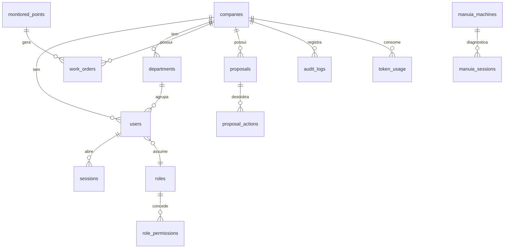

### 4.4 Multi-tenant e RLS

- **Isolamento lógico:** toda query de negócio filtra por `company_id`.
- **RLS (Row Level Security):** habilitado por runtime em `tenant-isolation/` com flags (`tenantRlsFlags.js`) e middleware (`tenantRls.js`, `tenantRlsMiddleware.js`, `tenantIsolationGuard.js`, `tenantResourceAssert.js`).
- **Garantia:** dados de uma empresa **nunca** cruzam com os de outra, nem mesmo no contexto cognitivo (a IA só lê dados do tenant do usuário autenticado).

### 4.5 Auditoria e imutabilidade

- **Auditoria universal:** `universalAuditMiddleware.js` registra ações em `audit_logs`.
- **Imutabilidade:** migration `202605131_audit_immutability_triggers_migration.sql` cria triggers que impedem alteração/exclusão de registros de auditoria.
- **Retenção:** `AUDIT_LOG_RETENTION_DAYS` (default 90 dias).
- **LGPD:** trilha de acesso (`data_access_logs`), consentimento, exportação e direito ao esquecimento.

### 4.6 Migrations

- **Runner:** `npm run migrate` → `scripts/run-all-migrations.js`.
- **Modos:** `--dry-run` (simula), `--status` (estado), `--adopt` (adota baseline), rollback via `npm run migrate:rollback`.
- **Governança:** ver `backend/docs/MIGRATIONS_GOVERNANCE.md`.
- **Diretório:** `backend/migrations/` (31 arquivos SQL + `_rollback/`).

---

## 5. APIs

### 5.1 Convenções gerais

- **Base:** `/api`.
- **Formato:** JSON. Respostas seguem o padrão `{ ok: true|false, ... }` com `error` e `code` em falhas.
- **Autenticação:** JWT no header `Authorization: Bearer <token>`; sessão persistida em `sessions`.
- **Autorização:** RBAC via middleware (`authorize.js`, `roleVerification.js`, `hierarchyScope.js`) + verificação de cargo (`requireUserVerified.js`).
- **Multi-tenant:** `multiTenant.js` injeta e valida `company_id`.
- **Segurança transversal:** Helmet, CORS, rate limiting global e por usuário (`globalRateLimit.js`, `userRateLimit.js`), `promptFirewall.js` para rotas de IA.

### 5.2 Catálogo de prefixos por domínio

| Domínio | Prefixos `/api/*` representativos |
|---------|-----------------------------------|
| **Auth & Identidade** | `auth`, `auth/mfa`, `federation`, `federation/scim/v2`, `role-verification`, `user-identification`, `companies`, `usuarios` |
| **Dashboard & KPIs** | `dashboard`, `dashboard/chat/voice`, `dashboard/maintenance/*`, `live-dashboard` |
| **IA & Chat** | `chat`, `chat/metrics`, `cognitive-council`, `cognitive-activation`, `cognitive-registry`, `central-ai`, `nexus-ia`, `anam`, `voz`, `tts`, `vision`, `did`, `f49/ceo`, `f49/gemini`, `f49/closure` |
| **Registro & Cadastro** | `intelligent-registration`, `cadastrar-com-ia`, `tasks`, `feedback` |
| **Domínio Qualidade** | `quality-operational`, `quality-governance`, `quality-telemetry`, `quality-cognitive`, `quality-rollout`, `quality-activation`, `quality-navigation`, `quality-intelligence` |
| **Domínio SST** | `safety-operational`, `safety-governance`, `safety-telemetry`, `safety-cognitive`, `safety-rollout`, `safety-activation`, `safety-navigation`, `safety-operational-validation` |
| **Domínio Ambiente** | `environment-operational`, `environment-governance`, `environment-telemetry`, `environment-cognitive`, `environment-executive`, `environment-pilot-rollout`, `environment-activation`, `environment-navigation` |
| **Domínio Logística** | `logistics`, `logistics-intelligence`, `logistics-operational-validation`, `warehouse-intelligence`, `admin/warehouse`, `admin/logistics` |
| **Manutenção** | `manutencao-ia`, `technical-library`, `asset-management`, `diagnostic`, `tpm` |
| **Pró-Ação** | `proacao` |
| **Custos & Forecasting** | `dashboard/costs/*`, `dashboard/forecasting/*`, `admin/nexus-custos`, `admin/nexus-wallet` |
| **RH** | `pulse`, `hr-intelligence` |
| **AIOI Executivo** | `aioi`, `aioi/cockpit`, `aioi/executive-cockpit`, `aioi/runtime`, `aioi/governance`, `aioi/scale`, `aioi/compliance`, `aioi/production`, `aioi/operations`, `aioi/authorization`, `aioi/assurance`, `aioi/baseline`, `aioi/release`, `aioi/recovery`, `aioi/archive` |
| **Workflow & Ações** | `workflow-engine`, `action-runtime` |
| **Comunicação** | `internal-chat`, `communications`, `app-communications`, `app-impetus`, `realtime-presence`, `alerts`, `plc-alerts`, `factory-team` |
| **Integrações** | `integrations` (mes-erp, edge, digital-twin, production/shift), `webhook`, `webhooks/*` |
| **Admin & Governança** | `admin/*` (users, departments, structural, settings, logs, incidents, ai-audit, ai-policies, operational-teams, equipment-library, raw-materials, time-clock, help-manual, runtime, tenant-admins), `impetus-admin`, `admin-portal`, `rollout-center`, `certification-readiness`, `deprecation-governance`, `domain-governance-gate`, `ai/governance` |
| **Compliance** | `lgpd`, `audit` |
| **Runtime interno** | `internal/*` (100+ rotas: governance, kpi-*, summary-*, runtime-*, cognitive-*, pilot-*, tenant-*, observability, industrial-event-backbone, etc.) |
| **Runtime Z** | `runtime-z-cognitive-os`, `runtime-z-operational-nervous-system`, `runtime-z-sovereign`, `runtime-z-maturation`, `runtime-z-sz5` |
| **Plataforma** | `health`, `onboarding`, `setup-company`, `subscription`, `enterprise-*`, `ecosystem-correlation`, `media-file` |

### 5.3 Exemplos de payload

**Login:**
```http
POST /api/auth/login
Content-Type: application/json

{ "email": "usuario@empresa.com.br", "password": "********" }
```
Resposta:
```json
{ "ok": true, "token": "<jwt>", "user": { "id": "...", "role": "gerente", "company_id": "..." } }
```

**Payload personalizado do dashboard (por cargo):**
```http
GET /api/dashboard/me
Authorization: Bearer <jwt>
```
Retorna perfil, KPIs, módulos contextuais (`contextual_modules`), insights.

**Iniciar workflow BPMN:**
```http
POST /api/workflow-engine/instances/start
Authorization: Bearer <jwt>

{ "definitionId": "<bpmn>", "variables": { ... } }
```

**Ingestão de telemetria via edge:**
```http
POST /api/integrations/edge/ingest
Authorization: Bearer <edge-token>

{ "agentId": "edge-01", "readings": [ { "tag": "temp_forno_1", "value": 812.4, "ts": "..." } ] }
```

### 5.4 Autenticação e autorização — fluxo

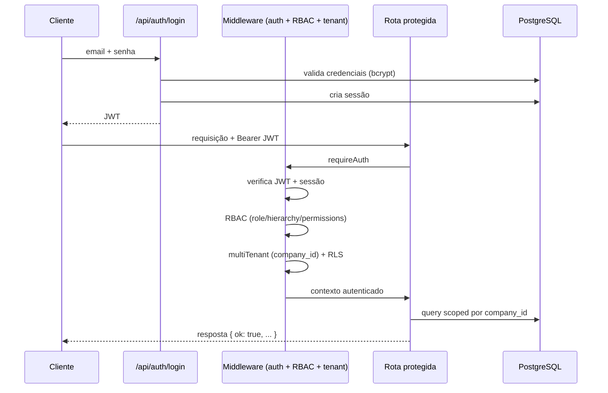

---

## 6. PM2

### 6.1 Processos em produção (estado real)

| id | Processo | Papel |
|----|----------|-------|
| 3 | `impetus-backend` | Backend Node.js/Express (API + WS). Entrypoint `backend/src/server.js`. |
| 2 | `impetus-frontend` | Servidor estático do `frontend/dist` (`serveDist.cjs`). |
| 1 | `lipsync-api` | Serviço de lipsync para avatar de voz. |
| 4 | `impetus-lab-modbus` | Servidor Modbus de laboratório (Python). |
| 5 | `impetus-lab-opcua` | Servidor OPC-UA de laboratório. |
| 6 | `impetus-edge-agent-lab` | Edge agent de laboratório. |
| 7 | `impetus-lab-oidc` | Provedor OIDC de laboratório (porta 8080). |
| 8 | `impetus-lab-smtp` | SMTP de laboratório (portas 1025/1080). |

> Os processos `impetus-lab-*` pertencem ao **ecossistema de laboratório industrial** (`ecosystem.industrial-lab.config.js`) e simulam OT real (Modbus/OPC-UA/edge) no mesmo host. Em cliente real, são substituídos pela OT do cliente.

### 6.2 Comandos essenciais

```bash
pm2 list                      # Lista processos e status
pm2 status impetus-backend    # Status de um processo
pm2 logs impetus-backend      # Logs em tempo real
pm2 logs impetus-backend --lines 200   # Últimas 200 linhas
pm2 restart impetus-backend   # Reinício
pm2 restart impetus-backend --update-env   # Reinício recarregando .env
pm2 reload impetus-backend    # Reload com zero-downtime (cluster)
pm2 stop impetus-backend      # Para
pm2 describe impetus-backend  # Detalhes (cwd, script, env)
pm2 monit                     # Monitor interativo
pm2 save                      # Persiste a lista de processos
pm2 startup                   # Gera script de boot
pm2 flush                     # Limpa logs
```

### 6.3 Monitoramento

- **Saúde:** `GET /api/health` e `GET /health`.
- **Restarts (↺):** observar a coluna de restarts no `pm2 list`. Restarts crescentes indicam crash-loop.
- **Memória/CPU:** `pm2 monit`.
- **Logs:** `~/.pm2/logs/` ou `pm2 logs`.

> **Nota de leitura de estado:** no `pm2 list`, `impetus-backend` pode exibir contagem de restarts elevada acumulada — investigar via `pm2 logs` se o uptime estiver baixo e os restarts subindo agora.

### 6.4 Troubleshooting PM2

| Sintoma | Diagnóstico | Ação |
|---------|-------------|------|
| Status `errored` | `pm2 logs <app> --err` | Corrigir erro de boot; `pm2 restart`. |
| Crash-loop (↺ subindo) | Erro fatal no start (env, porta, DB) | Validar `.env`, porta livre, DB acessível. |
| `online` mas sem responder | Deadlock / porta errada | `curl localhost:4000/health`; reiniciar. |
| Não inicia no boot | `pm2 startup` não salvo | `pm2 save` após `pm2 startup`. |
| Env desatualizado | `.env` mudou sem reload | `pm2 restart <app> --update-env`. |

---

## 7. Docker

> O deploy de produção atual usa **PM2** (ver Parte 1.3 e §6). O Docker é suportado como alternativa de empacotamento/dev.

### 7.1 Desenvolvimento

```bash
docker-compose up -d
docker-compose logs -f
docker-compose down
```
- Frontend: `http://localhost:3000` | Backend: `http://localhost:4000`.

### 7.2 Produção (build + nginx)

```bash
docker-compose -f docker-compose.yml -f docker-compose.prod.yml up -d --build
```
- Aplicação na porta 80 (nginx) com proxy `/api` → backend interno 4000.

### 7.3 Migrations em container

```bash
docker-compose exec backend npm run migrate
```

### 7.4 Build frontend para produção

```bash
cd frontend
VITE_API_URL=/api npm run build
```

### 7.5 Nginx para SPA (evitar 404 em rotas internas)

```nginx
location / {
  root /caminho/para/frontend/dist;
  try_files $uri $uri/ /index.html;
}
location /api {
  proxy_pass http://localhost:4000;
  proxy_http_version 1.1;
  proxy_set_header Host $host;
  proxy_set_header X-Real-IP $remote_addr;
}
```

---

## 8. Variáveis de Ambiente

> Base: `.env.production.example`. Copiar para `backend/.env` na implantação. **Nunca** versionar `.env` real.

### 8.1 Núcleo

| Variável | Descrição | Exemplo/Default |
|----------|-----------|-----------------|
| `NODE_ENV` | Ambiente | `production` |
| `PORT` | Porta do backend | `4000` |
| `FRONTEND_URL` | URL pública do frontend (CORS) | `https://cliente.impetus.com.br` |
| `BASE_URL` | URL base para health/self | `http://localhost:4000` |

### 8.2 Banco de dados

| Variável | Descrição |
|----------|-----------|
| `DB_HOST` / `DB_PORT` / `DB_NAME` / `DB_USER` / `DB_PASSWORD` | Conexão PostgreSQL |
| `DB_POOL_MAX` | Tamanho máximo do pool (produção: 20) |

### 8.3 IA

| Variável | Descrição |
|----------|-----------|
| `OPENAI_API_KEY` | **Obrigatória** — GPT-4o + embeddings |
| `ANTHROPIC_API_KEY` | Claude (Conselho Cognitivo) |
| `GEMINI_API_KEY` / `GOOGLE_API_KEY` | Gemini |
| `ANAM_API_KEY` | Avatar de vídeo Anam (sessão WebRTC) |
| `ENABLE_TOKEN_BILLING` | Liga billing de tokens Nexus (`false`/`0` desliga) |

### 8.4 Segurança e licenciamento

| Variável | Descrição |
|----------|-----------|
| `SALT` | Salt para hashing (string aleatória forte) |
| `JWT_SECRET` | Segredo de assinatura do JWT |
| `LICENSE_VALIDATION_ENABLED` | Valida licença em produção (`true`) |
| `LICENSE_SERVER_URL` / `LICENSE_KEY` / `LICENSE_API_KEY` | Servidor e chaves de licença |
| `AUDIT_LOG_RETENTION_DAYS` | Retenção de auditoria (default 90) |

### 8.5 Performance / resiliência

| Variável | Descrição |
|----------|-----------|
| `CACHE_MAX_ENTRIES` | Máximo de entradas em cache (ex.: 2000) |
| `HTTP_TIMEOUT_MS` | Timeout de chamadas HTTP externas (ex.: 20000) |
| `HTTP_RETRIES` | Retries de chamadas HTTP (ex.: 3) |

### 8.6 Flags do motor unificado / fachada de decisão (default OFF)

| Flag | Efeito |
|------|--------|
| `UNIFIED_STABILITY_MONITOR` | Monitor de estabilidade comportamental |
| `UNIFIED_LEARNING_INTEGRITY` | Integridade de aprendizado |
| `UNIFIED_CONSERVATISM_GUARD` | Guarda de conservadorismo |
| `UNIFIED_METRICS_INTERPRETER` | Interpretador de métricas |
| `UNIFIED_BEHAVIOR_DRIFT` / `UNIFIED_BEHAVIOR_GUARD` | Detecção/guarda de desvio comportamental |
| `USE_DECISION_FACADE` | Dashboard/chat encaminham ao motor via fachada |
| `DECISION_FACADE_VALIDATE` | Valida coerência fachada-vs-motor (staging) |

### 8.7 Billing (Asaas)

| Variável | Descrição |
|----------|-----------|
| `ASAAS_ENV` | `production` ou sandbox |
| `ASAAS_API_KEY` | Chave da API Asaas |

> **Regra operacional:** após mudar qualquer variável sensível, reiniciar o processo com `pm2 restart impetus-backend --update-env`.

---

## 9. Observabilidade

### 9.1 Logs

- **Aplicação:** `pm2 logs impetus-backend` (stdout/stderr); arquivos em `~/.pm2/logs/` e `backend/logs/`.
- **Correlação:** `correlationId.js` injeta um ID por requisição para rastrear ponta a ponta.
- **Tags de log relevantes:** `[NEXUS_BILLING]`, `[DECISION_FACADE_COHERENCE]`, `[SUBSCRIPTION_PAYMENT_LINK]`, prefixos de fase Z.

### 9.2 Métricas

- **Chat/IA:** `/api/chat/metrics`.
- **Runtime interno:** `/api/internal/observability`, `/api/internal/orchestration-health`, `/api/internal/runtime-*`.
- **KPI health:** famílias `/api/internal/kpi-*` (governance-health, runtime-stability, safety, etc.).

### 9.3 Auditoria

- `audit_logs` + `universalAuditMiddleware`.
- Consulta: `/api/audit`, `/api/admin/logs`, UI em `/app/admin/audit-logs`.
- Incidentes de IA: `/api/admin/incidents`, UI em `/app/admin/incidents`.

### 9.4 Telemetria industrial

- Runtimes `industrial-mqtt/`, `industrial-opcua/`, `industrial-modbus/` com warm boot e tracing.
- Saúde: `/api/internal/industrial-runtime-health`.
- Barramento de eventos: `/api/internal/industrial-event-backbone`.

### 9.5 Health checks

```bash
curl http://localhost:4000/health
curl http://localhost:4000/api/health
npm run health-check   # backend/scripts/health-check.js
```

---

## 10. Troubleshooting de Engenharia

### 10.1 Backend não sobe

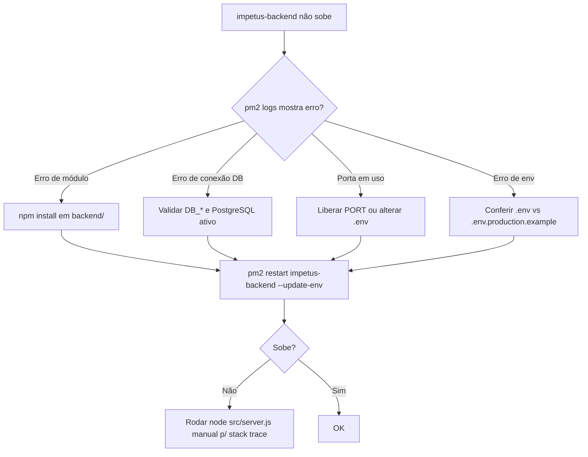

Checklist:
1. `pm2 logs impetus-backend --err --lines 200`.
2. `node -v` ≥ 18; `cd backend && npm install`.
3. PostgreSQL ativo: `systemctl status postgresql`.
4. Testar conexão: `psql -h $DB_HOST -U $DB_USER -d $DB_NAME -c "select 1;"`.
5. Porta livre: `ss -ltnp | grep 4000`.
6. Subir manual para stack trace: `cd backend && node src/server.js`.

### 10.2 Frontend não sobe / tela branca

1. `pm2 logs impetus-frontend`.
2. Verificar build: `ls frontend/dist/`. Se vazio: `cd frontend && npm run build`.
3. Conferir `VITE_API_URL` (deve apontar para `/api` em produção).
4. SPA 404 em rota interna → corrigir `try_files` no nginx (§7.5).
5. Build stale (versão antiga) → rebuild + limpar cache do browser (há *build version guard* no frontend).

### 10.3 Erro de banco

| Erro | Causa | Ação |
|------|-------|------|
| `Cannot connect to database` | DB down / credenciais | Validar `DB_*`, `systemctl status postgresql`. |
| `extension "vector" does not exist` | pgvector ausente | `apt install postgresql-15-pgvector` e `CREATE EXTENSION vector;`. |
| `relation ... does not exist` | Migration não aplicada | `npm run migrate:status` → `npm run migrate`. |
| Timeout em queries pesadas | Tabela grande / falta índice | Usar contagens estimadas; revisar índices; aumentar `DB_POOL_MAX`. |
| Permissão negada | RLS / usuário sem grant | Validar políticas RLS e grants do `DB_USER`. |

### 10.4 Erro de IA

| Sintoma | Causa provável | Ação |
|---------|----------------|------|
| `OpenAI API Key invalid` | Chave errada/expirada | Validar `OPENAI_API_KEY`; testar `GET https://api.openai.com/v1/models`. |
| IA responde "sem dados" sempre | Truth enforcement sem dados no tenant | Verificar se há dados reais no `company_id`; é comportamento correto em fábrica vazia. |
| Latência alta no chat | Provedor lento / convergência multi-modelo | Verificar `HTTP_TIMEOUT_MS`; checar status dos provedores. |
| Avatar Anam não inicia | Erro externo Anam (401/403) | Tratado como 503 (não desloga usuário); validar `ANAM_API_KEY`. |
| Billing de tokens não registra | `ENABLE_TOKEN_BILLING=false` | Habilitar se for esperado cobrar. |

> **Lição aprendida (regressão de login):** erros 401/403 vindos de provedores externos (ex.: Anam) **não devem** disparar logout global. O backend remapeia esses casos para 503 e o frontend exclui rotas `/anam/*` do handler de 401. Ver `backend/docs/LOGIN_REDIRECT_FIX_REPORT.md`.

### 10.5 Erro de PM2

Ver §6.4.

### 10.6 Erro de Docker

| Sintoma | Ação |
|---------|------|
| Container reinicia | `docker-compose logs -f <serviço>`; validar env e DB. |
| Migrations não rodam | `docker-compose exec backend npm run migrate`. |
| 404 em rota SPA | Ajustar nginx (`try_files`). |
| Porta ocupada | Ajustar mapeamento de portas no compose. |

### 10.7 Erro de integração (OT/ERP)

| Sintoma | Ação |
|---------|------|
| Sem telemetria | Validar broker MQTT (`mosquitto.service`), conectividade edge, tags configuradas em `machine_monitoring_config`. |
| OPC-UA não conecta | Endpoint/credenciais; firewall OT; certificados. |
| Modbus sem leitura | Mapa de registradores; IP/porta do dispositivo. |
| Webhook MES/ERP rejeitado | Token inválido em `integration_connectors`; validar assinatura. |
| Edge ingest 401 | Token do edge agent; ver `docs/EDGE_AUTENTICACAO.md`. |

### 10.8 Erro de autenticação

| Sintoma | Causa | Ação |
|---------|-------|------|
| Login → dashboard → volta ao login | 401 externo disparando logout | Já corrigido (§10.4); validar regressão se reaparecer. |
| `Token expired` | JWT expirado | Refazer login; revisar TTL. |
| MFA bloqueando | Dispositivo não confiável | Fluxo de backup codes / device trust em `/api/auth/mfa`. |
| Usuário não verificado | `requireUserVerified` | Concluir validação de cargo (`/validacao-cargo`). |
| Acesso negado a rota | RBAC/hierarquia | Conferir `role`, `hierarchy_level`, `role_permissions`. |

---

# PARTE 2 — IMPLANTAÇÃO E INSTALAÇÃO

**Público:** Equipe de implantação, Parceiros, Consultores industriais.

Esta parte descreve como instalar o IMPETUS do zero e implantá-lo em um cliente industrial, sem pular etapas.

---

## 11. Pré-Requisitos

### 11.1 Hardware / servidor (recomendação por porte)

| Porte | vCPU | RAM | Disco | Observação |
|-------|------|-----|-------|------------|
| Piloto / 1 departamento | 4 | 8 GB | 80 GB SSD | Single-host (app + DB) |
| PME industrial (1 planta) | 8 | 16 GB | 200 GB SSD | DB pode ser dedicado |
| Médio porte (1–2 plantas) | 8–16 | 32 GB | 500 GB SSD | DB dedicado + backups |
| Enterprise / multi-planta | 16+ | 64 GB+ | 1 TB+ NVMe | App e DB separados, HA |

### 11.2 Software base

- **SO:** Linux (Ubuntu 20.04+/22.04 LTS recomendado).
- **Node.js** ≥ 18.
- **PostgreSQL** ≥ 15 (mín. 14) com `pgcrypto` (e `vector` se RAG).
- **PM2** global (`npm i -g pm2`).
- **nginx** (proxy reverso + TLS).
- **Python 3** (apenas se usar servidores de lab Modbus).
- **Mosquitto** (broker MQTT) se houver telemetria MQTT.

### 11.3 Cloud

- Compatível com **AWS, Azure, Google Cloud** ou **on-premise**.
- Componentes equivalentes: EC2/VM + RDS/Cloud SQL + S3/Blob (uploads) + CDN opcional.
- Saída de internet para provedores de IA (OpenAI/Anthropic/Google/Anam) — ou rede liberada conforme política de segurança do cliente.

### 11.4 Rede

- Portas internas: backend `4000`, frontend (dev `5173` / prod via nginx `80/443`), OIDC lab `8080`, SMTP lab `1025/1080`.
- TLS obrigatório em produção (HTTPS) — voz/wake-phrase exige contexto seguro.
- Acesso à rede OT (PLCs/MQTT/OPC-UA/Modbus) segmentado e monitorado.

### 11.5 Banco

- Usuário de aplicação dedicado (`impetus_app`) com senha forte.
- Database `impetus_db`.
- Backups automáticos + retenção.

### 11.6 Segurança

- Certificados TLS válidos.
- Segredos (`SALT`, `JWT_SECRET`, chaves de IA, licença) em cofre/secret manager — nunca em git.
- Firewall: expor apenas 80/443 publicamente; 4000 interno.
- LGPD: política de consentimento e retenção definidas com o cliente.

---

## 12. Instalação Completa

### 12.1 Passo a passo (produção com PM2)

```bash
# 1. Obter o código (na raiz padrão de produção)
cd /var/www
git clone <repositorio> impetus-completa
cd impetus-completa

# 2. PostgreSQL: criar banco e extensões
sudo -u postgres psql -c "CREATE DATABASE impetus_db;"
sudo -u postgres psql -c "CREATE USER impetus_app WITH PASSWORD 'senha_forte_aqui';"
sudo -u postgres psql -c "GRANT ALL PRIVILEGES ON DATABASE impetus_db TO impetus_app;"
sudo -u postgres psql -d impetus_db -c "CREATE EXTENSION IF NOT EXISTS pgcrypto;"
sudo -u postgres psql -d impetus_db -c "CREATE EXTENSION IF NOT EXISTS vector;"  # opcional

# 3. Backend: dependências e ambiente
cd backend
npm install
cp ../.env.production.example .env
# editar .env: DB_*, OPENAI_API_KEY, SALT, JWT_SECRET, FRONTEND_URL, LICENSE_*

# 4. Migrations
npm run migrate
npm run migrate:status   # confirmar

# 5. Seed inicial (opcional — admin/portal)
npm run seed
# npm run seed:admin-portal

# 6. Subir backend no PM2
pm2 start src/server.js --name impetus-backend
pm2 save

# 7. Frontend: build e servir
cd ../frontend
npm install
VITE_API_URL=/api npm run build
pm2 start serveDist.cjs --name impetus-frontend
pm2 save

# 8. nginx: configurar proxy + TLS (ver §7.5) e recarregar
sudo nginx -t && sudo systemctl reload nginx

# 9. Boot automático
pm2 startup
pm2 save
```

### 12.2 Verificação de instalação

```bash
curl http://localhost:4000/health           # backend saudável
curl http://localhost:4000/api/health
psql -d impetus_db -U impetus_app -c "\dt"   # tabelas criadas
pm2 list                                     # processos online
```

### 12.3 Telemetria de laboratório (opcional, validação)

```bash
cd /var/www/impetus-completa/backend
pm2 start ecosystem.industrial-lab.config.js   # Modbus/OPC-UA/edge/OIDC/SMTP lab
```

---

## 13. Configuração Inicial

> Após a instalação técnica, configura-se o **tenant do cliente** e a **base estrutural**. Pode ser feito via UI (Admin), API ou SQL.

### 13.1 Empresa (tenant)

```sql
INSERT INTO companies (name, cnpj, active, plan_type)
VALUES ('Cliente Industrial Ltda', '12345678000199', true, 'profissional')
RETURNING id;
```

### 13.2 Usuário administrador

Preferir o fluxo de API/onboarding (`/api/onboarding`, `/api/setup-company`) ou a UI `/setup-empresa`. Via API:

```bash
curl -X POST http://localhost:4000/api/auth/register \
  -H "Content-Type: application/json" \
  -d '{
    "name": "Administrador",
    "email": "admin@cliente.com.br",
    "password": "SenhaForte@2026",
    "company_id": "<ID_DA_EMPRESA>",
    "role": "administrador",
    "hierarchy_level": 1,
    "lgpd_consent": true
  }'
```

### 13.3 Sequência de configuração (ordem recomendada)

```mermaid
flowchart LR
  A[Empresa/Tenant] --> B[Admin inicial]
  B --> C[Departamentos]
  C --> D[Cargos/Perfis]
  D --> E[Linhas de produção]
  E --> F[Ativos/Máquinas]
  F --> G[Processos]
  G --> H[Usuários]
  H --> I[Permissões/RBAC]
  I --> J[Carga de POPs/Manuais]
  J --> K[Integrações OT/ERP]
  K --> L[Validação]
```

### 13.4 Onde configurar (UI Admin)

| Entidade | Tela |
|----------|------|
| Empresa / conteúdo | `/app/admin` (Conteúdo da Empresa) |
| Departamentos | `/app/admin/departments` |
| Base estrutural (cargos, linhas, ativos, processos) | `/app/admin/structural` |
| Usuários | `/app/admin/users` |
| Equipes operacionais | `/app/admin/operational-teams` |
| Biblioteca técnica (equipamentos) | `/app/admin/equipment-library` |
| Integrações | `/app/admin/integrations` |
| Centro de custos (config) | `/app/admin/centro-custos` |

---

## 14. Integrações

### 14.1 MQTT

1. Garantir broker (Mosquitto) ativo e acessível pela rede OT.
2. Configurar runtime `industrial-mqtt/` (tópicos, credenciais).
3. Mapear tags em `machine_monitoring_config`.
4. Validar leitura em `/api/internal/industrial-runtime-health`.

### 14.2 OPC-UA

1. Endpoint do servidor OPC-UA do cliente + credenciais/certificados.
2. Configurar cliente em `industrial-opcua/`.
3. Mapear nós (NodeIds) para tags.
4. Testar conexão e leitura.

### 14.3 Modbus

1. IP/porta do dispositivo, mapa de registradores.
2. Configurar polling em `industrial-modbus/`.
3. Validar leituras.

### 14.4 ERP / MES

- Webhook push autenticado por token: `/api/integrations/mes-erp/*`.
- Registrar conector em `integration_connectors`.
- Digital Twin: `/api/integrations/digital-twin/*`.
- Registro manual de turno: `/api/integrations/production/shift`.

### 14.5 APIs externas / Identidade

- **Federation SSO:** OIDC/SAML por empresa (`/api/federation`).
- **SCIM v2:** provisionamento de usuários (`/api/federation/scim/v2`).
- **Edge agent:** `/api/integrations/edge/ingest` (token de agente).

### 14.6 Diagrama de integração OT → IMPETUS

```mermaid
flowchart LR
  subgraph OT[Rede OT do Cliente]
    PLC[PLCs] --> MQTT[(MQTT)]
    PLC --> OPC[OPC-UA]
    PLC --> MB[Modbus]
  end
  MQTT --> EDGE[Edge Agent]
  OPC --> EDGE
  MB --> EDGE
  EDGE -->|token| ING[/api/integrations/edge/ingest]
  ERP[ERP/MES] -->|webhook+token| MESAPI[/api/integrations/mes-erp]
  ING --> BUS[Industrial Event Backbone]
  MESAPI --> BUS
  BUS --> DB[(PostgreSQL)]
  DB --> COCKPIT[Cockpit por cargo]
```

---

## 15. Go Live

### Checklist de Go Live

**Infra**
- [ ] Servidor dimensionado conforme porte (§11.1).
- [ ] PostgreSQL com backups automáticos ativos.
- [ ] TLS/HTTPS válido e forçado.
- [ ] nginx com `try_files` SPA + proxy `/api`.
- [ ] PM2 com `startup` + `save` (boot automático).

**Aplicação**
- [ ] `.env` de produção completo e validado.
- [ ] `LICENSE_VALIDATION_ENABLED=true` + licença válida.
- [ ] Migrations aplicadas (`migrate:status` limpo).
- [ ] `/health` e `/api/health` OK.
- [ ] Build do frontend atualizado (sem versão stale).

**Tenant**
- [ ] Empresa criada e `active=true`.
- [ ] Base estrutural completa (departamentos, cargos, linhas, ativos, processos).
- [ ] Usuários criados com cargos corretos.
- [ ] RBAC validado por perfil.
- [ ] POPs/manuais carregados na biblioteca.

**Integrações**
- [ ] Telemetria (MQTT/OPC-UA/Modbus) lendo dados reais.
- [ ] ERP/MES conectado (se aplicável).
- [ ] Edge agent autenticado e ingerindo.

**IA & Segurança**
- [ ] Chaves de IA válidas (chat/voz testados).
- [ ] Truth enforcement respondendo com dados reais do tenant.
- [ ] MFA habilitado para perfis sensíveis.
- [ ] Auditoria registrando ações.
- [ ] LGPD: consentimento e retenção configurados.

---

## 16. Validação Pós-Go-Live

### Checklist de validação (primeiras 72h)

**Funcional**
- [ ] Login + redirecionamento estável (sem loop de logout).
- [ ] Dashboard por cargo carregando KPIs reais.
- [ ] Chat IA respondendo com dados do tenant (não genérico).
- [ ] ManuIA acessível para perfis de manutenção.
- [ ] Registro Inteligente e Cadastrar com IA operando.
- [ ] Chat interno e App mobile trocando mensagens.

**Dados**
- [ ] Telemetria persistindo em séries temporais.
- [ ] KPIs (OEE, custos, qualidade) coerentes com a realidade.
- [ ] Sem fallback fictício em gráficos (apenas estado vazio técnico).

**Operação**
- [ ] PM2 sem crash-loop (restarts estáveis).
- [ ] Latência de API aceitável.
- [ ] Logs sem erros recorrentes.
- [ ] Billing de tokens registrando (se habilitado).

**Adoção**
- [ ] Usuários-chave acessaram seus cockpits.
- [ ] Primeiras ocorrências/registros criados.
- [ ] Primeira proposta de Pró-Ação aberta.

---

## 17. Plano de Rollback

### 17.1 Princípios

- Toda implantação/atualização tem ponto de retorno.
- Backups antes de qualquer migration destrutiva.
- Mudanças aditivas e compatíveis sempre que possível.

### 17.2 Procedimento de rollback

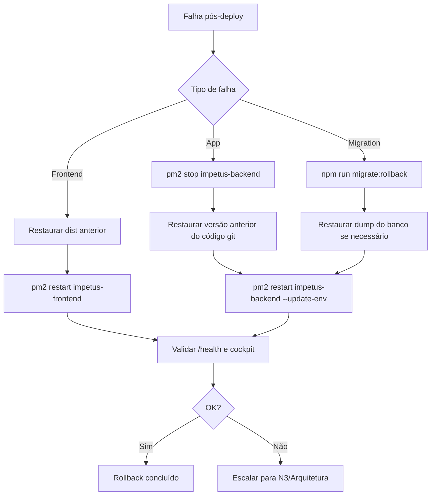

### 17.3 Comandos de referência

```bash
# Banco — restaurar dump
pg_restore -d impetus_db /caminho/backup_pre_deploy.dump

# Migrations — rollback
cd backend && npm run migrate:rollback

# Código — voltar versão
git checkout <tag_ou_commit_estavel>

# Frontend — restaurar build anterior (dist_backup_*)
cp -r frontend/dist_backup_<timestamp> frontend/dist

# Reiniciar
pm2 restart impetus-backend --update-env
pm2 restart impetus-frontend
```

### 17.4 Backups disponíveis no repositório

- `backups/`, `deploy_backups/` (raiz) e `frontend/dist_backup_*` — pontos de restauração de builds anteriores.
- **Regra:** nunca sobrescrever backup sem confirmar restauração bem-sucedida.

---

# PARTE 3 — SUPORTE OPERACIONAL E CADASTRO

**Público:** Suporte N1, Suporte N2, Onboarding, Customer Success.

Esta parte descreve como atender, cadastrar, parametrizar, treinar e acompanhar o cliente.

---

## 18. Fluxo de Atendimento

### 18.1 Níveis de suporte

| Nível | Responsabilidade | Exemplos |
|-------|------------------|----------|
| **N1** | Primeiro contato, triagem, dúvidas de uso, problemas conhecidos | "Não consigo logar", "Onde vejo o relatório?", reset de senha, dúvida de cadastro |
| **N2** | Configuração, parametrização, integração leve, análise de dados | Ajustar RBAC, configurar módulo, investigar KPI estranho, telemetria sem leitura |
| **N3** | Engenharia, código, banco, runtime cognitivo, incidentes críticos | Bug de backend, erro de migration, falha de runtime Z, correção de regressão |

### 18.2 Fluxo e escalonamento

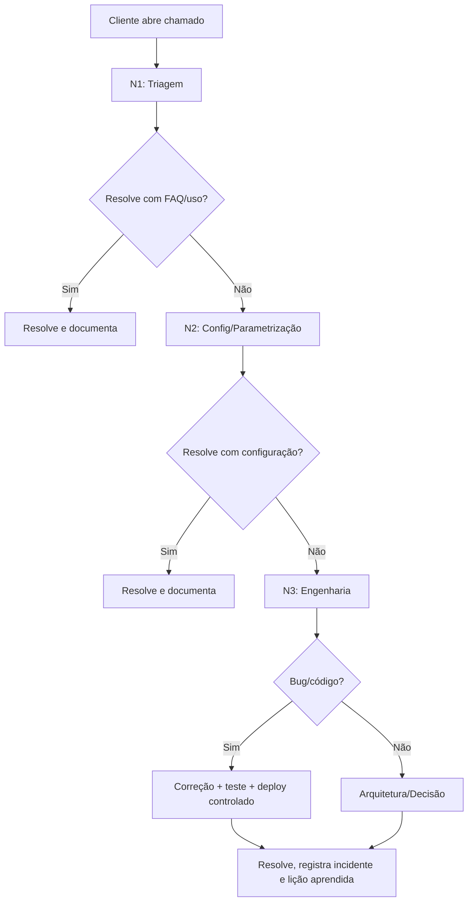

### 18.3 SLA sugerido (definir em contrato)

| Severidade | Definição | 1ª resposta | Resolução alvo |
|------------|-----------|-------------|----------------|
| **Crítica** | Sistema indisponível / produção parada | 30 min | 4 h |
| **Alta** | Função-chave degradada | 2 h | 1 dia útil |
| **Média** | Problema com workaround | 1 dia útil | 3 dias úteis |
| **Baixa** | Dúvida / melhoria | 2 dias úteis | Backlog |

### 18.4 Registro de incidentes

- Incidentes de IA: `/api/admin/incidents` (UI `/app/admin/incidents`).
- Auditoria de ações: `/api/admin/logs`.
- Toda resolução N3 gera **lição aprendida** documentada (ex.: `LOGIN_REDIRECT_FIX_REPORT.md`).

---

## 19. Cadastro Completo do Cliente

### 19.1 Roteiro de onboarding

```mermaid
flowchart LR
  A[Contrato assinado] --> B[Provisionar tenant]
  B --> C[Coletar dados estruturais]
  C --> D[Cadastrar base estrutural]
  D --> E[Criar usuários e cargos]
  E --> F[Carregar POPs/manuais]
  F --> G[Configurar módulos contratados]
  G --> H[Integrações OT/ERP]
  H --> I[Treinamento]
  I --> J[Go Live assistido]
  J --> K[Acompanhamento 90 dias]
```

### 19.2 Dados a coletar do cliente

- Razão social, CNPJ, plano contratado.
- Organograma (departamentos, cargos, hierarquia).
- Linhas de produção, ativos/máquinas, processos.
- Lista de usuários (nome, e-mail, cargo, departamento).
- POPs, manuais técnicos, políticas internas (para a base de conhecimento da IA).
- Dados de OT (PLCs, protocolos, tags) e ERP/MES (se integração).

### 19.3 Provisionamento do tenant

Ver §13. Preferir UI `/setup-empresa` e `/app/admin/*`.

---

## 20. Base Estrutural

A **Base Estrutural** (`/app/admin/structural`, API `/api/admin/structural`) é o cadastro mestre que dá significado a todos os dados. Sem ela, os cockpits ficam vazios.

| Entidade | Descrição | Por que importa |
|----------|-----------|-----------------|
| **Empresa (company)** | O tenant | Raiz do isolamento multi-tenant |
| **Departamentos** | Setores (Produção, Manutenção, Qualidade, SST, RH…) | Roteamento e agrupamento de usuários/dados |
| **Cargos (roles)** | Função hierárquica | Define o cockpit e as permissões (RBAC) |
| **Linhas de produção** | Linhas/células | Contextualiza OEE, produção, custos |
| **Ativos/Máquinas** | Equipamentos monitorados | Base de manutenção, telemetria, ManuIA |
| **Processos** | Processos produtivos | Liga qualidade, produção e custos |
| **Equipes operacionais** | Times de chão de fábrica | Login coletivo, app mobile |

> **Regra de ouro do cadastro:** cadastrar de cima para baixo (empresa → departamentos → cargos → linhas → ativos → processos → usuários). Cada nível depende do anterior.

---

## 21. Configuração de Perfis

### 21.1 Hierarquia de cargos e o que cada um vê

| Perfil | `hierarchy_level` típico | Cockpit / Foco |
|--------|--------------------------|----------------|
| **CEO / Executivo** | 1 | Centro de Custos Executivo, Mapa de Vazamentos, Forecasting, Fila Executiva AIOI, Portal Executivo |
| **Diretor** | 1–2 | Visão consolidada multi-domínio, custos, decisões estratégicas |
| **Gerente** | 2–3 | KPIs da área, produção vs demanda, gargalos, qualidade/manutenção |
| **Coordenador** | 3 | Coordenação operacional, equipes, indicadores de área |
| **Supervisor** | 3–4 | Alertas operacionais, mapa de vazamentos (sem valores), clima de equipe |
| **Operador** | 4–5 | Registro de ocorrências, app mobile, Pró-Ação, tarefas do posto |
| **Técnico de Manutenção** | 4 | ManuIA, OS, diagnóstico, biblioteca técnica |
| **Inspetor de Qualidade** | 4 | Inspeções, NCR/CAPA, SPC, kiosk |
| **Técnico SST** | 4 | Inspeção de campo, PT/APR/LOTO, incidentes |
| **RH** | 3 | Pulse RH, clima organizacional |
| **Administrador** | 1 | Administração da plataforma e tenant |

### 21.2 RBAC — fonte de verdade

- Permissões primárias: `roles` + `role_permissions`.
- Reforço: `hierarchy_level` e verificação de cargo (`/validacao-cargo`, `requireUserVerified`).
- Guards de rota no frontend: `CEORouteGuard`, `AdminRouteGuard`, `ColaboradorRouteGuard`, `FactoryTeamMemberGate`, `RoleGuard`.

### 21.3 Módulos contextuais por perfil

O backend pode injetar módulos no menu por perfil via `contextual_modules` em `/api/dashboard/me`. Domínios publicam no sidebar via engines de publicação (quality, safety, logistics, environment) com feature flags.

---

## 22. Parametrização dos Módulos

> Parametrizar = ligar o módulo ao contexto real do cliente (entidades, limiares, responsáveis, fluxos).

### 22.1 Quality (Qualidade)

- Pontos de inspeção, planos de inspeção, checklists.
- NCR/CAPA: fluxo de não-conformidade e ação corretiva.
- SPC: limites de controle por característica.
- Kiosk: postos de inspeção (`/app/quality/operational/kiosk`).
- Fila offline para campo sem rede.

### 22.2 Production / MES

- Ordens de produção, execuções, apontamento de turno.
- OEE: disponibilidade, performance, qualidade.
- Downtime e scrap (estado **foundation** — humano inicia; integração MES externo recomendada).

### 22.3 Maintenance (Manutenção)

- Cadastro de máquinas (`manuia_machines`) e sensores.
- Preventivas, OS, intervenções, falhas.
- Biblioteca técnica (manuais, modelos 3D).
- ManuIA: diagnóstico assistido.

### 22.4 Safety (SST)

- PT/APR/LOTO, EPI/EPC, GHE, matriz de risco.
- Inspeção de campo com evidências.
- Classificação de severidade de incidentes/near-miss.

### 22.5 HR (RH)

- Pulse RH: campanhas de clima, analytics, relatório IA.
- Estrutura de equipes.

### 22.6 Environmental (Meio Ambiente / ESG)

- Água, efluentes, emissões GEE, resíduos/MTR.
- Telemetria ambiental.
- Cockpit executivo ESG / carbono (estado **em consolidação**).

### 22.7 Executive

- Centro de Custos, Mapa de Vazamentos, Forecasting.
- Fila Executiva AIOI (decisões priorizadas com SLA).
- Smart Summary diário/semanal.

### 22.8 Matriz de maturidade (comunicar ao cliente)

| Módulo | Status |
|--------|--------|
| Dashboard por cargo, Chat IA+Voz, ManuIA, AIOI, Telemetria, Qualidade, SST, Pulse RH, Smart Panel, Pró-Ação/BPMN, Custos/Vazamentos/Previsão, Multi-tenant/MFA/LGPD | ✅ Enterprise Ready |
| Meio Ambiente / ESG executivo | ⚡ Em consolidação |
| MES (apontamento) | 🔧 Foundation |

---

## 23. Treinamento do Cliente

### 23.1 Roteiro de treinamento por público

| Público | Duração | Conteúdo |
|---------|---------|----------|
| **Executivos (CEO/Diretores)** | 2 h | Cockpit executivo, Mapa de Vazamentos, Forecasting, Fila AIOI, leitura de Smart Summary |
| **Gestores (Gerentes/Coordenadores)** | 4 h | KPIs de área, qualidade/manutenção/SST, Pró-Ação, aprovações HITL |
| **Supervisores** | 3 h | Alertas, registro de ocorrências, acompanhamento de equipe, clima |
| **Técnicos (Manutenção/Qualidade/SST)** | 4 h | ManuIA, inspeções, OS, kiosk, app de campo |
| **Operadores** | 1 h | App mobile, registro de ocorrência, chat interno (uso simples) |
| **Administradores** | 6 h | Base estrutural, usuários, RBAC, integrações, auditoria |

### 23.2 Princípio de treinamento

Operadores de chão de fábrica **não precisam de treinamento extenso** — usam o app de comunicação de forma natural. O esforço de treinamento concentra-se em gestores, técnicos e administradores.

### 23.3 Materiais

- Central de Ajuda na própria plataforma (`/app/admin/help-center`, `/api/admin/help-manual`).
- Guia de Implantação (`/app/admin` → Guia de Implantação).
- Este Manual Master (engenharia/implantação/suporte).

---

## 24. Problemas Frequentes

### FAQ Técnico

**P: O usuário loga e volta para a tela de login.**
R: Regressão conhecida e corrigida — erro 401/403 de provedor externo (Anam) não deve deslogar. Validar `ANAM_API_KEY` e confirmar que o fix está presente (backend remapeia 401/403→503; frontend ignora 401 em `/anam/*`). Ver `LOGIN_REDIRECT_FIX_REPORT.md`.

**P: O dashboard está vazio / sem KPIs.**
R: Base estrutural incompleta ou ausência de dados reais no tenant. Cadastrar departamentos/linhas/ativos e garantir ingestão de dados. O sistema **não** preenche com dados fictícios (Truth Program).

**P: A IA responde "não há dados suficientes".**
R: Comportamento correto quando o tenant não tem dados. Não é bug — é truth enforcement. Carregar dados/telemetria.

**P: Gráficos sem dados.**
R: Estado vazio técnico é esperado sem dados reais. Proibido fallback fictício (regra `charts-real-data-industrial`).

**P: Telemetria não aparece.**
R: Validar broker MQTT/edge, tags em `machine_monitoring_config`, e `/api/internal/industrial-runtime-health`.

**P: Voz/wake-phrase não funciona.**
R: Exige HTTPS (contexto seguro). Em HTTP há banner de aviso.

**P: Usuário sem acesso a um módulo.**
R: RBAC — conferir `role`, `hierarchy_level`, `role_permissions` e módulos contextuais.

**P: Reset de senha.**
R: Fluxo `/forgot-password` → `/reset-password`. Em último caso, N3 redefine com hash bcrypt.

**P: Build antigo (mudanças não aparecem).**
R: Rebuild do frontend + limpar cache; há *build version guard* que detecta build stale.

---

## 25. Boas Práticas

- **Cadastrar a base estrutural completa antes do Go Live** — é o que dá vida aos cockpits.
- **Carregar POPs e manuais reais** — a IA fica tão boa quanto o conhecimento que recebe.
- **Começar por 1–2 módulos** (ex.: Qualidade + Manutenção) e expandir após adoção.
- **Habilitar MFA** para perfis executivos e administrativos.
- **Reiniciar com `--update-env`** após mudar variáveis.
- **Nunca usar dados fictícios** — preferir estado vazio técnico.
- **Documentar toda resolução N3** como lição aprendida.
- **Mudanças aditivas e compatíveis** — preservar o que já funciona.
- **Backups antes de migrations destrutivas.**
- **Acompanhar adoção** via Adoption Progress Tracker.

---

## 26. Erros Comuns

| Erro | Causa | Prevenção |
|------|-------|-----------|
| Cockpit vazio no Go Live | Base estrutural incompleta | Checklist §15 antes de liberar |
| IA "genérica" | POPs/manuais não carregados | Carregar conhecimento do cliente |
| Logout inesperado | Erro externo tratado como 401 | Manter fix de remapeamento 503 |
| Telemetria muda | Tags/edge mal configurados | Validar OT antes do Go Live |
| Permissão errada | RBAC mal cadastrado | Validar por perfil pós-cadastro |
| Deploy quebrado | Migration sem backup | Sempre backup + `migrate:dry` |
| Build stale | Cache/rebuild ausente | Rebuild + version guard |
| Custo de IA alto | Uso intenso sem franquia | Configurar NexusIA Wallet/franquia |

---

## 27. Indicadores de Sucesso

### 27.1 Indicadores de adoção (Customer Success)

- Nº de usuários ativos por cargo.
- Nº de ocorrências/registros criados por semana.
- Nº de propostas de Pró-Ação abertas e concluídas.
- Nº de OS geradas via ManuIA.
- Cobertura de telemetria (tags ativas).
- Uso do cockpit executivo (Smart Summary lido).

### 27.2 Indicadores de valor (ROI — documentar para o cliente)

- Horas de downtime evitadas.
- Retrabalho/refugo reduzido.
- Não-conformidades resolvidas mais rápido.
- Tempo de relatório manual eliminado.
- Incidentes de SST registrados e tratados.

### 27.3 Gates de adoção (Adoption Progress Tracker)

| Gate | Critério (referência) |
|------|-----------------------|
| ESG Operational Activation | min. eventos/usuários em janela |
| Workflow Operational Activation | instâncias concluídas / tipos de processo |
| MES Operational Pilot | ordens / execuções em janela |
| Evidence Collection / Multi-Tenant / Executive Report | dependentes dos anteriores |

> Detalhe em `backend/docs/ADOPTION_PROGRESS_TRACKER_GATES.md`.

---

# 28. Como o IMPETUS Funciona

> Capítulo de treinamento para novos colaboradores. Linguagem simples, sem jargão desnecessário.

### 28.1 A ideia em uma frase

O IMPETUS pega o que acontece no chão de fábrica, entende o que significa, e mostra para a pessoa certa, na hora certa, do jeito que ela precisa — com uma IA que só fala o que consegue provar.

### 28.2 O fluxo completo da informação

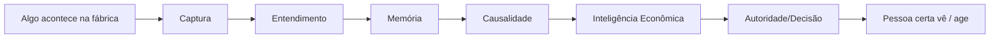

1. **Captura.** Um operador registra uma ocorrência (texto, áudio, foto), ou um sensor envia uma leitura (MQTT/OPC-UA/Modbus), ou o ERP manda um dado.
2. **Entendimento.** O IMPETUS classifica: é manutenção? qualidade? segurança? Define prioridade e responsável — de forma determinística (sem inventar).
3. **Memória operacional.** Tudo fica registrado e buscável. O conhecimento do técnico experiente vira ativo permanente da empresa.
4. **Causalidade.** Um evento em um domínio repercute nos outros: uma parada de máquina afeta produção, qualidade, custo e a decisão do CEO — automaticamente conectados.
5. **Inteligência econômica.** O sistema traduz operação em dinheiro: downtime, refugo, desperdício de energia viram valores no Mapa de Vazamentos e nas projeções.
6. **Autoridade e decisão.** Decisões críticas vão para uma fila priorizada (AIOI) e exigem aprovação humana (HITL). A IA propõe; a pessoa decide.
7. **Entrega por cargo.** Cada um vê o seu cockpit: o CEO vê custos; o técnico vê o ManuIA; o inspetor vê qualidade.

### 28.3 Como a IA funciona (sem mistério)

- **80% é determinístico** — regras e classificação, não "mágica". Isso garante que não há alucinação na maior parte do tempo.
- **Quando precisa pensar mais**, três IAs (GPT, Claude, Gemini) opinam e o sistema confere a verdade contra os dados reais antes de responder.
- **Se não tem dado, ela diz que não tem.** Nunca inventa número.
- **Funciona sem internet de IA** — se os provedores caírem, a camada determinística mantém a plataforma de pé.

### 28.4 Por que isso é diferente

A maioria dos sistemas mostra dados. O IMPETUS mostra **significado** — conecta os pontos entre domínios, traduz em dinheiro, e leva a decisão certa para a pessoa certa, com rastreabilidade total.

---

# 29. Guia de Treinamento Interno

Plano oficial de formação da equipe IMPETUS, por nível.

### 29.1 Trilhas e carga horária

| Nível | Público | Carga | Pré-requisito |
|-------|---------|-------|---------------|
| **Nível 1 — Fundamentos** | Todos os novos colaboradores | 8 h | Nenhum |
| **Nível 2 — Operacional** | Suporte N1/N2, Onboarding, CS | 16 h | Nível 1 |
| **Nível 3 — Implantação** | Implantadores, parceiros, consultores | 24 h | Nível 2 |
| **Especialista** | Suporte N3, devs de produto | 40 h | Nível 3 |
| **Administrador** | Admins de plataforma/tenant | 24 h | Nível 2 |
| **Arquiteto** | Arquitetos, líderes técnicos | 60 h | Especialista |

### 29.2 Conteúdo por nível

**Nível 1 — Fundamentos (8 h)**
- Cap. 28 (Como funciona).
- Visão dos 7 domínios e da proposta de valor.
- Navegação básica e cockpit por cargo.
- Princípios: Truth Program, HITL, multi-tenant.

**Nível 2 — Operacional (16 h)**
- Parte 3 completa (suporte, cadastro, parametrização).
- Base estrutural e RBAC na prática.
- FAQ técnico e erros comuns.
- Fluxo de atendimento e escalonamento.

**Nível 3 — Implantação (24 h)**
- Parte 2 completa (instalação, configuração, integrações, Go Live, rollback).
- Integrações OT (MQTT/OPC-UA/Modbus) e ERP/MES.
- Checklists de Go Live e validação.

**Especialista (40 h)**
- Parte 1 completa (arquitetura, runtime cognitivo, banco, APIs, observabilidade).
- Troubleshooting profundo.
- Leitura de código dos serviços principais.

**Administrador (24 h)**
- Administração de tenant, usuários, RBAC, auditoria.
- Governança de IA, incidentes, LGPD.
- Rollout e adoção.

**Arquiteto (60 h)**
- Runtime Z (fases, C0–C6, soberania, governança).
- Convergência cognitiva e truth enforcement.
- Decisões arquiteturais e evolução controlada (Cap. 31).

### 29.3 Avaliação

Cada nível encerra com avaliação prática (hands-on) + verificação teórica. Aprovação ≥ 80%.

---

# 30. Matriz de Conhecimento

Mapa do que cada função **precisa saber** (Obrigatório / Recomendado / Opcional).

| Tema | Dev | DevOps | N1 | N2 | N3 | Implantação | Onboarding/CS | Admin |
|------|-----|--------|----|----|----|-------------|---------------|-------|
| Como funciona (Cap.28) | O | O | O | O | O | O | O | O |
| Arquitetura geral | O | O | R | R | O | O | R | R |
| Runtime cognitivo (Z/C0–C6) | O | R | — | Op | O | Op | — | Op |
| Banco / RLS / multi-tenant | O | O | — | R | O | R | Op | R |
| APIs / payloads | O | R | Op | R | O | R | Op | R |
| PM2 | R | O | — | R | O | O | — | Op |
| Docker | R | O | — | Op | O | R | — | Op |
| Variáveis de ambiente | O | O | — | R | O | O | — | R |
| Observabilidade | R | O | Op | R | O | R | Op | R |
| Troubleshooting eng. | O | O | — | R | O | R | — | Op |
| Pré-requisitos/instalação | Op | O | — | R | R | O | Op | R |
| Configuração inicial | Op | R | R | O | R | O | O | O |
| Integrações OT/ERP | R | O | — | R | O | O | Op | R |
| Go Live / rollback | Op | O | — | R | O | O | R | R |
| Fluxo de atendimento | — | Op | O | O | R | R | O | R |
| Cadastro / base estrutural | Op | Op | R | O | R | O | O | O |
| Perfis / RBAC | R | R | R | O | O | O | O | O |
| Parametrização de módulos | Op | Op | R | O | R | O | O | O |
| Treinamento do cliente | — | — | R | R | Op | O | O | R |
| Indicadores de sucesso | — | — | R | R | Op | R | O | R |
| Governança/LGPD | R | R | Op | R | O | R | R | O |

Legenda: **O** = Obrigatório · **R** = Recomendado · **Op** = Opcional · **—** = Não aplicável.

---

# 31. Operação Enterprise do IMPETUS

### 31.1 Visão de longo prazo

O IMPETUS evolui de **plataforma de inteligência operacional** para o **sistema nervoso digital da indústria**: captura tudo, entende tudo, conecta tudo e leva decisão à pessoa certa — com governança que mantém a verdade e a soberania humana.

### 31.2 Arquitetura consolidada

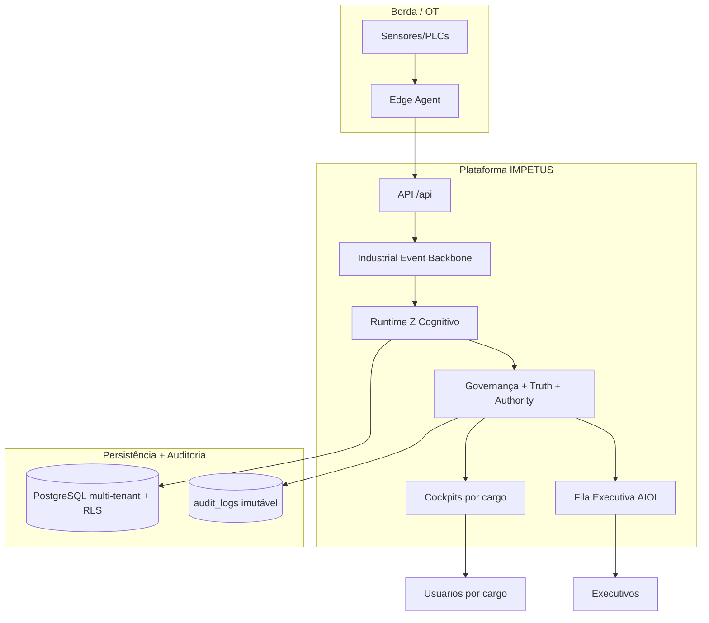

### 31.3 Papel do Runtime Z

O Runtime Z é o que permite **evoluir sem quebrar**: novas capacidades entram em **shadow** (observam sem afetar), passam por **controlled** (ativação parcial e auditada) e só viram **active** após validação e certificação. As fases Z documentam essa progressão.

### 31.4 Governança e soberania

- **Truth enforcement** em todas as respostas de IA.
- **HITL** obrigatório para ações críticas.
- **Authority por domínio** — cada domínio decide sobre seus dados.
- **Sovereignty** — humanos mantêm a decisão final; a IA assiste, não substitui.
- **Auditoria imutável** — tudo é rastreável.

### 31.5 Manutenção futura e evolução controlada

- Mudanças **aditivas e compatíveis** por padrão.
- Feature flags para promoção gradual.
- Certificação de readiness antes de ativar fases sensíveis.
- **Fases P17–P20 / Z.27–Z.29 (runtime cognitivo autônomo):** permanecem **proibidas/lab** até haver justificativa arquitetural e evidência operacional suficiente (coleta contínua, multi-tenant real, relatório executivo de operações reais). Reabertura só com gates de adoção cumpridos.

### 31.6 Princípios invioláveis de operação enterprise

1. Nunca inventar dados (Truth Program).
2. Nunca cruzar dados entre tenants (RLS).
3. Nunca executar ação crítica sem aprovação humana (HITL).
4. Nunca promover a produção sem shadow + validação (Runtime Z).
5. Nunca quebrar o que funciona (mudanças aditivas).
6. Sempre auditável (auditoria imutável + LGPD).

---

# ANEXO A — Matriz de Responsabilidades (RACI)

> R = Responsável · A = Aprovador · C = Consultado · I = Informado

| Atividade | Eng/Dev | DevOps | N1 | N2 | N3 | Implantação | CS/Onboarding | Admin Cliente |
|-----------|---------|--------|----|----|----|-------------|---------------|---------------|
| Instalação do servidor | C | R/A | — | I | C | R | I | I |
| Migrations | C | R | — | — | A | R | I | I |
| Deploy de versão | A | R | — | I | C | C | I | I |
| Configuração de tenant | I | I | C | R | C | A | R | C |
| Cadastro base estrutural | — | — | C | R | I | C | A | R |
| Integrações OT/ERP | C | R | — | C | A | R | I | C |
| Atendimento N1 | — | — | R | C | I | — | C | I |
| Escalonamento N2/N3 | C | C | R | R | A | C | I | I |
| Correção de bug | R | C | — | I | A | I | I | I |
| Rollback | A | R | — | I | R | C | I | I |
| Treinamento do cliente | — | — | C | C | I | C | R/A | C |
| Acompanhamento de adoção | — | — | I | C | I | C | R/A | C |
| Governança de IA/incidentes | C | C | I | C | R | I | I | A |

---

# ANEXO B — Plano de Certificação Interna

| Certificação | Pré-requisito | Avaliação | Validade |
|--------------|---------------|-----------|----------|
| **IMPETUS Operador de Suporte (N1)** | Níveis 1–2 | Prática (atendimento simulado) + teórica | 12 meses |
| **IMPETUS Especialista de Suporte (N2)** | N1 + Nível 2 | Parametrização + investigação | 12 meses |
| **IMPETUS Implantador** | Nível 3 | Instalação completa em ambiente de teste | 12 meses |
| **IMPETUS Engenheiro (N3)** | Especialista | Correção de bug real + troubleshooting | 12 meses |
| **IMPETUS Administrador** | Nível Admin | Configuração de tenant + RBAC + auditoria | 12 meses |
| **IMPETUS Arquiteto** | Especialista + experiência | Defesa de decisão arquitetural | 24 meses |

**Processo:** treinamento → avaliação prática (≥80%) → avaliação teórica (≥80%) → emissão → renovação periódica.

---

# ANEXO C — Roadmap de Manutenção Documental

| Frequência | Ação | Responsável |
|------------|------|-------------|
| A cada release | Atualizar seções afetadas (APIs, env, runtime) | Eng/Arquitetura |
| Mensal | Revisar FAQ e erros comuns com base nos chamados | Suporte N2/N3 |
| Trimestral | Revisar matriz de maturidade e roadmap | Produto/Arquitetura |
| A cada incidente N3 | Adicionar lição aprendida | N3 |
| Semestral | Revisão completa do manual | Arquitetura |
| Anual | Recertificação de equipe + revisão de trilhas | RH/Arquitetura |

**Regra:** este é um documento vivo. Toda mudança relevante no código deve refletir aqui. Versão e data de revisão atualizadas no cabeçalho.

---

# ANEXO D — Glossário Técnico

| Termo | Significado |
|-------|-------------|
| **AIOI** | AI Operations Intelligence — fila executiva de decisões priorizadas com SLA |
| **Anam** | Avatar de vídeo/voz em tempo real (WebRTC) |
| **BPMN** | Notation de workflow industrial (motor `workflow-engine`) |
| **C0–C6** | Camadas de profundidade cognitiva (determinística → soberania) |
| **CAPA** | Corrective and Preventive Action (qualidade) |
| **Conselho Cognitivo** | Convergência tri-IA (GPT + Claude + Gemini) |
| **Edge Agent** | Agente de borda que coleta OT e envia ao backend |
| **GHE** | Grupo Homogêneo de Exposição (SST) |
| **HITL** | Human-in-the-Loop — aprovação humana obrigatória |
| **IOE** | Industrial Operational Event (evento operacional) |
| **LOTO** | Lockout/Tagout (SST) |
| **MES** | Manufacturing Execution System |
| **Mapa de Vazamentos** | Visualização de perdas financeiras operacionais |
| **NCR** | Non-Conformance Report (qualidade) |
| **Nexus IA** | Billing/transparência de uso de tokens de IA |
| **OEE** | Overall Equipment Effectiveness |
| **PT/APR** | Permissão de Trabalho / Análise Preliminar de Risco |
| **Pulse RH** | Clima organizacional contínuo |
| **RBAC** | Role-Based Access Control |
| **RLS** | Row Level Security (PostgreSQL) |
| **Runtime Z** | Runtime cognitivo evolutivo (shadow → controlled → active) |
| **SCIM** | Provisionamento automatizado de usuários |
| **Shadow** | Modo de execução paralela sem afetar produção |
| **SPC** | Statistical Process Control (qualidade) |
| **Truth Enforcement** | Mecanismo que impede a IA de inventar dados |
| **Truth Program** | Programa de garantia de verdade operacional |

---

---

# ENGENHARIA REVERSA E FLUXOS INTERNOS DA PLATAFORMA

> **Maior seção do manual.** Produto de engenharia reversa direta do repositório `/var/www/impetus-completa/backend/src` e `frontend/src`. Todos os nomes de arquivos, rotas, services, tabelas, flags e fluxos abaixo foram extraídos do código real. Onde um componente é planejado mas não implementado, isso é declarado como **LACUNA**.

Esta seção destina-se à **transferência total de conhecimento**: um colaborador novo deve conseguir entender a plataforma inteira lendo-a. Ela complementa (não substitui) as Partes 1–3.

## Índice desta seção

- [ER.0 Diagrama Geral do Ecossistema IMPETUS](#er0--diagrama-geral-do-ecossistema-impetus)
- [ER.1 Mapa de Dependências entre Módulos](#er1--mapa-de-dependências-entre-módulos)
- [ER.2 ManuIA](#er2--manuia-engenharia-reversa)
- [ER.3 Pró-Ação](#er3--pró-ação-engenharia-reversa)
- [ER.4 Impetus Chat & Chat Interno](#er4--impetus-chat--chat-interno-engenharia-reversa)
- [ER.5 Registro Inteligente](#er5--registro-inteligente-engenharia-reversa)
- [ER.6 Cadastrar com IA](#er6--cadastrar-com-ia-engenharia-reversa)
- [ER.7 Nexus IA & Billing](#er7--nexus-ia--billing-engenharia-reversa)
- [ER.8 Telemetria Industrial (MQTT/OPC-UA/Modbus/Edge)](#er8--telemetria-industrial-engenharia-reversa)
- [ER.9 Workflow Engine](#er9--workflow-engine-engenharia-reversa)
- [ER.10 Action Runtime](#er10--action-runtime-engenharia-reversa)
- [ER.11 AIOI](#er11--aioi-engenharia-reversa)
- [ER.12 Runtime Cognitivo & Runtime Z](#er12--runtime-cognitivo--runtime-z-engenharia-reversa)
- [ER.13 Dashboard Engine V2](#er13--dashboard-engine-v2-engenharia-reversa)
- [ER.14 Autenticação, RBAC, Multi-Tenant/RLS](#er14--autenticação-rbac-multi-tenantrls-engenharia-reversa)
- [ER.15 LGPD & Auditoria](#er15--lgpd--auditoria-engenharia-reversa)
- [ER.16 Domínios Quality/Safety/Environment/Logistics/HR](#er16--domínios-industriais-engenharia-reversa)
- [ER.17 Fluxo Completo de Autenticação](#er17--fluxo-completo-de-autenticação)
- [ER.18 Fluxo Completo do Runtime Cognitivo (C0–C6 / Z.18–Z.29)](#er18--fluxo-completo-do-runtime-cognitivo)
- [ER.19 Fluxo Completo do ManuIA](#er19--fluxo-completo-do-manuia)
- [ER.20 Fluxo Completo do Pró-Ação](#er20--fluxo-completo-do-pró-ação)
- [ER.21 Fluxo Completo do Impetus Chat](#er21--fluxo-completo-do-impetus-chat)
- [ER.22 Fluxo Completo de Telemetria Industrial](#er22--fluxo-completo-de-telemetria-industrial)
- [ER.23 Diagramas de Banco de Dados por Domínio (ERD)](#er23--diagramas-de-banco-de-dados-por-domínio)
- [ER.24 Matriz de Eventos da Plataforma](#er24--matriz-de-eventos-da-plataforma)
- [ER.25 Matriz de APIs](#er25--matriz-de-apis)
- [ER.26 Matriz de Middlewares](#er26--matriz-de-middlewares)
- [ER.27 Matriz de Services](#er27--matriz-de-services)
- [ER.28 Matriz de Workers e Jobs](#er28--matriz-de-workers-e-jobs)

---

## ER.0 — Diagrama Geral do Ecossistema IMPETUS

Diagrama mestre com todas as camadas e conexões reais identificadas no código.

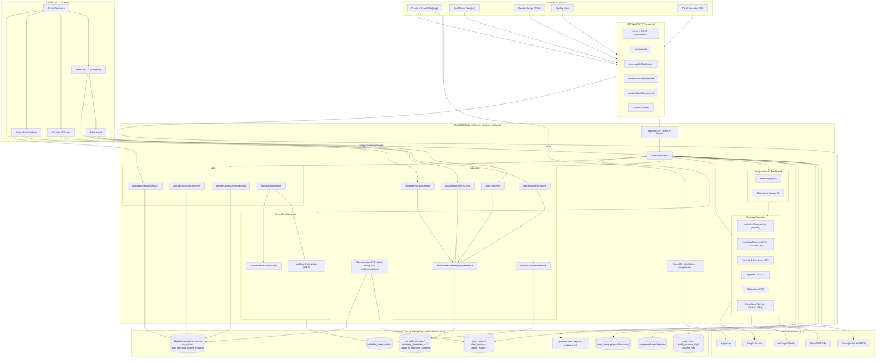

### Leitura do diagrama

- **Toda requisição** passa pela cadeia de middleware global do `server.js` (helmet → correlationId → observability → universalAudit → runtimeStateEnforcement → rate limit) antes de chegar ao `requireAuth` e às rotas.
- **Dois caminhos de telemetria coexistem:** o legado PLC (`edge/ingest` → `plc_collected_data`) e o WAVE3 environment (runtimes → conectores → `environmentTelemetryIngestService` → `telemetry_timeseries_v1`/`industrial_telemetry_samples`).
- **A fila executiva AIOI** é materializada (snapshot) — a API só lê do snapshot, nunca calcula em tempo de request.
- **Execução governada** (workflow/action) é o único caminho com efeito colateral, sempre com HITL.

---

## ER.1 — Mapa de Dependências entre Módulos

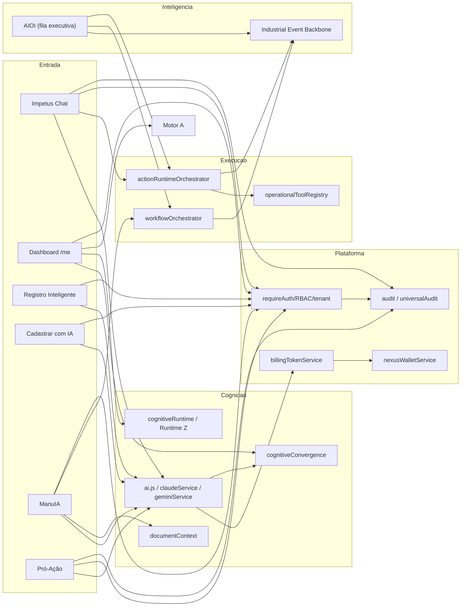

### Quem publica e quem consome eventos

| Publicador | Evento | Consumidor |
|------------|--------|-----------|
| Adapters AIOI (`plcAioiAdapter`, `taskAioiAdapter`, `mesAioiAdapter`, `communicationAioiAdapter`, `workOrderAioiAdapter`) | IOE em `industrial_operational_events` + `aioi_outbox` | `aioiClassificationConsumerService` |
| `aioiClassificationConsumerService` | IOE classificado (triaged) | `aioiContinuousWorkerService` → snapshot |
| Conectores environment (mqtt/opcua/modbus) | `environment.telemetry.*` | `environmentTelemetryIngestService` |
| `workflowOrchestrator` | `governance.workflow.started/transitioned/completed/compensated` | Industrial Event Backbone → outbox |
| `actionRuntimeOrchestrator` | `governance.action.executed/rejected` | Industrial Event Backbone → outbox |
| Quality operational | `quality.inspection.*` | `publishQualityIndustrialEvent` + socket |
| `chatService.saveMessage` | `new_message` (Socket.IO) | Clientes na room + `handleAIMessage` |

### Dependências críticas (se cair, o que para)

| Componente | Impacto se indisponível |
|------------|--------------------------|
| PostgreSQL | Plataforma inteira (persistência) |
| `requireAuth` + `sessions` | Todo acesso autenticado |
| Provedores de IA | Degrada para camada determinística (não para a plataforma) |
| Broker MQTT | Telemetria MQTT (OPC-UA/Modbus/Edge seguem) |
| Industrial Event Backbone | Eventos assíncronos enfileiram em outbox (replay posterior) |
| Workers AIOI | Fila executiva não atualiza (dados existentes permanecem) |

---

## ER.2 — ManuIA (Engenharia Reversa)

### 1. Visão Funcional

**O que faz:** assistente de manutenção industrial com IA. Pesquisa de equipamentos, diagnóstico assistido, assistência ao vivo (visão computacional + copiloto), criação de ordens de serviço e biblioteca técnica 3D. Possui versão de campo (PWA) com inbox, plantão (on-call) e push.

**Por que existe:** preservar o conhecimento técnico da fábrica e reduzir downtime — o técnico recebe diagnóstico e histórico antes de chegar à máquina.

**Problemas que resolve:** conhecimento que se perde com rotatividade; diagnóstico lento; falta de rastreabilidade de intervenções; dependência do "técnico que sabe tudo".

**Quem utiliza:** perfis de manutenção (`technician_maintenance`, `supervisor_maintenance`, `coordinator_maintenance`, `manager_maintenance`).

**Módulos que dependem dele:** Asset Management (OS e twins), Biblioteca Técnica, AIOI (via `workOrderAioiAdapter`), Dashboard de manutenção.

### 2. Arquitetura Interna

| Camada | Componentes reais |
|--------|-------------------|
| **Routes** | `routes/manutencao-ia.js` (`/api/manutencao-ia`), `routes/manuiaApp.js` (`/app/*`), `routes/manuiaDisabledFallback.js`, `routes/diagnostic.js`, `routes/assetManagement.js`, `routes/technicalLibrary.js` |
| **Services** | `equipmentResearchService`, `manuiaLiveAssistanceService`, `cognitiveTruthClosureService`, `diagnostic`, `assetManagementService`, `services/manuiaApp/*` (`manuiaAppRepository`, `manuiaAlertDecisionService`, `manuiaAiSummaryService`, `manuiaWebPushService`, `manuiaInboxIngestService`, `manuiaEventDispatchService`) |
| **Controllers/Módulos** | `modules/technicalLibrary/**` (CRUD equipamentos 3D, `modelResolverService`, field analysis) |
| **Middlewares** | `requireAuth`, `requireCompanyActive`, guard de perfil de manutenção |
| **APIs externas** | Gemini (visão — `analyze-frame`), OpenAI (copiloto — `chat`), billing via `billingTokenService` |
| **Database** | `manuia_machines`, `manuia_sensors`, `manuia_sessions`, `manuia_emergency_events`, `manuia_equipment_research`, `manuia_work_order_links`, `manuia_spare_parts`, `monitored_points`, `work_orders`; app: `manuia_notification_preferences`, `manuia_mobile_devices`, `manuia_inbox_notifications`, `manuia_on_call_slots`; biblioteca: `technical_library_equipments/_keywords/_models/_documents/_parts/_audit_logs`, `technical_library_field_analyses` |
| **Jobs/Workers** | Nenhum worker dedicado. Ingest de inbox opcional via `MANUIA_INBOX_FROM_SESSION=true`. Flag de módulo: `ENABLE_MANUIA`. |

**LACUNA:** `manuia_history` existe na migration, mas nenhum service/route escreve nela hoje.

### 3. Diagrama Estrutural Completo

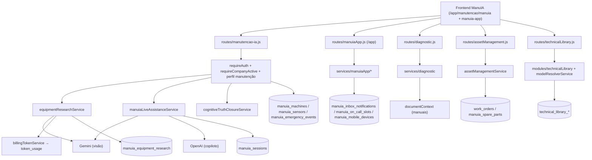

### 4. Diagrama de Sequência (sessão assistida + OS)

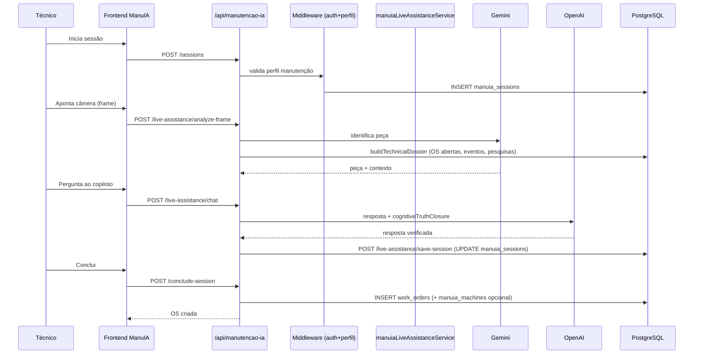

### 5. Fluxo de Dados

- **Origem:** câmera/texto do técnico; cadastro de máquinas/sensores; pesquisas IA.
- **Transformação:** Gemini identifica peça; dossiê técnico montado de OS/eventos/pesquisas; OpenAI gera resposta; `cognitiveTruthClosureService` aplica verdade industrial.
- **Persistência:** `manuia_sessions` (sessão/dossiê), `manuia_equipment_research` (cache de pesquisa), `work_orders` (OS), `manuia_machines` (cadastro on-the-fly).
- **Consulta:** `/machines`, `/sensors`, `/sessions`, `/emergency-events`.
- **Exibição:** cockpit de manutenção, app de campo.
- **Auditoria:** billing de tokens em `token_usage`; ações de OS rastreadas.

### 6. Fluxo de Erros

| Erro | Tratamento | Fallback |
|------|-----------|----------|
| `ENABLE_MANUIA=false` | `manuiaDisabledFallback.js` | Rotas respondem desabilitado |
| Falha Gemini (visão) | Captura e mensagem ao usuário | Continua sem identificação automática |
| Falha OpenAI (copiloto) | Erro tratado | Resposta degradada / retry manual |
| Detalhe insuficiente no diagnóstico | `ensureSufficientDetail` (`POST /diagnostic/validate`) | Solicita mais dados antes de processar |
| Perfil sem acesso | 403 | Bloqueio |

### 7. Fluxo de Auditoria

- Geração: cada uso de IA chama `billingTokenService.registrarUsoSafe` → `token_usage`.
- Persistência: sessões e OS persistidas com `company_id` e autor.
- Rastreamento: `manuia_work_order_links` liga sessão↔OS; `technical_library_audit_logs` para biblioteca.
- Consulta: dashboards de manutenção e histórico de sessões.

### 8. Fluxo de Segurança

- **Autenticação:** `requireAuth`.
- **Autorização:** guard de perfil de manutenção; técnico vê apenas suas sessões, demais veem da empresa.
- **RBAC:** por hierarquia de manutenção.
- **Tenant isolation:** `company_id` em todas as queries; `requireCompanyActive`.
- **LGPD:** sem dados pessoais sensíveis além do autor da ação.

---

## ER.3 — Pró-Ação (Engenharia Reversa)

### 1. Visão Funcional

**O que faz:** melhoria contínua / TPM. Registra propostas de melhoria, enriquece e avalia com IA, conduz ciclo PDCA com escalonamento e atribuição, registra dados por fase e finaliza.

**Por que existe:** transformar reclamações e ocorrências recorrentes em melhorias estruturadas e rastreadas (Ishikawa, 5W2H, PDCA), conectando chão de fábrica e gestão.

**Problemas que resolve:** PDCA de papel que ninguém atualiza; melhorias perdidas; falta de priorização objetiva.

**Quem utiliza:** membros operacionais de fábrica (criação), liderança (avaliação/aprovação) com escopo hierárquico.

**Módulos que dependem dele:** Chat (workspace Pró-Ação embutido), diagnóstico ManuIA (cria `proposal_actions` com `diagnostic_generated`), detecção de lotes.

### 2. Arquitetura Interna

| Camada | Componentes reais |
|--------|-------------------|
| **Routes** | `routes/proacao.js` (`/api/proacao`) |
| **Services** | `services/proacao.js` (core), `ai.js` / `documentContext.js` (IA), `hierarchicalFilter.js` (escopo), `rawMaterialLotDetectionService.js` (opcional) |
| **Middlewares** | `requireAuth`, `requireFactoryOperationalMember` (criação), `requireHierarchyScope` (listagem/detalhe), `audit.logAction` |
| **APIs externas** | OpenAI/Claude via `ai.js` |
| **Database** | `proposals`, `proposal_actions` (auditoria de ações), `users` |
| **Jobs/Workers** | `npm run proacao-worker` → `scripts/proacao_worker.js` — **LACUNA: arquivo ausente** |

**LACUNA:** `quality_tools_applied` e `action_plans_5w2h` aparecem em docs, mas **não têm CREATE TABLE nem uso** no backend. Os dados de fase PDCA são gravados em `proposal_actions` com `action = phase_{N}_data` e `metadata = collectedData`.

### 3. Diagrama Estrutural Completo

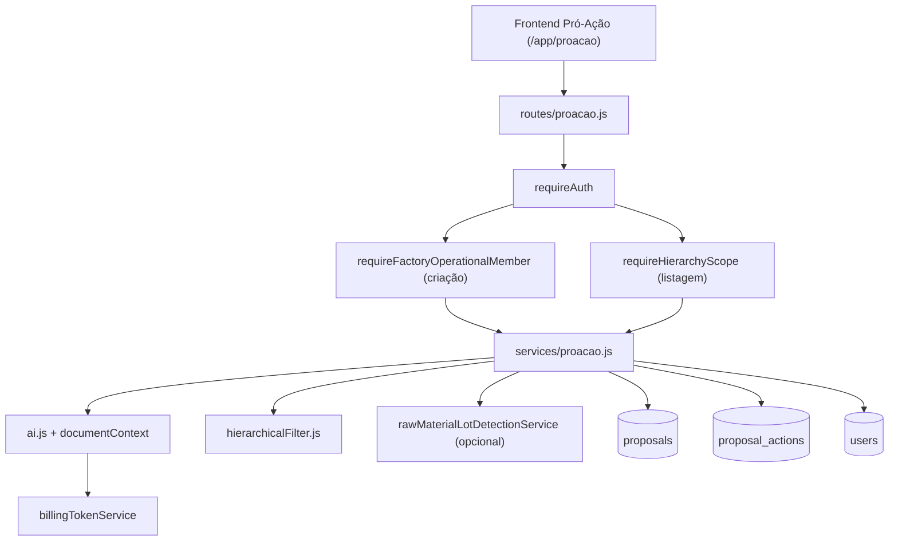

### 4. Diagrama de Sequência (PDCA)

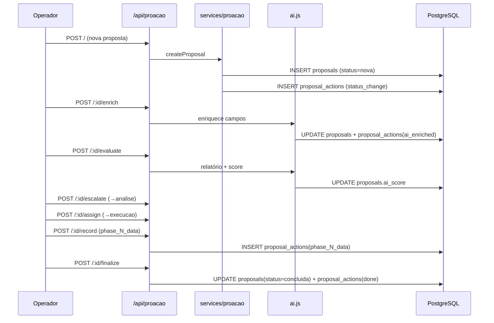

### 5. Fluxo de Dados

- **Origem:** proposta do operador (texto), opcional contexto de lote.
- **Transformação:** IA enriquece e avalia (score, Ishikawa/5W2H estruturados no conteúdo).
- **Persistência:** `proposals` (entidade), `proposal_actions` (trilha + dados de fase).
- **Consulta:** `GET /` (lista + summary + responsáveis), `GET /:id`.
- **Exibição:** workspace Pró-Ação e dashboard.
- **Auditoria:** `proposal_actions` registra cada transição (`status_change`, `ai_enriched`, `evaluated`, `escalated`, `assigned`, `phase_N_data`, `done`, `updated`).

### 6. Fluxo de Erros

| Erro | Tratamento |
|------|-----------|
| Lote bloqueado | `rawMaterialLotDetectionService` impede criação |
| Transição inválida de status | `canTransitStatus` valida sequência `nova→analise→aprovacao→execucao→concluida` |
| Falha IA no enrich/evaluate | Erro tratado; proposta permanece no estado anterior |
| Usuário sem escopo | `requireHierarchyScope` filtra/bloqueia |

### 7. Fluxo de Auditoria

Cada ação → INSERT em `proposal_actions` com tipo e metadados. Login coletivo → `audit.logAction`. Status canônicos com aliases legados (`submitted→nova`, `escalated→analise`, `assigned→execucao`, `done→concluida`).

### 8. Fluxo de Segurança

- **Autenticação:** `requireAuth`.
- **Autorização:** criação exige membro operacional de fábrica; leitura por escopo hierárquico (departamento/subordinados via `hierarchicalFilter`).
- **Tenant:** `company_id` em todas as operações.

---

## ER.4 — Impetus Chat & Chat Interno (Engenharia Reversa)

> **Existem DOIS sistemas distintos.** O Impetus Chat (`/api/chat`) usa Socket.IO; o Chat Interno (`/api/internal-chat`) é **somente HTTP** (LACUNA: sem WebSocket).

### 1. Visão Funcional

**O que faz:** comunicação entre colaboradores (1:1 e grupo), com presença, leitura, reações, upload de mídia, e conversa dedicada com a IA (@IA). Modo executivo (CEO) e automações operacionais.

**Por que existe:** substituir o WhatsApp corporativo por canal rastreável, integrado ao cockpit e à IA, com conformidade LGPD.

**Quem utiliza:** todos os perfis; IA respondendo quando mencionada.

**Módulos que dependem:** operationalRealtimeCoordinator (automações), executiveMode (CEO), SZ4/SZ5 indexers.

### 2. Arquitetura Interna

| Camada | Impetus Chat (`/api/chat`) | Chat Interno (`/api/internal-chat`) |
|--------|----------------------------|--------------------------------------|
| **Routes** | `routes/chat.js`, `routes/chatMetrics.js`, `routes/chatVoice.js` | `routes/internalChat.js` |
| **WebSocket** | `socket/chatSocket.js`, `socket/voiceStreamSocket.js` | — (LACUNA) |
| **Services** | `chatService`, `chatAIService.loader`, `executiveMode`, `operationalRealtimeCoordinator` | `internalChatService`, `runtime-z-operational-nervous-system/internal-chat/*` (SZ4) |
| **Database** | `chat_conversations`, `chat_participants`, `chat_messages`, `chat_message_deleted_for_user`, `chat_reactions`, `chat_push_subscriptions`, `users` | `internal_chat_conversations`, `internal_chat_messages`, `internal_chat_read_receipts`, `users`, `departments` |
| **Storage** | `uploads/chat/` (multer) | `media_url` no body (upload separado) |

### 3. Diagrama Estrutural Completo

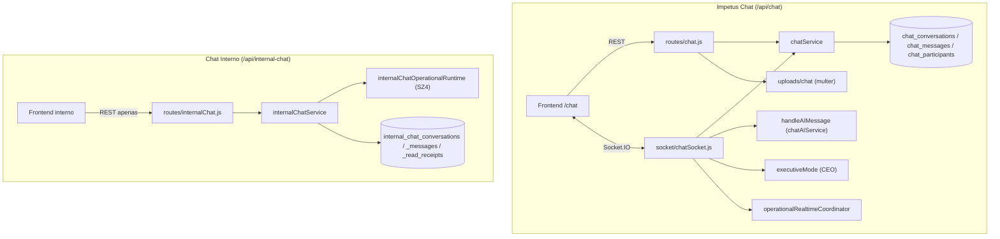

### 4. Diagrama de Sequência (mensagem com @IA via WebSocket)

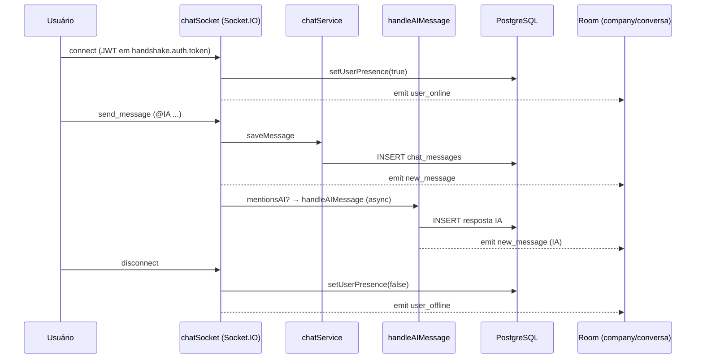

### 5. Fluxo de Dados

- **Origem:** mensagens (texto/áudio/vídeo/imagem/documento), reações, leitura.
- **Transformação:** `verifyParticipant`; modo CEO opcional; IA quando mencionada.
- **Persistência:** `chat_messages` (+ presença em `users`); mídia em `uploads/chat/`.
- **Consulta:** `/conversations`, `/conversations/:id/messages`, `/users`.
- **Exibição:** UI de chat, widget no dashboard.
- **Notificações:** Web Push (`/push/subscribe`, `chat_push_subscriptions`).

### 6. Fluxo de Erros

| Erro | Tratamento |
|------|-----------|
| JWT inválido no handshake | Conexão WS recusada |
| Não participante | `verifyParticipant` bloqueia |
| Falha IA (@IA) | Async; mensagem humana persiste mesmo assim |
| Upload inválido | multer rejeita |

### 7. Fluxo de Auditoria

Mensagens e participantes persistidos com `company_id`. Métricas em memória via `/api/chat/metrics`. Chat interno alimenta `claudeAnalytics.ingestInternalChat` (async).

### 8. Fluxo de Segurança

- **Autenticação:** JWT (REST e handshake WS).
- **Autorização:** participação validada por conversa.
- **Tenant:** rooms `company:{id}`; queries por `company_id`.
- **LGPD:** mensagens incluídas no export (`exportUserData`).

---

## ER.5 — Registro Inteligente (Engenharia Reversa)

> **Rota canônica:** `/api/intelligent-registration`. **NÃO** é `routes/operational.js` (esse é confirmação de ações operacionais, `/api/operational`).

### 1. Visão Funcional

**O que faz:** memória operacional assistida por IA. O colaborador registra atividades, problemas, pendências e ocorrências em texto e/ou anexos (PDF, doc, imagem, áudio); a IA estrutura em JSON (categoria, prioridade, setor, pendências).

**Por que existe:** capturar conhecimento operacional do dia a dia de forma estruturada e buscável.

**Quem utiliza:** membros operacionais de fábrica; liderança (`hierarchy_level <= 2`) vê visão consolidada.

### 2. Arquitetura Interna

| Camada | Componentes |
|--------|-------------|
| **Routes** | `routes/intelligentRegistration.js` (`/api/intelligent-registration`) |
| **Services** | `intelligentRegistrationService` (IA+persistência), `intelligentRegistrationAttachments` (multimodal), `claudeAnalyticsService` |
| **Middlewares** | `requireAuth`, `requireFactoryOperationalMember`, rate limit, multer |
| **APIs externas** | OpenAI (`ai.chatCompletion`), Gemini (imagem), `mediaProcessor` (áudio), mammoth/pdf-parse (documentos) |
| **Database** | `intelligent_registrations` (`ai_metadata`, `operational_team_member_id`), `users` |
| **Storage** | `uploads/registro-inteligente/` |
| **Workers** | Nenhum |

### 3. Diagrama Estrutural

```mermaid
flowchart TD
  FE["/app/registro-inteligente"] --> R["routes/intelligentRegistration.js"]
  R --> MW["requireAuth + requireFactoryOperationalMember + rate limit + multer"]
  MW --> ATT["intelligentRegistrationAttachments.processUploadedFile"]
  ATT --> GEM["Gemini (imagem)"]
  ATT --> MED["mediaProcessor (áudio)"]
  ATT --> DOCX["mammoth / pdf-parse"]
  MW --> SVC["intelligentRegistrationService.processWithAI"]
  SVC --> OAI["ai.chatCompletion + documentContext"]
  SVC --> T1[("intelligent_registrations")]
  SVC --> AN["claudeAnalytics.ingestRegistroInteligente"]
```

### 4. Diagrama de Sequência

```mermaid
sequenceDiagram
  participant U as Colaborador
  participant API as /api/intelligent-registration
  participant ATT as Attachments
  participant AI as ai.chatCompletion
  participant DB as PostgreSQL

  U->>API: POST / (texto + arquivo)
  API->>ATT: processUploadedFile
  ATT-->>API: texto extraído/transcrito
  API->>AI: estrutura JSON (categoria, prioridade, setor)
  AI-->>API: JSON estruturado
  API->>DB: INSERT intelligent_registrations
  API-->>U: registro criado
```

### 5. Fluxo de Dados

Origem: texto + anexo → extração/transcrição (texto final ≥ 3 chars) → IA estrutura → INSERT `intelligent_registrations` → consulta `GET /` (meus) e `GET /leadership` (consolidado) → analytics Claude.

### 6. Fluxo de Erros

| Erro | Tratamento |
|------|-----------|
| Texto insuficiente (<3 chars) | Rejeita |
| Falha de extração de anexo | Erro tratado por tipo |
| Rate limit excedido | 429 |
| Sem permissão de liderança | 403 em `/leadership` |

### 7. Fluxo de Auditoria

Audit log se login coletivo; `ai_metadata` guarda rastro da estruturação; analytics Claude ingere o registro.

### 8. Fluxo de Segurança

`requireAuth` + `requireFactoryOperationalMember`; `/leadership` exige `hierarchy_level <= 2`; rate limit; isolamento por `company_id`.

---

## ER.6 — Cadastrar com IA (Engenharia Reversa)

### 1. Visão Funcional

**O que faz:** ingestão multimodal para a base de conhecimento da empresa. Texto, imagem, áudio ou documento → IA extrai estrutura → memória operacional por setor/equipamento.

**Por que existe:** popular a base de conhecimento (que alimenta a IA) com o material real da empresa (manuais, fichas, procedimentos) de forma rápida.

**Quem utiliza:** perfis com acesso ao cadastro IA por setor.

### 2. Arquitetura Interna

| Camada | Componentes |
|--------|-------------|
| **Routes** | `routes/cadastrarComIA.js` (`/api/cadastrar-com-ia`) — lógica inline |
| **Services** | `geminiService` (imagem), `mediaProcessorService` (áudio), `ai.js` (texto/doc), `audioLogsService` |
| **Middlewares** | `requireAuth`, rate limit, multer |
| **Database** | `company_operation_memory` |
| **Storage** | `uploads/cadastrar-ia/` |

### 3. Diagrama Estrutural

```mermaid
flowchart TD
  FE["/app/cadastrar-com-ia"] --> R["routes/cadastrarComIA.js"]
  R --> MW["requireAuth + rate limit + multer"]
  MW --> DEC{Tipo de entrada}
  DEC -->|imagem| GEM["geminiService.extractStructuredFromImage"]
  DEC -->|áudio| MED["mediaProcessor.transcribeAudio → ai.chatCompletion"]
  DEC -->|pdf/doc| DOCX["pdf-parse / mammoth → ai.chatCompletion"]
  DEC -->|texto| OAI["ai.chatCompletion"]
  GEM --> T[("company_operation_memory")]
  MED --> T
  DOCX --> T
  OAI --> T
```

### 4. Diagrama de Sequência

```mermaid
sequenceDiagram
  participant U as Usuário
  participant API as /api/cadastrar-com-ia
  participant PROC as Processador multimodal
  participant DB as PostgreSQL

  U->>API: POST / (texto/imagem/áudio/doc + sector + equipamento)
  API->>PROC: processa mídia → {categoria, dados, resumo}
  PROC-->>API: estrutura extraída
  API->>DB: INSERT company_operation_memory
  API-->>U: cadastrado
  U->>API: GET / (?categoria, ?limit)
  API->>DB: SELECT metadados (sem conteúdo completo)
```

### 5. Fluxo de Dados

Origem: mídia/texto → extração por tipo → `{categoria, dados, resumo}` → INSERT `company_operation_memory` (com `source_type`, `file_path`, `sector`, `equipamento`, `dados_extraidos` JSON) → consulta lista de metadados.

### 6. Fluxo de Erros

| Erro | Tratamento |
|------|-----------|
| Tipo não suportado | Rejeita |
| Falha de transcrição/extração | Erro tratado |
| Rate limit | 429 |

### 7. Fluxo de Auditoria

`audioLogsService` registra transcrições; conteúdo persistido com `company_id` e autor.

### 8. Fluxo de Segurança

`requireAuth` + rate limit; isolamento por `company_id`; uploads isolados por pasta.

---

## ER.7 — Nexus IA & Billing (Engenharia Reversa)

### 1. Visão Funcional

**O que faz:** mede e cobra o uso de IA (tokens) por empresa, gere carteira de créditos (wallet), transparência de fornecedores de IA, assinaturas B2B (Asaas) e recargas (Stripe).

**Por que existe:** sustentar o custo variável de IA e o modelo de assinatura, com transparência e controle por tenant.

**Quem utiliza:** admin de empresa (consumo/carteira), plataforma (cobrança), financeiro.

### 2. Arquitetura Interna

| Camada | Componentes |
|--------|-------------|
| **Routes** | `routes/nexusIa.js`, `routes/admin/nexusCustos.js`, `routes/admin/nexusWallet.js`, `routes/webhooks/stripeNexusWallet.js`, `routes/webhooks/asaas.js`, `routes/subscription.js` |
| **Services** | `billingTokenService`, `nexusWalletService`, `asaasService`, `aiProviderService` |
| **Jobs** | `scripts/nexusTokenMonthlyBilling.js` (CLI mensal) + cron no `server.js`; **LACUNA:** `scripts/subscription_worker.js` ausente |
| **Database** | `token_usage`, `token_invoices`, `token_billing_plans`, `nexus_company_wallets`, `nexus_wallet_ledger`, `nexus_wallet_global_rates`, `nexus_wallet_company_rates`, `nexus_wallet_topups`, `subscriptions`, `companies`, `asaas_webhook_logs` |
| **APIs externas** | OpenAI/Claude/Gemini (custo medido), Asaas (boleto/assinatura), Stripe (recarga) |

### 3. Diagrama Estrutural

```mermaid
flowchart TD
  AISVC["ai.js / claudeService / chatVoice / equipmentResearch"] --> BILL["billingTokenService.registrarUsoSafe"]
  BILL --> T1[("token_usage")]
  BILL --> WALLET["nexusWalletService.debitAfterUsageSafe"]
  WALLET --> T2[("nexus_wallet_ledger")]
  CRON["cron dia 1 08:00 / nexusTokenMonthlyBilling.js"] --> MB["runMonthlyTokenBilling"]
  MB --> ASA["asaasService (boleto tokens)"]
  MB --> T3[("token_invoices")]
  SUB["Asaas subscription mensal"] --> WH["webhooks/asaas.js"]
  WH --> T4[("subscriptions / companies.active")]
  STRIPE["Stripe recarga"] --> WH2["webhooks/stripeNexusWallet.js"]
  WH2 --> T5[("nexus_wallet_topups")]
  ADMIN["/api/admin/nexus-custos / nexus-wallet"] --> T1
  ADMIN --> T2
```

### 4. Diagrama de Sequência (consumo → cobrança)

```mermaid
sequenceDiagram
  participant SVC as Serviço de IA
  participant BILL as billingTokenService
  participant WAL as nexusWalletService
  participant DB as PostgreSQL
  participant CRON as Cron mensal
  participant ASA as Asaas

  SVC->>BILL: registrarUsoSafe(company, servico, qtd)
  BILL->>DB: INSERT token_usage (custo_real)
  BILL->>WAL: debitAfterUsageSafe (se wallet ativa)
  WAL->>DB: UPDATE nexus_company_wallets + ledger
  Note over CRON: Dia 1, 08:00
  CRON->>BILL: runMonthlyTokenBilling (mês anterior)
  BILL->>DB: calcularFaturaMes (tokens × preço + mensalidade)
  BILL->>ASA: cobrança BOLETO (se >= min charge)
  ASA-->>BILL: cobrança criada
  BILL->>DB: INSERT token_invoices
```

### 5. Fluxo de Dados

- **Origem:** cada chamada de IA chama `registrarUsoSafe` (fire-and-forget).
- **Transformação:** custo unitário por serviço (`CUSTO_REAL_POR_UNIDADE`); preço de token por plano (`token_billing_plans` ou defaults: essencial 0.00005 … enterprise 0.00002 BRL/token).
- **Persistência:** `token_usage`; débito em `nexus_wallet_ledger` se wallet ativa.
- **Consulta:** `GET /api/admin/nexus-custos` (resumo mês), `GET /api/admin/nexus-wallet`.
- **Faturamento:** mensal (mês civil anterior) → `token_invoices` + cobrança Asaas.
- **Mensalidade base:** `asaasService.getPlanValue` (199/399/799/1499 BRL) — separada dos tokens.

### 6. Fluxo de Erros

| Erro | Tratamento |
|------|-----------|
| Falha ao registrar uso | `registrarUsoSafe` **nunca lança** — só loga `[NEXUS_BILLING]` |
| Saldo insuficiente (wallet enforce) | `canConsumeEstimate` pré-bloqueia; `NEXUS_WALLET_ENFORCE` |
| Falha Asaas | Cobrança não criada; reprocessável |
| Empresa inadimplente | `PAYMENT_OVERDUE` → grace period; `/api/subscription/payment-link` para regularizar |

### 7. Fluxo de Auditoria

`token_usage` (uso), `nexus_wallet_ledger` (débitos/créditos), `token_invoices` (faturas), `asaas_webhook_logs` (eventos de pagamento). Transações de wallet com `FOR UPDATE` (consistência).

### 8. Fluxo de Segurança

- **Ativação:** `ENABLE_TOKEN_BILLING`, `NEXUS_CREDIT_WALLET`, `NEXUS_WALLET_ENFORCE`.
- **Webhooks:** validados (raw body Stripe; eventos Asaas).
- **Admin:** rotas de custo/carteira exigem admin de empresa.
- **Tenant:** tudo escopado por `company_id`.

---

## ER.8 — Telemetria Industrial (Engenharia Reversa)

> **Dois caminhos coexistem:** (A) legado PLC (`edge/ingest` → `plc_collected_data`) e (B) WAVE3 environment (runtimes → conectores → `environmentTelemetryIngestService` → `telemetry_timeseries_v1`/`industrial_telemetry_samples`).

### 1. Visão Funcional

**O que faz:** conecta sensores/PLCs da planta via MQTT, OPC-UA e Modbus, ingere leituras, detecta anomalias, gera alertas PLC e publica eventos no barramento industrial.

**Por que existe:** levar o dado de chão de fábrica ao cockpit em tempo real, sem planilhas.

**Quem utiliza:** operação, manutenção, executivo (indiretamente via KPIs/alertas).

**Módulos que dependem:** Dashboard (KPIs/alertas), AIOI (via `plcAioiAdapter`), Environment (telemetria ambiental), Industrial Event Backbone.

### 2. Arquitetura Interna

| Camada | Componentes reais |
|--------|-------------------|
| **Routes** | `routes/integrations.js` (`/edge/ingest`, `/edge/register`, `/mes-erp/*`, `/production/shift`, `/digital-twin/*`), `routes/plcAlerts.js`, `routes/internal/industrialEventBackbone.js` |
| **Services (legado PLC)** | `edgeIngestService`, `plcDataService`, `plcCollector`, `plcAdapters/adapterFactory` |
| **Runtimes MQTT** | `industrial-mqtt/runtime/mqttRealClientRuntime`, `services/mqttBrokerConfigService`, `governance/mqttGovernanceService`, `runtime/mqttBufferReplayRuntime`, `runtime/mqttDlqBridge` |
| **Runtimes OPC-UA** | `industrial-opcua/runtime/opcuaRealClientRuntime`, `opcuaServerConfigService`, `opcuaGovernanceService`, `opcuaSampleBufferRuntime`, `opcuaDlqBridge` |
| **Runtimes Modbus** | `industrial-modbus/runtime/modbusRealPollRuntime`, `modbusDeviceConfigService`, `modbusGovernanceService`, `modbusSampleBufferRuntime`, `modbusDlqBridge` |
| **Edge** | `industrial-edge/runtime/edgeConnectorBridgeRuntime`, `edgeRealSyncRuntime`, `edgePhysicalAgentBridge`, `services/edgeQueuePersistenceService`, `governance/edgeGovernanceService` |
| **Environment ingest** | `domains/environment/telemetry/environmentTelemetryRuntime`, `environmentTelemetryIngestService`, `environmentTelemetryEnterpriseRouting`, connectors `environmentMqttConnector`/`OpcUaConnector`/`ModbusConnector` |
| **Storage WAVE3** | `storage/telemetryIsolationService`, `storage/industrialStorageRuntime` |
| **Event backbone** | `eventPipeline/industrialEventBackbone`, `outbox/industrialOutboxService`, `catalog/industrialEventCatalog`, `dlq/industrialDlqService`, `replay/industrialReplayOrchestrator`, `recovery/streamRecoveryWorker` |
| **Database** | `edge_agents`, `plc_collected_data`, `plc_analysis`, `plc_alerts`, `machine_monitoring_config`, `telemetry_timeseries_v1`, `industrial_telemetry_samples`, `industrial_event_outbox` |

> **Runtimes MQTT/OPC-UA/Modbus não expõem REST próprio** — são iniciados no boot do `server.js`.

### 3. Diagrama Estrutural Completo

```mermaid
flowchart TD
  subgraph OT[OT do cliente]
    PLC[PLCs] --> BRK[(MQTT)]
    PLC --> OPC[OPC-UA]
    PLC --> MOD[Modbus]
    EDGE[Edge Agent]
  end
  BRK --> MQTTR[mqttRealClientRuntime]
  OPC --> OPCR[opcuaRealClientRuntime]
  MOD --> MODR[modbusRealPollRuntime]
  EDGE -->|/edge/ingest| RINT[routes/integrations.js]

  MQTTR --> MQC[environmentMqttConnector]
  OPCR --> OPCC[environmentOpcUaConnector]
  MODR --> MODC[environmentModbusConnector]
  MQC --> ENVING[environmentTelemetryIngestService]
  OPCC --> ENVING
  MODC --> ENVING
  ENVING --> ROUTING[environmentTelemetryEnterpriseRouting]
  ROUTING --> TS[(telemetry_timeseries_v1)]
  ROUTING --> ITS[(industrial_telemetry_samples)]

  RINT --> EIS[edgeIngestService]
  EIS --> PDS[plcDataService.saveCollectedData]
  PDS --> PCD[(plc_collected_data)]
  COLL[plcCollector.runCollectorCycle] --> ADP[adapterFactory]
  ADP --> PDS
  PDS --> AISAVE[saveAnalysisAndAlert] --> PA[(plc_alerts)]

  ENVING --> EVT[publishIndustrialEvent]
  EVT --> OUT[(industrial_event_outbox)]
```

### 4. Diagrama de Sequência (MQTT real)

```mermaid
sequenceDiagram
  participant PLC as Sensor/PLC
  participant BRK as Broker MQTT
  participant MQ as mqttRealClientRuntime
  participant CON as environmentMqttConnector
  participant ING as environmentTelemetryIngestService
  participant ROUT as enterpriseRouting
  participant DB as PostgreSQL

  PLC->>BRK: publica leitura (tópico)
  MQ->>BRK: subscribe (startClient por company)
  BRK-->>MQ: mensagem
  MQ->>CON: ingestMqttMessage
  CON->>ING: processConnectorIngest('mqtt')
  ING->>ING: normaliza + detecta anomalia + emite environment.telemetry.*
  ING->>ROUT: _persist()
  alt flag = industrial
    ROUT->>DB: ingestIndustrialSample → industrial_telemetry_samples
  else timeseries (default)
    ROUT->>DB: ingestTimeseriesV1 → telemetry_timeseries_v1
  end
  Note over MQ: falha → buffer (replay) + DLQ
```

### 5. Fluxo de Dados

Origem (PLC) → runtime de protocolo → conector environment → `ingestSingle` (normalização, anomalia, eventos) → `_persist()` → tabela conforme flag `IMPETUS_ENVIRONMENT_TELEMETRY_PRIMARY_TABLE` (`industrial` ou `timeseries`). Caminho legado: `edge/ingest` → `plc_collected_data` → (collector) análise IA → `plc_alerts`. Exibição: dashboard/KPIs e alertas PLC.

### 6. Fluxo de Erros

| Erro | Tratamento |
|------|-----------|
| Falha de persistência (MQTT) | `mqttBufferReplayRuntime` (buffer) + `mqttDlqBridge` (DLQ) |
| Falha OPC-UA/Modbus | buffers + DLQ por protocolo |
| Token edge inválido | 401 em `/edge/ingest` |
| Backbone indisponível | enfileira em `industrial_event_outbox` (replay) |
| Modo `simulation`/`audit` | Não persiste em produção real (governança por protocolo) |

### 7. Fluxo de Auditoria

Governança por protocolo (`*GovernanceService`) controla modo (`on`/`audit`/`simulation`) e pilot tenants. Eventos no `industrial_event_outbox`. Rotas internas para replay/recovery/archive/DLQ em `/api/internal/industrial-event-backbone`.

### 8. Fluxo de Segurança

- **Edge:** token SHA-256 validado contra `edge_agents.token_hash`.
- **Tenant:** ingest escopado por `company_id`; isolamento de telemetria (`telemetryIsolationService`).
- **Acesso runtime:** rotas internas protegidas por `internalNetworkGuard` + ACL.

---

## ER.9 — Workflow Engine (Engenharia Reversa)

### 1. Visão Funcional

**O que faz:** motor de workflow industrial (BPMN) com aprovação humana (HITL), grafo de execução, auditoria, compensação/rollback e recuperação.

**Por que existe:** orquestrar processos industriais com governança e gating de permissão (ex.: cadeia de aprovação, ciclo de vida de tarefa).

**Quem utiliza:** supervisores+ (aprovações exigem hierarchy ≥ 4); integrado a CAPA, Pró-Ação e decisões ambientais.

### 2. Arquitetura Interna

| Camada | Componentes |
|--------|-------------|
| **Routes** | `routes/workflowEngine.js` (`/api/workflow-engine`) |
| **Orquestração** | `workflowEngine/orchestration/workflowOrchestrator`, `stateMachine/stateMachineEngine` |
| **BPMN** | `bpmn/bpmnDefinitionRegistry` (definições embutidas) |
| **HITL** | `hitl/approvalChainService` |
| **Grafo/Audit** | `graph/executionGraphService`, `audit/workflowAuditTracer` |
| **Compensação** | `compensation/compensationService`, `recovery/workflowRecoveryService` |
| **Permissão/Eventos** | `permission/workflowPermissionGate`, `integration/workflowBackboneEvents` |
| **Flags** | `config/workflowEngineFlags` (`shadow`/`audit`/`on`) |
| **Database** | `industrial_workflow_definitions`, `industrial_workflow_instances`, `industrial_workflow_execution_graph`, `industrial_workflow_approval_chain`, audit tables, `industrial_event_outbox` |

**Definições embutidas:** `governance.approval_chain.v1` (supervisor gate → execute → complete/reject/compensate), `operational.task_lifecycle.v1` (open → assigned → done/cancelled).

### 3. Diagrama Estrutural

```mermaid
flowchart TD
  FE["Cliente"] --> R["routes/workflowEngine.js"]
  R --> GATE["workflowPermissionGate"]
  GATE --> ORC["workflowOrchestrator"]
  ORC --> SM["stateMachineEngine"]
  ORC --> REG["bpmnDefinitionRegistry"]
  ORC --> APR["approvalChainService"]
  ORC --> GRAPH["executionGraphService"]
  ORC --> AUD["workflowAuditTracer"]
  ORC --> COMP["compensationService"]
  ORC --> EVT["workflowBackboneEvents → industrial_event_outbox"]
  ORC --> T1[("industrial_workflow_instances")]
  GRAPH --> T2[("industrial_workflow_execution_graph")]
  APR --> T3[("industrial_workflow_approval_chain")]
```

### 4. Diagrama de Sequência (cadeia de aprovação)

```mermaid
sequenceDiagram
  participant U as Solicitante
  participant API as /api/workflow-engine
  participant ORC as workflowOrchestrator
  participant APR as approvalChainService
  participant SUP as Supervisor (h≥4)
  participant DB as PostgreSQL

  U->>API: POST /instances/start (governance.approval_chain.v1)
  API->>ORC: startWorkflow (após permission gate)
  ORC->>DB: INSERT industrial_workflow_instances (created)
  ORC->>ORC: auto-signal SUBMIT → pending_approval
  ORC->>APR: createApprovalStep (node supervisor_gate)
  SUP->>API: POST /approvals/:id/approve
  API->>ORC: signalWorkflow(APPROVE)
  alt mode on
    ORC->>ORC: signalWorkflow(EXECUTE) → COMPLETE
    ORC->>DB: state completed
  end
  ORC->>DB: backbone governance.workflow.completed
```

### 5. Fluxo de Dados

Início → permission gate → instância (`created`) → auto SUBMIT → `pending_approval` → approval step → APPROVE → (mode on) EXECUTE → COMPLETE (`completed`). Grafo e auditoria persistidos; eventos no backbone.

### 6. Fluxo de Erros

| Erro | Tratamento |
|------|-----------|
| Sem permissão | `workflowPermissionGate` → 403 |
| Modo `shadow` | Retorno simulado, sem persistência |
| Reject | Sinal REJECT → estado `rejected` |
| Falha/necessidade de desfazer | `compensationService` + COMPENSATE → `COMPENSATION_DONE` |
| Recuperação | `POST /instances/:id/recover` (hierarchy ≥ 3) |

### 7. Fluxo de Auditoria

`workflowAuditTracer` grava transições; `GET /instances/:id/audit` e `/graph`. Eventos `governance.workflow.*` no `industrial_event_outbox`.

### 8. Fluxo de Segurança

`requireAuth`; aprovações/rollback exigem hierarchy ≥ 4; recover ≥ 3; tenant por `company_id`.

---

## ER.10 — Action Runtime (Engenharia Reversa)

### 1. Visão Funcional

**O que faz:** executa "tool calls" propostas pela IA (chat/dashboard/AIOI) com política por ferramenta, exigindo aprovação humana (HITL) quando a ação é sensível, com trace, explicabilidade e rollback.

**Por que existe:** garantir que a IA nunca executa ação crítica sozinha — propõe, humano decide.

**Quem utiliza:** chat/dashboard (origem), supervisores+ (aprovação), AIOI (via bridge).

### 2. Arquitetura Interna

| Camada | Componentes |
|--------|-------------|
| **Routes** | `routes/actionRuntime.js` (`/api/action-runtime`) |
| **Orquestração** | `actionRuntime/orchestration/actionRuntimeOrchestrator` |
| **HITL** | `hitl/approvalQueueService` |
| **Execução** | `execution/actionExecutionTracer`, `execution/actionRollbackService` |
| **Governança** | `governance/actionToolPolicyRegistry` (`requiresApproval`, `risk`, `rollback_supported`) |
| **Explicabilidade** | `explainability/actionExplainabilityService` |
| **Integração** | `integration/governanceBackboneEvents`, delegação real `services/operational/operationalToolRegistry` |
| **Flags** | `config/actionRuntimeFlags` (shadow/audit/on) |
| **Database** | `ai_action_approval_queue`, tabela de traces, `tasks` (rollback de status), `industrial_event_outbox` |

**Ponte AIOI:** `services/aioi/aioiExecutionBridgeService`.

### 3. Diagrama Estrutural

```mermaid
flowchart TD
  SRC["Chat/Dashboard/AIOI"] --> ORC["actionRuntimeOrchestrator.executeToolCall"]
  ORC --> POL["actionToolPolicyRegistry"]
  ORC --> TRC["actionExecutionTracer (trace=proposed)"]
  ORC --> DEC{requiresApproval?}
  DEC -->|não| EXE["operationalToolRegistry.executeToolApproved"]
  DEC -->|sim| Q["approvalQueueService.enqueueApproval"]
  Q --> T1[("ai_action_approval_queue")]
  EXE --> T2[("trace: executed")]
  EXE --> EVT["governance.action.executed → outbox"]
  ORC --> FALL["fallback operationalToolRegistry (legado) se runtime inactivo"]
```

### 4. Diagrama de Sequência (HITL)

```mermaid
sequenceDiagram
  participant IA as Chat/IA
  participant ORC as actionRuntimeOrchestrator
  participant Q as approvalQueueService
  participant SUP as Supervisor (h≥4)
  participant OPT as operationalToolRegistry
  participant DB as PostgreSQL

  IA->>ORC: executeToolCall(tool, args)
  ORC->>DB: trace proposed
  alt shadow
    ORC-->>IA: shadow_simulated
  else requer aprovação
    ORC->>Q: enqueueApproval
    Q->>DB: INSERT ai_action_approval_queue
    ORC-->>IA: pending_approval + approval_id
    SUP->>ORC: POST /approvals/:id/approve
    ORC->>OPT: executeToolApproved (mode on)
    OPT->>DB: trace executed
    ORC->>DB: governance.action.executed (outbox)
  else sem aprovação
    ORC->>OPT: executeToolApproved
  end
```

### 5. Fluxo de Dados

IA chama `executeToolCall` → trace `proposed` → política → (shadow) `shadow_simulated` / (sem aprovação) execução direta / (com aprovação) fila → aprovação → execução → trace `executed`/`failed` + evento backbone. Via AIOI: IOE `approved` → bridge → `direct_action` → `executeToolCall`.

### 6. Fluxo de Erros

| Erro | Tratamento |
|------|-----------|
| Runtime inativo | Fallback `operationalToolRegistry` (legado) |
| Modo audit | `audit_approved_not_executed` (não executa) |
| Reject | Fila `rejected` + trace `rejected` + evento |
| Rollback | `POST /rollback/:traceId` (hierarchy ≥ 4, mode on) via `actionRollbackService` |

### 7. Fluxo de Auditoria

`actionExecutionTracer` (proposed→executed/failed/rejected), `ai_action_approval_queue` (decisões), eventos `governance.action.*`. Explicabilidade via `actionExplainabilityService`.

### 8. Fluxo de Segurança

`requireAuth`; approve/reject/rollback exigem hierarchy ≥ 4; política por ferramenta define risco e necessidade de aprovação; tenant por `company_id`.

---

## ER.11 — AIOI (Engenharia Reversa)

### 1. Visão Funcional

**O que faz:** transforma eventos operacionais industriais (IOE) em uma **fila executiva de decisões priorizadas com SLA** para o CEO/executivos, com classificação determinística, snapshot materializado e ponte de execução (workflow/action).

**Por que existe:** dar ao executivo as decisões certas, priorizadas, sem ruído — e permitir agir com governança.

**Quem utiliza:** executivos (leitura da fila); a operação alimenta via adapters.

### 2. Arquitetura Interna

| Camada | Componentes |
|--------|-------------|
| **Routes** | `routes/aioi/*` (queue, cockpit, executive-cockpit, runtime, governance, scale, production, operations, authorization, compliance, baseline, assurance, recovery, release, archive) — todas **GET read-only** |
| **Controllers** | `controllers/aioi/aioiQueueController`, `aioiHealthController`, `aioiCockpitController` |
| **Ingestão** | `services/aioi/aioiEventIngestionService` |
| **Classificação** | `aioiClassificationEngine` (determinístico, sem LLM), `aioiClassificationConsumerService`, `aioiPriorityEngine` (facade) |
| **Workers** | `aioiOutboxWorkerService`, `runtime/aioiContinuousWorkerService` |
| **Projeção/Leitura** | `aioiExecutiveQueueSnapshotProjectionService`, `aioiQueueApiService`, `aioiExecutiveQueueReadModelService`, `aioiExecutiveQueueViewModelService` |
| **Execução** | `aioiExecutionBridgeService` |
| **Adapters (fontes)** | `plcAioiAdapter`, `taskAioiAdapter`, `workOrderAioiAdapter`, `mesAioiAdapter`, `communicationAioiAdapter` |
| **Database** | `industrial_operational_events` (IOE), `aioi_outbox`, `aioi_executive_queue_snapshot`; RLS via `set_config('app.current_company_id', ...)` |
| **Flags** | `IMPETUS_AIOI_ENABLED`, `IMPETUS_AIOI_OUTBOX_WORKER_ENABLED`, `IMPETUS_AIOI_PILOT_TENANTS` |

### 3. Diagrama Estrutural

```mermaid
flowchart TD
  ADP["Adapters: plc/task/workOrder/mes/communication"] --> ING["aioiEventIngestionService.ingestIoe"]
  ING --> IOE[("industrial_operational_events")]
  ING --> OUT[("aioi_outbox")]
  OUT --> CONS["aioiClassificationConsumerService"]
  CONS --> CLASS["aioiClassificationEngine (determinístico)"]
  CLASS --> IOE
  CONT["aioiContinuousWorkerService"] --> PROJ["projectExecutiveQueueSnapshot"]
  PROJ --> SNAP[("aioi_executive_queue_snapshot")]
  API["GET /api/aioi/queue"] --> READ["aioiQueueApiService.fetchLatestSnapshot"]
  READ --> SNAP
  IOE --> BRIDGE["aioiExecutionBridgeService"]
  BRIDGE --> WF["workflowOrchestrator"]
  BRIDGE --> ACT["actionRuntimeOrchestrator"]
```

### 4. Diagrama de Sequência (ingestão → fila → execução)

```mermaid
sequenceDiagram
  participant ADP as Adapter (PLC/MES)
  participant ING as ingestIoe
  participant OUT as aioi_outbox
  participant WORK as outbox/continuous worker
  participant CLASS as classificationEngine
  participant SNAP as snapshot
  participant CEO as Executivo
  participant BR as executionBridge

  ADP->>ING: evento operacional
  ING->>OUT: INSERT IOE(open) + outbox (TX)
  WORK->>CLASS: processClassificationBatch
  CLASS->>OUT: UPDATE IOE open→triaged (priority/sla)
  WORK->>SNAP: projectExecutiveQueueSnapshot (audience=ceo)
  CEO->>SNAP: GET /api/aioi/queue
  SNAP-->>CEO: itens priorizados
  Note over BR: IOE approved + HITL
  BR->>BR: workflow OU direct_action
```

### 5. Fluxo de Dados

Adapter → `ingestIoe` (TX: IOE `open` + outbox) → worker classifica (`open`→`triaged` com `priority_band`, `sla`) → `aioiContinuousWorkerService` projeta snapshot (IOEs `triaged/pending_approval/approved/in_progress`, `audience_key='ceo'`, ordenado por `priority_score`) → API lê snapshot. Execução só via bridge (não pela API de leitura).

### 6. Fluxo de Erros

| Erro | Tratamento |
|------|-----------|
| Worker desligado | Snapshot não atualiza (dados existentes permanecem) |
| Falha de classificação | IOE permanece `open`; reprocessável (outbox idempotente `classification:{ioe_id}`) |
| RLS sem contexto | `set_config` por request garante isolamento |

### 7. Fluxo de Auditoria

`industrial_operational_events` (ciclo de vida), `aioi_outbox` (idempotência), `aioi_executive_queue_snapshot` (autoridade ORG-1 da fila). Rotas `governance`/`compliance`/`assurance`/`baseline`/`archive` para evidência.

### 8. Fluxo de Segurança

Rotas AIOI **read-only** (`readOnlyMw`); RLS por `company_id`; execução via bridge exige IOE `approved` + HITL; pilot tenants por flag.

---

## ER.12 — Runtime Cognitivo & Runtime Z (Engenharia Reversa)

### 1. Visão Funcional

**O que faz:** enriquece o dashboard e respostas com inteligência governada — convergência multi-modelo, verdade verificada (truth enforcement), composição por perfil, e camadas evolutivas Z (SZ1–SZ4) operando majoritariamente em **shadow** até promoção.

**Por que existe:** entregar inteligência sem alucinação, evoluindo sem quebrar produção.

**Quem utiliza:** indiretamente todos (via `/api/dashboard/me` e `/chat`).

### 2. Arquitetura Interna

| Camada | Componentes |
|--------|-------------|
| **Convergência (Fase M)** | `cognitiveConvergence/cognitiveConvergenceFacade`, `governedAiOrchestrator`, `runtimeTruthResolver`, `unifiedCognitiveContextEngine`, `governedContextComposition`, `contextualTruthAuthority`, `phaseMLogger` |
| **Cognitive Runtime (Z.18–Z.29, C0–C6)** | `cognitiveRuntime/facade/cognitiveRuntimeFacade`, loggers `phaseZ18..Z26`, `phaseZP0`, flags `phaseZ18..Z29FeatureFlags`, `phaseC6FeatureFlags`, `composition/compositionShadowResolver`, `composition/runtimeCockpitComposer`, `domains/*` |
| **SZ1 Sovereign** | `runtime-z-sovereign/facade/zSovereignFacade` (+ bootstrap/context/kpi/promotion) |
| **SZ2 Cognitive OS** | `runtime-z-cognitive-os/facade/zCognitiveOperatingSystemFacade` (orchestration/memory/reasoning/actions) |
| **SZ3 Maturation** | `runtime-z-maturation/facade/zMaturationFacade` |
| **SZ4 Nervous System** | `runtime-z-operational-nervous-system/facade/zOperationalNervousSystemFacade` (pipeline/execution HITL/workflows/tasks) |
| **Entrada** | enriquecimento aditivo em `GET /api/dashboard/me` (sem prefixo REST dedicado) |

### 3. Diagrama Estrutural

```mermaid
flowchart TD
  ME["GET /api/dashboard/me"] --> MA["Motor A (legacy)"]
  MA --> V2["Engine V2 gateway"]
  MA --> M["cognitiveConvergence (Fase M)"]
  M --> TRUTH["runtimeTruthResolver"]
  M --> AUTH["contextualTruthAuthority"]
  M --> COMP["governedContextComposition"]
  MA --> Z18["cognitiveRuntime Z.18+ (applyCognitiveFoundation)"]
  Z18 --> DOMS["domains: maintenance/sst/hr/production/environmental/executive"]
  MA --> SZ1["SZ1 sovereign"]
  SZ1 --> SZ2["SZ2 cognitive OS"]
  SZ2 --> SZ3["SZ3 maturation"]
  SZ3 --> SZ4["SZ4 nervous system (HITL)"]
  M --> OUT["runtime_truth_state + blocos aditivos no JSON"]
```

### 4. Diagrama de Sequência (enriquecimento de /me)

```mermaid
sequenceDiagram
  participant FE as Frontend
  participant ME as /api/dashboard/me
  participant MA as Motor A
  participant M as cognitiveConvergence
  participant Z as cognitiveRuntime Z18+
  participant SZ as Runtime Z SZ1-SZ4
  participant DB as PostgreSQL

  FE->>ME: GET /me
  ME->>MA: profile/modules/KPIs/personalization
  MA->>DB: leitura dados reais (scoped)
  ME->>M: enrichWithCognitiveConvergence
  M->>M: truth resolver + authority + composition + validações/drift
  ME->>Z: applyCognitiveFoundationToDashboard (multi-domínio, shadow)
  ME->>SZ: SZ1→SZ2→SZ3→SZ4 (aditivo)
  ME-->>FE: JSON (kpis + engine_v2 + runtime_truth_state + runtime_z_*)
```

### 5. Fluxo de Dados

Dados reais do tenant (Motor A) → convergência (verdade verificada) → composição cognitiva por domínio (shadow) → camadas Z aditivas. Persistência cognitiva é majoritariamente **em memória + flags**; truth enforcement industrial lê `plc_collected_data`. Stores SZ4 em memória (`sz4TenantStore`).

### 6. Fluxo de Erros

| Erro | Tratamento |
|------|-----------|
| Confiança abaixo do limiar | Fallback determinístico (`cognitiveRuntime/fallback`) |
| Sem dados no tenant | Resposta "sem dados" (truth enforcement) — não inventa |
| Divergência legacy vs Z | Shadow diff; só promove se `Z_PRIMARY` + `bootstrap_safe` |
| Drift detectado | `contextDriftDetector` / `runtimeTruthDeviationDetector` sinalizam |

### 7. Fluxo de Auditoria

Loggers de fase (`phaseZ18..Z26`, `phaseM`) registram readiness/promotion; `governedTruthRegistry` registra decisões; trace de decisão de dashboard (`dashboardDecisionTrace`).

### 8. Fluxo de Segurança

Composição respeita `company_id` (truth só do tenant); SZ2 `assistive_only: true`, `auto_execution: false`; SZ4 HITL via `validateHumanAction` + `sz4HitlPolicies`; `governedAiOrchestrator` bloqueia inferência paralela quando enforcement ativo.

---

## ER.13 — Dashboard Engine V2 (Engenharia Reversa)

### 1. Visão Funcional

**O que faz:** segunda geração do compositor de cockpit por cargo — deriva identidade (função, área, eixos, capacidades), aplica políticas (allow/deny de widgets), seleciona e pontua widgets, e monta layout em grade.

**Por que existe:** entregar a cada cargo exatamente os widgets relevantes, de forma governada e explicável, coexistindo com o Motor A legado.

**Quem utiliza:** todos (via `/me`); observabilidade/governança para admins.

### 2. Arquitetura Interna

| Camada | Componentes |
|--------|-------------|
| **Routes** | `routes/dashboard.js` (`/api/dashboard`, incl. `/me`, `/v2/*`) |
| **Gateway** | `dashboardEngineV2/gateway/dashboardCompositionGateway` (off/shadow/on), `gateway/motorAdapter`, `gateway/diffAnalyzer` |
| **Composição** | `composition/compositionEngine`, `composition/widgetSelector`, `composition/granularityPolicy` |
| **Identidade** | `identity/identityResolver`, `identity/functionResolver`, `axes/axesPriorityCatalog`, `axes/capabilitiesDeriver` |
| **Políticas/Governança** | `policies/dashboardPolicyEngine`, `governance/governanceFacade`, `observability/dashboardDecisionTrace` |
| **Flags** | `dashboardEngineV2/flags` (`IMPETUS_DASHBOARD_ENGINE_V2`) |
| **Database** | **Não consulta BD diretamente** na composição (KPIs vêm do Motor A na mesma rota) |

### 3. Diagrama Estrutural

```mermaid
flowchart TD
  ME["GET /api/dashboard/me"] --> GW["dashboardCompositionGateway"]
  GW -->|off| MA["Motor A apenas"]
  GW -->|shadow| BOTH["A primário + B paralelo + diff"]
  GW -->|on| B["B primário + A fallback"]
  B --> CE["compositionEngine.composeDashboardV2"]
  CE --> ID["buildContextualIdentity (identityResolver/functionResolver)"]
  ID --> AX["axesPriorityCatalog + capabilitiesDeriver"]
  CE --> POL["dashboardPolicyEngine.applyPolicies"]
  POL --> SEL["widgetSelector (scoring por eixos)"]
  SEL --> GRID["_gridLayout (4 colunas)"]
  CE --> TRACE["dashboardDecisionTrace"]
```

### 4. Diagrama de Sequência

```mermaid
sequenceDiagram
  participant FE as Frontend
  participant ME as /me
  participant GW as gateway
  participant CE as compositionEngine
  participant ID as identityResolver
  participant POL as policyEngine
  participant SEL as widgetSelector

  FE->>ME: GET /me
  ME->>GW: composePrimary (se V2 ≠ off)
  GW->>CE: composeDashboardV2(user)
  CE->>ID: buildContextualIdentity
  CE->>POL: applyPolicies(identity)
  POL->>SEL: selectWidgets
  SEL-->>CE: widgets pontuados
  CE-->>ME: engine_v2.payload (layout, widgets, explainability)
  ME-->>FE: JSON (legacy + engine_v2)
```

### 5. Fluxo de Dados

`req.user` → identidade contextual (cargo/área/hierarquia/eixos/capacidades) → políticas → seleção/scoring → grid 4 colunas → `engine_v2.payload`. KPIs/dados reais vêm do Motor A (`dashboardKPIs`, `dashboardComposerService`) na mesma rota.

### 6. Fluxo de Erros

| Erro | Tratamento |
|------|-----------|
| V2 `off` | Usa só Motor A |
| Divergência A vs B (shadow) | `diffAnalyzer` registra, não afeta usuário |
| Falha de composição V2 | Fallback Motor A |

### 7. Fluxo de Auditoria

`dashboardDecisionTrace` (decisões de composição), `/v2/decision-trace`, `/v2/divergence`, `/v2/identity-audit`, governança `/v2/governance/*`. Telemetria de uso em hooks de learning (noop por padrão).

### 8. Fluxo de Segurança

Identidade derivada do usuário autenticado; políticas allow/deny por cargo; tenant via Motor A (`company_id`); governança e auditoria de decisão expostas a admins.

---

## ER.14 — Autenticação, RBAC, Multi-Tenant/RLS (Engenharia Reversa)

### 1. Visão Funcional

**O que faz:** autentica usuários (senha bcrypt + JWT + sessão em banco), aplica MFA opcional, resolve permissões (RBAC roles+role_permissions), aplica escopo hierárquico e isola dados por tenant (lógico sempre; RLS PostgreSQL opt-in).

**Por que existe:** segurança enterprise multi-tenant com governança de acesso.

**Quem utiliza:** toda a plataforma.

### 2. Arquitetura Interna

| Camada | Componentes reais |
|--------|-------------------|
| **Routes** | `routes/auth.js`, `routes/authMfa.js` |
| **Middlewares auth** | `middleware/auth.js` (`requireAuth`, RBAC helpers), `middleware/session.js` (no-op), `middleware/authorize.js` (hydrateUserPermissions), `middleware/roleVerification.js` (órfão), `middleware/hierarchyScope.js`, `middleware/requireUserVerified.js` |
| **MFA/Federation** | `mfa/services/mfaChallengeService`, `federation/services/federationSessionBridge` |
| **Tenant** | `middleware/multiTenant.js` (requireCompanyActive), `tenant-isolation/config/tenantRlsFlags`, `runtime/tenantRlsRuntime`, `runtime/tenantDbContext`, `governance/tenantRlsGovernanceService`, `middleware/tenantRls.js`, `tenantRlsMiddleware.js`, `tenantIsolationGuard.js`, `tenantResourceAssert.js` |
| **Hierarquia** | `services/hierarchyResolver.js` (`resolveHierarchyLevel`, fallback por role) |
| **Database** | `users`, `sessions`, `password_reset_tokens`, `roles`, `role_permissions`, `permissions`, `company_roles`, `mfa_challenges`; RLS: `enterprise_rls_migration.sql` |

**Escala hierárquica** (`requireHierarchy`): 0=CEO, 1=Diretoria, 2=Gerente, 3=Coordenador, 4=Supervisor, 5=Colaborador (número menor = mais poder).

**Claims do JWT (login normal):** `id`, `email`, `name`, `role`, `company_id`, `expiresIn: '8h'`. Via MFA/federation: `+federation`, `provider_id`, `mfa_verified`, `mfa_method`.

**LACUNAS:** `middleware/session.js` é no-op (gestão de sessão está em `auth.js`); `requireRoleVerified` existe mas não está montado; `tenantRlsContext` middleware existe mas RLS é ativado dentro de `requireAuth`.

### 3. Diagrama Estrutural

```mermaid
flowchart TD
  C["Cliente"] --> LOGIN["POST /api/auth/login"]
  LOGIN --> BCRYPT["bcrypt.compare"]
  LOGIN --> MFA{MFA ativo?}
  MFA -->|sim| MFAV["POST /api/auth/mfa/verify"]
  MFAV --> FSB["federationSessionBridge.issueSessionForUser"]
  MFA -->|não| JWTSIGN["jwt.sign HS256 (8h)"]
  JWTSIGN --> SESS[("INSERT sessions(token=JWT)")]
  FSB --> SESS
  C --> REQ["Requisição + Bearer"]
  REQ --> RA["requireAuth"]
  RA --> VS["validateSession → fallback validateJWTAndLoadUser"]
  VS --> HYD["hydrateUserPermissions (roles+role_permissions)"]
  HYD --> TEN["setRequestTenant(company_id) se RLS ativo"]
  TEN --> RBAC["requirePermission/requireRole/requireHierarchy"]
  RBAC --> HANDLER["Handler scoped por company_id"]
```

### 4. Diagrama de Sequência

Ver [ER.17 — Fluxo Completo de Autenticação](#er17--fluxo-completo-de-autenticação) (sequência detalhada).

### 5. Fluxo de Dados

Credenciais → `users` (JOIN `company_roles`, `departments`) → bcrypt → (MFA opcional) → JWT → `sessions` (armazena JWT string) → requests validam por `sessions` primeiro, fallback JWT puro → `hydrateUserPermissions` monta `req.user.permissions` → tenant via `users.company_id` (`IMPETUS_STRICT_TENANT_FROM_DB=true`).

### 6. Fluxo de Erros

| Erro | Tratamento |
|------|-----------|
| Senha inválida | 401 |
| `password_hash` ausente | Rejeita |
| Falha INSERT sessão | 503 `SESSION_PERSIST_FAILED` (`IMPETUS_LOGIN_REQUIRE_SESSION_PERSISTENCE=true`) |
| MFA requerido | 200 `mfa_required` + `mfa_challenge_token` |
| Token expirado | 401 (refazer login) |
| `company_id` forjado | 403 `TENANT_MISMATCH` (`tenantIsolationGuard`) |
| Empresa inativa | `requireCompanyActive` bloqueia |
| Erro 401 externo (Anam) | **Não desloga** — remapeado para 503 (ver §10.4) |

### 7. Fluxo de Auditoria

`universalAuditMiddleware` (P0 WRITE) + `audit.logAction` → `audit_logs`/`audit_universal_log`. RLS boot emite audit (`emitBootAudit`). Sessões: `last_activity`/`last_seen` atualizados.

### 8. Fluxo de Segurança

- **Camada lógica (sempre):** queries por `company_id`; `tenantIsolationGuard` anti-forging; `tenantResourceAssert` (IDOR guard).
- **Camada RLS (opt-in):** `IMPETUS_RLS_ENABLED`, modos off/shadow/audit/on, pilot tenants; políticas `{table}_impetus_tenant_isolation` com `impetus_current_company_id()` via `set_config('app.current_company_id')`.
- **RBAC:** `roles`+`role_permissions` (fonte primária) + `users.permissions[]` (grants diretos); gates `requirePermission/requireRole/requireHierarchy/requireTenantAdminRole/requireRhManagementAccess`.
- **MFA:** TOTP/WebAuthn/backup codes/device trust.

---

## ER.15 — LGPD & Auditoria (Engenharia Reversa)

### 1. Visão Funcional

**O que faz:** conformidade LGPD (consentimento, DSR export/erase com fluxo DPO, anonimização) e auditoria imutável universal de ações.

**Por que existe:** exigência legal + rastreabilidade enterprise.

**Quem utiliza:** titulares de dados, DPO (hierarchy ≤ 1), admins, auditores.

### 2. Arquitetura Interna

| Camada | Componentes |
|--------|-------------|
| **LGPD Routes** | `routes/lgpd.js` (`/api/lgpd`) |
| **LGPD Service** | `middleware/lgpd.js` (exportUserData, anonymizeUserData, detecção PII), `dsrExportService`, `dsrEraseService`, `retentionPolicyRegistry` |
| **Auditoria** | `middleware/audit.js` (`logAction`→`audit_logs`, `logDataAccess`→`data_access_logs`), `middleware/universalAuditMiddleware.js` (`audit_universal_log`), `routes/admin/logs.js`, `routes/admin/aiAudit.js` |
| **Imutabilidade** | migration `202605131_audit_immutability_triggers_migration.sql` (protege `ai_decision_logs`, `support_recovery_audit_events`); `security_enterprise_migration.sql` (protege `ai_audit_logs`) |
| **Database** | `consent_logs` (NÃO `lgpd_consents`), `lgpd_data_requests`, `data_access_logs`, `audit_logs`, `audit_universal_log`, `users` (`lgpd_consent`, `lgpd_tenant_status`) |

**LACUNA/atenção:** a tabela é `consent_logs` (não `lgpd_consents`). A migration de imutabilidade **não** cobre `audit_logs` diretamente.

### 3. Diagrama Estrutural

```mermaid
flowchart TD
  subgraph LGPD
    RL["routes/lgpd.js"] --> CONS["POST /consent → consent_logs"]
    RL --> EXP["GET /subject/me/export → dsrExportService"]
    RL --> ERA["POST /subject/me/erase → dsrEraseService"]
    RL --> ANON["POST /anonymize-user/:id"]
    EXP --> LDR[("lgpd_data_requests")]
    ERA --> LDR
    EXP --> DPO["DPO approve/execute (hierarchy≤1)"]
  end
  subgraph Auditoria
    UA["universalAuditMiddleware (global)"] --> AUL[("audit_universal_log")]
    LA["audit.logAction"] --> AL[("audit_logs")]
    LDA["audit.logDataAccess"] --> DAL[("data_access_logs")]
    ADMIN["/api/admin/logs"] --> AL
    ADMIN --> DAL
  end
```

### 4. Diagrama de Sequência (DSR export com DPO)

```mermaid
sequenceDiagram
  participant T as Titular
  participant API as /api/lgpd
  participant SVC as dsrExportService
  participant DPO as DPO (h≤1)
  participant DB as PostgreSQL

  T->>API: GET /subject/me/export
  API->>SVC: submit PENDING
  SVC->>DB: INSERT lgpd_data_requests
  DPO->>API: POST /subject/export/:id/approve
  DPO->>API: POST /subject/export/:id/execute
  API->>SVC: gera export
  SVC->>DB: + data_access_logs
  API-->>T: export disponível
```

### 5. Fluxo de Dados

Consentimento → `consent_logs` + `users.lgpd_consent`. Export legacy agrega `users`, `data_access_logs`, `lgpd_data_requests`, `audit_logs`, `consent_logs`, `chat_messages`, `communications`. DSR v3: submit → aprovação DPO → execução. Erasure: anonimiza nome/email, desativa user, apaga `sessions`, redact documentos.

### 6. Fluxo de Erros

| Erro | Tratamento |
|------|-----------|
| DSR sem aprovação DPO | Permanece PENDING |
| Erasure de dado legalmente retido | Bloqueado por política de retenção |
| Tentativa de UPDATE/DELETE em log imutável | Exception `IMPETUS_AUDIT_IMMUTABLE` |
| PII detectada em payload | `middleware/lgpd.js` sinaliza |

### 7. Fluxo de Auditoria

`universalAuditMiddleware` (modo off/shadow/pilot/on) intercepta WRITE P0 globalmente → `audit_universal_log`. `audit_logs` com colunas completas (ação, entidade, mudanças, IP, severidade, sucesso). Triggers de imutabilidade em logs de IA.

### 8. Fluxo de Segurança

Acesso a logs exige hierarchy ≤ 1 (`/api/admin/logs`) ou tenant admin (`/api/admin/ai-audit`). DSR/erase com fluxo DPO. Flags `IMPETUS_DSR_EXPORT`, `IMPETUS_DSR_ERASE`, `IMPETUS_UNIVERSAL_AUDIT`. Tudo por `company_id`.

---

## ER.16 — Domínios Industriais (Engenharia Reversa)

> Padrão comum: rotas finas → flags por domínio → serviços em `domains/<domínio>/` → eventos (backbone) ou ingest de telemetria. Quase tudo com `requireAuth` + `requireCompanyActive` + `apiByUserLimiter`. Camadas: **operational / governance / telemetry / cognitive / rollout (+ navigation/activation/validation)**.

### 1. Visão Funcional

| Domínio | O que faz | Quem usa |
|---------|-----------|----------|
| **Quality** | Inspeções, NCR/CAPA, SPC, FMEA, scorecard de fornecedor, kiosk, offline | Inspetores, qualidade, gestão |
| **Safety (SST)** | Matriz de risco, GHE, PT/APR/LOTO, EPI, inspeção de campo, incidentes | Técnicos SST, coordenação |
| **Environment (ESG)** | Água, efluentes, emissões/GEE, resíduos/MTR, carbono, ESG executivo | Ambiental, compliance, executivo |
| **Logistics** | Recebimento, armazenagem, picking, expedição, telemetria logística | Logística, supply chain |
| **HR** | Pulse (clima), indicadores RH, ponto, alertas | RH, liderança |

### 2. Arquitetura Interna (rotas por camada)

| Domínio | Operational | Governance | Telemetry | Cognitive | Rollout/Outras |
|---------|-------------|------------|-----------|-----------|----------------|
| **Quality** | `qualityOperational.js` | `qualityGovernance.js` (SPC/drift/FMEA/analytics/narrative/supplier) | `qualityTelemetry.js` (ingest v1/dimensional/batch) | `qualityCognitive.js` (assistive_only) | `qualityRollout.js`, `qualityNavigation.js`, `qualityActivation.js`, `qualityIntelligence.js` (legado) |
| **Safety** | `safetyOperational.js` | `safetyGovernance.js` (risk-matrix/GHE) | `safetyTelemetry.js` | `safetyCognitive.js` | `safetyRollout.js`, `safetyNavigation.js`, `safetyActivation.js`, `safetyOperationalValidation.js` |
| **Environment** | `environmentOperational.js` | `environmentGovernance.js` (ESG/compliance/carbon/energy/sustainability) | `environmentTelemetry.js` (+ conectores MQTT/OPC-UA/Modbus) | `environmentCognitive.js` | `environmentExecutive.js`, `environmentPilotRollout.js`, `environmentNavigation.js`, `environmentActivation.js`, `environmentOperationalValidation.js` |
| **Logistics** | `domains/logistics/routes/logisticsRoutes.js` | — | (telemetria logística) | — | `logisticsIntelligence.js` (legado), `logisticsNavigation.js`, `logisticsActivation.js`, `logisticsOperationalValidation.js`, `admin/logistics.js` |
| **HR** | `pulse.js` (colaborador/supervisor/RH/gestão) | — | — | — | `hrIntelligence.js` (dashboard/indicadores/ponto/alertas) |

**Tabelas visíveis:** Quality (eventos via backbone; `qualityIntelligenceService` legado), Logistics (`logistics_alerts`, `logistics_expeditions`, `logistics_vehicles`, `logistics_routes`, `logistics_drivers`), HR (`pulse_company_settings`, `pulse_evaluations`, `pulse_campaigns`, `hr_alerts`, `users`, `operational_team_members`).

### 3. Diagrama Estrutural (padrão de domínio)

```mermaid
flowchart TD
  FE["Frontend domínio (/app/<dominio>/operational)"] --> OPR["routes/<dom>Operational.js"]
  FE --> GOV["routes/<dom>Governance.js"]
  FE --> TEL["routes/<dom>Telemetry.js"]
  FE --> COGr["routes/<dom>Cognitive.js"]
  OPR --> MW["requireAuth + requireCompanyActive + apiByUserLimiter"]
  MW --> FLAGS["flags por domínio"]
  FLAGS --> SVC["domains/<dom>/* services"]
  SVC --> EVT["publish<Dom>IndustrialEvent → backbone"]
  TEL --> ING["telemetry ingest service"]
  COGr --> COGNO["cognitive (assistive_only, no_authority)"]
```

### 4. Diagrama de Sequência (evento operacional de qualidade)

```mermaid
sequenceDiagram
  participant U as Inspetor
  participant API as /api/quality-operational
  participant SVC as quality service
  participant EVT as Industrial Event Backbone
  participant WS as Socket.IO

  U->>API: POST /events (quality.inspection.*)
  API->>SVC: valida evento allowlisted
  SVC->>EVT: publishQualityIndustrialEvent
  EVT-->>WS: fanout socket
  EVT->>EVT: enqueue industrial_event_outbox
```

### 5. Fluxo de Dados

Operational publica eventos allowlisted (`quality.inspection.*`, `environment.water.*`, etc.) → backbone/outbox + socket. Governance roda análises (SPC/FMEA/ESG/carbon). Telemetry ingere (single/batch/dimensional). Cognitive gera packs assistivos (sem autoridade). Rollout avalia maturidade de ativação por tenant.

### 6. Fluxo de Erros

| Erro | Tratamento |
|------|-----------|
| Evento fora da allowlist | Rejeitado pela camada operational |
| Domínio não ativado para tenant | Flags/rollout bloqueiam |
| Falha de ingest telemetry | Buffers/DLQ (environment) |
| Cognitive sem dados | Pack vazio assistivo (`no_authority: true`) |

### 7. Fluxo de Auditoria

Eventos no `industrial_event_outbox`; governance expõe `audit/explore` (qualidade) sobre audit imutável; rollout/activation registram readiness por tenant.

### 8. Fluxo de Segurança

`requireAuth` + `requireCompanyActive` + rate limit por usuário; cognitive é `assistive_only`; telemetria isolada por tenant; publicação no sidebar via engines de publicação com feature flags.

---

## ER.17 — Fluxo Completo de Autenticação

### Fluxograma (decisão)

```mermaid
flowchart TD
  A[POST /api/auth/login] --> B[SELECT users + company_roles + departments]
  B --> C{password_hash existe?}
  C -->|Não| ERR1[401 sem credencial]
  C -->|Sim| D[bcrypt.compare]
  D --> E{senha confere?}
  E -->|Não| ERR2[401]
  E -->|Sim| F{MFA ativo p/ tenant?}
  F -->|Sim| G[200 mfa_required + challenge_token]
  G --> H[POST /api/auth/mfa/verify]
  H --> I[federationSessionBridge.issueSessionForUser]
  F -->|Não| J[jwt.sign HS256 8h]
  J --> K[INSERT sessions token=JWT]
  I --> K
  K --> L{INSERT ok?}
  L -->|Não| ERR3[503 SESSION_PERSIST_FAILED]
  L -->|Sim| M[Retorna token + user]
  M --> N[Requisições subsequentes Bearer]
  N --> O[requireAuth]
  O --> P[validateSession]
  P --> Q{sessão válida?}
  Q -->|Não| R[fallback validateJWTAndLoadUser]
  Q -->|Sim| S[hydrateUserPermissions]
  R --> S
  S --> T[setRequestTenant company_id se RLS]
  T --> U[RBAC gates]
  U --> V{autorizado?}
  V -->|Não| ERR4[403]
  V -->|Sim| W[Handler scoped por company_id]
```

### Sequência completa (com MFA e tenant)

```mermaid
sequenceDiagram
  participant C as Cliente
  participant AUTH as routes/auth.js
  participant DB as PostgreSQL
  participant MFA as mfaChallengeService
  participant FSB as federationSessionBridge
  participant RA as requireAuth
  participant AZ as authorize.hydrateUserPermissions
  participant T as tenantDb

  C->>AUTH: POST /login {email,password}
  AUTH->>DB: SELECT users JOIN company_roles JOIN departments
  AUTH->>AUTH: bcrypt.compare
  alt MFA ativo
    AUTH->>MFA: evaluateAfterPassword
    MFA->>DB: INSERT mfa_challenges
    MFA-->>C: mfa_required + token
    C->>AUTH: POST /mfa/verify
    AUTH->>FSB: issueSessionForUser
    FSB->>DB: INSERT sessions + jwt.sign(+mfa_verified)
  else sem MFA
    AUTH->>AUTH: jwt.sign {id,email,name,role,company_id} 8h
    AUTH->>DB: INSERT sessions(user_id,token,expires_at)
  end
  AUTH-->>C: {token, user}
  C->>RA: Bearer token
  RA->>DB: validateSession(token) JOIN users+roles
  alt sessão inválida
    RA->>DB: validateJWTAndLoadUser
  end
  RA->>AZ: hydrateUserPermissions (roles+role_permissions)
  RA->>T: setRequestTenant(company_id) se IMPETUS_RLS_ENABLED
  RA-->>C: req.user populado → handler
```

### Explicação detalhada

1. **Login** (`routes/auth.js`): normaliza email, busca usuário ativo com `company_roles` e `departments`. Rejeita sem `password_hash`. Compara com `bcrypt`.
2. **MFA** (opcional): se `IMPETUS_MFA` ativo e tenant elegível, retorna `mfa_required` e insere desafio em `mfa_challenges`. `/mfa/verify` finaliza via `federationSessionBridge` (mesmo pipeline JWT+sessão).
3. **JWT**: `HS256`, claims `id/email/name/role/company_id`, `expiresIn: 8h`. Via federation, claims extras de MFA.
4. **Sessão**: `INSERT sessions (user_id, token, expires_at)` — armazena o JWT inteiro. Flag `IMPETUS_LOGIN_REQUIRE_SESSION_PERSISTENCE` (default true) → falha vira 503.
5. **requireAuth**: token de `Authorization: Bearer` ou `x-access-token` (query só se `IMPETUS_ALLOW_TOKEN_IN_QUERY=true`). Valida sessão primeiro; fallback JWT puro. Enriquece com `contextualSystemAdmin`, `tenantAdminService`, `hydrateUserPermissions`.
6. **Tenant**: `company_id` vem do banco (`IMPETUS_STRICT_TENANT_FROM_DB=true`), não do JWT. Se RLS ativo para o tenant → `setRequestTenant`.
7. **RBAC**: `requirePermission`, `requireRole`, `requireHierarchy(min)`, etc. `requireCompanyActive` valida `companies.active` + `tenant_status IN ('teste','ativo')`.
8. **Logout**: `DELETE FROM sessions WHERE token = $1`.

---

## ER.18 — Fluxo Completo do Runtime Cognitivo

### Camadas C0–C6 (diagrama)

```mermaid
flowchart LR
  REQ["Solicitação"] --> C0["C0 Determinística (regras/classificação/SLA)"]
  C0 --> C1["C1 Enriquecimento contextual (dados do tenant)"]
  C1 --> C2["C2 Recuperação semântica / memória (RAG)"]
  C2 --> DEC{Requer inferência?}
  DEC -->|Não| OUT0["Resposta determinística"]
  DEC -->|Sim| C3["C3 Inferência single-model + truth check"]
  C3 --> C4["C4 Convergência multi-modelo (GPT+Claude+Gemini)"]
  C4 --> C5["C5 Composição governada (dashboards/painéis)"]
  C5 --> C6["C6 Soberania/Authority + HITL + auditoria"]
  C6 --> OUTX["Resposta verificada + confiança"]
```

### Fases Z.18–Z.29 (progressão shadow → active)

```mermaid
flowchart TD
  ZP0["ZP0 Baseline/observação"] --> Z18["Z.18 Composição shadow"]
  Z18 --> Z19["Z.19 Bridge cockpit qualidade"]
  Z19 --> Z20["Z.20 Validação + promoção controlada"]
  Z20 --> Z21["Z.21 Estabilização entrega contextual"]
  Z21 --> Z22["Z.22 Convergência KPI/summary"]
  Z22 --> Z23["Z.23 Soberania do runtime"]
  Z23 --> Z24["Z.24 Maturação operacional"]
  Z24 --> Z25["Z.25 Escalonamento operacional"]
  Z25 --> Z26["Z.26 Sustentabilidade/governança"]
  Z26 --> Z27["Z.27-Z.29 Adaptive orchestration (LAB/proibido em prod)"]
  classDef lab fill:#3a1,color:#fff;
```

### Camadas SZ (Runtime Z) — diagrama individual

```mermaid
flowchart TD
  ME["/api/dashboard/me"] --> SZ1["SZ1 Sovereign: bootstrap → shadow diff legacy vs Z → hydration → resilience → governance"]
  SZ1 --> PROMO{Z_PRIMARY + bootstrap_safe?}
  PROMO -->|Sim| ZPAY["Promove payload Z"]
  PROMO -->|Não| LEG["Mantém legacy"]
  SZ1 --> SZ2["SZ2 Cognitive OS: memory/continuity/context/reasoning/actions (assistive_only)"]
  SZ2 --> SZ3["SZ3 Maturation"]
  SZ3 --> SZ4["SZ4 Nervous System: workflows/tasks/reminders + HITL (validateHumanAction)"]
```

### Sequência (convergência + truth enforcement)

```mermaid
sequenceDiagram
  participant ME as /me ou /chat
  participant FAC as cognitiveConvergenceFacade
  participant CTX as unifiedCognitiveContextEngine
  participant TR as runtimeTruthResolver
  participant AUTH as contextualTruthAuthority
  participant COMP as governedContextComposition
  participant VAL as validators/drift
  participant DB as PostgreSQL

  ME->>FAC: enrichWithCognitiveConvergence(user,ctx)
  FAC->>CTX: buildUnifiedCognitiveContext
  CTX->>TR: resolveRuntimeTruth
  TR->>DB: confirma origem (ex.: plc_collected_data)
  TR->>AUTH: getAuthoritativeTruth
  AUTH->>COMP: composeGovernedContext
  COMP->>VAL: consistency + convergence + drift
  VAL-->>ME: runtime_truth_state + confiança
```

### Ordem real de enriquecimento em `/api/dashboard/me`

1. Motor A legado (profile, modules, KPIs, personalization).
2. Engine V2 gateway (se `IMPETUS_DASHBOARD_ENGINE_V2 ≠ off`).
3. Fases K→S (semantic alignment, precision, **convergência M**, enterprise ops, stabilization).
4. Z.18 `applyCognitiveFoundationToDashboard` (multi-domínio, shadow).
5. C4/C5/C6 facades.
6. SZ1 → SZ2 → SZ3 → SZ4.
7. Identity enforcement middleware (se hardening ativo).
8. JSON final com blocos aditivos (`runtime_truth_state`, `runtime_z_sovereign`, `runtime_z_cognitive_os`, `runtime_z_operational_nervous_system`).

---

## ER.19 — Fluxo Completo do ManuIA

```mermaid
flowchart TD
  U["Técnico"] --> S1["POST /sessions (manuia_sessions)"]
  S1 --> RESEARCH["POST /research-equipment"]
  RESEARCH --> CACHE{cache em manuia_equipment_research?}
  CACHE -->|Sim| DOSSIER
  CACHE -->|Não| LIB["modelResolverService (Biblioteca Técnica)"]
  LIB --> BILL["billingTokenService"]
  LIB --> DOSSIER["buildTechnicalDossier (OS + eventos + pesquisas)"]
  U --> FRAME["POST /live-assistance/analyze-frame"]
  FRAME --> GEM["Gemini identifica peça"]
  GEM --> DOSSIER
  U --> CHAT["POST /live-assistance/chat"]
  CHAT --> OAI["OpenAI + cognitiveTruthClosureService"]
  OAI --> SAVE["POST /live-assistance/save-session"]
  SAVE --> UPD[("UPDATE manuia_sessions")]
  U --> CONC["POST /conclude-session"]
  CONC --> WO[("INSERT work_orders")]
  CONC --> MM{cadastrar máquina?}
  MM -->|Sim| INSM[("INSERT manuia_machines")]
  CONC --> INBOX{MANUIA_INBOX_FROM_SESSION?}
  INBOX -->|Sim| NOTIF["manuiaInboxIngestService.notifyUserForWorkOrderCreated"]
```

### Fluxo do app de campo (PWA)

```mermaid
flowchart LR
  TEC["Técnico (campo)"] --> INBOX2["GET /app/inbox"]
  INBOX2 --> ATT["PATCH /app/inbox/:id/attendance"]
  ATT --> ESC["POST /app/inbox/:id/escalate"]
  TEC --> ONCALL["GET/POST /app/on-call (plantão)"]
  TEC --> WO2["GET /app/work-orders"]
  SESSION["Sessão concluída"] -->|ingest| INBOX2
  PUSH["manuiaWebPushService"] --> TEC
```

---

## ER.20 — Fluxo Completo do Pró-Ação

```mermaid
flowchart TD
  REG["Registro: POST / (status=nova)"] --> ACT0[("proposal_actions: status_change")]
  REG --> CLASS["Classificação implícita (categoria/setor)"]
  CLASS --> ENRICH["POST /:id/enrich (IA estrutura Ishikawa/5W2H)"]
  ENRICH --> ACT1[("proposal_actions: ai_enriched")]
  ENRICH --> EVAL["POST /:id/evaluate (IA score)"]
  EVAL --> SCORE[("UPDATE proposals.ai_score")]
  SCORE --> ESC["POST /:id/escalate (→analise)"]
  ESC --> ASSIGN["POST /:id/assign (→execucao)"]
  ASSIGN --> PDCA["POST /:id/record (phase_N_data)"]
  PDCA --> ACTN[("proposal_actions: phase_N_data + metadata")]
  ACTN --> MON["Acompanhamento (status sequencial)"]
  MON --> FIN["POST /:id/finalize (→concluida)"]
  FIN --> DONE[("proposal_actions: done")]
```

### Máquina de estados (PDCA)

```mermaid
stateDiagram-v2
  [*] --> nova
  nova --> analise: escalate
  analise --> aprovacao
  aprovacao --> execucao: assign
  execucao --> concluida: finalize
  nova --> rejeitada
  analise --> rejeitada
  aprovacao --> rejeitada
  execucao --> rejeitada
  concluida --> [*]
  rejeitada --> [*]
```

> Aliases legados aceitos: `submitted→nova`, `escalated→analise`, `assigned→execucao`, `done→concluida`. Dados de fase ficam em `proposal_actions` (não há tabela 5W2H dedicada).

---

## ER.21 — Fluxo Completo do Impetus Chat

```mermaid
flowchart TD
  CONN["connect (JWT handshake)"] --> PRES["setUserPresence(true) + join company/conversas"]
  PRES --> ONLINE["emit user_online"]
  SEND["send_message"] --> VERIFY["verifyParticipant"]
  VERIFY --> CEO{modo CEO?}
  CEO -->|Sim| EXMODE["executiveMode.processCEOMessageFromWeb"]
  CEO -->|Não| SAVE["chatService.saveMessage"]
  EXMODE --> SAVE
  SAVE --> MSGDB[("INSERT chat_messages")]
  SAVE --> EMIT["emit new_message (room)"]
  EMIT --> AI{menciona @IA?}
  AI -->|Sim| AIH["handleAIMessage (async)"]
  AIH --> AIRESP["INSERT resposta IA + emit new_message"]
  EMIT --> ORC["operationalRealtimeCoordinator (automações)"]
  EMIT --> IDX["SZ4/SZ5 indexers"]
  TYPING["typing/stop_typing"] --> IND["indicadores"]
  READ["mark_read"] --> RR["messages_read"]
  REACT["add_reaction"] --> RX["message_reaction"]
  DISC["disconnect"] --> OFF["setUserPresence(false) + user_offline"]
```

### Canais e mídia

```mermaid
flowchart LR
  TXT["Texto"] --> WSx["chatSocket"]
  AUD["Áudio"] --> UP["POST /upload (multer → uploads/chat)"]
  VID["Vídeo"] --> UP
  IMG["Imagem"] --> UP
  DOC["Documento"] --> UP
  UP --> URL["media_url"]
  URL --> MSG["chat_messages"]
  PUSH["/push/subscribe → chat_push_subscriptions"] --> NOTIF["Web Push"]
```

> **Chat interno** (`/api/internal-chat`) segue fluxo análogo mas **somente HTTP** (sem WebSocket): `POST /conversations` → `POST messages` → `internal_chat_messages` + `claudeAnalytics.ingestInternalChat` (async).

---

## ER.22 — Fluxo Completo de Telemetria Industrial

### Visão ponta a ponta (todos os caminhos)

```mermaid
flowchart TD
  subgraph Fontes
    PLC[PLC/Sensor]
  end
  PLC --> MQTT[(MQTT)]
  PLC --> OPC[OPC-UA]
  PLC --> MOD[Modbus]
  PLC --> EDGEAG[Edge Agent]

  MQTT --> MQR[mqttRealClientRuntime]
  OPC --> OPR[opcuaRealClientRuntime]
  MOD --> MDR[modbusRealPollRuntime]

  MQR --> MQC[environmentMqttConnector]
  OPR --> OPC2[environmentOpcUaConnector]
  MDR --> MDC[environmentModbusConnector]

  MQC --> ING[environmentTelemetryIngestService.ingestSingle]
  OPC2 --> ING
  MDC --> ING
  ING --> NORM[normalização + anomalia + eventos environment.telemetry.*]
  NORM --> ROUT[enterpriseRouting]
  ROUT --> TS[(telemetry_timeseries_v1)]
  ROUT --> ITS[(industrial_telemetry_samples)]

  EDGEAG -->|POST /edge/ingest| EIS[edgeIngestService]
  EIS --> AUTHEDGE{token válido em edge_agents?}
  AUTHEDGE -->|Não| ERR[401]
  AUTHEDGE -->|Sim| PDS[plcDataService.saveCollectedData]
  PDS --> PCD[(plc_collected_data)]

  COLL[plcCollector.runCollectorCycle] --> MMC[(machine_monitoring_config)]
  COLL --> ADP[adapterFactory simulated/modbus/opcua/rest]
  ADP --> PDS
  PDS --> ANALYZE{variação significativa?}
  ANALYZE -->|Sim| AISAVE[plcAi + saveAnalysisAndAlert]
  AISAVE --> PA[(plc_alerts)]

  NORM --> EVT[publishIndustrialEvent]
  EVT --> OUT[(industrial_event_outbox)]
  ING -.falha.-> BUF[buffer replay + DLQ]
```

### Sequência (PLC collector com alerta)

```mermaid
sequenceDiagram
  participant OP as Operador/Cron
  participant API as POST /api/plc-alerts/run-collector
  participant COLL as plcCollector
  participant ADP as adapterFactory
  participant PDS as plcDataService
  participant AI as plcAi
  participant DB as PostgreSQL

  OP->>API: run-collector
  API->>COLL: runCollectorCycle(companyId)
  COLL->>DB: SELECT machine_monitoring_config
  COLL->>ADP: lê leitura (simulated/modbus/opcua/rest)
  ADP-->>COLL: leitura
  COLL->>PDS: saveCollectedData → plc_collected_data
  PDS->>PDS: detecta variação
  alt variação significativa
    PDS->>AI: analisa
    AI->>DB: saveAnalysisAndAlert → plc_alerts
  end
```

### Caminhos resumidos

| Caminho | Entrada | Persistência | Tabela |
|---------|---------|--------------|--------|
| A — Edge ingest | `POST /edge/ingest` | `plcDataService` | `plc_collected_data` |
| B — MQTT real | runtime MQTT | `environmentTelemetryIngestService` | `telemetry_timeseries_v1` / `industrial_telemetry_samples` |
| C — OPC-UA / Modbus | runtimes | idem B | idem B |
| D — Edge bridge | `connector_source` | conector environment | idem B |
| E — PLC collector | `run-collector` | `plcDataService` + IA | `plc_collected_data` + `plc_alerts` |
| F — Event backbone | `publishIndustrialEvent` | outbox | `industrial_event_outbox` |

---

## ER.23 — Diagramas de Banco de Dados por Domínio

> ERDs derivados das migrations e do uso real no código. Cardinalidades indicadas. Onde uma tabela é referenciada no código mas sem `CREATE TABLE` no repositório, marca-se com nota.

### Núcleo Multi-Tenant (base de tudo)

```mermaid
erDiagram
  companies ||--o{ users : "possui"
  companies ||--o{ company_roles : "define"
  companies ||--o{ subscriptions : "assina"
  users ||--o{ sessions : "abre"
  roles ||--o{ role_permissions : "agrega"
  permissions ||--o{ role_permissions : "concede"
  roles ||--o{ users : "atribui (role_id)"
  users ||--o{ departments : "pertence"

  companies {
    uuid id PK
    string name
    boolean active
    string tenant_status
    string asaas_customer_id
  }
  users {
    uuid id PK
    uuid company_id FK
    string email
    string password_hash
    int hierarchy_level
    string role
    boolean active
  }
  sessions {
    uuid id PK
    uuid user_id FK
    text token
    timestamp expires_at
    timestamp last_activity
  }
  roles { uuid id PK; string code; int hierarchy_level }
  permissions { uuid id PK; string code }
  role_permissions { uuid role_id FK; uuid permission_id FK }
```

### Domínio Maintenance (ManuIA)

```mermaid
erDiagram
  companies ||--o{ manuia_machines : "tem"
  manuia_machines ||--o{ manuia_sensors : "monitora"
  manuia_machines ||--o{ manuia_emergency_events : "gera"
  users ||--o{ manuia_sessions : "conduz"
  manuia_sessions ||--o{ work_orders : "origina"
  manuia_machines ||--o{ work_orders : "alvo"
  manuia_sessions ||--o{ manuia_work_order_links : "liga"
  companies ||--o{ manuia_equipment_research : "pesquisa"
  companies ||--o{ manuia_spare_parts : "estoca"

  manuia_machines { uuid id PK; uuid company_id FK; string nome; string tag }
  manuia_sensors { uuid id PK; uuid machine_id FK; string tipo; numeric valor }
  manuia_sessions { uuid id PK; uuid user_id FK; jsonb metadata; text summary }
  work_orders { uuid id PK; uuid company_id FK; string status; uuid machine_id FK }
  manuia_emergency_events { uuid id PK; uuid machine_id FK; boolean resolved }
  manuia_equipment_research { uuid id PK; uuid company_id FK; jsonb resultado }
```

> `manuia_history`: existe na migration, **sem uso em runtime**.

### Domínio Quality

```mermaid
erDiagram
  companies ||--o{ quality_inspections : "registra"
  quality_inspections ||--o{ quality_nonconformities : "detecta"
  quality_nonconformities ||--o{ quality_capa : "aciona"
  companies ||--o{ quality_suppliers : "avalia"
  quality_suppliers ||--o{ quality_supplier_scorecards : "pontua"

  quality_inspections { uuid id PK; uuid company_id FK; string resultado; timestamp created_at }
  quality_nonconformities { uuid id PK; uuid inspection_id FK; string severidade }
  quality_capa { uuid id PK; uuid ncr_id FK; string status }
  quality_supplier_scorecards { uuid id PK; uuid supplier_id FK; numeric score }
```

> Camada operational publica eventos `quality.inspection.*` no backbone; análises (SPC/FMEA) computam sobre dados de inspeção.

### Domínio Safety (SST)

```mermaid
erDiagram
  companies ||--o{ safety_risk_assessments : "avalia"
  safety_risk_assessments ||--o{ safety_ghe : "agrupa"
  companies ||--o{ safety_work_permits : "emite"
  companies ||--o{ safety_incidents : "registra"
  safety_incidents ||--o{ safety_capa : "aciona"

  safety_risk_assessments { uuid id PK; uuid company_id FK; int probabilidade; int severidade; int rpn }
  safety_work_permits { uuid id PK; uuid company_id FK; string tipo; string status }
  safety_incidents { uuid id PK; uuid company_id FK; string classificacao }
```

### Domínio Environment (ESG)

```mermaid
erDiagram
  companies ||--o{ environment_telemetry : "mede"
  companies ||--o{ environment_emissions : "inventaria"
  companies ||--o{ environment_waste_mtr : "rastreia"
  companies ||--o{ environment_water_records : "monitora"
  environment_emissions ||--o{ environment_carbon_inventory : "compõe"

  environment_telemetry { uuid id PK; uuid company_id FK; string metric; numeric value; timestamp ts }
  environment_emissions { uuid id PK; uuid company_id FK; string escopo; numeric co2e }
  environment_waste_mtr { uuid id PK; uuid company_id FK; string classe; numeric quantidade }
```

> Telemetria ambiental persiste em `telemetry_timeseries_v1` / `industrial_telemetry_samples` (roteamento por flag).

### Domínio Logistics

```mermaid
erDiagram
  companies ||--o{ logistics_expeditions : "expede"
  logistics_expeditions ||--o{ logistics_routes : "segue"
  logistics_routes ||--o{ logistics_vehicles : "usa"
  logistics_vehicles ||--o{ logistics_drivers : "conduz"
  companies ||--o{ logistics_alerts : "gera"

  logistics_expeditions { uuid id PK; uuid company_id FK; string status }
  logistics_routes { uuid id PK; uuid expedition_id FK; string origem; string destino }
  logistics_vehicles { uuid id PK; string placa }
  logistics_drivers { uuid id PK; string nome }
  logistics_alerts { uuid id PK; uuid company_id FK; string tipo }
```

### Domínio HR (Pulse)

```mermaid
erDiagram
  companies ||--o{ pulse_company_settings : "configura"
  companies ||--o{ pulse_campaigns : "lança"
  users ||--o{ pulse_evaluations : "responde"
  pulse_campaigns ||--o{ pulse_evaluations : "agrupa"
  companies ||--o{ hr_alerts : "gera"

  pulse_evaluations { uuid id PK; uuid user_id FK; uuid campaign_id FK; jsonb respostas; numeric motivacao }
  pulse_campaigns { uuid id PK; uuid company_id FK; string status }
  hr_alerts { uuid id PK; uuid company_id FK; string tipo }
```

### Domínio Executive (cockpit / convergência)

```mermaid
erDiagram
  companies ||--o{ audit_logs : "audita"
  companies ||--o{ ai_decision_logs : "decide"
  companies ||--o{ intelligent_registrations : "registra"
  companies ||--o{ company_operation_memory : "memoriza"

  ai_decision_logs { uuid id PK; uuid company_id FK; jsonb decisao; timestamp created_at }
  intelligent_registrations { uuid id PK; uuid company_id FK; jsonb ai_metadata }
  company_operation_memory { uuid id PK; uuid company_id FK; string categoria; jsonb dados_extraidos }
```

> `ai_decision_logs` é **imutável** (triggers da migration `202605131`).

### Domínio AIOI

```mermaid
erDiagram
  companies ||--o{ industrial_operational_events : "emite"
  industrial_operational_events ||--o{ aioi_outbox : "enfileira"
  companies ||--o{ aioi_executive_queue_snapshot : "materializa"

  industrial_operational_events {
    uuid id PK
    uuid company_id FK
    string status
    string priority_band
    numeric priority_score
    string audience_key
    timestamp sla
  }
  aioi_outbox {
    uuid id PK
    uuid ioe_id FK
    string consumer_type
    string idempotency_key
    string status
  }
  aioi_executive_queue_snapshot {
    uuid id PK
    uuid company_id FK
    jsonb items
    timestamp created_at
  }
```

### Billing / Nexus

```mermaid
erDiagram
  companies ||--o{ token_usage : "consome"
  companies ||--o{ token_invoices : "fatura"
  companies ||--o{ nexus_company_wallets : "credita"
  nexus_company_wallets ||--o{ nexus_wallet_ledger : "movimenta"
  nexus_company_wallets ||--o{ nexus_wallet_topups : "recarrega"

  token_usage { uuid id PK; uuid company_id FK; string servico; numeric quantidade; numeric custo_real }
  token_invoices { uuid id PK; uuid company_id FK; numeric valor; string status }
  nexus_company_wallets { uuid id PK; uuid company_id FK; numeric saldo }
  nexus_wallet_ledger { uuid id PK; uuid wallet_id FK; string tipo; numeric valor }
```

---

## ER.24 — Matriz de Eventos da Plataforma

| Evento | Origem | Destino | Trigger | Persistência | Auditoria | Impacto |
|--------|--------|---------|---------|--------------|-----------|---------|
| `new_message` | `chatService.saveMessage` | Clientes na room (Socket.IO) | Mensagem enviada | `chat_messages` | Métricas em memória | Comunicação em tempo real |
| `user_online` / `user_offline` | `chatSocket` | Room company | Connect/disconnect | `users.status_online` | — | Presença |
| `message_reaction` | `chatSocket addReaction` | Room | Reação | `chat_reactions` | — | UX |
| `messages_read` | `chatSocket mark_read` | Room | Leitura | `chat_messages.read` | — | Confirmação |
| `environment.telemetry.*` | conectores environment | `environmentTelemetryIngestService` | Leitura sensor | `telemetry_timeseries_v1`/`industrial_telemetry_samples` | Outbox | Telemetria/anomalia |
| `quality.inspection.*` | quality operational | backbone + socket | Inspeção registrada | `industrial_event_outbox` | Sim (imutável) | Rastreabilidade qualidade |
| `environment.water/effluent/waste.*` | environment operational | backbone | Registro ambiental | `industrial_event_outbox` | Sim | Compliance ESG |
| `governance.workflow.started/transitioned/completed/compensated` | `workflowOrchestrator` | backbone | Transição BPMN | `industrial_event_outbox` | `workflowAuditTracer` | Governança de processo |
| `governance.action.executed/rejected` | `actionRuntimeOrchestrator` | backbone | Ação aprovada/rejeitada | `industrial_event_outbox` | `actionExecutionTracer` | Execução governada |
| IOE `open` | adapters AIOI | `aioi_outbox` | Evento operacional | `industrial_operational_events` | Sim | Entrada da fila executiva |
| IOE `triaged` | `aioiClassificationConsumer` | snapshot worker | Classificação | `industrial_operational_events` | Sim | Priorização/SLA |
| snapshot atualizado | `aioiContinuousWorkerService` | `GET /api/aioi/queue` | Pós-classificação | `aioi_executive_queue_snapshot` | Sim | Fila CEO |
| `token_usage` | `billingTokenService.registrarUsoSafe` | billing | Chamada IA | `token_usage` | Ledger wallet | Custo/cobrança |
| `PAYMENT_CONFIRMED`/`PAYMENT_OVERDUE` | webhook Asaas | `asaasService` | Pagamento | `subscriptions`, `companies` | `asaas_webhook_logs` | Ativação/grace |
| RLS boot audit | `tenantRlsRuntime.emitBootAudit` | — | Boot | `audit_logs` | Sim | Governança RLS |
| WRITE P0 (login, LGPD, admin, chat, pulse) | `universalAuditMiddleware` | — | Requisição WRITE | `audit_universal_log` | Sim | Auditoria universal |

---

## ER.25 — Matriz de APIs

> Amostra representativa (a plataforma tem 139 routers). Todas escopadas por `company_id` salvo indicação. Autorização indica o gate principal.

| Rota | Método | Payload (resumo) | Retorno | Autorização | Tenant | Uso |
|------|--------|------------------|---------|-------------|--------|-----|
| `/api/auth/login` | POST | `{email,password}` | `{token,user}` ou `mfa_required` | Público | — | Login |
| `/api/auth/logout` | POST | header token | `{ok}` | Token opcional | — | Logout |
| `/api/auth/mfa/verify` | POST | `{challenge_token,code}` | `{token,user}` | Público (challenge) | — | MFA |
| `/api/dashboard/me` | GET | — | cockpit completo + camadas cognitivas | `requireAuth` | Sim | Cockpit por cargo |
| `/api/manutencao-ia/sessions` | POST | `{machine_id?}` | sessão | `requireAuth` + perfil manut. | Sim | Sessão ManuIA |
| `/api/manutencao-ia/live-assistance/chat` | POST | `{message,session_id}` | resposta IA verificada | perfil manut. | Sim | Copiloto |
| `/api/manutencao-ia/conclude-session` | POST | `{summary,create_machine?}` | OS criada | perfil manut. | Sim | Gera OS |
| `/api/proacao` | POST | `{titulo,descricao,...}` | proposta | `requireFactoryOperationalMember` | Sim | Nova melhoria |
| `/api/proacao/:id/finalize` | POST | — | proposta concluída | `requireHierarchyScope` | Sim | Fecha PDCA |
| `/api/intelligent-registration` | POST | texto + arquivo (multipart) | registro estruturado | `requireFactoryOperationalMember` | Sim | Registro inteligente |
| `/api/cadastrar-com-ia` | POST | mídia + `sector`+`equipamento` | memória cadastrada | `requireAuth` | Sim | Base de conhecimento |
| `/api/chat/conversations/:id/messages` | POST | `{content,type}` | mensagem | `requireAuth` (participante) | Sim | Chat |
| `/api/internal-chat/conversations/:id/messages` | POST | `{content,type,media_url?}` | mensagem | `requireAuth` | Sim | Chat interno |
| `/api/integrations/edge/ingest` | POST | `{edge_id,company_id,token,readings[]}` | `{accepted}` | token `edge_agents` | Sim | Telemetria edge |
| `/api/plc-alerts/run-collector` | POST | — | resumo coleta | `requireAuth` | Sim | Coleta PLC |
| `/api/workflow-engine/instances/start` | POST | `{process_key,vars}` | instância | `requireAuth` + permission gate | Sim | Inicia BPMN |
| `/api/workflow-engine/approvals/:id/approve` | POST | — | instância avançada | hierarchy ≥ 4 | Sim | Aprovação HITL |
| `/api/action-runtime/approvals/:id/approve` | POST | — | ação executada | hierarchy ≥ 4 | Sim | Aprova ação IA |
| `/api/aioi/queue` | GET | `?audience` | fila priorizada | `requireAuth` (read-only) | Sim (RLS) | Fila executiva |
| `/api/aioi/cockpit/summary` | GET | — | resumo cockpit AIOI | read-only | Sim | Portal executivo |
| `/api/lgpd/consent` | POST | `{consent_type,granted}` | `{ok}` | `requireAuth` | Sim | Consentimento |
| `/api/lgpd/subject/export/:id/execute` | POST | — | export | DPO hierarchy ≤ 1 | Sim | DSR |
| `/api/admin/logs/audit` | GET | filtros | logs | hierarchy ≤ 1 | Sim | Auditoria |
| `/api/admin/nexus-custos` | GET | `?ano&mes` | resumo tokens | admin empresa | Sim | Custo IA |
| `/api/admin/nexus-wallet` | GET | — | carteira | admin empresa | Sim | Créditos |
| `/api/pulse/me/submit` | POST | `{respostas}` | avaliação | `requireAuth` | Sim | Clima |
| `/api/hr-intelligence/dashboard` | GET | — | indicadores RH | perfil RH | Sim | RH |
| `/api/internal/industrial-event-backbone/replay` | POST | `{filter}` | resultado replay | `internalNet` + ACL | Sim | Ops backbone |

---

## ER.26 — Matriz de Middlewares

> Ordem global no `server.js`: (1) stub session → (2) helmet → (3) correlationId → (4) observability → (5) compression/cors → (6) webhook raw → (7) body parsers → (8) rate limit IP → (9) universalAudit → (10) runtimeStateEnforcement → (11) rotas (com middlewares por rota) → (12) error handler.

| Middleware | Função | Ordem/Escopo | Impacto | Dependências |
|------------|--------|--------------|---------|--------------|
| `helmet` | Headers de segurança | Global (cedo) | Hardening HTTP | — |
| `correlationId` | Propaga `X-Request-Id` | Global | Rastreabilidade | — |
| `observabilityMiddleware` | Contexto observabilidade WAVE2 | Global | Métricas/logs | `impetusAsyncContextBind` |
| `compression`/`cors` | Compressão e CORS | Global | Performance/origem | — |
| `apiByIpLimiter` | Rate limit por IP | Global `/api/*` | Anti-abuso | `globalRateLimit` |
| `universalAuditMiddleware` | Audit assíncrono P0 WRITE | Global | `audit_universal_log` | flag `IMPETUS_UNIVERSAL_AUDIT` |
| `runtimeStateEnforcementMiddleware` | Impede side effects de módulos observ. | Global | Segurança runtime | runtime flags |
| `requireAuth` | Autenticação JWT/sessão + RBAC + tenant | Por rota | Acesso autenticado | `sessions`, `authorize`, `tenantDb` |
| `requireCompanyActive` | Valida empresa ativa | Por rota | Bloqueia inativos | `companies` |
| `apiByUserLimiter` | Rate limit por usuário | Por rota | Anti-abuso | `userRateLimit` |
| `heavyRouteLimiter` | Rate limit rotas pesadas | Rotas IA/relatório | Proteção custo | — |
| `authorize.hydrateUserPermissions` | Monta permissões efetivas | Dentro de `requireAuth` | RBAC | `roles`,`role_permissions` |
| `requireHierarchy(n)` | Gate por nível hierárquico | Por rota | Autorização | `hierarchyResolver` |
| `requireHierarchyScope` | Escopo de dados (depto/subordinados) | Por rota | Filtragem | `hierarchicalFilter` |
| `requireFactoryOperationalMember` | Exige membro operacional | Pró-Ação/Registro | Autorização | `operational_team_members` |
| `requireRhManagementAccess` | Acesso gestão RH | Pulse RH | Autorização | contexto RH |
| `requireTenantAdminRole` | Admin do tenant | Rotas admin | Autorização | `tenantAdminService` |
| `tenantIsolationGuard` | Anti-forging de `company_id` | Por rota | 403 mismatch | — |
| `tenantResourceAssert` | IDOR guard recursos admin | Rotas admin | Segurança | `company_roles`,`assets` |
| `tenantRlsMiddleware` | AsyncLocalStorage tenant p/ RLS | (existe; RLS em requireAuth) | Isolamento DB | `tenantDbContext` |
| `lgpd` | Consentimento/export/PII | Rotas LGPD | Conformidade | `consent_logs` |
| `promptFirewall` | Anti prompt injection | Antes da IA (local) | Segurança IA | — |
| `requireUserVerified` | Identificação diária | Chat/IA | Verificação | `userIdentificationService` |
| `geminiIngressMiddleware` | Ingress Gemini global | Global (flag) | Roteamento IA | flag |
| `zCognitiveContextInjector` | Injeta contexto SZ2/SZ3 no prompt | Chat | Enriquecimento | runtime Z |
| `zUnifiedConversationalContextInjector` | Fatos operacionais SZ5 | Chat | Verdade | runtime Z |
| `forbiddenNarrativeAuditor` | Substitui narrativas proibidas | Resposta IA | Compliance | — |
| `operationalIdentityEnforcementMiddleware` | Hardening identidade em `/me` | Dashboard | Segurança | — |
| `internalNetworkGuard` / `internalRouteGuard` | ACL/CIDR rotas internas | `/api/internal/*` | Segurança | — |
| `adminPortalAuth` | JWT separado admin portal | Admin portal | Segurança | `IMPETUS_ADMIN_JWT_SECRET` |
| `incomingWebhookAuth` | HMAC/timing-safe webhooks | Webhooks | Segurança | — |
| `secureStaticUploads` | `/uploads` autenticado + tenant | Uploads | Segurança | — |
| `requestCapacityClassify`/`limitedHeavyGuard`/`systemDegradedGuard` | Classificação e degradação | Global | Resiliência | observabilidade |

> **Órfãos/no-op:** `middleware/session.js` (no-op), `roleVerification.requireRoleVerified` (não montado).

---

## ER.27 — Matriz de Services

| Service | Objetivo | Entrada | Saída | Dependências |
|---------|----------|---------|-------|--------------|
| `ai.js` | Inferência LLM genérica | prompt + contexto | resposta | OpenAI/Claude, `billingTokenService`, `documentContext` |
| `claudeService.js` | Inferência Claude | prompt | resposta | Anthropic, billing |
| `geminiService.js` | Visão/imagem | imagem | estrutura JSON | Gemini, billing |
| `mediaProcessorService.js` | Transcrição áudio | áudio | texto | provider de áudio |
| `documentContext.js` | Contexto de manuais/docs | query + tenant | trechos relevantes | base de conhecimento |
| `billingTokenService.js` | Mede/cobra tokens | company, servico, qtd | INSERT uso + fatura | `token_usage`, `nexusWalletService`, `asaasService` |
| `nexusWalletService.js` | Carteira de créditos | débito/recarga | saldo/ledger | `nexus_*` tables, Stripe |
| `asaasService.js` | Assinaturas B2B | customer/subscription | boleto/ativação | Asaas API, `subscriptions` |
| `chatService.js` | Persistência de chat | mensagem | registro | `chat_*` tables |
| `internalChatService.js` | Chat interno | mensagem | registro | `internal_chat_*` |
| `equipmentResearchService.js` | Pesquisa de equipamento | descrição | dossiê | Gemini, `manuia_equipment_research`, billing |
| `manuiaLiveAssistanceService.js` | Assistência ao vivo | frame/chat | resposta + dossiê | Gemini, OpenAI, `cognitiveTruthClosureService` |
| `cognitiveTruthClosureService.js` | Verdade industrial | resposta IA | resposta verificada | dados do tenant |
| `assetManagementService.js` | Twins/estoque/OS | ações | registros | `work_orders`, `manuia_spare_parts` |
| `proacao.js` | Ciclo PDCA | proposta/ações | proposta + trilha | `proposals`, `proposal_actions`, `ai.js` |
| `intelligentRegistrationService.js` | Estrutura registro | texto/anexo | JSON | `ai.js`, `documentContext` |
| `intelligentRegistrationAttachments.js` | Multimodal | arquivo | texto extraído | Gemini, mediaProcessor, mammoth/pdf-parse |
| `claudeAnalyticsService.js` | Ingest analytics | interações | métricas | Claude |
| `dashboardComposerService.js` | Payload do dashboard | user | KPIs/módulos | DB scoped |
| `dashboardKPIs.js` | KPIs | user | indicadores | DB scoped |
| `dashboardProfileResolver.js` | Perfil de dashboard | user | config | DB |
| `dashboardAccessService.js` | Módulos permitidos | user | lista | RBAC |
| `hierarchyResolver.js` | Nível hierárquico | user | level | `company_roles`, fallback |
| `hierarchicalFilter.js` | Escopo de dados | user | filtro | hierarquia |
| `aioiEventIngestionService.js` | Ingestão IOE | evento | IOE + outbox (TX) | `industrial_operational_events`, `aioi_outbox` |
| `aioiClassificationEngine.js` | Classificação determinística | IOE | banda/SLA/score | regras (sem LLM) |
| `aioiExecutiveQueueSnapshotProjectionService.js` | Projeta snapshot | IOEs | snapshot | `aioi_executive_queue_snapshot` |
| `aioiQueueApiService.js` | Lê fila | request | fila | snapshot |
| `aioiExecutionBridgeService.js` | Ponte execução | IOE approved | workflow/action | `workflowOrchestrator`, `actionRuntimeOrchestrator` |
| `workflowOrchestrator.js` | Orquestra BPMN | start/signal | instância | state machine, approval chain |
| `actionRuntimeOrchestrator.js` | Executa tool calls | tool+args | trace/resultado | policy, approval queue, `operationalToolRegistry` |
| `operationalToolRegistry.js` | Ferramentas reais | tool aprovado | efeito | DB (`tasks` etc.) |
| `edgeIngestService.js` | Ingestão edge | readings | persistência | `edge_agents`, `plcDataService` |
| `plcDataService.js` | Persistência PLC | leitura | dados + análise | `plc_collected_data`, `plc_alerts` |
| `plcCollector.js` | Ciclo de coleta | company | leituras | `machine_monitoring_config`, adapters |
| `environmentTelemetryIngestService.js` | Ingest telemetria | leitura | persistência + eventos | `telemetryIsolationService`, routing |
| `telemetryIsolationService.js` | Persistência isolada | sample | INSERT | `telemetry_timeseries_v1`/`industrial_telemetry_samples` |
| `cognitiveConvergenceFacade.js` | Convergência | user+ctx | contexto verificado | truth resolver/authority |
| `governedAiOrchestrator.js` | Orquestra IA governada | request | resposta+authority | enforcement |
| `executiveMode.js` | Modo CEO no chat | mensagem CEO | resposta executiva | dashboard/IA |
| `operationalRealtimeCoordinator.js` | Automações operacionais | evento chat | ações | módulos operacionais |

---

## ER.28 — Matriz de Workers e Jobs

| Worker/Job | Agendamento | Objetivo | Entrada | Saída | Monitoramento |
|------------|-------------|----------|---------|-------|---------------|
| `aioiOutboxWorkerService` | Contínuo (loop) — flags `IMPETUS_AIOI_ENABLED` + `..._OUTBOX_WORKER_ENABLED` | Classificar IOEs do outbox | `aioi_outbox` (pendentes) | IOE `open→triaged` | `/api/aioi/runtime/metrics` |
| `aioiContinuousWorkerService` | Contínuo (pós-classificação) | Projetar snapshot da fila executiva | IOEs classificados | `aioi_executive_queue_snapshot` | `/api/aioi/runtime/status` |
| Nexus token billing (cron) | Dia 1, 08:00 (`node-cron`) — flag `ENABLE_NEXUS_TOKEN_BILLING_CRON` | Faturar tokens do mês anterior | `token_usage` | `token_invoices` + boleto Asaas | logs `[NEXUS_BILLING]` |
| `scripts/nexusTokenMonthlyBilling.js` | CLI manual | Mesmo faturamento via linha de comando | `token_usage` | `token_invoices` | stdout |
| `streamRecoveryWorker` (event backbone) | Boot WAVE2 + scheduler | Recuperar streams/replay de eventos | `industrial_event_outbox` | eventos reprocessados | `/api/internal/industrial-event-backbone/health` |
| `industrialReplayOrchestrator` | Sob demanda (`/replay`, `/replay/shadow`) | Reprocessar eventos | filtro | resultado replay | rota interna |
| `industrialDlqService` (redrive) | Sob demanda (`/dlq/redrive`) | Reprocessar DLQ | DLQ | reenfileirado | rota interna |
| MQTT/OPC-UA/Modbus runtimes | Boot do `server.js` (por tenant/governança) | Coletar telemetria contínua | brokers/servidores | ingest | `*GovernanceService` |
| `mqtt/opcua/modbusBufferReplayRuntime` | Contínuo (em falha) | Reenviar buffer de telemetria | buffer | persistência | governança por protocolo |
| `edgeRealSyncRuntime` | Contínuo | Sincronizar fila edge persistente | fila edge | persistência | `edgeGovernanceService` |
| Flag reconciler | Boot | Reconciliar flags de runtime | env/flags | estado consistente | logs boot |
| `tenantRlsRuntime.boot` | Boot | Aplicar políticas RLS + audit | config RLS | políticas ativas | `audit_logs` (boot audit) |

### LACUNAS de workers (referenciados, ausentes)

| Script | Estado |
|--------|--------|
| `scripts/proacao_worker.js` | Referenciado em `package.json` (`proacao-worker`), **arquivo não existe** |
| `scripts/subscription_worker.js` | Referenciado em `package.json` (`subscription-worker`), **arquivo não existe** |

> **Recomendação de engenharia:** ou implementar os scripts ausentes, ou remover os aliases do `package.json` para evitar erro em pipelines que os invoquem. (Não alterado neste manual — apenas documentado.)

---

> **FIM DO MANUAL MASTER.**
> Documento oficial de engenharia, implantação, suporte e operação do ecossistema IMPETUS.
> Mantido sob governança documental (Anexo C). Dúvidas → Arquitetura IMPETUS.


