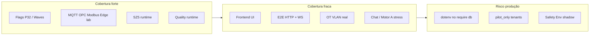

# IMPETUS — Relatório de Aptidão para Uso Industrial (QA Sénior)

**Data:** 2026-05-28  
**Âmbito:** backend canónico (`backend/`), frontend (`frontend/`), scripts operacionais  
**Baseline de governança:** P32 — score **85**, classificação `international_ready` (ver `PROMPT_32_FLAG_GOVERNANCE_CONSOLIDATION.md`)  
**Veredicto QA (chão de fábrica):** **Condicional — apto para piloto industrial controlado**, **não apto** para missão crítica OT sem UAT no site, broker real e gate CI unificado.

**Documentos relacionados:**  
`INDUSTRIAL_FACTORY_FLOOR_READINESS_PLAN.md` · `MASTER_ENTERPRISE_GAP_AUDIT.md` · `ENTERPRISE_OPERATIONAL_MATURITY_SCORE.md`

---

## 1. Resumo executivo

| Dimensão | Nota (0–5) | Síntese |
|----------|------------|---------|
| Cobertura de testes | **3/5** | Muitos cenários de runtime/flags (~312 ficheiros de teste); **sem** runner unificado (Jest/Vitest); frontend quase sem testes |
| Robustez (edge cases) | **3/5** | Suítes OT (MQTT/OPC/Modbus/Edge) e SZ5 fortes em lab; lacunas em HTTP E2E, UI e poluição de `.env` |
| Escalabilidade / falhas | **3/5** | Backpressure, DLQ, soak scripts existem; backbone em `audit`/`observe`; carga multi-tenant não é gate obrigatório |
| Risco em produção | **2,5/5** | `PILOT_ONLY`, brokers `127.0.0.1`, Safety/Environment em shadow, testes frágeis ao `.env` de produção |

**Conclusão:** O código demonstra **maturidade enterprise declarativa** (P32, waves, domínio Quality) e **validação de conectores em laboratório**. A aptidão industrial real depende de: (1) gate de testes determinístico, (2) evidência no tenant da fábrica, (3) promoção governada de flags OT, (4) UAT Safety/Environment.

---

## 2. Metodologia e inventário

### 2.1 Infraestrutura de testes

| Item | Valor |
|------|-------|
| Ficheiros `src/**/*.js` | ~3 317 |
| Ficheiros de teste (`tests/`, `src/tests/`) | ~312 |
| Runner unitário (Jest/Mocha/Vitest) | **Ausente** — padrão `assert()` + `node script.js` |
| Scripts `npm run test:*` em `package.json` | **>150** aliases (sem suíte única `test:all`) |
| Testes frontend | **2** (`PageLoader.test.jsx`, `MetricCard.test.jsx`) |
| Scripts evidência / certificação | ~27 em `scripts/` (`phase37-real-factory-audit.js`, `verify-*`, soak) |

### 2.2 Suítes executadas nesta auditoria (ambiente com `.env` de produção carregado indirectamente)

| Suíte | Comando | Resultado |
|-------|---------|-----------|
| MQTT industrial | `node tests/industrial-mqtt/runMqttTests.js` (ou equivalente no repo) | **16/16** |
| OPC-UA | suíte OPC lab | **16/16** |
| Modbus | suíte Modbus lab | **16/16** |
| Edge | suíte Edge | **6/6** |
| SZ5 | `npm run test:sz5-unified-memory` | **138/138** |
| P32 validação | catálogo / consolidation | **21/21** |
| Enterprise telemetry hardening | `npm run test:enterprise-telemetry-hardening` | **7/7** |
| Wave 2 backbone (P23) | `node src/tests/wave2IndustrialEventBackboneScenarios.js` | **10 passed, 1 failed** (W2.11) |
| Tenant isolation (script dedicado) | `node tests/tenant-isolation/runTenantIsolationSuite.js` | **9 passed, 1 failed** (`audit mode`) |

> **Nota:** `npm run test:tenant-isolation` aponta para `tests/cognitive-runtime/runCognitiveC5Tests.js` — **diferente** do script `runTenantIsolationSuite.js`. Documentar ambos no pipeline.

### 2.3 Causa raiz das falhas observadas (reprodutível)

1. **Tenant isolation — `audit mode`:** O teste define `IMPETUS_RLS_MODE=audit` no topo, mas `require('../../src/tenant-isolation/runtime/tenantRlsRuntime')` puxa `../../db`, que executa `dotenv.config()` e **sobrescreve** com `IMPETUS_RLS_MODE=on` do `.env` de produção **antes** do assert.
2. **Wave 2 — W2.11 `health wave2 section`:** Após o ciclo de `require` do teste, `getIndustrialBackboneHealth().wave2.backbone_mode` reflecte o modo **efectivo pós-dotenv** (`on`), não o `audit` injectado no início do cenário — ou `wave2` fica `{}` se algum sub-módulo W2 falhar no `try/catch` interno do health.

**Implicação industrial:** CI/CD que corre testes **no mesmo host que PM2** com `.env` real terá **falsos negativos/positivos**; é débito de qualidade **D-QA-1** (isolamento de ambiente).

---

## 3. Cobertura de testes e lacunas de lógica

### 3.1 O que está bem coberto

| Área | Evidência | Lacuna residual |
|------|-----------|-----------------|
| Flags / modos shadow→on | Dezenas de `*Scenarios.js`, P32 engine | Drift catálogo vs `.env` legado |
| Conectores OT (lab) | MQTT, OPC-UA, Modbus, Edge — 16+16+16+6 | Sem PLC/VLAN real; `PILOT_ONLY` |
| Event backbone W1–W2 | `wave1/2IndustrialEventBackboneScenarios.js` | Health W2 frágil; replay em `audit`/`shadow` |
| SZ5 memória soberana | `tests/runtime-z-sovereign-sz5/` | Cardinalidade multi-tenant em produção |
| Quality runtime | Múltiplos `test:quality-*` | Safety/Environment não em `ACTIVATION_STAGE=full` |
| Governança enterprise | `test:enterprise-*`, compliance, observability | Pouca asserção sobre **latência** e **SLO** |

### 3.2 Lacunas críticas de lógica (prioridade industrial)

| ID | Lacuna | Impacto em fábrica | Prioridade |
|----|--------|-------------------|------------|
| L1 | **Sem testes E2E HTTP** sistemáticos (login → dashboard → ingest OT) | Regressões de contrato API só descobertas em campo | P0 |
| L2 | **Frontend** (~2 testes) | Cockpit/visibility quebram sem alarme CI | P0 |
| L3 | **Isolamento de tenant** em rotas quentes (`dashboard`, Motor A, `chat.js`) — testes de fuzz existem mas **não são gate** | Risco de vazamento cross-tenant sob carga | P0 |
| L4 | **Poluição `.env`** nos scripts Node | Pipeline não determinístico | P0 |
| L5 | OT **localhost** (`127.0.0.1:1883`, OPC lab URI) | Falso positivo “conector ON” | P1 |
| L6 | **Safety / Environment** publicação shadow | Operador vê dados não autoritativos | P1 |
| L7 | **Motor A / chat** — poucos testes de timeout, payload malformado, LLM indisponível | Paragem de linha se IA bloquear thread | P1 |
| L8 | **Replay massivo** (`IMPETUS_INDUSTRIAL_REPLAY_MODE=audit`) | Reprocessamento perigoso se promovido sem drill | P2 |

### 3.3 Mapa cobertura vs módulos de produção



---

## 4. Robustez — edge cases e dados inesperados

### 4.1 Matriz por subsistema

| Subsistema | Edge cases tratados no código | Testado? | Gap |
|------------|--------------------------------|----------|-----|
| MQTT real runtime | Buffer, DLQ em falha ingest, pilot gate | Sim (lab) | Broker down prolongado, cert inválido, topic flood |
| OPC-UA / Modbus | Reconnect, pilot tenant | Sim (lab) | Clock skew, endianness, scan rate > DB |
| Edge sync | Fila persistida `edge_runtime_queue` | Parcial | Agente offline dias, disco cheio |
| Industrial backbone | Throttle, backpressure `observe`, catalog strict | Sim | Modo `on` + scheduler + arquivo em carga |
| Tenant RLS | Fuzz + attack simulator | Script dedicado (falha env) | `enforce` com queries legadas sem `company_id` |
| Dashboard / charts | Serviços reais `dashboardChartDataService` | Testes de domínio | `company_id` null, timezone, série vazia |
| Chat / IA | Timeouts parciais em serviços consolidados | Fraco | Prompt injection, ficheiro > limite, rate limit |

### 4.2 Dados inesperados — comportamento esperado vs verificar

Executar manualmente ou automatizar:

| Cenário | Entrada | Resultado esperado | Como validar |
|---------|---------|-------------------|--------------|
| Payload MQTT não-JSON | bytes aleatórios | DLQ / drop + métrica; **sem** crash processo | Logs + `GET` health MQTT |
| `company_id` UUID inválido | string `"null"` | 400 ou reject backbone | `wave2` publish test + API |
| Event storm | > cap fila (15k observe) | Backpressure bloqueia ou observa | `scripts/industrial-backbone-pilot-load-test.js` |
| DB indisponível 30s | parar PostgreSQL | Degradação graceful; PM2 restart policy | Soak + chaos |
| Token JWT expirado mid-session | WS | Desconexão limpa | `npm run test:realtime` |
| Duplicado idempotente | mesmo `correlation_id` | Sem duplicar efeito lateral | Teste outbox (adicionar) |

---

## 5. Escalabilidade e tratamento de falhas

### 5.1 Mecanismos presentes (positivo)

- **Backpressure** (`backpressureController`) — modo `observe` por defeito em muitos `.env`.
- **DLQ industrial** + espelho de eventos em falha.
- **Throttle per-tenant** (`IMPETUS_EVENT_THROTTLE_PER_TENANT`).
- **Soak / stress** em `src/tests/enterprise-soak/`:
  - `eventThroughputStressTest.js`
  - `tenantCardinalityExplosionTest.js`
  - `dlqPressureStressTest.js`
  - `replayMassiveStressTest.js`
  - `cognitiveSaturationStressTest.js`
- **Load pilot:** `scripts/industrial-backbone-pilot-load-test.js`
- **PM2** — processo único; escalar = horizontal manual + sticky tenant (não validado automaticamente).

### 5.2 Limites conhecidos para produção industrial

| Limite | Detalhe | Acção |
|--------|---------|-------|
| Backbone `audit` / replay `audit` | Não exercita enforce completo | Drill antes de `MODE=on` |
| `PILOT_ONLY` nos conectores | Só um tenant vê OT real | Expandir lista após UAT |
| Observability export off | Falhas silenciosas em APM externo | Ligar OTEL em piloto |
| Single-node assumptions | Sem teste de split-brain / filas distribuídas | Plano multi-instância Tier 2 |
| Cardinalidade SZ5 | Soak existe; não no gate diário | Incluir no release candidate |

### 5.3 Falhas e recuperação (runbook QA)

1. **Processo Node OOM** — verificar buffers MQTT/edge; correr `dlqPressureStressTest.js`.
2. **Fila outbox crescente** — `getIndustrialBackboneHealth()` + pausar scheduler; replay só em `shadow`.
3. **Conector OT flapping** — confirmar `PILOT_ONLY` não aplica a outros tenants; rever credenciais VLAN.
4. **Score P32 alto com OT down** — normal; score ≠ conectividade planta.

---

## 6. Pontos de vulnerabilidade em produção

| ID | Vulnerabilidade | Severidade | Mitigação recomendada |
|----|-----------------|------------|------------------------|
| V1 | **dotenv** ao importar `db` altera flags mid-test e mid-request em ferramentas ad-hoc | Alta (QA) | `IMPETUS_TEST_ISOLATED=1` + dotenv só em `server.js`; CI com `.env.test` |
| V2 | **RLS / MFA pilot_only** — resto dos tenants sem enforce | Alta (segurança) | Plano expansão tenant fábrica + fuzz gate verde |
| V3 | **Brokers 127.0.0.1** em produção PM2 | Alta (OT) | Variáveis por site; `phase37-real-factory-audit.js` |
| V4 | **Safety/Environment shadow** — UI pode mostrar dados não publicados | Média (operacional) | Banner + `PUBLICATION_SHADOW_MODE` visível |
| V5 | **~244 flags `IMPETUS_*`** — combinação inválida | Média | `npm run validate` P32 antes de deploy |
| V6 | **Chat / upload ficheiros** — superfície CEO/company | Média | Scan tipo MIME, limite tamanho, teste fuzz |
| V7 | **KMS em audit** | Média (compliance) | Promoção para `on` após rotação chaves |
| V8 | **Sem `test:all` no CI** | Alta (processo) | Script agregador abaixo |
| V9 | **Motor A + cognitive flags** — `COGNITIVE_RUNTIME=off` vs aliases `on` | Média | Reconciliar P04 / flag reconciler |
| V10 | **Dependência PostgreSQL** em fuzz RLS | Média | Job CI com serviço PG ou skip explícito |

---

## 7. Veredicto de aptidão industrial

| Cenário | Aptidão | Condições |
|---------|---------|-----------|
| Piloto lab / fábrica digital interna | **Apto** | Brokers lab; tenant piloto; Quality full |
| Piloto em cliente (1 linha, 1 tenant) | **Apto com ressalvas** | UAT 4–8 semanas; `phase37` verde; OT não localhost |
| Produção multi-tenant enterprise | **Não apto ainda** | RLS enforce global; gate CI; soak no release |
| Missão crítica safety interlock | **Não apto** | Safety publication + validação PLC redundante |

---

## 8. Lista de acções (priorizada)

### P0 — Antes de qualquer deploy industrial no cliente

1. Criar **`.env.test`** (audit/shadow fixos) e impedir `dotenv` de sobrescrever quando `NODE_ENV=test` ou `IMPETUS_TEST_ISOLATED=1`.
2. Implementar script **`scripts/run-industrial-qa-gate.sh`** (secção 9) no pipeline.
3. Correr **`phase37-real-factory-audit.js`** contra API + BD do tenant fábrica.
4. Executar **tenant isolation** com env isolado; corrigir assert ou ordem de requires.
5. Validar **visibility API** (`GET /api/dashboard/visibility`) com JWT tenant real.

### P1 — Durante piloto (semanas 1–4 do plano chão de fábrica)

6. Promover conectores com `scripts/promote-industrial-connectors-on.js` **só** após broker real.
7. Correr **load test** backbone + soak DLQ (1h janela maintenance).
8. Expandir `IMPETUS_*_PILOT_TENANTS` para UUID da fábrica.
9. Adicionar smoke **E2E**: `scripts/run-industrial-lab-e2e.js` → evoluir para site.
10. Auditoria **chat/upload** e rate limits Motor A.

### P2 — Endurecimento enterprise

11. `test:all` no CI + relatório JUnit (opcional wrapper).
12. Frontend: testes mínimos rotas cockpit + `ImpetusChart` empty state.
13. Safety/Environment UAT e promoção publication.
14. OTEL export ON em staging.
15. Resolver P04 flag reconciler drift.

---

## 9. Scripts e comandos a executar

### 9.1 Gate mínimo pré-deploy (≈15–25 min, com BD e API up)

```bash
cd /var/www/impetus-completa/backend

# Isolar env de teste (criar ficheiro se não existir)
export IMPETUS_TEST_ISOLATED=1
# Opcional: export $(grep -v '^#' .env.test | xargs) quando existir

# Governança P32
npm run test:prompt-32-validation 2>/dev/null || node src/finalConsolidationAudit/runPrompt32Validation.js

# Backbone e telemetria
node src/tests/wave1IndustrialEventBackboneScenarios.js
node src/tests/wave2IndustrialEventBackboneScenarios.js
npm run test:enterprise-telemetry-hardening

# OT lab (não substitui VLAN)
node tests/industrial-mqtt/runMqttTests.js
node tests/industrial-opcua/runOpcuaTests.js
node tests/industrial-modbus/runModbusTests.js
node tests/industrial-edge/runEdgeTests.js

# Memória / runtime crítico
npm run test:sz5-unified-memory

# Tenant (script correcto — não confundir com test:tenant-isolation do package.json)
IMPETUS_RLS_MODE=audit IMPETUS_TEST_ISOLATED=1 node tests/tenant-isolation/runTenantIsolationSuite.js

# Certificação read-only fábrica (API + BD)
node scripts/phase37-real-factory-audit.js | tee /tmp/phase37-$(date +%Y%m%d).json
```

### 9.2 Gate release candidate (janela maintenance, 1–3 h)

```bash
cd /var/www/impetus-completa/backend

# Soak enterprise
node src/tests/enterprise-soak/runEnterpriseReadiness.js
node src/tests/enterprise-soak/eventThroughputStressTest.js
node src/tests/enterprise-soak/dlqPressureStressTest.js
node src/tests/enterprise-soak/tenantCardinalityExplosionTest.js

# Carga backbone piloto
node scripts/industrial-backbone-pilot-load-test.js

# E2E lab
node scripts/run-industrial-lab-e2e.js

# Evidências (se existirem no branch)
node scripts/verify-industrial-evidence.js 2>/dev/null || true
```

### 9.3 Script agregador sugerido (criar em `scripts/run-industrial-qa-gate.sh`)

```bash
#!/usr/bin/env bash
set -euo pipefail
cd "$(dirname "$0")/.."
export IMPETUS_TEST_ISOLATED=1
FAIL=0
run() { echo "== $1 =="; shift; if "$@"; then echo OK; else echo FAIL; FAIL=1; fi; }
run "P32" node src/finalConsolidationAudit/runPrompt32Validation.js
run "W1 backbone" node src/tests/wave1IndustrialEventBackboneScenarios.js
run "W2 backbone" node src/tests/wave2IndustrialEventBackboneScenarios.js
run "Telemetry hardening" npm run test:enterprise-telemetry-hardening
run "SZ5" npm run test:sz5-unified-memory
run "MQTT" node tests/industrial-mqtt/runMqttTests.js
run "OPC" node tests/industrial-opcua/runOpcuaTests.js
run "Modbus" node tests/industrial-modbus/runModbusTests.js
run "Edge" node tests/industrial-edge/runEdgeTests.js
exit $FAIL
```

### 9.4 Cronograma QA sugerido (alinhar ao plano 8 semanas)

| Semana | Foco | Scripts principais |
|--------|------|-------------------|
| S0 | Baseline verde em CI | Gate 9.1 diário |
| S1 | Broker real + 1 PLC | `run-industrial-lab-e2e` + logs MQTT |
| S2 | Tenant fábrica + RLS | `runTenantIsolationSuite` + fuzz com PG |
| S3 | Carga | `industrial-backbone-pilot-load-test` + soak DLQ |
| S4 | Operadores | UAT manual + `phase37-real-factory-audit` |
| S5–S8 | Aceitação 90d | Repetir gate + métricas OTEL |

### 9.5 Referência rápida `npm run` (amostra — ver `package.json` completo)

| Comando | Uso |
|---------|-----|
| `npm run test:enterprise-telemetry-hardening` | Hardening telemetria |
| `npm run test:sz5-unified-memory` | SZ5 |
| `npm run test:wave1-industrial-event-backbone` | Backbone W1 |
| `npm run test:realtime` | WebSocket |
| `npm run test:quality-runtime-validation` | Quality industrial |
| `npm run test:enterprise-operational-continuity` | Continuidade |

---

## 10. Critérios de aceitação QA (industrial)

Considerar **apto para uso industrial autoritativo** quando **todos** forem verdadeiros:

1. Gate 9.1 **100% verde** em CI com `.env.test` (sem depender do `.env` PM2).
2. `phase37-real-factory-audit.js` sem tabelas críticas vazias no tenant fábrica.
3. Pelo menos **7 dias** de ingest OT real (não localhost) sem DLQ runaway.
4. Tenant isolation fuzz **ok** com RLS `audit` → `on` planeado e documentado.
5. UAT Safety/Environment assinado ou permanecem **shadow** com UI bloqueada.
6. Operadores validaram cockpit + chat em turno real.

---

## 11. Registo de evidências desta auditoria

- Inventário testes: ~312 ficheiros / ~3317 módulos `src`
- Falhas reproduzidas: W2.11 (health backbone pós-dotenv); tenant `audit mode` (require `db` → `on`)
- Score P32 **85** não substitui critérios da secção 10

**Próximo artefacto recomendado:** `scripts/run-industrial-qa-gate.sh` versionado + job CI; opcional correção de isolamento em `src/db` (fora do âmbito deste relatório, salvo pedido explícito).

---

*Relatório gerado por auditoria QA estática + execução de suítes no host de desenvolvimento. Reexecutar após alterações em `.env`, conectores OT ou PROMPT 32.*

---

## Anexo A — Operational Truth (activação Vertente, 03/06/2026)

**Objectivo:** Ligar este relatório (QA chão de fábrica, 28/05) ao pacote Truth sem substituí-lo.

| Tema QA industrial (28/05) | Após Truth 03/06 | Leitura conjunta |
|----------------------------|------------------|------------------|
| Piloto condicional, OT localhost | Sem mudança | QA continua a reger OT/broker/tenant |
| Safety/Environment `ACTIVATION_STAGE=shadow` | Sem mudança | Truth **não** promove Safety a full |
| Gate CI / dotenv nos testes | Sem mudança | |
| Integridade respostas IA (OEE inventado) | **Nova camada:** enforce + block + voz oral + C2 off | Complementa QA; ver `RELATORIO_EXECUTIVO_WELLIGTON_TRUTH_2026-06-03.md` |
| Certificação 100% industrial | Truth melhora **confiança IA**, não OT real | Critérios secção 10 **não** todos ✓ |

### Flags Truth confirmadas (`.env` + override)

- `IMPETUS_INDUSTRIAL_TRUTH_MODE=enforce`
- `IMPETUS_HALLUCINATION_BLOCK=on`
- `IMPETUS_C2_SYNTHETIC_EVENTS_WHEN_SPARSE=off`
- `IMPETUS_VOICE_TRUTH_ORAL_ENFORCE=true`

### Risco operacional (não Truth)

- **PM2 `impetus-backend`:** ~348 restarts históricos — investigar logs antes de piloto 24/7 (não contradiz activação Truth).

### Documentos Truth relacionados

| Documento | Uso |
|-----------|-----|
| `RELATORIO_EXECUTIVO_WELLIGTON_TRUTH_2026-06-03.md` | Resumo CEO |
| `TRUTH_GAP_REPORT.md` | GAPs + addendum 03/06 |
| `COGNITIVE_OBSERVABILITY_REPORT.md` | Métricas Etapa 6 (255 assessments, 955 traces/30d, 202 com truth) |
| `ANAM_REALTIME_TRUTH_AUDIT.md` | Etapa 4 (actualizar vs oral enforce) |

### Pendente transversal (P0)

1. `GEMINI_API_KEY` válida + `pm2 restart impetus-backend --update-env`
2. Teste campo CEO: OEE sem dados → correcção oral Anam
3. Fase 2 código: Claude Panel, ManuIA live (canais HIGH no gap report)
