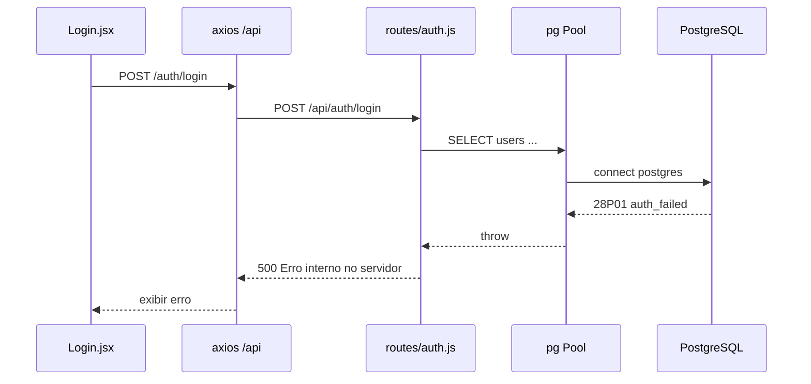

# LOGIN_FORENSIC_01

**FASE:** LOGIN-FORENSIC-01  
**Modo:** READ ONLY absoluto  
**Data:** 2026-06-04  
**Contexto:** Mensagem *"Erro interno no servidor"* na tela de login após **GIT-RECOVERY-03** (reload PM2 ~15:46 UTC).

---

## Etapa 1 — Rota do formulário de login

| Campo | Valor |
|-------|--------|
| **Frontend** | `frontend/src/pages/Login.jsx` → `auth.login(email, password)` |
| **Cliente HTTP** | `frontend/src/services/api.js` → `api.post('/auth/login', { email, password })` |
| **Base URL** | `API_URL` = `normalizeApiBase(VITE_API_URL)` → em produção local: proxy `/api` ou host `:4000/api` |
| **Endpoint completo** | `POST /api/auth/login` |
| **Método HTTP** | `POST` |
| **Montagem no servidor** | `backend/src/server.js` → `useRoute('/api/auth', './routes/auth')` |
| **Handler** | `backend/src/routes/auth.js` — `router.post('/login', …)` (linha 18) |
| **Middleware JWT** | `backend/src/middleware/auth.js` (usado após login; não no POST inicial) |
| **BD** | `require('../db')` → `backend/src/db/index.js` (pool PostgreSQL) |
| **“Controller” dedicado** | Não existe ficheiro separado; lógica inline na rota `auth.js` |

Mensagem genérica **500** no frontend vem de `err.response?.data?.error` quando o backend devolve:

```json
{ "error": "Erro interno no servidor" }
```

(definido no `catch` global do handler de login, `auth.js` ~200–202).

---

## Etapa 2 — Teste controlado (curl)

```bash
curl -sS -X POST http://127.0.0.1:4000/api/auth/login \
  -H "Content-Type: application/json" \
  -d '{"email":"forensic@test.local","password":"x"}'
```

| Campo | Resultado |
|-------|-----------|
| **HTTP status** | **500** |
| **Payload (corpo)** | `{"error":"Erro interno no servidor"}` |
| **Stack trace na resposta** | **Não** (erro mascarado pelo handler) |
| **Stack trace nos logs** | **Sim** — ver Etapa 3 |

**Nota:** Porta **3001** recusou conexão; backend PM2 escuta em **4000** (`server.js` / logs: `http://0.0.0.0:4000`).

---

## Etapa 3 — Logs PM2 (`impetus-backend`, ~200 linhas)

Padrão dominante após reload GIT-RECOVERY-03:

| Padrão | Observado |
|--------|-----------|
| `[LOGIN_ERROR]` | **Sim** — repetido |
| `password authentication failed for user "postgres"` | **Sim** |
| Código PostgreSQL **`28P01`** | **Sim** (FATAL, `routine: auth_failed`) |
| Stack | `pg-pool` → `auth.js:26` (`db.query` do SELECT de utilizador) |
| `[EDGE_INGEST]`, `[REMINDER]`, boots | Mesmo erro 28P01 |
| `/api/system/health/deep` | `ready: false`, issue **`DB_CONNECT`** crítico |
| `ReferenceError` / `Cannot find module` no login | **Não** (nesta amostra) |
| JWT / TypeError no login | **Não** — falha antes do `jwt.sign` |

**Primeiros `[LOGIN_ERROR]`** no `impetus-backend-error.log` aparecem **na mesma janela** dos erros `DB_CONNECT` / boots pós-reload (após linhas de arranque com rotas recarregadas do disco restaurado).

---

## Etapa 4 — Integridade dos ficheiros de autenticação

| Ficheiro | Disco | Git HEAD | `git diff HEAD` |
|----------|-------|----------|-----------------|
| `backend/src/routes/auth.js` | **EXISTE** | tracked | **0 linhas** |
| `backend/src/middleware/auth.js` | **EXISTE** | tracked | **0 linhas** |
| `backend/src/db/index.js` | **EXISTE** | tracked | **0 linhas** |
| `backend/src/db.js` | N/A | não existe no repo | módulo canónico é **`db/index.js`** |

**Conclusão:** Rotas e middleware de auth **alinhados com HEAD**; **não** há regressão de código de login por `git checkout` da recovery.

**Ficheiro operacional ausente (não versionado):**

| Path | Estado |
|------|--------|
| `backend/.env` | **AUSENTE** no disco |
| `backend/.env.bkp.20260508_185602` | **EXISTE** (backup local) |
| `backend/.env.example` | **D** vs HEAD (doc exemplo; não é runtime) |

---

## Etapa 5 — Variáveis de ambiente (sem segredos)

Legenda: **PRESENTE** = chave definida e não vazia; **AUSENTE** = não definida no scope indicado.

### `backend/.env` (disco)

| Grupo | Estado |
|-------|--------|
| JWT_SECRET | **AUSENTE** (ficheiro não existe) |
| SESSION_SECRET | **AUSENTE** |
| DATABASE | **AUSENTE** |
| SUPABASE | **AUSENTE** |
| OPENAI | **AUSENTE** |
| GOOGLE | **AUSENTE** |

### `backend/.env.bkp.20260508_185602` (backup — só presença)

| Grupo | Estado |
|-------|--------|
| JWT_SECRET | **PRESENTE** |
| SESSION_SECRET | **AUSENTE** |
| DATABASE | **PRESENTE** |
| SUPABASE | **AUSENTE** |
| OPENAI | **PRESENTE** |
| GOOGLE | **AUSENTE** |

### Processo PM2 `impetus-backend` (runtime atual)

| Grupo | Estado |
|-------|--------|
| JWT_SECRET | **PRESENTE** |
| SESSION_SECRET | **AUSENTE** |
| DATABASE (`DB_HOST`, `DB_USER`, `DB_NAME`, `DB_PASSWORD`, …) | **PRESENTE** |
| SUPABASE | **AUSENTE** |
| OPENAI | **PRESENTE** |
| GOOGLE (chaves `GOOGLE_TTS_*`, voz, etc.) | **PRESENTE** (config TTS; não implica credencial GCP ficheiro) |

### Prova controlada (READ ONLY, sem expor valores)

| Configuração | Resultado `SELECT 1` |
|--------------|----------------------|
| Credenciais do **backup** `.env.bkp.20260508_185602` | **OK** (`BKP_CONNECT 1`) |
| Credenciais **PM2** (`DB_*` atuais) | **FALHA** (`28P01`) |

O pool em `db/index.js` carrega `dotenv` de `backend/.env` com `override: true`; com `.env` ausente, prevalecem variáveis **injectadas pelo PM2**, cuja password de `postgres` **não coincide** com a password real do PostgreSQL.

---

## Respostas obrigatórias

### 1. Qual endpoint falha?

**`POST /api/auth/login`** (montado em `/api/auth` + rota `/login`).

### 2. Qual erro exato ocorre?

- **Cliente:** HTTP **500**, body `{ "error": "Erro interno no servidor" }`.
- **Servidor (log):** `error: password authentication failed for user "postgres"` — código PostgreSQL **`28P01`** na primeira query do login (`auth.js:26`, tabela `users`).
- **Não** é falha de JWT, MFA, bcrypt nem utilizador inexistente (a query nem completa).

### 3. O erro começou após o GIT_RECOVERY?

**Sim, correlacionável.**

- GIT-RECOVERY-03 executou `pm2 reload impetus-backend --update-env` (~**2026-06-04T15:46:12Z**).
- Antes do reload, o processo antigo podia ter credenciais corretas em memória e/ou via `.env` que existia no disco.
- Após reload: `.env` **ausente** + PM2 com `DB_PASSWORD` **inválida** → erros `28P01` imediatos em boots, crons e **`[LOGIN_ERROR]`**.
- `/health` simples continuou **200** (não exige BD); login e `/api/system/health/deep` falham por BD.

O commit `7ea6cb2b8` / restore de `backend/src` **não** alterou `auth.js`; a causa é **runtime/env/BD**, não diff de código de login.

### 4. Existe arquivo ausente?

| Tipo | Resposta |
|------|----------|
| Código auth no Git | **Não** — ficheiros presentes e iguais a HEAD |
| **Operacional crítico** | **Sim** — `backend/.env` **ausente** no disco |
| Módulo `db.js` na raiz | Não aplicável — usar `backend/src/db/index.js` |

### 5. Existe variável ausente?

- No **disco**: `.env` inteiro **ausente** → todos os grupos listados como AUSENTE no ficheiro.
- No **PM2**: variáveis DATABASE **presentes**, mas **valor de `DB_PASSWORD` incorreto** face ao PostgreSQL (evidência 28P01 + teste backup OK / PM2 FAIL).
- **SESSION_SECRET** e **SUPABASE**: ausentes no PM2 (não são a causa directa deste 500 de login).

### 6. Qual a correção recomendada?

1. **Restaurar `backend/.env`** a partir de backup validado (ex.: `.env.bkp.20260508_185602`) **ou** alinhar `DB_PASSWORD` / `DATABASE_URL` no ecosystem PM2 com a password real do role `postgres` em `impetus_db`.
2. **`pm2 reload impetus-backend --update-env`** (fora desta fase forense) após `.env` correcto.
3. Validar: `curl -X POST …/api/auth/login` (credenciais reais) → **200** com `token`; `curl /api/system/health/deep` → `ready: true` sem `DB_CONNECT`.
4. **Não** commitar `.env`; garantir que está em `.gitignore`.
5. Opcional endurecimento: em falha `28P01` no login, devolver **503** com código `DB_UNAVAILABLE` em vez de 500 genérico (alteração de código — fora do scope READ ONLY).

### 7. Classificação

| Veredito | **CRITICAL** |
|----------|----------------|
| Motivo | Autenticação bloqueada por falha de conexão PostgreSQL; impacto total em login e serviços dependentes de BD |
| SAFE | Código auth vs HEAD, endpoint mapeado, handler existe |
| WARNING | `.env` ausente, SESSION_SECRET/SUPABASE ausentes no PM2, `/health` superficial verde enquanto deep health falha |

---

## Veredito final

| Item | Valor |
|------|--------|
| **Causa raiz** | Desalinhamento de credenciais PostgreSQL no runtime pós-reload (**PM2 `DB_PASSWORD` inválida** + **`backend/.env` ausente**). |
| **Sintoma UI** | `"Erro interno no servidor"` (= catch 500 em `auth.js`). |
| **Relação GIT_RECOVERY** | **Directa** (reload + perda/uso incorrecto de env); **não** por regressão de ficheiros `auth.js`. |
| **Classificação global** | **CRITICAL** |

---

## Anexo — Fluxo resumido



---

*Relatório gerado em modo forense READ ONLY. Nenhum código, `.env`, git destrutivo ou PM2 foi alterado durante esta fase.*
