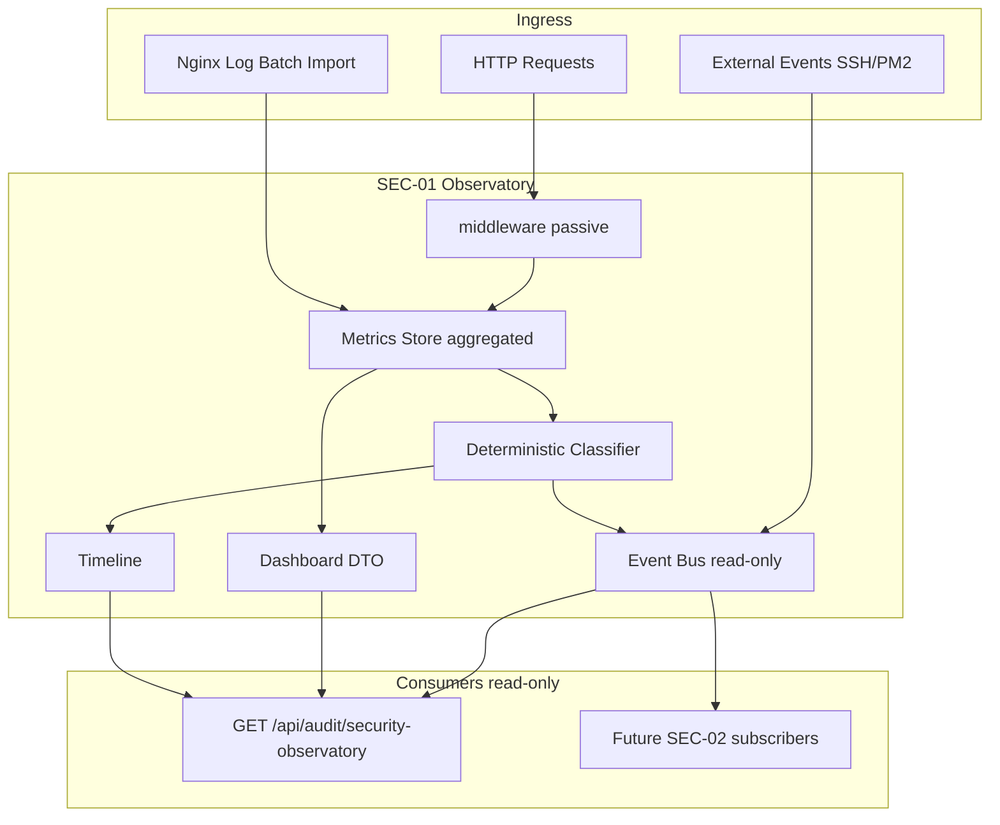

# SEC-01 — Arquitectura Enterprise Security Observatory

## Princípios

1. **Observational only** — consumidores read-only
2. **Aggregated events** — janelas temporais, não request bruto
3. **Deterministic classification** — regras, zero IA generativa
4. **Opt-in** — `SECURITY_OBSERVATORY=false`
5. **No interference** — middleware pass-through, sem block/limit auto

---

## Diagrama

---

## Fluxo HTTP

1. Request entra → middleware regista sample em metrics (se flag ON)
2. A cada `SECURITY_OBSERVATORY_WINDOW_MS` → flush buckets
3. Classifier atribui `classification` + `event_type`
4. Event Bus publica DTO agregado
5. Timeline regista marco se actividade relevante

---

## Isolamento

| Sistema | Alterado? |
|---------|-----------|
| Event Governance | ❌ |
| Cognitive Core | ❌ |
| ECO | ❌ |
| Enterprise Baseline | ❌ |
| Business routes | ❌ |

Única integração: middleware passivo + boot opt-in + audit route.

---

## Storage

**In-memory only** na SEC-01. Persistência = fases SEC-02+.

Limites configuráveis:
- `SECURITY_OBSERVATORY_MAX_BUCKETS`
- `SECURITY_OBSERVATORY_MAX_TIMELINE`
