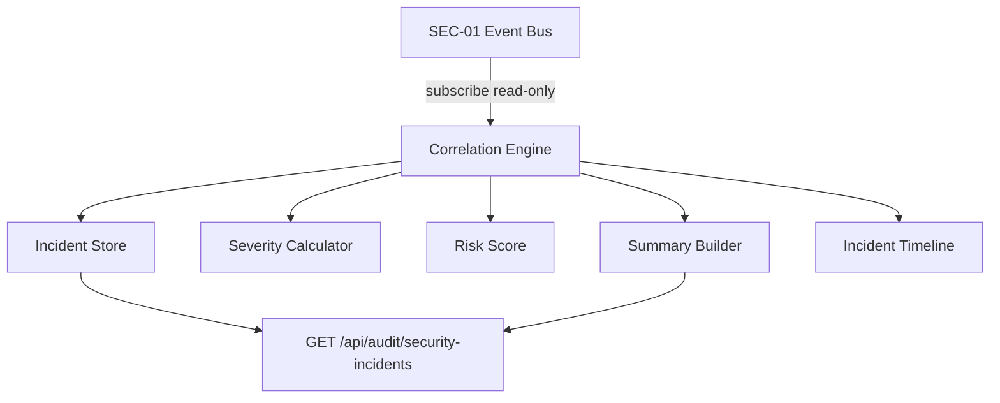

# SEC-02 — Arquitectura

## Princípios

1. Eventos originais **nunca alterados**
2. Evidence = referências (`eventId`)
3. Agrupamento por IP + janela temporal + classificação
4. Determinístico — zero ML/IA generativa
5. In-memory — persistência em SEC-03+

## Chaves de correlação

| Prioridade | Regra |
|------------|-------|
| 1 | Mesmo `source_ip` + incidente OPEN + janela 4h |
| 2 | Mesmo UA + mesma classification + overlap temporal |
