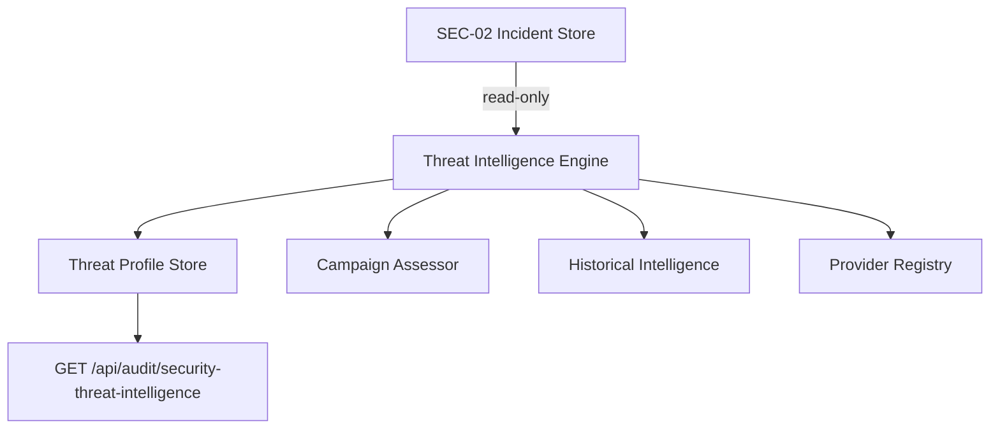

# SEC-03 — Arquitectura

## Princípios

1. **Nunca altera** Incident DTO SEC-02
2. Threat Profile separado, ligado por `incidentId`
3. Determinístico — regras internas IMPETUS
4. Hipóteses com níveis: Confirmed / Likely / Possible / Unknown
5. Provider registry heurístico (AWS, Vultr, DO, GCP, Azure) — sem API externa

## Bootstrap

SEC-03 faz backfill do SEC-02 store + subscrição read-only ao Event Bus SEC-01 (poll 60s).
