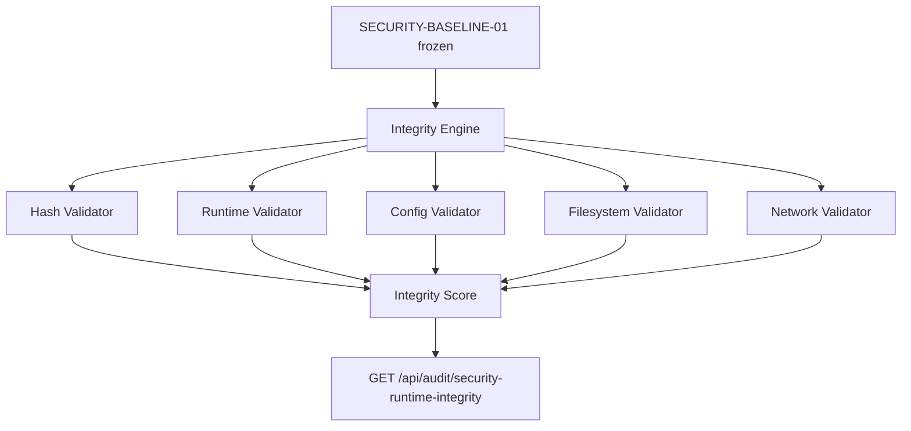

# SEC-04 — Arquitectura

## Princípios

1. Read-only — nunca modifica ficheiros, processos ou config
2. Baseline SECURITY-BASELINE-01 imutável
3. Determinístico — score 0.0–1.0 por regras
4. Poll periódico + check inicial no boot
5. Sem auditd, fail2ban, kill, restart automático
