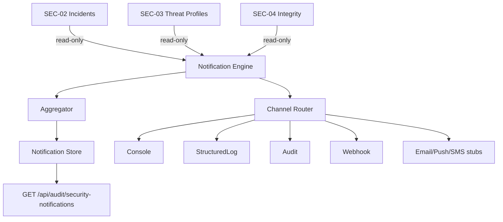

# SEC-05 — Arquitectura

## Princípios

1. Notificação only — nunca bloqueia, reinicia ou remedia
2. Não altera SEC-01→SEC-04
3. Deduplicação determinística por incidentId
4. Adapters externos desacoplados para Wellington/Gustavo (futuro)
