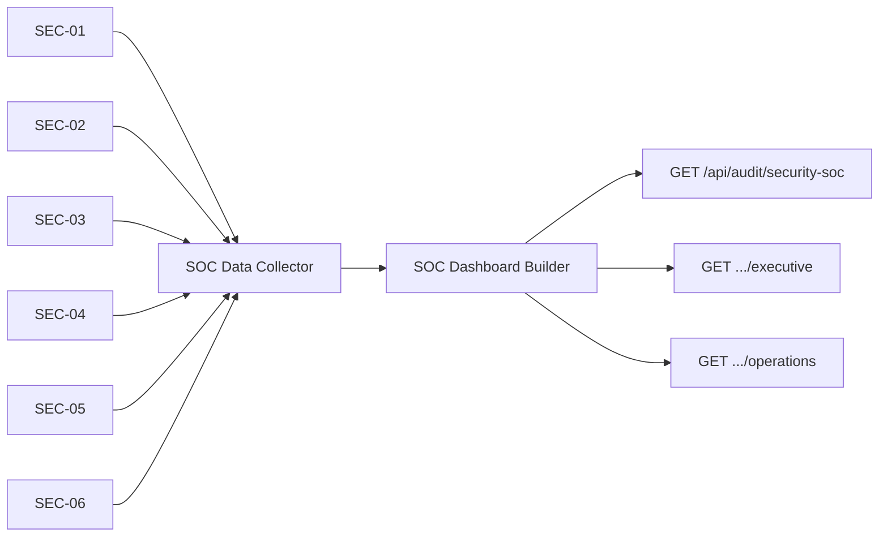

# SEC-07 — Arquitectura

```mermaid
flowchart LR
  S1[SEC-01] --> COL[SOC Data Collector]
  S2[SEC-02] --> COL
  S3[SEC-03] --> COL
  S4[SEC-04] --> COL
  S5[SEC-05] --> COL
  S6[SEC-06] --> COL
  COL --> BUILD[SOC Dashboard Builder]
  BUILD --> AUDIT[GET /api/audit/security-soc]
  BUILD --> EXEC[GET .../executive]
  BUILD --> OPS[GET .../operations]
```

Read-only em toda a cadeia. Cache TTL configurável (30s default).
