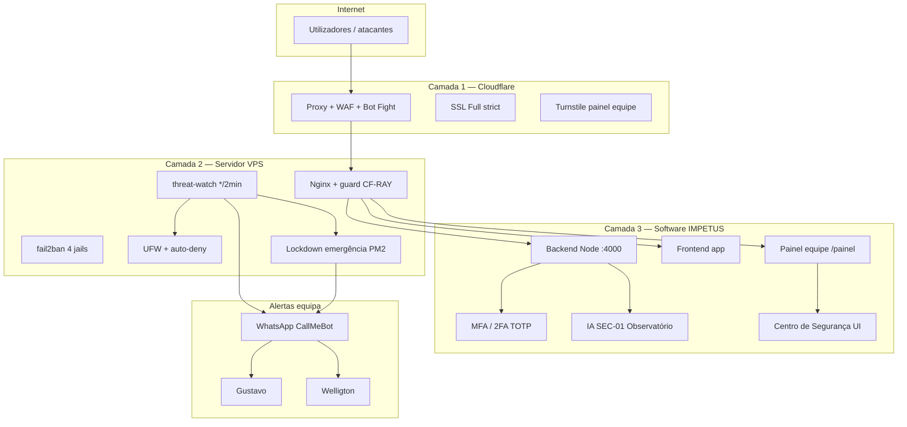

# Segurança IMPETUS — Plataforma Completa

**Documento:** visão executiva + técnica da pilha de segurança  
**Data:** 06 de julho de 2026  
**Domínio produção:** `https://plataformaimpetus.com`  
**Servidor:** VPS Hostinger `72.61.221.152` (legado: `srv1422313.hstgr.cloud`)  
**Equipa alertas:** Gustavo · Welligton  

---

## 1. Resumo executivo

O IMPETUS passou de uma proteção **sólida no servidor** (nginx, fail2ban, JWT) para uma arquitectura **defesa em profundidade em três planos**:

| Plano | O quê | Estado |
|-------|--------|--------|
| **Rede** | Cloudflare (proxy, SSL strict, Bot Fight, Turnstile) | ✅ Activo |
| **Servidor** | UFW, fail2ban, threat-watch, lockdown automático | ✅ Activo |
| **Software** | MFA/2FA, Turnstile painel, IA observatório SEC-01…21 | ✅ Ligado (2FA por conta pendente) |

**Princípio:** detectar cedo → bloquear IP → alertar só o sério → **tirar software do ar** se houver sinais de invasão multi-camada.

---

## 2. Como era antes (baseline)

### 2.1 O que já existia

| Componente | Situação anterior |
|------------|-------------------|
| **HTTPS** | Let's Encrypt no hostname Hostinger (`srv1422313.hstgr.cloud`) |
| **Nginx** | Rate limit, bloqueio paths scanner (`.env`, `.git`), headers segurança |
| **JWT** | App cliente + JWT **separado** painel equipe (`IMPETUS_ADMIN_JWT_SECRET`) |
| **fail2ban** | Jails nginx-scan, sshd, rate limit |
| **UFW** | Firewall com IPs de confiança da equipa |
| **RBAC** | Perfis admin, tenant admin, guards no frontend |
| **MFA (código)** | Implementado no backend mas **desligado** (`IMPETUS_MFA_ENABLED=false`) |
| **Cloudflare** | Config preparada; tráfego ia **directo ao IP** (sem proxy) |
| **Alertas WhatsApp** | threat-watch básico; muitos alertas MEDIUM (ruído) |
| **IA segurança** | Módulos SEC-01…21 no código; modo **observe** / dry-run |

### 2.2 Lacunas que motivaram o reforço (jul/2026)

- Domínio próprio sem WAF na frente  
- MFA não activo para a equipa  
- Painel equipe sem captcha Turnstile  
- Alertas WhatsApp excessivos (bots, 404 flood)  
- Sem **kill switch** automático em invasão grave  
- Sem painel visual de segurança para a equipa  

---

## 3. Arquitectura actual — defesa em profundidade



### 3.1 Separação de planos (não confundir)

| Plano | Quem entra | Onde | Tabela / auth |
|-------|------------|------|----------------|
| **Cliente (tenant)** | Empresas, operadores | `plataformaimpetus.com` | `users` + JWT app |
| **Equipa IMPETUS** | Comercial, suporte, super admin | `/painel/` | `admin_users` + JWT admin |
| **Infra** | Bots, scanners | Bloqueados antes da app | UFW / fail2ban / CF |

Não há partilha de sessão entre app cliente e painel equipe.

---

## 4. Camada 1 — Cloudflare (rede)

| Item | Configuração | Estado |
|------|--------------|--------|
| DNS **A** `@` | `72.61.221.152` Proxied | ✅ |
| DNS **CNAME** `www` | `plataformaimpetus.com` Proxied | ✅ |
| SSL/TLS | **Full (strict)** / Completo Rigoroso | ✅ |
| Bot Fight Mode | ON | ✅ |
| Turnstile widget | `plataformaimpetus.com` + `www` | ✅ |
| Real IP nginx | `cloudflare-real-ip.conf` | ✅ |
| **Guard anti-bypass** | Só `plataformaimpetus.com` exige CF-RAY; `hstgr.cloud` mantém-se | ✅ |

**Certificado origem:** Let's Encrypt `plataformaimpetus.com` + `www` (válido até out/2026).

**URLs canónicas:**

| Serviço | URL |
|---------|-----|
| App cliente | https://plataformaimpetus.com |
| Painel equipe | https://plataformaimpetus.com/painel/ |
| Legado | https://srv1422313.hstgr.cloud |

---

## 5. Camada 2 — Servidor (VPS)

### 5.1 fail2ban (4 jails)

| Jail | Função |
|------|--------|
| `sshd` | Força bruta SSH |
| `impetus-nginx-scan` | Paths scanner no nginx |
| `nginx-limit-req` | Rate limit excedido |
| `impetus-auth-fail` | Falhas login API/painel |

### 5.2 threat-watch (cron */2 min)

**Script:** `/usr/local/bin/impetus-threat-watch.sh`  
**Config:** `/etc/impetus/threat-watch.env` (chmod 600)  
**Log:** `/var/log/impetus-threat-watch.log`  
**Incidentes:** `/var/lib/impetus/incidents/latest.json`

| Comportamento | Detalhe |
|---------------|---------|
| Auto-ban UFW | IP malicioso → `ufw deny` |
| WhatsApp | **Só HIGH e CRITICAL** (não MEDIUM) |
| Cooldown WhatsApp | 1 hora entre digests |
| 404 flood | Bane IP; alerta só se ≥ 50 pedidos |
| POST /graphql ruído | **Desligado** (não notifica) |
| IPs equipa | Nunca banidos (CIDRs confiança) |

**Alertas WhatsApp sérios (exemplos):**

- Probe `.env` / `.git` / `wp-admin`  
- Scanner UA (nikto, sqlmap, etc.)  
- SSH brute force (CRÍTICO — aviso imediato)  

### 5.3 Lockdown automático — Fase 2 (jul/2026)

**Activado:** `IMPETUS_AUTO_LOCKDOWN_ENABLED=true`

Se o sistema detectar **invasão multi-camada**, executa **na hora**:

1. `pm2 stop impetus-backend impetus-frontend impetus-admin-portal`  
2. WhatsApp para Gustavo + Welligton: **“IMPETUS FORA DO AR”**  
3. Estado gravado em `/var/lib/impetus/lockdown/active.json`  

**Gatilhos de lockdown:**

| Código | Situação |
|--------|----------|
| `INVASION_SENSITIVE_200` | HTTP **200** em path sensível (`.env`, `.git`, etc.) |
| `AUTH_SUCCESS_AFTER_BREACH` | Login **200** após probes/scanners no **mesmo IP** |
| `ADMIN_LOGIN_AFTER_FAILS` | Login painel OK após falhas no **mesmo IP** |
| `MULTI_LAYER_BREACH` | ≥ 2 camadas de ataque no mesmo IP em 15 min |
| `DISTRIBUTED_MULTI_LAYER` | SSH crítico + vários IPs em probes simultâneos |

**Restaurar software:**

```bash
sudo bash /var/www/impetus-completa/infra/scripts/impetus-emergency-restore.sh
```

Envia WhatsApp: *“IMPETUS ONLINE — Software restaurado após lockdown”*.

**Scripts:**

| Script | Função |
|--------|--------|
| `infra/scripts/impetus-emergency-lockdown.sh` | Para PM2 + WhatsApp |
| `infra/scripts/impetus-emergency-restore.sh` | Religa PM2 + WhatsApp |
| `infra/scripts/impetus-breach-lockdown-engine.sh` | Motor multi-camada |
| `infra/scripts/impetus-threat-watch.sh` | Detecção contínua |
| `infra/scripts/impetus-security-observatory-ingest.sh` | Alimenta IA (cron */5) |
| `infra/scripts/impetus-security-stack-verify.sh` | Verificação pilha |

---

## 6. Camada 3 — Software (dentro do IMPETUS)

### 6.1 Autenticação e 2FA (MFA)

| Flag | Valor |
|------|-------|
| `IMPETUS_MFA_ENABLED` | `true` |
| `IMPETUS_MFA_MODE` | `on` |
| `IMPETUS_ADMIN_PORTAL_MFA_ENABLED` | `true` |
| WebAuthn RP | `plataformaimpetus.com` |

**Enrolamento 2FA (pendente por conta):**

| Onde | Caminho |
|------|---------|
| App cliente | Configurações → Segurança (`/app/settings`) |
| Painel equipe | Menu **2FA da conta** (`/painel/conta-seguranca`) |

Contas piloto equipa: `impetusvrb@yahoo.com`, `wellfreitasmachado@gmail.com`, `admin@impetus.local`, `gsutavovrb29@gmail.com`, `gustavovrb@outlook.com`.

### 6.2 Dispositivos e IPs autorizados (painel equipe)

**URL:** https://plataformaimpetus.com/painel/dispositivos-autorizados  
**Acesso:** listagem todos; aprovação `super_admin`  
**Flags:** `IMPETUS_ADMIN_DEVICE_TRUST_ENABLED=true`, `IMPETUS_ADMIN_DEVICE_TRUST_MODE=enforce`

| Camada | Regra |
|--------|--------|
| **IP / rede** | Prefixos globais equipa (`186.225.*`, `2804:2980:*`, etc.) em `admin_trusted_ips` |
| **Dispositivo** | ID único no browser — primeiro login cria pedido `pending` |
| **Aprovação** | Super admin aprova em **Dispositivos autorizados** |
| **Lockdown** | IPs equipa **não** disparam lockdown por falha de senha (≥3 falhas + IP não equipa) |

Fluxo Welligton celular: login → pendente → Gustavo aprova → segundo login OK.

### 6.3 Turnstile (anti-robô painel equipe)

- Widget Cloudflare no login `/painel/login`  
- Chaves em `backend/.env` (`ADMIN_PORTAL_TURNSTILE_*`)  
- App cliente **não** usa Turnstile (só painel interno)  

### 6.4 Centro de Segurança (UI equipa)

**URL:** https://plataformaimpetus.com/painel/seguranca  
**Acesso:** `super_admin`  
**API:** `GET /api/impetus-admin/security-dashboard`  

Mostra em tempo real (refresh 30 s):

- IPs bloqueados (UFW + fail2ban) e país de origem  
- Logins falhados painel  
- Gráficos ataques hora/dia (threat-watch)  
- Eventos críticos  
- Status SSL, Cloudflare, Turnstile, MFA, IA  
- Detecções observatório SEC-01  

### 6.5 IA de segurança interna (SEC-01…21)

Módulos enterprise no backend (`SECURITY_OBSERVATORY=true`, etc.):

| Modo actual | Significado |
|-------------|-------------|
| `SECURITY_PROTECTION_MODE=observe` | Observa, não bloqueia utilizadores |
| `SECURITY_DRY_RUN_ONLY=true` | Sem acções destrutivas automáticas na app |
| `SECURITY_RESPONSE_DEFAULT_MODE=advise` | Recomendações, não execução |

A IA **correlaciona** eventos HTTP, classifica padrões (scanner, enumeração, probe) e alimenta o Centro de Segurança. O **lockdown PM2** é independente e mais agressivo — activo na infra.

---

## 7. O que foi implementado em 06/07/2026

| # | Entrega |
|---|---------|
| 1 | Domínio `plataformaimpetus.com` + DNS Cloudflare (`@` + `www`) |
| 2 | Certificado Let's Encrypt raiz + www |
| 3 | Guard nginx — bloqueio acesso directo ao IP no domínio novo |
| 4 | UFW — permitir ranges Cloudflare |
| 5 | Turnstile painel equipe (2 hostnames) |
| 6 | MFA/2FA ligado no `.env` + UI enrolamento painel |
| 7 | Centro de Segurança (`SecurityDashboard.jsx` + API) |
| 8 | Relatório fail2ban 30 dias |
| 9 | WhatsApp threat-watch — só alertas **sérios** (HIGH+) |
| 10 | **Lockdown automático Fase 2** — software offline em invasão crítica |
| 11 | Cron observatório nginx → IA SEC-01 |
| 12 | Script verificação pilha (`STACK_SEGURANCA_STATUS.md`) |
| 13 | **Fase A** — Score 1000, Risk L0–3, Attack Graph, auto-audit |
| 14 | **Fase B** — Mapa mundial, SEC-02/03, playbooks, fila hardening |
| 15 | **Fase C** — Gêmeo digital, simulador SEC-19, vault, promoção assist |
| 16 | **Dispositivos + IPs autorizados** — painel equipa |
| 17 | `IMPETUS_ADMIN_JWT_SECRET` dedicado (JWT painel isolado do app) |

---

## 8. Matriz de resposta a incidentes

| Severidade | Exemplo | UFW ban | WhatsApp | Lockdown PM2 |
|------------|---------|---------|----------|--------------|
| **LOW** | Health check, ruído | Não | Não | Não |
| **MEDIUM** | 404 flood, scans leves | Sim | Não | Não |
| **HIGH** | Probe `.env`, scanner UA | Sim | Sim (digest) | Não* |
| **CRITICAL** | SSH brute, invasão 200 | Sim | Sim (imediato) | Sim** |

\* HIGH sozinho não desliga o software.  
\*\* Lockdown se multi-camada ou invasão confirmada (ver secção 5.3).

---

## 9. Operação diária — comandos úteis

```bash
# Verificar pilha completa
bash /var/www/impetus-completa/infra/scripts/impetus-security-stack-verify.sh

# Estado fail2ban
sudo fail2ban-client status

# Últimos alertas
tail -50 /var/log/impetus-threat-watch.log

# Software offline por lockdown?
cat /var/lib/impetus/lockdown/active.json 2>/dev/null || echo "Sem lockdown activo"

# Restaurar após lockdown
sudo bash /var/www/impetus-completa/infra/scripts/impetus-emergency-restore.sh

# PM2 manual (manutenção)
pm2 stop impetus-backend impetus-frontend impetus-admin-portal
pm2 start impetus-backend impetus-frontend impetus-admin-portal --update-env
```

---

## 10. Fecho de segurança — checklist

### Feito (técnico)

| Item | Estado |
|------|--------|
| Cloudflare + SSL + Turnstile + fail2ban + UFW | ✅ |
| Lockdown automático (com excepção IPs equipa) | ✅ |
| Centro de Segurança Fases A/B/C | ✅ |
| Dispositivos + IPs autorizados | ✅ |
| JWT dedicado painel (`IMPETUS_ADMIN_JWT_SECRET`) | ✅ |
| Backups `.env` frontend arquivados (`deploy_backups/env-archived/`) | ✅ |
| Crons: threat-watch, auto-audit, baseline, simulador semanal | ✅ |

### Pendente (equipa — manual)

| Item | Prioridade | Quem |
|------|------------|------|
| **2FA** nas contas admin (`/painel/conta-seguranca`) | Alta | Cada utilizador |
| **Aprovar dispositivo** Welligton após login celular | Alta | Super admin |
| Trocar senha inicial se ainda `123456` | Alta | Admin |
| Re-login após JWT painel novo (sessão pode expirar) | Média | Quem estiver logado |
| Rever Centro de Segurança semanalmente | Média | Super admin |

---

## 11. Ficheiros de referência

| Documento / path | Conteúdo |
|------------------|----------|
| `infra/docs/CLOUDFLARE_PLATAFORMAIMPETUS.md` | Guia Cloudflare equipa |
| `infra/security/security-stack.env.example` | Variáveis pilha |
| `infra/security/threat-watch.env.example` | Alertas + lockdown |
| `backend/docs/evidence/admin-portal-security/` | Relatórios e evidências |
| `backend/docs/evidence/admin-portal-security/STACK_SEGURANCA_STATUS.md` | Última verificação automática |
| `backend/docs/evidence/admin-portal-security/FAIL2BAN_RELATORIO_30D.md` | IPs banidos |
| `backend/docs/evidence/admin-portal-security/RELATORIO_SEGURANCA_IMPETUS_EQUIPA.md` | Auditoria painel |

---

## 12. Conclusão

O IMPETUS opera hoje com **segurança máxima alinhada ao estado actual do produto**:

- **Perímetro** Cloudflare com SSL strict e anti-bot  
- **Servidor** com ban automático, alertas inteligentes e **circuit breaker** que tira o software do ar em invasão grave  
- **Aplicação** com MFA pronto, Turnstile no painel, observatório IA e **Centro de Segurança** para visibilidade em tempo real  

A única acção humana importante em aberto é **activar o 2FA** e **aprovar dispositivos** da equipa — o sistema já está preparado.

Após fechar 2FA + dispositivos, a pilha entra em **modo operação**: threat-watch + crons + WhatsApp HIGH+ mantêm vigilância sem intervenção diária.

---

*Documento gerado para Gustavo Júnior · Welligton Freitas Machado — IMPETUS Comunica IA.*
