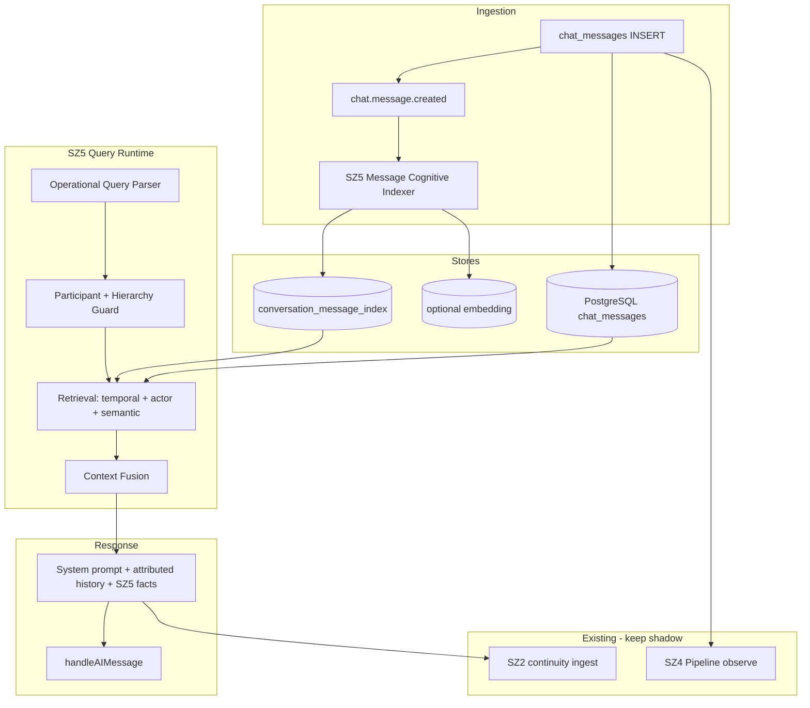

# SZ5 — Auditoria: Unified Operational Conversational Memory

**Data:** 2026-05-23  
**Modo:** read-only — sem implementação  
**Escopo:** Runtime Z (SZ1–SZ4) + Impetus Chat + memória operacional conversacional  
**Caso real:** mensagem «marcar reunião amanhã às 8h» → pergunta «o Gustavo solicitou reunião amanhã?» → IA: «não há informações disponíveis»

**Relacionado:** [`pm2-live-runtime-audit.md`](./pm2-live-runtime-audit.md), [`enterprise-shadow-runtime-audit.md`](./enterprise-shadow-runtime-audit.md), [`runtime-z-cognitive-os-sz2.md`](./runtime-z-cognitive-os-sz2.md), [`runtime-z-operational-nervous-system-sz4.md`](./runtime-z-operational-nervous-system-sz4.md)

---

## 1. Executive Summary

O IMPETUS **persiste** mensagens de chat em PostgreSQL (`chat_messages`, `chat_conversations`, `chat_participants`) e possui **várias camadas de “memória”** (SZ2 in-memory, SZ4 thread store, `operational_memory`, `impetusChatOperationalContextService`), mas **nenhuma delas constitui hoje uma memória operacional conversacional soberana** ligada ao hot path do Impetus Chat.

O Runtime Z (SZ2 em `Z_OPERATIONAL_ASSISTIVE`, SZ4 em `SZ4_OPERATIONAL_NERVOUS_SYSTEM` no `.env`) **observa, extrai entidades e prepara tarefas**, porém:

1. **Não alimenta** a resposta da IA no socket/HTTP do chat interno com retrieval soberano ao histórico.
2. **Não indexa** mensagens com schema cognitivo completo (actors, intent, meeting, follow-up).
3. **Não expõe** query engine «há reuniões amanhã?» / «o Gustavo pediu X?» sobre `chat_messages`.

**Veredicto:** SZ5 **não existe** como sistema unificado. Existe **implementação parcial e desconectada** — o bug observado é **arquitecturalmente explicável** (ver secção 4).

---

## 2. Current Runtime Z Capabilities (o que já corre de verdade)

| Fase | Módulo base | Estado LIVE (.env) | Liga ao Impetus Chat? |
|------|-------------|-------------------|------------------------|
| SZ1 | `runtime-z-sovereign/` | configurável | Indirecto (governança admin) |
| SZ2 | `runtime-z-cognitive-os/` | **on**, stage `Z_OPERATIONAL_ASSISTIVE` | **Não** no `handleAIMessage` |
| SZ3 | `runtime-z-maturation/` | configurável | Só via injector em **dashboard chat** |
| SZ4 | `runtime-z-operational-nervous-system/` | **on**, stage `SZ4_OPERATIONAL_NERVOUS_SYSTEM` | **Observa** mensagens via socket; **não** responde com memória |

**Capacidades SZ2 implementadas (código real):**

| Capacidade | Ficheiro(s) | Classificação |
|------------|-------------|---------------|
| Memória operacional kernel | `memory/zOperationalMemoryRuntime.js` | **IMPLEMENTADO PARCIALMENTE** — Map + ficheiro JSON opcional; **não** `chat_messages` |
| Grafo conversacional | `memory/zConversationMemoryGraph.js` | **IMPLEMENTADO PARCIALMENTE** — `recordTurn` só se chamado |
| Índice keyword | `memory/zContextualMemoryIndex.js` | **IMPLEMENTADO PARCIALMENTE** — search em summaries, não full-text chat |
| Continuidade | `continuity/zIntentContinuityRuntime.js`, `zConversationContinuationRuntime.js` | **IMPLEMENTADO** — não wired ao chat |
| Workflow / task / entity / incident memory | `zWorkflowMemoryRuntime.js`, `zTaskMemoryRuntime.js`, etc. | **IMPLEMENTADO PARCIALMENTE** |
| Fusão memória | `orchestration/zMemoryFusionPipeline.js` | **IMPLEMENTADO PARCIALMENTE** — não no chat |
| Facade | `facade/zCognitiveOperatingSystemFacade.js` | **IMPLEMENTADO** — API `/api/runtime-z-cognitive-os/*` |
| Ingest POST | `routes/runtimeZCognitiveOs.js` → `ingest/conversation` | **IMPLEMENTADO** — **manual/API**, não automático no chat |

**Capacidades SZ4 implementadas (código real):**

| Capacidade | Ficheiro(s) | Classificação |
|------------|-------------|---------------|
| Pipeline chat | `_core/sz4PipelineCore.js` → `processOperationalSignal` | **IMPLEMENTADO** — chamado em `socket/chatSocket.js` |
| Thread context in-memory | `_core/sz4TenantStore.js` `upsertThreadContext` | **IMPLEMENTADO PARCIALMENTE** — RAM, cap 40 msgs/thread |
| NLP entidades | `_core/sz4EntityExtractor.js` | **IMPLEMENTADO PARCIALMENTE** — sem padrão `reunião/meeting` |
| Task / reminder / workflow prepared | pipeline + `internal-chat/*` | **IMPLEMENTADO PARCIALMENTE** — `prepared_only`, HITL |
| Reintegração thread | `internalChatConversationalReintegration.js` | **IMPLEMENTADO PARCIALMENTE** — lembrete futuro, não Q&A |

**Módulos pedidos na auditoria — existência nominal:**

| Módulo pedido | Existe? | Equivalente real |
|---------------|---------|------------------|
| `zOperationalMemoryRuntime` | **Sim** | `runtime-z-cognitive-os/memory/zOperationalMemoryRuntime.js` |
| `zThreadRuntime` | **Não** (nome) | `sz4TenantStore.upsertThreadContext` |
| `zConversationRuntime` | **Não** (nome) | `zConversationMemoryGraph` |
| `zContinuityRuntime` | **Sim** (vários) | `continuity/*` |
| `zWorkflowMemoryRuntime` | **Sim** | `memory/zWorkflowMemoryRuntime.js` |
| `zTaskMemoryRuntime` | **Sim** | `memory/zTaskMemoryRuntime.js` |
| `zReminderRuntime` | **Parcial** | SZ4 reminders + `reminderSchedulerService` |
| `zMemoryGraphRuntime` | **Não** | `buildConversationGraph` (arestas lineares, não grafo actor) |
| `zOperationalIndexRuntime` | **Não** (nome) | `zContextualMemoryIndex` |
| `zConversationIndexRuntime` | **Não** | — |
| `zContextFusionRuntime` | **Não** (nome) | `zMemoryFusionPipeline` |

---

## 3. Missing Conversational Sovereignty (porque o caso Gustavo falha)

### 3.1 O evento existe na BD

| Artefacto | Persistência | Evidência |
|-----------|--------------|-----------|
| Mensagem utilizador | **IMPLEMENTADO** | `chatService.saveMessage` → `INSERT INTO chat_messages` |
| Thread | **IMPLEMENTADO** | `chat_conversations`, `chat_participants` |
| Actor (Gustavo) | **IMPLEMENTADO** | `users` + `sender` em `getMessages` |

### 3.2 A IA do chat **não consulta** esse histórico de forma soberana

**Hot path:** `socket/chatSocket.js` → `handleAIMessage` → `chatAIService.consolidated.js`

```476:483:backend/src/services/chatAIService.consolidated.js
    const msgs = [
      { role: 'system', content: systemContent },
      ...history.slice(-20).map((m) => ({
        role: m.sender_id === AI_USER_ID ? 'assistant' : 'user',
        content: sanitizeContent(m.content || '[arquivo]')
      })),
      { role: 'user', content: sanitizeContent(normalizedMessage) }
    ];
```

| Problema | Classificação | Impacto |
|----------|---------------|---------|
| Histórico **sem nome do remetente** (só `content`) | **IMPLEMENTADO PARCIALMENTE** | Pergunta «o **Gustavo** solicitou…» não associa actor |
| Ramo `CHAT_USE_TRIADE` (se activo) **ignora** histórico; usa só `retrieveContextualData(operational_overview)` | **IMPLEMENTADO MAS DESCONECTADO** | Resposta «sem informações» mesmo com thread cheio |
| `impetusChatOperationalContextService` **não** é chamado em `handleAIMessage` | **IMPLEMENTADO MAS DESCONECTADO** | Serviço que **sabe** ler thread por nome existe só em voz/painel |
| `zCognitiveContextInjector` **não** é usado no chat interno | **IMPLEMENTADO MAS DESCONECTADO** | SZ2 inject só em `POST /dashboard/chat` |
| `ingestTurnForContinuity` usa `conversation_id: tenantId_timestamp` fictício | **IMPLEMENTADO MAS DESCONECTADO** | SZ2 memory não correlaciona thread real |
| `operationalMemoryBindingService` não query `chat_messages` | **IMPLEMENTADO MAS SEM CONTEXT RETRIEVAL** | Só `operational_memory`, tasks, `eventos_empresa` |
| Tool `consultar_historico` query `eventos_empresa`, não chat | **IMPLEMENTADO MAS DESCONECTADO** | Ferramenta não resolve reuniões no chat |
| SZ4 guarda excerpt com `sender_name` mas **não** devolve ao LLM | **IMPLEMENTADO PARCIALMENTE** | Observação ≠ soberania de resposta |

### 3.3 Conclusão do caso real

**Não é que a mensagem não exista.** É que **nenhum runtime autoritativo** faz `SELECT` + retrieval semântico + RBAC sobre `chat_messages` antes da resposta — e o prompt LLM pode falhar por falta de atribuição de actor mesmo quando o texto está no context window.

---

## 4. FASE 1 — Auditoria do Impetus Chat

### 4.1 Persistência

| Item | Estado | Evidência |
|------|--------|-----------|
| Persistência mensagens | **IMPLEMENTADO** | `backend/src/services/chatService.js` `saveMessage`, `getMessages` |
| Tabelas | **IMPLEMENTADO** | `chat_messages`, `chat_conversations`, `chat_participants` (+ migrations em `models/chat_profile_presence_migration.sql`) |
| Attachments | **IMPLEMENTADO** | `file_url`, `file_name` em `saveMessage` |
| Soft delete | **IMPLEMENTADO** | `deleted_at`, `deleted_for_everyone_at`, `chat_message_deleted_for_user` |
| Socket realtime | **IMPLEMENTADO** | `backend/src/socket/chatSocket.js` |
| HTTP API | **IMPLEMENTADO** | `backend/src/routes/chat.js` |
| Event bus dedicado chat | **NÃO IMPLEMENTADO** | Sem fila/topic `chat.events`; só socket emit |
| Timeline table | **NÃO IMPLEMENTADO** | Sem `conversation_timeline` / `operational_events` ligada 1:1 ao chat |

### 4.2 Runtime Z recebe mensagens?

| Canal | Recebe? | Como | Classificação |
|-------|---------|------|---------------|
| Socket `send_message` | **Sim** | `operationalRealtimeCoordinator.processChatMessage` | **OBSERVATIONAL** |
| Socket → SZ4 | **Sim** | `internalChatOperationalRuntime.processInternalChatMessage` | **PARCIAL** (prepara task/reminder) |
| Socket → SZ2 ingest | **Não** automático | `ingest/conversation` só API manual + injector pós-dashboard-chat | **IMPLEMENTADO MAS DESCONECTADO** |
| `_ingestAfterReply` | **Parcial** | `unifiedOperationalIngestionService` — última mensagem user, não thread | **IMPLEMENTADO PARCIALMENTE** |

### 4.3 Query soberana ao chat

| Capacidade | Estado |
|------------|--------|
| Query SQL governada `chat_messages` por tenant + RBAC | **NÃO IMPLEMENTADO** como serviço |
| Full-text / semântico sobre conversas | **NÃO IMPLEMENTADO** (só `operational_memory` FTS) |
| Cross-thread «o que o Gustavo disse» | **IMPLEMENTADO PARCIALMENTE** só em `impetusChatOperationalContextService` (fora do chat IA) |

---

## 5. FASE 2 — Memória operacional

### 5.1 Camadas existentes (matriz)

| Camada | Persistência | Retrieval | Chat hot path | Classificação |
|--------|--------------|-----------|---------------|---------------|
| `chat_messages` (PostgreSQL) | **Sim** | Via `getMessages` (últimas N) | **Sim** (raw, sem actor) | **IMPLEMENTADO PARCIALMENTE** |
| `operational_memory` | **Sim** (BD) | FTS `operationalMemoryService` | Via binding (query=user msg) | **IMPLEMENTADO PARCIALMENTE** |
| SZ2 `zOperationalMemoryRuntime` | RAM + JSON file opcional (`IMPETUS_SZ2_PERSISTENCE=off`) | Keyword index | **Não** | **IMPLEMENTADO MAS DESCONECTADO** |
| SZ4 `sz4TenantStore` | RAM | Por `thread_id` | **Não** na resposta | **IMPLEMENTADO PARCIALMENTE** |
| `corporateMemoryService` / `learningMemoryService` | BD | FTS | Binding opcional | **IMPLEMENTADO PARCIALMENTE** |
| `impetusChatOperationalContextService` | Lê BD on demand | Heurística nome + `getMessages` | **Não** no chat IA | **IMPLEMENTADO MAS DESCONECTADO** |

### 5.2 Perguntas da auditoria (10)

| # | Pergunta | Resposta |
|---|----------|----------|
| 1 | Grafo operacional? | **PARCIAL** — `buildConversationGraph` linear; sem actor graph |
| 2 | Timeline operacional? | **NÃO** unificada |
| 3 | Indexação conversacional? | **NÃO** em BD |
| 4 | Retrieval cross-thread? | **NÃO** no chat IA; **PARCIAL** em painel/voz |
| 5 | Correlation engine? | **PARCIAL** SZ4 `correlation_id` in-memory |
| 6 | Memory fusion? | **PARCIAL** `zMemoryFusionPipeline` — não no chat |
| 7 | Actor continuity graph? | **NÃO IMPLEMENTADO** |
| 8 | Workflow persistence? | **PARCIAL** SZ4 prepared + `tasks` DB se HITL |
| 9 | Operational memory retrieval? | **PARCIAL** — não inclui chat archive |
| 10 | Contextual memory retrieval? | **PARCIAL** — dashboard/overview bias |

---

## 6. FASE 3 — Query soberana (perguntas operacionais)

| Pergunta tipo | Engine dedicado? | O que existe hoje |
|---------------|------------------|-------------------|
| «Há reuniões amanhã?» | **NÃO** | LLM + histórico curto; SZ4 deadline NLP sem «reunião» |
| «Tarefas relacionadas ao Gustavo?» | **PARCIAL** | `consultar_tarefas` (tools off por defeito); binding tasks |
| «Workflows turnover?» | **NÃO** | — |
| «Compromissos pendentes?» | **PARCIAL** | tasks + reminders no binding |
| «Quem solicitou relatório de perdas?» | **NÃO** | Sem index actor→intent |
| «Follow-up pendente?» | **PARCIAL** | SZ4 `pending` pattern; não Q&A |
| Retrieval temporal | **PARCIAL** | SZ4 `parseDeadline` |
| Retrieval por actor | **NÃO** no chat path | `impetusChatOperationalContext` só outros canais |
| Retrieval por workflow | **PARCIAL** | SZ4 in-memory |
| Retrieval semântico chat | **NÃO** | — |
| Retrieval RBAC multi-thread | **NÃO** | `verifyParticipant` por conversa apenas |
| Retrieval multi-thread | **NÃO** | — |

**Engine de query operacional unificada:** **IMPLEMENTAÇÃO NÃO EXISTE**.

---

## 7. FASE 4 — Indexação cognitiva por mensagem

Schema alvo pedido:

```json
{
  "message_id": "...",
  "thread_id": "...",
  "actors": [],
  "entities": [],
  "intent": "...",
  "workflow_type": "...",
  "temporal_markers": [],
  "priority": "...",
  "operational_relevance": "...",
  "requires_followup": true
}
```

| Campo / pipeline | Estado | Evidência |
|-----------------|--------|-----------|
| `message_id` / `thread_id` | **IMPLEMENTADO** (BD) | `chat_messages` |
| `actors[]` | **IMPLEMENTADO PARCIALMENTE** | SZ4 guarda `sender_id`/`sender_name` em RAM; **não** em índice BD |
| `entities[]` | **IMPLEMENTADO PARCIALMENTE** | `sz4EntityExtractor`, `unifiedOperationalIngestionService` — regex, não LLM estruturado por msg |
| `intent` | **IMPLEMENTADO PARCIALMENTE** | `nlp.inferIntent` SZ4 |
| `workflow_type` | **IMPLEMENTADO PARCIALMENTE** | workflow record SZ4 |
| `temporal_markers` | **IMPLEMENTADO PARCIALMENTE** | deadline «amanhã», «8h» — frágil |
| `priority` | **IMPLEMENTADO PARCIALMENTE** | `classifyPriority` |
| `operational_relevance` | **NÃO IMPLEMENTADO** | — |
| `requires_followup` | **IMPLEMENTADO PARCIALMENTE** | reminder/task heuristics |
| Meeting extraction | **NÃO IMPLEMENTADO** | Sem pattern `reunião|meeting|marcar` em SZ4 NLP |
| Escalation / deadline extraction | **IMPLEMENTADO PARCIALMENTE** | SZ4 + ingestion |
| Persistência índice | **NÃO IMPLEMENTADO** | Sem tabela `conversation_cognitive_index` |

---

## 8. FASE 5 — Governança e segurança

| Controlo | Chat read | Chat memory index | SZ2/SZ4 store |
|----------|-----------|-------------------|---------------|
| Tenant isolation | **IMPLEMENTADO** (`company_id` em conversas) | N/A | **IMPLEMENTADO** (key por tenant) |
| RBAC / participant check | **IMPLEMENTADO** (`verifyParticipant`) | — | **IMPLEMENTADO PARCIALMENTE** |
| Hierarchy scope | **IMPLEMENTADO PARCIALMENTE** | `structuralAIGovernance` no chat | SZ2 governance flags |
| Chat visibility cross-user | **IMPLEMENTADO** (só conversas onde é participante) | — | — |
| Confidentiality / sanitization | **IMPLEMENTADO PARCIALMENTE** | LGPD protocol em prompt | — |
| Runtime Z acede tudo indevidamente? | **Risco baixo** por conversa; **risco médio** se memory binding sem scope filters | — | SZ2 file store por tenant — sem encriptação |

**Governança de memória conversacional unificada:** **IMPLEMENTADO PARCIALMENTE** — fragmentada, sem policy engine único no chat.

---

## 9. FASE 6 — Capacidades operacionais

| Capacidade | Detectar | Persistir | Recuperar na resposta | Classificação |
|------------|----------|-----------|----------------------|---------------|
| Tarefas implícitas | SZ4/ingestion | tasks / prepared | Tools/binding | **PARCIAL** |
| Reuniões | **Não** | **Não** | **Não** | **NÃO IMPLEMENTADO** |
| Deadlines | **Sim** (regex) | SZ4/thread | Parcial | **PARCIAL** |
| Follow-ups | Parcial | reminders | Parcial | **PARCIAL** |
| Escalonamentos | Parcial | prepared actions | Não | **PARCIAL** |
| Riscos | Parcial | operational_memory | Parcial | **PARCIAL** |
| Urgência | Parcial | priority field | Parcial | **PARCIAL** |
| Continuidade thread | Parcial | SZ4 RAM | Não no LLM | **PARCIAL** |
| Timeline operacional | Não | Não | Não | **NÃO IMPLEMENTADO** |
| Memória persistente soberana | Não | Não | Não | **NÃO IMPLEMENTADO** |

---

## 10. SZ5 Gaps — Unified Operational Conversational Memory

### GAP-01 — Soberania de retrieval no hot path do chat

| Campo | Conteúdo |
|-------|----------|
| O que falta | Serviço `queryOperationalConversationMemory(companyId, userId, query)` com RBAC |
| Por que falta | Chat delega só ao LLM + binding genérico |
| Onde deveria existir | `backend/src/runtime-z-conversational-memory/` ou extensão SZ5 de SZ2/SZ4 |
| Impacto actual | Caso Gustavo; qualquer «o que X disse» |
| Risco | Alucinação + «não há informações» com dados na BD |
| Runtime | SZ5 Query Runtime |
| Middleware | Hook pós-`saveMessage` + pré-`handleAIMessage` |
| Persistência | Índice + `chat_messages` |
| Governance | participant + hierarchy + tenant |
| Rollout | shadow → assist (inject facts) → sovereign |

### GAP-02 — Indexação por mensagem (schema cognitivo)

| Campo | Conteúdo |
|-------|----------|
| O que falta | Pipeline async: message saved → extract → upsert index |
| Por que falta | Só regex pontual na ingestão da última frase |
| Onde | Worker/cron ou listener socket + tabela `conversation_message_index` |
| Impacto | Impossível query estruturada |
| Risco | Drift entre RAM SZ4 e BD |
| Runtime | SZ5 Indexer |
| Persistência | PostgreSQL (+ opcional vector) |
| Rollout | shadow index only → enrich prompt |

### GAP-03 — Actor-attributed history no LLM

| Campo | Conteúdo |
|-------|----------|
| O que falta | Formato `{sender_name, role, ts, content}` no OpenAI messages |
| Por que falta | Regressão/omissão em `chatAIService.consolidated.js` |
| Onde | `handleAIMessage` + triade branch |
| Impacto | **Imediato** — fix de baixo risco |
| Runtime | Chat adapter (não SZ5 completo) |

### GAP-04 — Wiring `impetusChatOperationalContextService` → chat IA

| Campo | Conteúdo |
|-------|----------|
| O que falta | Chamar `buildChatOperationalContext` quando query menciona actor/chat |
| Por que falta | Serviço criado para voz/painel (`claudePanelService`, `smartPanelCommandService`) |
| Onde | `chatAIService.consolidated.js` após memory binding |
| Impacto | Cross-thread por nome falha no chat |
| Classificação actual | **IMPLEMENTADO MAS DESCONECTADO** |

### GAP-05 — SZ2 ingest com `conversation_id` real + replay

| Campo | Conteúdo |
|-------|----------|
| O que falta | `ingestTurnForContinuity(companyId, user, { conversation_id, message, response })` no fim do chat |
| Por que falta | Só dashboard chat chama injector; ID fictício em `zCognitiveContextInjector` |
| Onde | `_ingestAfterReply` + injector |
| Persistência | SZ2 persistence on + export to PG |

### GAP-06 — Tool «consultar_conversa» / histórico chat

| Campo | Conteúdo |
|-------|----------|
| O que falta | Tool que query `chat_messages` com filtros actor/date/intent |
| Por que falta | `consultar_historico` → `eventos_empresa` only |
| Onde | `operationalToolRegistry.js` |
| Flags | `OPERATIONAL_TOOL_CALLING_ENABLED` (ausente .env = **false**) |

### GAP-07 — Event backbone conversacional

| Campo | Conteúdo |
|-------|----------|
| O que falta | `chat.message.created` → indexers + SZ4 + SZ2 + optional vector |
| Por que falta | Chamadas ad-hoc `setImmediate` sem contrato único |
| Onde | `eventPipeline` / `IMPETUS_EVENT_BACKBONE_ENABLED` (off) |

### GAP-08 — Cross-thread correlation (actor graph)

| Campo | Conteúdo |
|-------|----------|
| O que falta | Resolver «Gustavo» → user_id → todas threads permitidas |
| Por que falta | Context service só quando hint de nome no texto da pergunta |
| Onde | SZ5 Actor Resolution + Graph |

### GAP-09 — Meeting / commitment intent type

| Campo | Conteúdo |
|-------|----------|
| O que falta | NLP/LLM class `meeting_request`, `calendar_commitment` |
| Por que falta | SZ4 patterns não incluem reunião |
| Onde | `sz4EntityExtractor.js` + indexer |

### GAP-10 — Unified memory facade (SZ5)

| Campo | Conteúdo |
|-------|----------|
| O que falta | Facade única: `resolveConversationalContextForQuery()` usada por chat, dashboard, voz |
| Por que falta | 4+ camadas independentes |
| Onde | `facade/zUnifiedConversationalMemoryFacade.js` |

---

## 11. Architectural Risks

| Risco | Severidade | Notas |
|-------|------------|-------|
| Falsa sensação de «memória viva» (SZ2/SZ4 on) sem retrieval | **Alta** | Stages assistive em `.env` mas chat não consome |
| RAM loss on PM2 restart | **Alta** | SZ2/SZ4 stores in-memory |
| Duplicação SZ2 vs SZ4 vs binding vs chat context | **Média** | Inconsistência de facts |
| Triade sem histórico | **Alta** se `CHAT_USE_TRIADE=true` | operational_overview ≠ thread |
| Tool shadow retorna sucesso falso | **Média** | `OPERATIONAL_TOOL_SHADOW_MODE` default true |
| Privacy leakage cross-thread | **Média** | Sem query engine governado |

---

## 12. Recommended Runtime Architecture (SZ5 target)



**Princípios SZ5:**

1. **PostgreSQL `chat_messages` é source of truth** para conversação.
2. **Índice cognitivo** é derivado (replay-safe), não substituto.
3. **Query runtime** é autoritativo para «o que foi dito / combinado».
4. SZ2/SZ4 passam a **consumidores** do índice, não stores paralelos contraditórios.

---

## 13. Rollout Strategy (shadow-first)

| Fase | Conteúdo | Flags sugeridas |
|------|----------|-----------------|
| **SZ5-A** | Fix rápido: actor no history + wire `impetusChatOperationalContext` no chat | sem flag |
| **SZ5-B** | Tabela índice + indexer async (shadow, não inject) | `IMPETUS_SZ5_INDEXER=shadow` |
| **SZ5-C** | Query runtime inject no prompt (assist) | `IMPETUS_SZ5_QUERY=assist` |
| **SZ5-D** | Sovereign: query responde antes do LLM; LLM só redige | `IMPETUS_SZ5_SOVEREIGN=on` + tenant allowlist |

**Rollback:** desactivar flags; Motor A + raw history permanecem.

---

## 14. Plano de implementação por sub-fases

### SZ5-A — Correção de wiring (crítico, baixo risco)

| Componente | Acção |
|------------|-------|
| `chatAIService.consolidated.js` | Incluir `sender.name` no history; chamar `impetusChatOperationalContextService` quando `wantsChatDetail(query)` |
| `chatAIService.consolidated.js` | Triade: passar últimas mensagens no `context` ou desactivar triade para perguntas de recall |
| `_ingestAfterReply` | Chamar `zCognitiveContextInjector.ingestTurnForContinuity` com `conversationId` real |
| Teste | Script integração: msg1 reunião → msg2 pergunta Gustavo → assert contém «reunião» |

### SZ5-B — Indexação persistente

| Componente | Acção |
|------------|-------|
| Migration SQL | `conversation_message_index` (message_id, thread_id, company_id, actors jsonb, intent, temporal jsonb, …) |
| `sz5MessageCognitiveIndexer.js` | Listener pós-save (socket + REST) |
| `sz5EntityExtractor.js` | Extender patterns: `reunião`, `meeting`, `marcar`, `às \d+h` |
| Cron | Backfill últimos 90 dias (tenant-scoped) |

### SZ5-C — Query runtime

| Componente | Acção |
|------------|-------|
| `sz5OperationalQueryRuntime.js` | Parses: actor, temporal («amanhã»), intent (meeting, task, follow-up) |
| `sz5ConversationRetrievalEngine.js` | SQL + index join + optional vector |
| `sz5GovernanceGuard.js` | Reutilizar `verifyParticipant` + hierarchy |
| `operationalToolRegistry` | `consultar_mensagens_chat`, `consultar_compromissos` |
| Facade | `zUnifiedConversationalMemoryFacade.js` |

### SZ5-D — Soberania e fusão

| Componente | Acção |
|------------|-------|
| Unificar SZ2 recordTurn ← indexer | Single write path |
| SZ4 thread context ← indexer | Eliminar duplicação NLP |
| Event backbone | `chat.message.created` quando `IMPETUS_EVENT_BACKBONE_ENABLED` |
| Observability | Métricas: index_lag, retrieval_hit_rate, recall_accuracy |
| Frontend | Opcional: mostrar «fonte: mensagem de Gustavo, 22/05 14:32» |

---

## 15. Matriz resumo (classificação global)

| Área | Classificação predominante |
|------|---------------------------|
| Persistência chat | **IMPLEMENTADO** |
| Indexação cognitiva mensagem | **NÃO IMPLEMENTADO** |
| Memória operacional unificada | **NÃO IMPLEMENTADO** |
| Runtime Z → Chat resposta | **IMPLEMENTADO MAS DESCONECTADO** |
| SZ2 memory | **IMPLEMENTADO PARCIALMENTE** (RAM, não chat PG) |
| SZ4 nervous system | **IMPLEMENTADO PARCIALMENTE** (observe/act prepared) |
| Query soberana | **NÃO IMPLEMENTADO** |
| Cross-thread actor | **IMPLEMENTADO MAS DESCONECTADO** (serviço existe) |
| Governança tenant/RBAC conversa | **IMPLEMENTADO** (por thread, não cross-thread query) |
| Meeting/reunião | **NÃO IMPLEMENTADO** |

---

## 16. Final Conclusion

### O Runtime Z consegue transformar o Impetus Chat em memória operacional viva e soberana?

## **Não — ainda não.**

**O que já é real:**

- Stack SZ2/SZ4 **implementado em código**, activo em `.env`, SZ4 **processa** cada mensagem de chat em pipeline operacional.
- Mensagens **persistem** em PostgreSQL.
- Serviços auxiliares (`impetusChatOperationalContextService`, `operationalMemoryBindingService`) demonstram que a equipa já modelou **parte** do problema.

**O que impede SZ5:**

1. **Ausência de query runtime** conversacional autoritativo.
2. **Ausência de índice cognitivo** persistente por mensagem.
3. **Desconexão sistemática** entre observação (SZ4) e resposta (GPT no `handleAIMessage`).
4. **Bug de produto** no formato do histórico LLM (sem nomes) e serviços certos no canal errado.

**Posição arquitectural:** O sistema está em **SZ4 Operational Nervous System (observação + preparação)** + **SZ2 Operational Assistive (contexto dashboard)**, **não** em **SZ5 Unified Operational Conversational Memory**.

A transição para SZ5 não é «activar mais flags SZ2» — é **novo wiring + índice + query engine** com `chat_messages` como verdade, mantendo SZ2/SZ4 em shadow/assist até validação de recall (caso Gustavo como teste de regressão obrigatório).

---

*Auditoria concluída sem alteração de código, flags ou PM2.*
