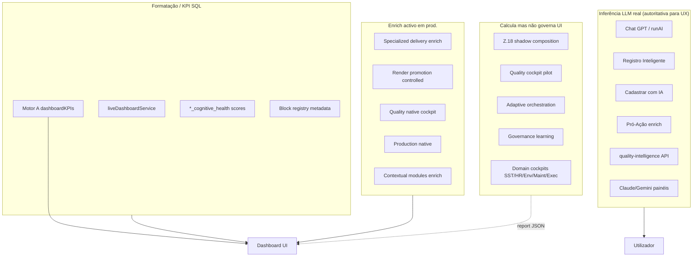
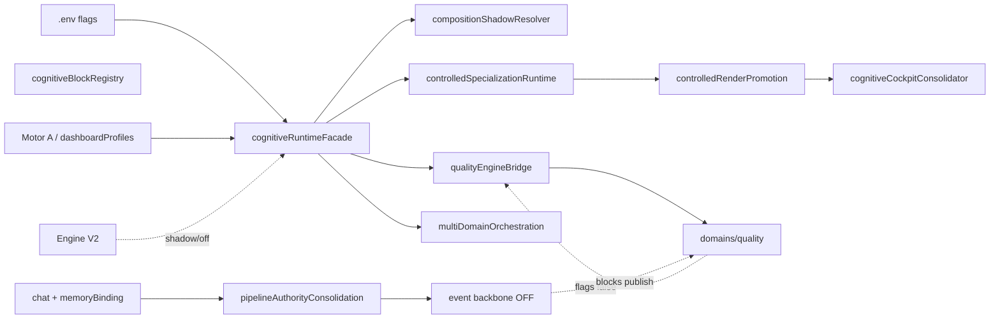

# Auditoria Enterprise — Shadow Runtime / Cognitive Activation (IMPETUS)

**Data:** 2026-05-23  
**Modo:** read-only — nenhuma activação, remoção de shadow ou alteração de governança  
**Escopo:** `backend/`, `frontend/` (consumo de runtime), flags `.env` / `.env.example`  
**Ambiente referenciado:** `backend/.env` (PM2 produção) + defaults de código

---

## Resumo executivo

O IMPETUS possui **duas camadas cognitivas paralelas**:

1. **Camada operacional legada (activa):** Motor A (`dashboardProfiles`, `dashboardKPIs`, `liveDashboardService`), chat GPT + `operationalMemoryBindingService`, módulos IA pontuais (Registro Inteligente, Cadastrar com IA, Pró-Ação), APIs `quality-intelligence` / painéis Claude.
2. **Camada enterprise cognitiva (Z.0–Z.29):** registry, composition, enrich, render promotion, cockpits nativos por domínio, adaptive orchestration, governance learning — com **rollout heterogéneo**: Quality e Production parcialmente **operacionais** no `.env` actual; SST, HR, Environmental, Maintenance, Executive em **shadow** ou **preview**; fundação Z.18 com registry **definition-only**; pipeline authority em **partial_authority** (não shadow).

**Veredicto (secção 10):** *Runtime cognitivo híbrido* — acima de “ERP + IA”, abaixo de “enterprise cognitive operating system” pleno.

---

## 1. Metodologia

| Fonte | O que foi lido |
|--------|----------------|
| Facades | `cognitiveRuntimeFacade.js`, `adaptiveOrchestrationFacade.js`, `governanceLearningFacade.js`, `pipelineAuthorityConsolidation.js` |
| Flags | 50+ `*FeatureFlags.js` (Z.0–Z.29, contextual, engine V2, policy) |
| Registry | `cognitiveBlockRegistry.js` (`delivery_active: false`, `composition_engine: shadow_only`) |
| Domínios | `domains/quality|cognitive|rollout`, `cognitiveRuntime/domains/*` |
| Dashboard | `routes/dashboard.js` (stack Z.13–Z.29, chat, KPI/summary precision) |
| Memória / chat | `operationalMemoryBindingService.js`, `chatAIService.consolidated.js` |
| Módulos IA | `intelligentRegistrationService.js`, `cadastrarComIA.js`, `proacao.js` |
| Config produção | `backend/.env` (estado efectivo PM2) |

Classificações usadas: `ACTIVE` | `SHADOW` | `PARTIAL_SHADOW` | `OBSERVATIONAL` | `COLLECTION_ONLY` | `FALLBACK_DOMINANT` | `DISABLED_COGNITION` | `ENRICH_ONLY` | `RENDER_DISABLED`.

---

## 2. Estado global de flags (auditoria de configuração)

### 2.1 Produção (`backend/.env`) — snapshot crítico

| Flag | Valor prod. | Default código | Interpretação |
|------|-------------|----------------|---------------|
| `IMPETUS_COGNITIVE_RUNTIME` | **off** | false | Fundação Z.18 “master” desligada |
| `IMPETUS_SEMANTIC_DELIVERY_OBSERVABILITY` | **on** | true | **Facade Z.18 corre na mesma** (gate alternativo) |
| `IMPETUS_COGNITIVE_BLOCK_REGISTRY` | off | false | Registry não exposto como runtime activo |
| `IMPETUS_COGNITIVE_COMPOSITION_ENGINE` | off | false | Composition engine OFF |
| `IMPETUS_QUALITY_COCKPIT_PILOT` | shadow | off | Piloto quality em shadow |
| `IMPETUS_SPECIALIZED_DELIVERY_ENRICH` | **enrich** | off | **KPI/summary quality podem mutar payload** |
| `IMPETUS_COGNITIVE_RENDER_PROMOTION` | **controlled** | off | Promoção de widgets quality (perfil piloto) |
| `IMPETUS_SPECIALIZED_COCKPIT_RUNTIME` | **quality_native** | off | Consolidação cockpit quality activa (com gates Z.22) |
| `IMPETUS_PRODUCTION_COGNITIVE_RUNTIME` | **production_native** | off | Production cockpit **activo** |
| `IMPETUS_*_COGNITIVE_RUNTIME` (SST, HR, Env, Maint, Exec) | **shadow** | off | Cockpits calculados; UI muitas vezes preview |
| `IMPETUS_ADAPTIVE_ORCHESTRATION` | shadow | off | Densidade/fadiga — metadata only |
| `IMPETUS_GOVERNANCE_LEARNING` | shadow | off | Padrões em `governance_learning_shadow` |
| `IMPETUS_MULTI_DOMAIN_FOUNDATION` | shadow | off | Orquestração multi-domínio não substitui layout |
| `IMPETUS_CONTEXTUAL_MODULES` | **enrich** | off | Sidebar união legacy ∪ contextual |
| `IMPETUS_DASHBOARD_ENGINE_V2` | off | off | Motor V2 não governa resposta |
| `IMPETUS_PIPELINE_AUTHORITY_CONSOLIDATION_MODE` | **partial_authority** | shadow | **Excepção:** mais avançado que shadow default |
| `IMPETUS_EVENT_PIPELINE_SHADOW` | (ver .env) | true | Pipeline paralelo típico |
| `IMPETUS_PIPELINE_AUTHORITY_ENABLED` | (não listado → false) | false | Authority service shadow |
| `IMPETUS_KPI_GOVERNANCE` / `SUMMARY` / `CHAT` | **off** | variável | Enforcement Z terminal **não activo** em prod. |
| `IMPETUS_TERMINAL_GOVERNANCE` | off | — | Locks terminais OFF em prod. (código Z.16 existe) |
| `UNIFIED_DECISION_ENGINE` | comentado / false | — | Conselho cognitivo chat **inactivo** |
| `IMPETUS_UNIFIED_ORCHESTRATOR_ENABLED` | false (.example) | false | Orquestrador unificado OFF |
| `OPERATIONAL_MEMORY_ENABLED` | (vazio .example) | — | Memória operacional opcional |
| `MEMORY_BINDING_ENABLED` | default true | true | Binding chat **activo** se deps existirem |

### 2.2 Flags inconsistentes / risco de “shadow eterno”

| Problema | Evidência |
|---------|-----------|
| **Dupla verdade cognitive** | `IMPETUS_COGNITIVE_RUNTIME=off` mas `IMPETUS_SEMANTIC_DELIVERY_OBSERVABILITY=on` activa `applyCognitiveFoundationToDashboard` |
| **Quality misto** | `QUALITY_COCKPIT_PILOT=shadow` + `SPECIALIZED_DELIVERY_ENRICH=enrich` + `RENDER_PROMOTION=controlled` → piloto shadow, entrega enrich/render **activos** para `coordinator_quality` |
| **Production activo vs multi-domain shadow** | `PRODUCTION_COGNITIVE_RUNTIME=production_native` com `MULTI_DOMAIN_FOUNDATION=shadow` |
| **Render sem runtime** | Maintenance/Executive: `RENDER_PROMOTION=controlled` + `COGNITIVE_RUNTIME=shadow` → widgets promovidos, consolidação muitas vezes `shadow_compare_only` |
| **Governança documentada vs prod.** | Z.13–Z.17 validados em piloto; `.env` prod. tem `TERMINAL_GOVERNANCE=off`, `KPI_GOVERNANCE=off` — **governança de entrega desactivada** |
| **Pipeline authority** | Código default `shadow`; prod. `partial_authority` — divergência intencional de rollout |
| **Registry morto para UI** | `getRegistryStats(): delivery_active: false, composition_engine: shadow_only` |
| **`.env` duplicado** | Blocos `ENVIRONMENT_ACTIVATION` repetidos — risco de drift manual |

### 2.3 Flags mortas ou pouco utilizadas (amostra)

- `IMPETUS_COGNITIVE_COMPOSITION_SHADOW=off` com composition engine off — shadow path redundante.
- Policy stack (`IMPETUS_POLICY_*`) — todos false em `.env.example`; rotas admin existem, runtime inactivo.
- `IMPETUS_CONTROLLED_RUNTIME_ACTIVATION` (Fase S) — default false; sem wiring visível no hot path dashboard.
- `IMPETUS_CHAT_ALIGNMENT_RUNTIME` — false; chat não passa por alinhamento enterprise dedicado.

---

## 3. Cognitive Runtime (composição, orquestração, enrich, promotion)

### Estado: **PARTIAL_SHADOW** (global) / **ACTIVE** (Quality enrich+render em prod.)

| Submódulo | Estado | Evidência |
|-----------|--------|-----------|
| Block registry | **RENDER_DISABLED** / definition-only | `cognitiveBlockRegistry.js` L371-373 |
| Composition engine | **DISABLED_COGNITION** | `IMPETUS_COGNITIVE_COMPOSITION_ENGINE=off`; metadata `shadow_only` |
| Shadow composition plan | **OBSERVATIONAL** | `resolveShadowCompositionPlan` → report only |
| Quality engine bridge | **SHADOW** (prod.) | `IMPETUS_QUALITY_ENGINE_BRIDGE=shadow`; `allowDirectEngineInvocation` default true |
| Z.21 Specialized delivery | **ENRICH_ONLY** → **ACTIVE** em prod. | `enrich` muta `kpis`/`specialized_summary` quando eligibility OK |
| Z.22 Render promotion | **PARTIAL_SHADOW** | `controlled` aplica widgets; shadow path `preview_only: true` |
| Z.23 Cockpit consolidation | **ACTIVE** (quality pilot) | `quality_native` + `coordinator_quality`; exige Z.22 `promotion_applied` |
| Z.24 Multi-domain | **SHADOW** | `isMultiDomainShadow()` — não escreve `multi_domain_foundation` no payload |
| Z.28 Adaptive orchestration | **SHADOW** | `adaptiveOrchestrationFacade.js` L14-17 `shadow_only: true` |
| Z.29 Governance learning | **SHADOW** | `governance_learning_shadow` vs report |
| Event pipeline authority | **PARTIAL_SHADOW** / **partial_authority** | Consolidation prod.; `IMPETUS_PIPELINE_AUTHORITY_ENABLED` default false |
| Engine V2 | **DISABLED_COGNITION** | `IMPETUS_DASHBOARD_ENGINE_V2=off`; shadow flag false |

**Porquê shadow:** rollout safety, `globalReplace: false` em todas as fases, dependência de binding ratio, piloto restrito a perfis (`coordinator_quality`, perfis SST/HR/etc.).

**Maturidade (0–5):** usefulness 2 | cognition 3 | context 3 | inference 2 | enterprise readiness 2 | stability 4

**Readiness:** `NEEDS_STABILIZATION` (unificar gates) + `REQUIRES_OBSERVABILITY` (diff shadow vs enrich activo)

**Risco activação plena:** leakage cross-domain, widgets duplicados Motor A+V2+cognitive, overload em `/dashboard/me`.

---

## 4. Chat Impetus

### Estado: **FALLBACK_DOMINANT** + **ACTIVE** (LLM) sem runtime enterprise

| Capacidade | Estado | Evidência |
|------------|--------|-----------|
| LLM resposta | **ACTIVE** | `chatAIService` / `runAI` |
| Memória operacional | **PARTIAL_SHADOW** | `MEMORY_BINDING_ENABLED` default true; depende `operationalMemoryService` |
| Unified decision / triade | **DISABLED_COGNITION** | `UNIFIED_DECISION_ENGINE` false |
| Chat alignment (Fase W) | **DISABLED_COGNITION** | `IMPETUS_CHAT_ALIGNMENT_RUNTIME` false |
| Chat governance | **DISABLED_COGNITION** | `IMPETUS_CHAT_GOVERNANCE=off` |
| Contextual retrieval dashboard | **ACTIVE** (limitado) | `POST /dashboard/chat` — `retrieveContextualData`; **sem** `dashboardVisibility` unificado |
| Orchestrator fallback | **FALLBACK_DOMINANT** | `chatAIService.consolidated.js` warns orchestrator fallback |
| Cross-module cognition | **OBSERVATIONAL** | binding agrega facts/tasks; não orquestra domínios |

**Porquê:** caminho quente é GPT + prompt enrichment; enterprise path opcional e desligado.

**Maturidade:** usefulness 3 | cognition 2 | context 2 | inference 2 | readiness 2 | stability 3

**Readiness:** `REQUIRES_MEMORY_LAYER` (persistência cognitiva `IMPETUS_COGNITIVE_PERSISTENCE_ENABLED=false`) + `REQUIRES_CONTEXT_ENGINE`

**Risco:** hallucination sem boundary guard; leakage se visibility não unificar.

---

## 5. Registro Inteligente

### Estado: **ACTIVE** (extração LLM) / **COLLECTION_ONLY** (memória operacional)

| Capacidade | Estado | Evidência |
|------------|--------|-----------|
| Semantic extraction | **ACTIVE** | `intelligentRegistrationService.processWithAI` — JSON estruturado |
| Classificação automática | **ACTIVE** | categorias/prioridade no prompt |
| Persistência | **ACTIVE** | `intelligent_registrations` |
| Correlação contextual cross-módulo | **DISABLED_COGNITION** | sem event backbone; não alimenta `domains/quality` engines |
| Recurrence / shift intelligence | **FALLBACK_DOMINANT** | heurísticas em metadata; sem motor recurrence dedicado |
| Timeline cognitiva | **COLLECTION_ONLY** | listagem SQL; sem grafo temporal |
| Acções automáticas | **DISABLED_COGNITION** | não cria CAPA/Pró-Ação automaticamente |

**Maturidade:** usefulness 4 | cognition 3 | context 2 | inference 2 | readiness 3

**Readiness:** `NEEDS_DATA` (eventos) + `REQUIRES_EVENT_BACKBONE`

---

## 6. Cadastrar com IA

### Estado: **ACTIVE** (ingestão multimodal pontual) / **DISABLED_COGNITION** (grafo industrial)

| Capacidade | Estado | Evidência |
|------------|--------|-----------|
| OCR / PDF / DOC | **ACTIVE** | `cadastrarComIA.js` pdf-parse, mammoth |
| Imagem (Gemini) | **ACTIVE** | `geminiService` |
| Áudio | **ACTIVE** | `mediaProcessorService` |
| Entity extraction | **ACTIVE** (batch) | prompt + `dadosExtraidos` |
| Knowledge graph | **DISABLED_COGNITION** | persiste cadastro; sem `domains/*/graph` |
| Duplicate detection | **FALLBACK_DOMINANT** | não há motor enterprise dedicado na rota |
| Ingestion cognition unificada | **DISABLED_COGNITION** | `unifiedOperationalIngestionService` existe; flags parciais |

**Maturidade:** usefulness 4 | cognition 2 | context 1 | inference 1 | readiness 3

---

## 7. Pró-Ação

### Estado: **ACTIVE** (CRUD + LLM pontual) / **FALLBACK_DOMINANT** (priorização enterprise)

| Capacidade | Estado | Evidência |
|------------|--------|-----------|
| Workflow propostas | **ACTIVE** | `proacao.js` status machine |
| Enriquecimento IA (criação) | **ACTIVE** | `chatCompletion` melhoria título/descrição/score |
| Priorização contextual ROI | **FALLBACK_DOMINANT** | `score_ia` campo; relatório diagnóstico opcional |
| Recurrence intelligence | **DISABLED_COGNITION** | — |
| Link predictive maintenance | **DISABLED_COGNITION** | — |
| Workflow cognition | **DISABLED_COGNITION** | não usa `cognitiveRuntime` |

**Maturidade:** usefulness 3 | cognition 2 | context 2 | inference 1 | readiness 2

**Readiness:** `REQUIRES_CONTEXT_ENGINE` + ligação a quality/production runtime

---

## 8. Saúde Cognitiva (observabilidade)

### Estado: **OBSERVATIONAL** / **ENRICH_ONLY**

| Capacidade | Estado | Evidência |
|------------|--------|-----------|
| Métricas `*_cognitive_health` | **ENRICH_ONLY** | calculadas em consolidators; não bloqueiam entrega |
| Trust / divergence pipeline | **OBSERVATIONAL** | `pipelineAuthorityConsolidation` métricas em memória |
| Cognitive drift | **DISABLED_COGNITION** | `IMPETUS_COGNITIVE_DRIFT_ENABLED=false` |
| Fallback analysis | **PARTIAL_SHADOW** | telemetria Z.22/Z.28; sem dashboard único prod. |
| Runtime degradation | **OBSERVATIONAL** | live validation `*_LIVE_VALIDATION=shadow` |
| Usefuleness measurement | **SHADOW** | Z.28/Z.29 não mutam UX |

**Maturidade:** usefulness 2 | cognition 1 | context 2 | inference 1 | readiness 2

**Readiness:** `REQUIRES_OBSERVABILITY` (OTel/Prometheus off em prod.)

---

## 9–14. Domain runtimes (Quality, Production, Safety, Environmental, Maintenance, Executive)

### Resumo por domínio (prod. `.env` + código)

| Domínio | Runtime env | Render | Cockpit native | `domains/*` flags | Estado global |
|---------|-------------|--------|----------------|-------------------|---------------|
| **Quality** | pilot shadow + enrich **on** | controlled/pilot | quality_native | `IMPETUS_QUALITY_COGNITIVE_RUNTIME_ENABLED` **false** | **PARTIAL_SHADOW** → **ACTIVE** entrega KPI/widget |
| **Production** | production_native | (obs.) | pilot paths | telemetry runtime flags | **ACTIVE** (cockpit) / **PARTIAL_SHADOW** (inferência profunda) |
| **Safety** | shadow | controlled SST | sst pilot | `IMPETUS_SAFETY_COGNITIVE_RUNTIME_ENABLED` false | **SHADOW** |
| **Environmental** | shadow | controlled | pilot | publication shadow | **SHADOW** |
| **Maintenance** | shadow | controlled | pilot | live validation shadow | **SHADOW** |
| **HR** | shadow | — | — | — | **SHADOW** |
| **Executive** | shadow | controlled | boardroom pilot | block `delivery_mode: shadow_only` | **SHADOW** / preview |

### Quality — detalhe

- **Stack `domains/quality/` (~101 ficheiros):** engines SPC, drift, CAPA, narratives — **DISABLED_COGNITION** via `qualityCognitiveRuntimeFlags.js` (tudo default false).
- **Stack `cognitiveRuntime` + adapters:** **ENRICH_ONLY**/**ACTIVE** para perfil quality em prod.
- **API legada:** `/api/quality-intelligence` — **ACTIVE** (paralela ao domain runtime).
- **Gap:** composição cockpit ≠ consumo `domains/quality` (confirmado em auditoria cockpit anterior).

### Production

- **ACTIVE:** `productionCockpitConsolidator`, telemetry flags default on, `production_native`.
- **SHADOW:** `PRODUCTION_LIVE_VALIDATION=shadow`; inferência preditiva limitada a heurísticas/BD.

### Safety / Environmental / Maintenance / Executive

- Pilotos calculam `shadow_cognitive_cockpit`; consolidação frequentemente `shadow_compare_only` quando `is*CognitiveRuntimeShadow()`.
- Publication: `IMPETUS_SAFETY_ACTIVATION_STAGE=shadow`, `ENVIRONMENT_PUBLICATION_SHADOW_MODE=true`.
- **Inferência** (incident prediction, ESG reasoning, MTBF): código em `domains/*` — **DISABLED_COGNITION** ou enrich-only.

---

## 15. Matriz de shadow (master)

| Módulo / runtime | Estado | Maturidade (1-5) | Risco activação | Readiness |
|------------------|--------|------------------|-----------------|-----------|
| Cognitive foundation Z.18 | PARTIAL_SHADOW | 2 | Médio | NEEDS_STABILIZATION |
| Composition engine | DISABLED_COGNITION | 1 | Baixo | REQUIRES_OBSERVABILITY |
| Quality cockpit (Z.19–23) | PARTIAL_SHADOW → ACTIVE enrich | 3 | Médio | SAFE_TO_ACTIVATE (piloto) |
| Production cockpit ZP0 | ACTIVE | 3 | Médio | NEEDS_STABILIZATION |
| SST / HR / Env / Maint / Exec cockpits | SHADOW | 2 | Médio-alto | NEEDS_DATA |
| Multi-domain Z.24 | SHADOW | 2 | Alto | REQUIRES_CONTEXT_ENGINE |
| Adaptive Z.28 | SHADOW | 2 | Médio | REQUIRES_OBSERVABILITY |
| Governance learning Z.29 | SHADOW | 2 | Médio | REQUIRES_OBSERVABILITY |
| domains/quality engines | DISABLED_COGNITION | 4 (código) / 1 (runtime) | Alto | NEEDS_STABILIZATION |
| Engine V2 | DISABLED_COGNITION | 2 | Alto | HIGH_RISK |
| Contextual modules | ENRICH_ONLY (prod.) | 3 | Médio | SAFE_TO_ACTIVATE |
| Event pipeline | PARTIAL_SHADOW / partial_authority | 2 | Alto | HIGH_RISK |
| Chat | FALLBACK_DOMINANT | 3 | Médio | REQUIRES_MEMORY_LAYER |
| Registro inteligente | ACTIVE | 4 | Baixo | SAFE_TO_ACTIVATE |
| Cadastrar com IA | ACTIVE | 3 | Baixo | SAFE_TO_ACTIVATE |
| Pró-Ação | ACTIVE / fallback IA | 3 | Baixo | NEEDS_STABILIZATION |
| Saúde cognitiva | OBSERVATIONAL | 2 | Baixo | REQUIRES_OBSERVABILITY |
| Terminal governance Z.16 | DISABLED_COGNITION (prod.) | 4 (código) | Alto se off | HIGH_RISK |
| KPI/Summary governance Z.5–9 | DISABLED_COGNITION (prod.) | 3 | Médio | NEEDS_STABILIZATION |

---

## 16. Mapa de cognição real vs. apresentação



| Onde | Tipo | Notas |
|------|------|-------|
| Chat, Registro, Cadastrar, Pró-Ação IA | **Inferência** | Prompt → JSON/texto; decisão não governada por pipeline |
| Quality enrich + render | **Inferência + composição** | Adapters + engines bridge; domínio quality parcial |
| `domains/quality/*` engines | **Código pronto / runtime off** | Promessa industrial; flags OFF |
| Cockpit health scores | **Formatação** | Heurísticas 0–1; não fecham loop |
| KPIs Motor A | **Formatação** | SQL + proxies (`proposals`, `communications`) |
| Multi-domain Z.24 shadow | **Observação** | `cockpit_ready` no report apenas |
| Policy simulation/sandbox | **Dry-run** | Admin only; flags off |

---

## 17. Mapa de dependências



**Dependências críticas para sair de shadow:**

1. `IMPETUS_EVENT_BACKBONE_ENABLED` + persistência  
2. Alinhar `domains/quality` flags com bridge Z.20  
3. Frontend: `dashboardContextAdapter` + resolvers por domínio (já existem) consumirem campos **promoted**, não só `cognitive_runtime_report`  
4. Terminal/KPI governance ON com piloto tenant  
5. Unificar visibility policy (chat + `/dashboard/me`)

---

## 18. Auditoria de fallback

| Fluxo | Comportamento fallback | Frequência estimada |
|-------|------------------------|---------------------|
| Chat orchestrator | catch → GPT direct | Alta se unified off |
| Registro IA | JSON parse fail → summary truncado | Média |
| Quality KPI | Motor A proxies | **Alta** fora piloto quality |
| Environmental cockpit | `environmentalFallbackSupervisor` empty feed | Alta sem telemetria |
| Maintenance | `graceful_unavailable` | Média |
| Dashboard visibility FE | `ALL_TRUE` se API 404 | **Alta** (rota `/visibility` ausente) |
| Engine V2 | Motor A primário | Total com V2 off |
| Cognitive runtime off | skip `observability_skipped` | N/A em prod. (obs on) |

**Conclusão:** o sistema **mascara** ausência de cognição de domínio com KPIs genéricos + relatórios shadow ricos no JSON de `/dashboard/me` (não sempre reflectidos na UI).

---

## 19. Memória operacional

| Camada | Persistente | Cross-session | Estado |
|--------|-------------|---------------|--------|
| `operationalMemoryService` | Sim (BD) | Parcial | **ACTIVE** se tabelas populadas |
| `corporateMemoryService` | Sim | Parcial | **ACTIVE** |
| `operationalMemoryBindingService` | N/A (agregador) | Por request chat | **ACTIVE** |
| `IMPETUS_COGNITIVE_PERSISTENCE_ENABLED` | — | — | **false** |
| Cognitive replay/drift | — | — | **DISABLED** |
| Timeline cognitiva enterprise | — | — | **ausente** |

**Readiness:** `REQUIRES_MEMORY_LAYER` para chat enterprise; registro inteligente não retroalimenta memória de forma sistemática.

---

## 20. Correlação entre módulos

| Ligação | Real? | Mecanismo |
|---------|-------|-----------|
| Registro → Pró-Ação | Fraca | manual / mesmo utilizador |
| Registro → Quality runtime | **Não** | sem eventos |
| Dashboard → domains/quality | **Parcial** | bridge Z.20 shadow/enrich |
| Chat → operational memory | **Sim** | binding |
| Chat → cockpit blocks | **Não** | intents genéricos |
| Contextual modules → sidebar | **Sim** | enrich mode |
| Proação → maintenance predictive | **Não** | — |
| Unified ingestion | **Parcial** | serviço existe; não é backbone activo |

---

## 21. Capacidades enterprise em falta

- Memória cognitiva persistente (`COGNITIVE_PERSISTENCE`, replay)  
- Event backbone + publicação industrial (`domains/*/publish` off)  
- Semantic graph / entity resolution unificado  
- Policy engine único (visibility + chat + KPI + sidebar)  
- Enforcement terminal activo em produção  
- Composition engine activo ligado ao registry  
- Observabilidade exportável (OTel/Prometheus off)  
- Fecho de loop usefulness → render (Z.28 shadow)

---

## 22. Plano de transição (fases sugeridas)

### Fase 0 — Estabilização (4–6 semanas)
- Inventário único de flags por tenant; remover duplicados `.env`  
- Documentar “fonte de verdade” UI: Motor A vs campos `*_promoted`  
- Activar observabilidade: runtime delivery audit, divergência shadow vs enrich  
- Corrigir fail-open visibility frontend + rota API  

### Fase 1 — Dados e memória (6–8 semanas)
- `EVENT_BACKBONE` piloto; ingestão registro → eventos  
- `COGNITIVE_PERSISTENCE` piloto; chat com timeline  

### Fase 2 — Quality end-to-end (8–10 semanas)
- Ligar `domains/quality` engines ao bridge (flags graduais)  
- Manter render promotion; validar binding ratio em tenant real  
- Desactivar proxies KPI onde métricas quality existirem  

### Fase 3 — Domínios industriais (rolling)
- SST → Production → Maintenance → Environmental → Executive  
- Por domínio: shadow → controlled render → native runtime  

### Fase 4 — Orquestração enterprise
- Multi-domain **active** com isolation tests  
- Adaptive orchestration: shadow → assist (sem auto_mutation)  
- Pipeline authority: partial → assist (nunca full sem revisão)  

### Fase 5 — Inteligência emergente (opcional)
- Governance learning activo com human-in-the-loop  
- Policy discovery off até contratos estáveis  

---

## 23. Prioridades

### P0
1. Matriz única flag/UI — evitar enrich activo com governança terminal off  
2. Bridge `domains/quality` ↔ dashboard (dados reais, não proxy proposals)  
3. Visibility policy unificada (chat + KPI + sidebar)  
4. Documentar contrato JSON `cognitive_runtime_report` vs campos que o React consome  

### P1
5. Event backbone piloto + registro inteligente publicador  
6. Activar KPI/Summary governance em tenant piloto  
7. SST / Production live validation → controlled  
8. Resolver render-without-runtime (Maint/Exec)  

### P2
9. Engine V2 piloto `shadow` com diff automático  
10. Chat alignment + leakage detection  
11. Cognitive persistence + drift observability  

### P3
12. Policy graph / simulation (admin)  
13. Autonomous optimization (permanece off)  
14. Full pipeline authority  

---

## 24. Veredicto final

### O IMPETUS hoje é:

## **Runtime cognitivo híbrido** (IA operacional parcial)

**Não é** apenas “ERP com IA”: há infraestrutura enterprise real (facade multi-fase, registry, promotion, governance code Z.13–Z.29, domain packs, anti-leakage patterns, shadow-first).

**Não é** ainda “enterprise cognitive operating system” pleno porque:
- a **UI principal** ainda é governada pelo Motor A e KPIs SQL genéricos;  
- a maior parte dos **domain engines** está implementada mas **desligada por flags**;  
- **shadow/enrich** produzem telemetria e campos JSON mais do que decisão operacional fechada;  
- **memória cognitiva persistente** e **event backbone** estão off;  
- **governança terminal** está off em produção apesar do código maduro.

**Justificação técnica:** Em `backend/.env`, `IMPETUS_SEMANTIC_DELIVERY_OBSERVABILITY=on` força execução da facade cognitiva mesmo com `IMPETUS_COGNITIVE_RUNTIME=off`, enquanto `domains/quality` permanece com `IMPETUS_QUALITY_COGNITIVE_RUNTIME_ENABLED=false`. O utilizador recebe **enriquecimento real** em Quality/Production (enrich + render controlled) e **simulação** nos restantes domínios (`shadow_compare_only`, pilots). Chat e módulos satélite usam **LLM directo** sem orquestração unificada (`UNIFIED_DECISION_ENGINE` false). Isso define um híbrido estável e rollback-safe — alinhado à arquitectura shadow-first — mas perceptível como “ERP + camada cognitiva em report” fora dos perfis piloto.

---

## 25. Referências de código (amostra)

```50:82:backend/src/cognitiveRuntime/facade/cognitiveRuntimeFacade.js
function getCognitiveRuntimeStatus(ctx = {}) {
  return {
    phase: 'Z.24',
    cognitive_runtime: flags.isCognitiveRuntimeEnabled(),
    composition_shadow: flags.isCognitiveCompositionShadowEnabled(),
    quality_cockpit_shadow: flagsZ19.isQualityCockpitShadowActive(),
    auto_compose_cockpit: false,
    replace_dashboard: false,
```

```358:374:backend/src/cognitiveRuntime/registry/cognitiveBlockRegistry.js
function getRegistryStats() {
  return {
    definition_only: true,
    delivery_active: false,
    composition_engine: 'shadow_only'
  };
}
```

```14:18:backend/src/cognitiveRuntime/adaptive/adaptiveOrchestrationFacade.js
  if (flags.isAdaptiveOrchestrationShadow() && !ctx.force_adaptive_orchestration_apply) {
    return { payload: enriched, ok: true, shadow_only: true, adaptive_orchestration: report.adaptive_orchestration, report };
  }
```

```14:16:backend/src/domains/quality/cognitive/flags/qualityCognitiveRuntimeFlags.js
function isQualityCognitiveRuntimeEnabled() {
  return envBool('IMPETUS_QUALITY_COGNITIVE_RUNTIME_ENABLED', false);
}
```

```85:100:backend/src/cognitiveRuntime/facade/cognitiveRuntimeFacade.js
async function applyCognitiveFoundationToDashboard(user = {}, payload = {}, ctx = {}) {
  const active =
    flags.isSemanticDeliveryObservabilityEnabled() ||
    flags.isCognitiveRuntimeEnabled() ||
    flags.isCognitiveCompositionShadowEnabled() ||
```

---

## 26. Documentos relacionados

- `backend/docs/cognitive-cockpit-domain-specialization-audit.md`  
- `backend/docs/dashboard-visibility-contextual-governance-audit.md`  
- `backend/docs/enterprise-evolution-master-plan.md`  
- `backend/docs/governance-production-bootstrap-report.md`  

---

*Auditoria gerada sem alteração de runtime, flags ou código de produção.*
