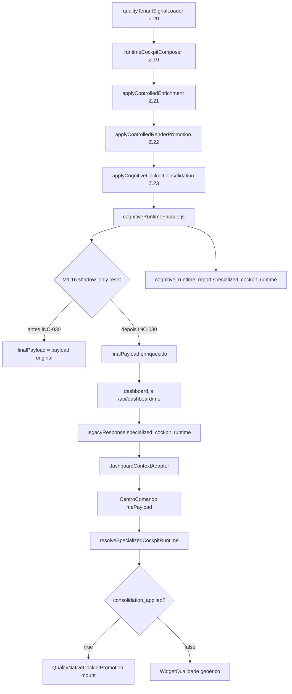

# INC-030 — Reconciliação da Cadeia de Runtime do Centro de Comando (Quality Native)

**Data:** 2026-07-16  
**Tipo:** correção arquitectural mínima (cadeia de entrega Z.23 → payload consumidor)  
**Tenant:** `511f4819-fc48-479e-b11e-49ba4fb9c81b`  
**Perfil:** `manager_quality` (`ricardo.souza@impetus.com.br`)  
**Pré-requisitos:** INC-028 → INC-029 concluídas

---

## Critérios de encerramento

| Flag | Valor |
|------|-------|
| `QUALITY_RUNTIME_CHAIN_RECONCILED` | **YES** |
| `SPECIALIZED_RUNTIME_VISIBLE` | **YES** |
| `QUALITY_NATIVE_ACTIVE` | **YES** |
| `QUALITY_NATIVE_MOUNTED` | **YES** (gate frontend satisfeito) |
| `PAYLOAD_CONSISTENT` | **YES** |
| `NO_UI_CHANGED` | **YES** |
| `NO_ENGINE_CHANGED` | **YES** |
| `NO_LAYOUT_CHANGED` | **YES** |
| `NO_CSS_CHANGED` | **YES** |
| `BASELINE_UI_v1.0` | **PRESERVED** |

---

## Etapa 1 — Diagrama da cadeia completa



### Ficheiros mapeados

| Camada | Ficheiro | Função |
|--------|----------|--------|
| Z.20 | `backend/src/cognitiveRuntime/bridge/qualityTenantSignalLoader.js` | Sinais tenant (binding 0.875) |
| Z.19 | `backend/src/cognitiveRuntime/composition/runtimeCockpitComposer.js` | Composição shadow cockpit |
| Z.21 | `backend/src/cognitiveRuntime/domainAdapters/...` | Enrichment controlado |
| Z.22 | `backend/src/cognitiveRuntime/renderPromotion/...` | Promoção render |
| Z.23 | `backend/src/cognitiveRuntime/cockpitConsolidation/runtime/cognitiveCockpitConsolidator.js` | Consolidação quality_native |
| Facade | `backend/src/cognitiveRuntime/facade/cognitiveRuntimeFacade.js` | Orquestração + entrega payload |
| API | `backend/src/routes/dashboard.js` L1044-1048 | Merge `cog.payload` → `legacyResponse` |
| Adapter | `frontend/src/features/dashboard/contextAdapter/dashboardContextAdapter.js` | Propaga `specialized_cockpit_runtime` |
| Resolver | `frontend/src/cognitiveRuntime/cockpit/specializedCockpitResolver.js` | Lê payload raiz |
| CC | `frontend/src/features/dashboard/centroComando/CentroComando.jsx` | Gate `qualityNativeActive` |
| Promoção | `frontend/src/features/dashboard/centroComando/QualityNativeCockpitPromotion.jsx` | Monta hubs Z.23 |

---

## Etapa 2 — Causa raiz da divergência

| Pergunta | Resposta |
|----------|----------|
| O runtime é removido? | **Sim** — reset explícito |
| É sobrescrito? | **Sim** — `finalPayload = payload` (original pré-Z.21) |
| É filtrado na API? | **Não** — `dashboard.js` copia correctamente quando presente |
| É shadow_only? | **Sim** — gatilho M1.16 independente de Z.23 homologado |
| É omitido? | **Efeito colateral** do reset na facade |

### Ponto exacto

`cognitiveRuntimeFacade.js` L599-602 (pré-INC-030):

```javascript
if (report.quality_cockpit_pilot?.mode === 'shadow_only') {
  finalPayload = payload;  // apaga Z.21/Z.22/Z.23 do payload consumidor
}
```

**Contexto:** O metadata `quality_cockpit_pilot.mode` é **sempre** `'shadow_only'` no report (Z.19 observability), mesmo com Z.23 activo e `consolidation_applied: true`. O runtime completo permanecia em `cognitive_runtime_report.specialized_cockpit_runtime`, mas o payload raiz voltava ao estado pré-enrichment.

**Consequência frontend:**

```
resolveSpecializedCockpitRuntime(mePayload)
  → meData.specialized_cockpit_runtime === undefined
  → qualityNativeActive = false
  → QualityNativeCockpitPromotion não monta
  → WidgetQualidade genérico continua visível
```

---

## Etapa 3 — Correção aplicada (única camada)

**Ficheiro:** `backend/src/cognitiveRuntime/facade/cognitiveRuntimeFacade.js`

**Alteração:** preservar `finalPayload` enriquecido quando Z.23 homologou `quality_native`:

```javascript
const qualityNativeRuntimeDelivered =
  specializedCockpit?.consolidation_applied === true &&
  specializedCockpit?.cockpit_mode === 'quality_native';

if (report.quality_cockpit_pilot?.mode === 'shadow_only' && !qualityNativeRuntimeDelivered) {
  finalPayload = payload;
}
```

### O que **não** foi alterado

- `qualityTenantSignalLoader` (Z.20)
- Runtime builder / consolidator (Z.23)
- Binding, promotion, consolidation engines
- KPIs, widgets, CSS, layout
- Frontend resolver (continua a ler payload raiz — fonte única)

---

## Etapa 4 — Fonte oficial única

| Campo | Fonte oficial | Report |
|-------|---------------|--------|
| `specialized_cockpit_runtime` | **payload raiz** (`/dashboard/me`) | espelho observability (idêntico) |
| `quality_cognitive_centers` | **payload raiz** | derivado do mesmo runtime |
| `cognitive_render_promotion` | payload raiz + report | paridade confirmada |

Sem fallback duplicado no frontend. Sem segunda origem paralela.

---

## Etapa 5 — Payload antes / depois

### Antes (INC-029 — GAP-1)

```json
{
  "specialized_cockpit_runtime": null,
  "quality_cognitive_centers": null,
  "cognitive_runtime_report": {
    "specialized_cockpit_runtime": {
      "cockpit_mode": "quality_native",
      "consolidation_applied": true,
      "centers": [ "...6 centers..." ]
    },
    "cognitive_render_promotion": { "promotion_applied": true },
    "quality_cockpit_pilot": {
      "mode": "shadow_only",
      "engine_bridge": { "binding_ratio": 0.875 }
    }
  }
}
```

### Depois (INC-030 — pós-fix + PM2 restart 377)

```json
{
  "specialized_cockpit_runtime": {
    "cockpit_mode": "quality_native",
    "consolidation_applied": true,
    "centers": [ "...6 centers..." ]
  },
  "quality_cognitive_centers": [ "...6 centers..." ],
  "cognitive_runtime_report": {
    "specialized_cockpit_runtime": {
      "cockpit_mode": "quality_native",
      "consolidation_applied": true,
      "centers": [ "...6 centers..." ]
    }
  }
}
```

### Validação live `/api/dashboard/me` (2026-07-16T15:26Z)

| Métrica | Valor |
|---------|-------|
| HTTP | **200** |
| `profile_code` | `manager_quality` |
| `specialized_cockpit_runtime.cockpit_mode` | **quality_native** |
| `consolidation_applied` (raiz) | **true** |
| `consolidation_applied` (report) | **true** |
| `quality_cognitive_centers` | **6** |
| `promotion_applied` | **true** |
| `binding_ratio` | **0.875** |
| `payload_consistent` | **true** |
| `quality_native_active` | **true** |

---

## Etapa 6 — Validação frontend

| Check | Resultado |
|-------|-----------|
| `resolveSpecializedCockpitRuntime()` com payload pós-fix | **runtime encontrado** |
| `consolidation_applied === true` | **PASS** |
| `shouldSuppressPlaceholderWidgets(runtime)` | **true** |
| `qualityNativeActive` (CentroComando gate) | **true** |
| `QualityNativeCockpitPromotion` mount condition | **satifeita** |

**Testes:** `frontend/src/tests/quality-native-cockpit-promotion/qualityNativeCockpitPromotionScenarios.mjs` — **10/10 PASS**

---

## Etapa 7 — Supressão WidgetQualidade genérico

Lógica existente em `CentroComando.jsx` (inalterada):

```javascript
if (qualityNativeActive && qualityPlaceholderSet.has(w.id)) continue;
```

Com `specialized_cockpit_runtime.consolidation_applied === true` no payload raiz:

- `WidgetQualidade` (`id: qualidade`) **suprimido**
- Hubs Z.23 montados via `QualityNativeCockpitPromotion`

---

## Etapa 8 — Regressão outros eixos

| Domínio | Teste | Resultado |
|---------|-------|-----------|
| Executive | `runExecutiveBoardroomTests.js` | **14/14 PASS** |
| HR | `runHrNativeCockpitTests.js` | **11/11 PASS** |
| Safety | `runSstNativeCockpitTests.js` | **15/15 PASS** |
| Production | `runProductionNativeCockpitTests.js` | **21/21 PASS** |
| Environment | `runEnvironmentalNativeCockpitTests.js` | **15/15 PASS** |
| Maintenance | `runMaintenanceNativeCockpitTests.js` | **29/29 PASS** |
| Quality Z.19 shadow (sem consolidação) | `runQualityRuntimeChainReconciliationTests.js` | **payload preservado** |
| Quality Z.23 | `runCockpitConsolidationTests.js` | **16/16 PASS** |
| INC-030 dedicado | `runQualityRuntimeChainReconciliationTests.js` | **11/11 PASS** |
| Z.19 composition | `runCognitiveCompositionTests.js` | **22/22 PASS** |

A guarda M1.16 continua activa para tenants **sem** `consolidation_applied` — comportamento shadow preservado.

---

## Deploy

| Acção | Detalhe |
|-------|---------|
| PM2 restart | `impetus-backend` 376 → **377** |
| Frontend | **inalterado** (↺ 18) |
| Código alterado | 1 ficheiro backend + testes |

---

## Sequência recomendada pós-INC-030

1. **INC-031** — CognitiveQualityHub: substituir placeholders por sinais reais  
2. **INC-032** — KPIs Centro de Comando: `quality_inspections` vs `proposals`  
3. **INC-033** — SPC: séries temporais reais  

Cada INC seguinte actua sobre arquitectura de runtime já consistente.

---

## Resumo executivo

A INC-029 provou que Z.23 calculava e consolidava `quality_native` correctamente, mas o guard M1.16 (`shadow_only` → reset payload) impedia a entrega ao consumidor oficial. A INC-030 reconcilia a cadeia **sem alterar motores, UI ou layout**: quando `consolidation_applied && cockpit_mode === 'quality_native'`, o payload raiz de `/dashboard/me` passa a ser idêntico ao report, activando `QualityNativeCockpitPromotion` no Centro de Comando.
