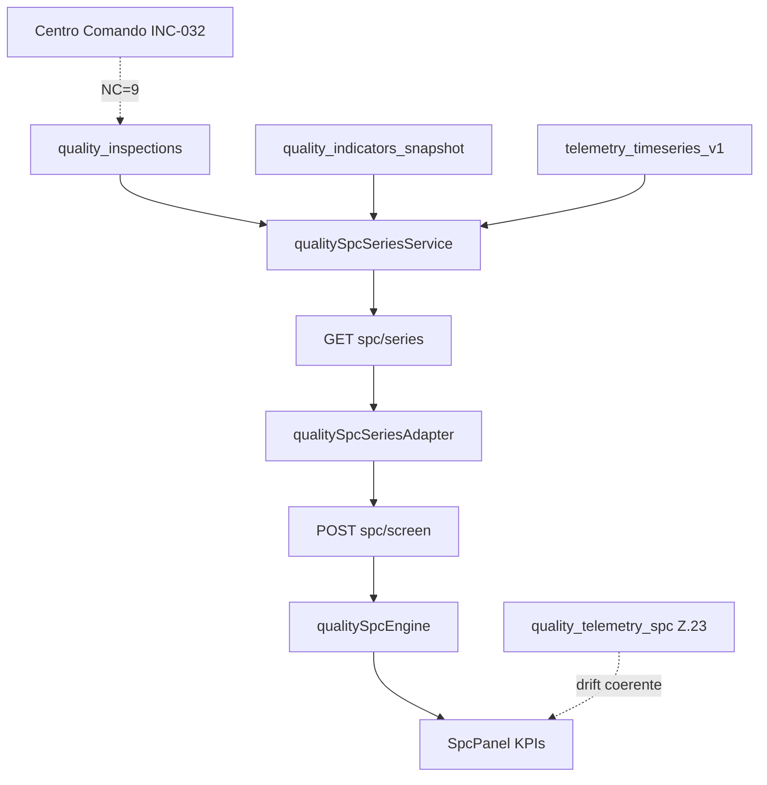

# INC-033 — Reconciliação das Séries Temporais SPC (Quality Native)

**Data:** 2026-07-16  
**Tipo:** reconciliação de origem de dados (SPC Governance)  
**Tenant:** `511f4819-fc48-479e-b11e-49ba4fb9c81b`  
**Perfil:** `manager_quality` (`ricardo.souza@impetus.com.br`)  
**Pré-requisitos:** INC-028 → INC-032 concluídas

---

## Critérios de encerramento

| Flag | Valor |
|------|-------|
| `SPC_REAL_TIMESERIES` | **YES** |
| `PLACEHOLDER_SERIES` | **NO** |
| `REAL_MEASUREMENTS` | **YES** |
| `NO_SYNTHETIC_CURVES` | **YES** |
| `NO_INTERPOLATION` | **YES** |
| `NO_LAYOUT_CHANGED` | **YES** |
| `NO_CSS_CHANGED` | **YES** |
| `NO_RUNTIME_CHANGED` | **YES** |
| `BASELINE_UI_v1.0` | **PRESERVED** |
| `QUALITY_BASELINE_v1.0` | **PRESERVED** |

---

## Etapa 1 — Auditoria SPC (origem antiga)

| Componente | Localização | Problema |
|------------|-------------|----------|
| **`SpcPanel`** | `QualityGovernanceHub.jsx` L46–51 | Subgrupos **hardcoded** `[10.1, 10.2…]` enviados a `screenSpc()` |
| **`QualityTelemetryHub`** | `QualityTelemetryHub.jsx` | Sem gráfico SPC; ingestão manual spot (não mock de série) |
| **`SPCGovernance` / `ProcessStability`** | — | **Não existem** como componentes frontend; `bindProcessStability` só no backend Z.20 (não alterado) |
| **`qualityCognitiveRuntimeSignalAdapter`** | `qualityCognitiveRuntimeSignalAdapter.js` | Extrai `process_values` / `spc_subgroup_means` do runtime se existirem — **sem geração mock** |
| **Rota SPC screen** | `POST /quality-governance/intelligence/spc/screen` | Motor real (`qualitySpcEngine`) mas UI enviava payload sintético |

### Ponto crítico eliminado

```javascript
// ANTES (QualityGovernanceHub.jsx)
subgroups: [
  [10.1, 10.2, 10.0, 10.3, 10.1],
  [10.2, 10.0, 10.1, 10.2, 10.0],
  [10.4, 10.9, 11.0, 10.8, 11.2]
]
```

---

## Etapa 2 — Inventário datasets reais

| Dataset | Existe (BD) | Registos tenant | Uso INC-033 |
|---------|-------------|-----------------|-------------|
| `quality_inspections` | ✅ | **9** (defects_count=3) | **Primária** — subgrupos SPC |
| `quality_indicators_snapshot` | ✅ | **1** | Metadados série (insuficiente para subgrupos) |
| `telemetry_timeseries_v1` (domain=quality) | ✅ | **9** (várias metric_keys) | Série telemetria; `quality.spc_value` = **1 ponto** |
| `quality_operational_metrics` | runtime Z.21 | payload | Drift/deterioration — **não alterado** |
| `quality_telemetry_spc` | center Z.23 | runtime | Drift cognitivo — **não alterado** |
| `quality_timeseries` | ❌ | — | Documentado ausente |
| `quality_measurements` | ❌ | — | Documentado ausente |

---

## Etapa 3 — Adapter único

### Backend: `qualitySpcSeriesService.js`

```
quality_inspections (+ snapshot + telemetry)
        ↓
buildSubgroupsFromMeasurements (sem padding)
        ↓
GET /quality-governance/intelligence/spc/series
        ↓
SpcPanel (via adapter frontend)
```

**Regras:**
- Prioridade: `quality_inspections.defects_count` cronológico
- Fallback: `telemetry_timeseries_v1.quality.spc_value` (só se ≥ 2 subgrupos completos)
- Fallback: `quality_indicators_snapshot` (só se ≥ 4 medições)
- **Nunca** interpolar, pad, ou inventar tendência

### Frontend: `qualitySpcSeriesAdapter.js` + `qualitySpcSeriesAdapterCore.js`

```
getSpcSeries() → subgrupos reais
        ↓
screenSpc(subgroups) → motor governance
        ↓
normalizeSpcScreenResponse() → SpcPanel (Baseline UI v1.0)
```

Estado vazio: **"Sem dados suficientes"**

---

## Etapa 4 — Gráficos / KPIs SPC

| Elemento | Origem | Sintético? |
|----------|--------|------------|
| X̄ médio | `limits.center` de subgrupos reais | **NO** |
| UCL / LCL | `qualitySpcEngine.xbarControlLimits` | **NO** |
| Violations | Nelson / Western Electric sobre médias reais | **NO** |
| Subgrupos | `defects_count` × 9 inspeções → 2×n=4 | **NO** |

---

## Etapa 5 — Séries indisponíveis

| Cenário | Comportamento |
|---------|---------------|
| < 4 medições finitas | `data_available: false`, subgrupos `[]` |
| Telemetria SPC (1 ponto) | Ignorada para subgrupos; inspeções usadas |
| Snapshot único | Não forma subgrupos |
| UI | Mensagem **"Sem dados suficientes"** — sem linha reta fake |

---

## Etapa 6 — Coerência cross-superfície

| Superfície | Estado SPC / Drift | Coerente? |
|------------|-------------------|-----------|
| **SPC Governance** | X̄=3, 2 subgrupos, 9 inspeções | ✅ REAL |
| **Runtime `quality_telemetry_spc`** | drift high, conf 100% | ✅ (INC-031) |
| **Centro de Comando KPIs** | NC=9 via inspections | ✅ (INC-032) |
| **Cognitive Hub** | Drift card runtime | ✅ (INC-031) |
| **QualityTelemetryHub** | Protocolos + ingestão; sem série SPC gráfica | ✅ (escopo preservado) |

Validação adapter: `validateSpcRuntimeCoherence()` compara contagem de subgrupos vs `spc_subgroup_means` runtime quando disponível.

---

## Etapa 7 — Regressão

| Suite | Resultado |
|-------|-----------|
| `runQualitySpcTimeseriesReconciliationTests.js` | **23/23 PASS** |
| `qualitySpcSeriesAdapterScenarios.mjs` | **10/10 PASS** |
| `runQualityCommandCenterKpiReconciliationTests.js` (INC-032) | **9/9 PASS** |
| `runQualitySignalReconciliationTests.js` (INC-028) | **PASS** |
| `quality-governance-runtime` scenarios | **PASS** |
| `runDomainContextualRegression.js` | **48/49** (1 fail pré-existente: `finance bloqueia anomaly_detection`) |

**Runtime Z.20–Z.23, KPIs, Cognitive Hub, layout, CSS:** não alterados.

---

## Validação live (pós-deploy PM2 #379)

```json
GET /api/quality-governance/intelligence/spc/series
{
  "ok": true,
  "data_available": true,
  "subgroup_meta": {
    "subgroup_count": 2,
    "subgroup_size": 4,
    "primary_source": "quality_inspections",
    "measurement_count": 8
  },
  "series": { "inspections": 9 }
}

POST /api/quality-governance/intelligence/spc/screen (subgrupos reais)
{
  "ok": true,
  "result": { "limits": { "center": 3, "ucl": 3, "lcl": 3 }, "violation_count": 0 }
}
```

> Com 9 inspeções idênticas (defects_count=3), limites colapsam em X̄=3 — comportamento estatístico honesto, não estética artificial.

---

## Ficheiros alterados

| Ficheiro | Alteração |
|----------|-----------|
| `backend/.../spc/qualitySpcSeriesService.js` | **NOVO** — adapter BD → subgrupos |
| `backend/src/routes/qualityGovernance.js` | **GET** `/intelligence/spc/series` |
| `frontend/.../qualitySpcSeriesAdapter.js` | **NOVO** — fetch + screen |
| `frontend/.../qualitySpcSeriesAdapterCore.js` | **NOVO** — funções puras |
| `frontend/.../QualityGovernanceHub.jsx` | `SpcPanel` — origem real via adapter |
| `frontend/src/services/api.js` | `getSpcSeries()` |
| `backend/tests/.../runQualitySpcTimeseriesReconciliationTests.js` | **NOVO** |
| `frontend/src/tests/quality-spc-series/...` | **NOVO** |

---

## Diagrama pós-INC-033



---

## Observação operacional

Gráfico/KPI simples com **poucos pontos reais** (2 subgrupos, X̄ constante) é preferível a curva artificial. Princípio **honestidade dos dados > estética** mantido — alimenta drift, estabilidade e previsões sem regressão futura.

**Próximo bloco sugerido:** PPAP / MSA / Ishikawa — após SPC consolidado.
