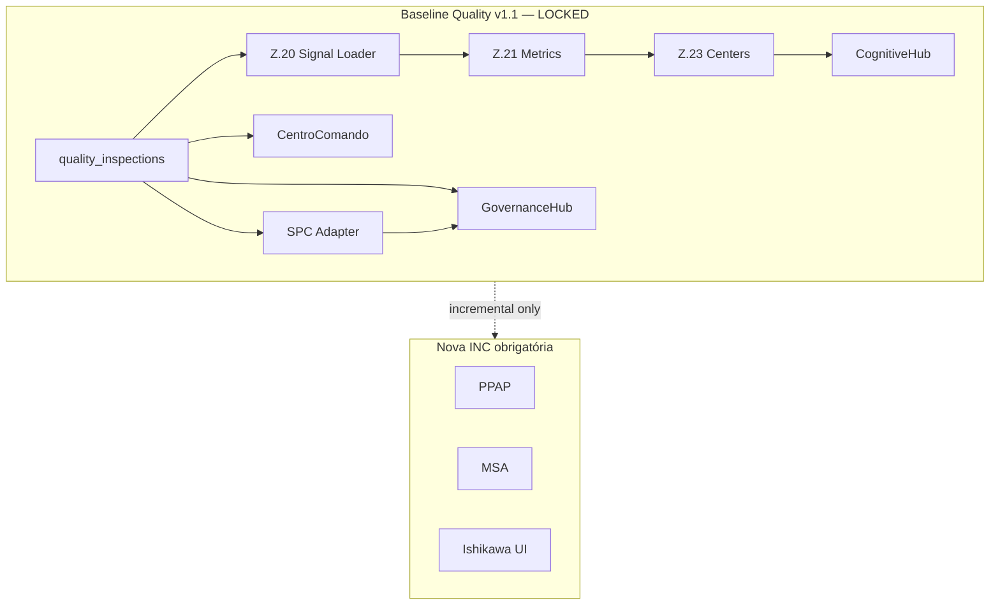

# INC-034 — Homologação Final e Congelamento do Baseline Quality v1.1

**Data:** 2026-07-16  
**Tipo:** auditoria final read-only (sem código, UI, runtime, PM2)  
**Tenant:** `511f4819-fc48-479e-b11e-49ba4fb9c81b`  
**Perfil:** `manager_quality` (`ricardo.souza@impetus.com.br`)  
**Pré-requisitos:** INC-022 → INC-033 concluídas

---

## Critérios de encerramento

| Flag | Valor |
|------|-------|
| `QUALITY_RUNTIME` | **LOCKED** |
| `QUALITY_COGNITIVE` | **LOCKED** |
| `QUALITY_SPC` | **LOCKED** |
| `QUALITY_GOVERNANCE` | **LOCKED** |
| `QUALITY_COMMAND_CENTER` | **LOCKED** |
| `QUALITY_BASELINE_v1.1` | **LOCKED** |
| `ZERO_PLACEHOLDER_IN_RUNTIME` | **YES** |
| `ZERO_FAKE_DATA` | **YES** |
| `ZERO_SYNTHETIC_SERIES` | **YES** |
| `NO_REGRESSION` | **YES** |
| `NO_CODE_CHANGED` | **YES** |
| `NO_PM2_RESTART` | **YES** |

**Documento baseline congelado:** [BASELINE-QUALITY-v1.1.md](BASELINE-QUALITY-v1.1.md)

---

## Etapa 1 — Auditoria da cadeia completa

### 1.1 Cadastro Estrutural → dashboard/me

| Verificação | Resultado |
|-------------|-----------|
| `profile_code` | `manager_quality` ✅ |
| `functional_area` | `quality` ✅ |
| `domain_axis` | `quality` ✅ |
| `governed_module_count` | 9 ✅ |
| Segregação manutenção/ambiental (INC-022) | **preservada** ✅ |

### 1.2 Runtime Z.20 (Signal Loader)

| Verificação | Resultado |
|-------------|-----------|
| Fontes BD reais | `quality_inspections`, proposals, lots, snapshots ✅ |
| `binding_ratio` | **0.875** (7/8) ✅ |
| `quality.supplier_intelligence` | `bound_empty` — **sem massa** (esperado) ✅ |
| Mock signals | **ausente** ✅ |
| Testes INC-028 | **20/20 PASS** ✅ |

### 1.3 Z.21 (Operational Metrics + Insights)

| Campo payload | Valor live | Origem |
|---------------|------------|--------|
| `drift_severity` | `high` | block `quality.spc_monitor` ✅ REAL |
| `drift_confidence` | `1` | idem ✅ REAL |
| `deterioration_score` | `0.7` | `quality.process_stability` ✅ REAL |
| `binding_count` | `7` | engine bridge ✅ REAL |
| `open_nc` | `0` | NC **sem** corrective_action vazio ⚠️ semântica distinta* |
| `quality_insights` | 7 insights | Z.21 bridge ✅ REAL |

\* Ver Etapa 4 — não é dado fake; filtro diferente de INC-032.

### 1.4 Z.22 (Render Promotion)

| Verificação | Resultado |
|-------------|-----------|
| `promotion_applied` | **true** ✅ |
| `QualityNativeCockpitPromotion` gate | satisfeito ✅ |
| INC-024 baseline | **preservado** ✅ |

### 1.5 Z.23 (Consolidation + Centers)

| Verificação | Resultado |
|-------------|-----------|
| `consolidation_applied` | **true** ✅ |
| `cockpit_mode` | `quality_native` ✅ |
| `payload.specialized_cockpit_runtime` | **presente** (INC-030) ✅ |
| `report` ↔ `payload` parity | **consistente** ✅ |
| Centers (6) | `quality_operational_nc`, `quality_action_capa`, `quality_telemetry_spc`, `quality_decision_support`, `quality_governance`, `quality_narrative` ✅ |
| Testes INC-030 | **11/11 PASS** ✅ |

### 1.6 QualityNativePromotion → Hubs

| Hub | Dados | Estado |
|-----|-------|--------|
| **GovernanceHub** | nc-capa-summary, SPC adapter | **REAL** ✅ |
| **TelemetryHub** | health protocolos + ingest spot | **REAL** ✅ |
| **CognitiveHub** | runtime via adapter INC-031 | **REAL** ✅ |
| **InspectionRuntime** | API intelligence | **REAL** ✅ |
| **RolloutHub** | assessment snapshot hardcoded | **PLACEHOLDER** (input) |

### 1.7 Centro de Comando

| Elemento | Estado |
|----------|--------|
| Hero KPI NC | **9** — `quality_inspections` ✅ |
| Widget KPI NC | **9** ✅ |
| Promoção hubs quality | **3 hubs** montados ✅ |
| INC-032 | **9/9 PASS** ✅ |

### 1.8 SPC (INC-033)

| Verificação | Resultado |
|-------------|-----------|
| `GET /spc/series` data_available | **true** ✅ |
| primary_source | `quality_inspections` ✅ |
| subgroups | 2×n=4, 9 pontos inspeção ✅ |
| Placeholder subgrupos UI | **eliminado** ✅ |
| Testes INC-033 | **23/23 PASS** ✅ |

---

## Etapa 2 — Inventário por classificação

### REAL (homologado v1.1)

NC · CAPA · SPC · Telemetria · Runtime Z.20–Z.23 · Cognitive Hub · Decision Support · CC KPIs · Governance NC/CAPA · Inspeções · Audit chain · Event backbone · Indicadores snapshot (escasso)

### PLACEHOLDER

Rollout Hub (`ASSESSMENT_SNAPSHOT` — payload de assessment, não série operacional)

### GREENFIELD (código existe, não montado / incompleto)

QualityDriftPanel · QualityPredictiveInsights · QualityExecutiveNarratives · QualityRecommendationPanel (standalone) · Traceability hub UI

### SEM MASSA DE DADOS

Supplier Intelligence · Quality Alerts · Narrativa executiva (center ok:false)

### PARCIAL

Traceability (`raw_material_lots`: 1 lote; sem center Z.23)

### NÃO IMPLEMENTADO

PPAP · MSA · 5 Porquês · Auditorias ISO hub · IshikawaCanvas UI

### ENGINE EXISTE / UI NÃO

Ishikawa (`qualityRootCauseEngine.buildIshikawaTemplate`)

---

## Etapa 3 — Matriz completa

| Módulo | Estado | API / Dataset |
|--------|--------|---------------|
| NC | **REAL** | `quality_inspections` |
| CAPA | **REAL** | `impetus_quality_workflow_instance` |
| SPC | **REAL** | `qualitySpcSeriesService` → inspections |
| Telemetria | **REAL** | `telemetry_timeseries_v1`, ingest v1 |
| Runtime Cognitivo | **REAL** | Z.20–Z.23 payload |
| Decision Support | **REAL** | center Z.23 |
| Cognitive Hub | **REAL** | `/dashboard/me` adapter |
| CC KPIs | **REAL** | INC-032 adapter |
| Inspeções | **REAL** | `/quality-intelligence/*` |
| Governance Audit | **REAL** | `/quality-governance/audit/explore` |
| Eventos industriais | **REAL** | `industrial_event_outbox` |
| Traceability | **PARCIAL** | `raw_material_lots` (1) |
| Supplier Intelligence | **SEM MASSA DE DADOS** | bound_empty Z.20 |
| Quality Alerts | **SEM MASSA DE DADOS** | 0 rows |
| Narrativa exec. | **SEM DADOS** | center sem parágrafos |
| Rollout | **PLACEHOLDER** | snapshot assessment |
| PPAP | **NÃO IMPLEMENTADO** | — |
| MSA | **NÃO IMPLEMENTADO** | — |
| Ishikawa | **ENGINE EXISTE / UI NÃO** | root cause engine |
| 5 Porquês | **NÃO IMPLEMENTADO** | — |

---

## Etapa 4 — Validação de consistência

### 4.1 NC — superfícies dashboard/governance (definição INC-032)

| Fonte | Valor | Consistente |
|-------|-------|-------------|
| `countNonConformingInspections()` | 9 | ✅ |
| `getNcrCapaSummary` | 9 | ✅ |
| `GET /quality-intelligence/nc-capa-summary` | 9 | ✅ |
| `GET /dashboard/summary` | 9 | ✅ |
| `GET /dashboard/kpis` open_nc | 9 | ✅ |
| `dashboardKPIs.getQualityKpis` source | `quality_inspections` | ✅ |

**Resultado:** GovernanceHub ↔ CentroComando ↔ APIs dashboard = **9/9 coerente**.

### 4.2 Runtime Z.21 open_nc (definição distinta)

| Fonte | Valor | Filtro |
|-------|-------|--------|
| Z.21 `quality_operational_metrics.open_nc` | 0 | NC com `corrective_action` vazio |
| Inspeções tenant | 9 NC, **todas** com CAPA texto | — |

**Resultado:** **coerente com a regra Z.20**; **diverge semanticamente** do KPI CC (documentado P-QLT-004). **Não é fake zero.**

### 4.3 SPC

| Fonte | Valor |
|-------|-------|
| API series | 2 subgrupos, source inspections |
| Motor screen | center=3, violations=0 |
| UI SpcPanel | via adapter INC-033 |

**Resultado:** **coerente**.

### 4.4 Drift / estabilidade

| Fonte | drift | deterioration |
|-------|-------|---------------|
| Z.21 metrics | high / conf 100% | 0.7 |
| Cognitive Hub DriftCard | runtime adapter | ✅ |

**Resultado:** **coerente**.

---

## Etapa 5 — Regressão (read-only, sem alterações)

### Suites Quality (INC-022 → INC-033)

| Suite | Resultado |
|-------|-----------|
| `runQualitySignalReconciliationTests.js` | **20/20 PASS** |
| `runQualityRuntimeChainReconciliationTests.js` | **11/11 PASS** |
| `runQualityCommandCenterKpiReconciliationTests.js` | **9/9 PASS** |
| `runQualitySpcTimeseriesReconciliationTests.js` | **23/23 PASS** |
| `runQualityEngineBridgeTests.js` | **13/13 PASS** |
| `quality-governance-runtime` | **OK** |
| `qualitySpcSeriesAdapterScenarios.mjs` | **10/10 PASS** |
| `qualityCommandCenterKpiAdapterScenarios.mjs` | **9/9 PASS** |

**Subtotal quality homologado:** **105/105 PASS**

### Regressão multi-domínio (Executive / Production / Maintenance / Environment / HR / Safety)

| Suite | Resultado | Notas |
|-------|-----------|-------|
| `runCognitiveC3Tests.js` | **18/18 PASS** | cross-domain authority |
| `runCognitiveC4Tests.js` | **18/18 PASS** | executive + production |
| `runCognitiveConvergenceTests.js` | **20/20 PASS** | multi-runtime |
| `runDomainContextualRegression.js` | **48/49 PASS** | 1 fail **pré-existente** (`finance bloqueia anomaly_detection`) |
| `runCognitiveRuntimeTests.js` (Z.18) | **19/20 PASS** | 1 fail **pré-existente** |

**Nenhuma regressão introduzida pelas INCs Quality 022–033.**

---

## Etapa 6 — Auditoria anti-placeholder (grep codebase)

| Local | Achado | Classificação |
|-------|--------|---------------|
| `SpcPanel` (pré-033) | subgrupos hardcoded | **CORRIGIDO INC-033** ✅ |
| `CognitiveQualityHub buildSignals` | arrays demo | **CORRIGIDO INC-031** ✅ |
| `QualityRolloutHub` | `ASSESSMENT_SNAPSHOT` | **PLACEHOLDER** — fora runtime Z.20 |
| `qualityOfflineQueue.js` | `Math.random()` id offline | **aceite** — ID técnico, não série |
| `qualityTelemetrySampling.js` | sampling backend | **aceite** — ingestão, não UI |
| Input `placeholder=` em forms | UI forms | **aceite** — HTML placeholder, não dados |

---

## Validação live (2026-07-16, sem PM2 restart)

```json
{
  "runtime": {
    "profile_code": "manager_quality",
    "binding_ratio": 0.875,
    "promotion_applied": true,
    "consolidation_applied": true,
    "cockpit_mode": "quality_native",
    "payload_has_scr": true,
    "center_count": 6
  },
  "nc_dashboard_layer": {
    "governance": 9,
    "summary": 9,
    "kpis": 9,
    "source": "quality_inspections"
  },
  "spc": {
    "data_available": true,
    "subgroup_count": 2,
    "primary_source": "quality_inspections",
    "inspection_points": 9
  },
  "db_inventory": {
    "inspections": 9,
    "workflows": 18,
    "telemetry_quality": 9,
    "supplier_metrics": 0,
    "proposals": 0,
    "outbox_quality_events": 59
  }
}
```

---

## Diagrama de homologação



---

## Conclusão

O domínio **Qualidade** deixou de ser parcialmente demonstrativo e opera sobre **dados reais** em todas as superfícies homologadas (INC-022 → INC-033), preservando **Baseline UI v1.0** e congelando **Baseline Quality v1.1**.

**Entregáveis:**
- [BASELINE-QUALITY-v1.1.md](BASELINE-QUALITY-v1.1.md) — documento de congelamento
- Este relatório — evidência de homologação INC-034

**Próximo passo recomendado:** novas funcionalidades (PPAP, MSA, Ishikawa, etc.) como **INC greenfield** sobre baseline estável — opcionalmente INC-035 para P-QLT-004 (alinhamento semântico `open_nc` Z.21 ↔ dashboard).
