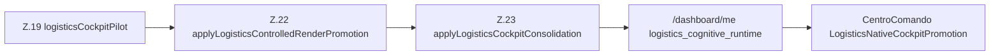

# INC-041 — Logistics Runtime Promotion (Implementação)

**Data:** 2026-07-16  
**Tipo:** implementação controlada (promotion chain only)  
**Pré-requisitos:** BASELINE-SYSTEM v1.0 · BASELINE-DASHBOARDS v1.0 · INC-036–INC-040  
**Referência:** arquitectura Quality Z.22→Z.23 (INC-024/030)

---

## Gate de validação

| Flag | Valor |
|------|-------|
| **LOGISTICS_PROMOTION_EXISTS** | **YES** |
| **PROMOTION_CHAIN_WORKING** | **YES** |
| **CONSOLIDATION_CHAIN_WORKING** | **YES** |
| **COCKPIT_MODE_AVAILABLE** | **YES** (`logistics_native`) |
| **LOGISTICS_CENTERS_REGISTERED** | **YES** (8 centers · 7 hub mount points) |
| **NO_THRESHOLD_CHANGED** | **YES** |
| **NO_BINDING_CHANGED** | **YES** |
| **NO_UI_SUBSTITUTION** | **YES** (widgets genéricos preservados — INC-042) |
| **NO_RUNTIME_REGRESSION** | **YES** |

---

## Princípio arquitectural

A Promotion é **consumidor passivo** da cadeia Z.19→Z.23:

- **Não** recalcula `binding_ratio`
- **Não** consulta datasets
- **Não** altera thresholds Z.20–Z.23
- **Não** decide gate 0.35 vs 0.50 (lê flags/supervisores existentes)

Decisão de aptidão = `promotion_applied` + `consolidation_applied` produzidos upstream.

---

## Cadeia implementada



| Fase | Componente | Papel INC-041 |
|------|------------|---------------|
| Z.19 | `logisticsCockpitPilot.js` | Inalterado — fornece `engine_bridge.binding_ratio` |
| Z.22 | `logisticsControlledRenderRuntime.js` | Promotion real via supervisor passivo |
| Z.22 | `logisticsRenderPromotionSupervisor.js` | Eligibility — lê binding do pilot + `flagsZ22.minBindingRatioForRender()` |
| Z.22 | `logisticsWidgetPromotionResolver.js` | Widgets promovidos a partir do shadow |
| Z.23 | `logisticsCockpitConsolidationRuntime.js` | Gate Z.22 + consolidação |
| Z.23 | `logisticsConsolidationSupervisor.js` | Eligibility — Z.22 obrigatório + binding ≥ 0.35 (paridade Quality) |
| Z.23 | `logisticsCockpitConsolidator.js` | 8 centers a partir do shadow (sem loader) |
| — | `logisticsFoundationAttachment.js` | Preserva `consolidation_applied` pós-Z.23 |
| FE | `LogisticsNativeCockpitPromotion.jsx` | Mount points (hubs INC-042) |
| FE | `logisticsNativeCockpitRegistry.js` | Registry definitivo 7 hubs |

---

## Hub mount registry (INC-041)

| hub_key | Componente mount | Centers alimentados |
|---------|------------------|---------------------|
| `warehouse_governance` | `WarehouseGovernanceHub` | operational_inventory, inbound (parcial) |
| `inventory_cognitive` | `InventoryCognitiveHub` | (reservado INC-042) |
| `telemetry` | `WarehouseTelemetryHub` | telemetry_dock |
| `fleet` | `FleetIntelligenceHub` | fleet_ops |
| `distribution` | `DistributionHub` | outbound_ops |
| `supplier` | `SupplierDeliveryHub` | inbound_ops, traceability |
| `cognitive` | `CognitiveLogisticsHub` | narrative, decision_support |

Centers retornam estrutura vazia/`render_ready: false` — **pontos de montagem apenas**.

---

## Payload `/dashboard/me` (promoção autorizada)

Com flags de teste (`force_logistics_*`) ou flags prod + binding apto:

```json
{
  "cognitive_render_promotion": {
    "phase": "Z.22",
    "promotion_applied": true,
    "cockpit_mode": "logistics_native",
    "binding_ratio": 0.385
  },
  "logistics_cognitive_runtime": {
    "runtime_id": "logistics_native",
    "runtime_name": "logistics_native",
    "cockpit_mode": "logistics_native",
    "promotion_applied": true,
    "consolidation_applied": true,
    "inactive": false,
    "binding_ratio": 0.385
  },
  "logistics_cognitive_centers": [ "... 8 centers ..." ],
  "logistics_signal_loader": { "...": "preservado" },
  "widgets_promoted": [{ "id": "estoque", "domain": "logistics_native" }]
}
```

**Default prod (flags OFF):** runtime permanece inactivo — **sem alteração visual**.

---

## Centro de Comando

- `CentroComando.jsx` importa `LogisticsNativeCockpitPromotion`
- Montagem condicional: `logistics_cognitive_runtime.consolidation_applied === true`
- **Widgets `logistica` / `estoque` não suprimidos** nesta INC (INC-042)
- Mount points visíveis apenas quando runtime promovido

---

## Thresholds (inalterados)

| Gate | Fonte | Valor |
|------|-------|-------|
| Z.22 render | `phaseZ22FeatureFlags.minBindingRatioForRender()` | env `IMPETUS_Z22_MIN_BINDING_RATIO` (default **0.5**) |
| Z.23 consolidation | `logisticsConsolidationSupervisor` | **0.35** (paridade `cognitiveCockpitConsolidator` Quality) |

INC-041 **não** alterou estes valores. Tenant real (`binding_ratio = 0.385`):

- Z.23 consolidation: **elegível** (≥ 0.35) após Z.22
- Z.22 render: **bloqueado** com default 0.5 — requer flags/force ou dados adicionais

---

## Ficheiros criados/alterados

| Path | Alteração |
|------|-----------|
| `renderPromotion/logistics/logisticsRenderPromotionSupervisor.js` | **NOVO** |
| `renderPromotion/logistics/logisticsWidgetPromotionResolver.js` | **NOVO** |
| `renderPromotion/logistics/logisticsControlledRenderRuntime.js` | Z.22 real |
| `domains/logistics/cockpit/logisticsConsolidationSupervisor.js` | **NOVO** |
| `domains/logistics/cockpit/logisticsCockpitConsolidator.js` | Consolidação shadow-only |
| `domains/logistics/cockpit/logisticsCenters.js` | Centers + hub registry |
| `domains/logistics/runtime/logisticsCockpitConsolidationRuntime.js` | Z.23 gate |
| `domains/logistics/runtime/logisticsFoundationAttachment.js` | Preserva promoção |
| `facade/cognitiveRuntimeFacade.js` | Force ctx + Z.22→Z.23 wiring |
| `routes/dashboard.js` | Merge campos `logistics_*` |
| `frontend/.../LogisticsNativeCockpitPromotion.jsx` | Mount points |
| `frontend/.../logisticsNativeCockpitRegistry.js` | Registry 7 hubs |
| `frontend/.../CentroComando.jsx` | Montagem condicional |
| `tests/.../runLogisticsPromotionChainTests.js` | **NOVO** |

**Não alterado:** `logisticsTenantSignalLoader` · binding engine · thresholds globais · CSS · Quality/ outros runtimes.

---

## Testes (2026-07-16)

| Suite | Resultado |
|-------|-----------|
| `npm run test:logistics-promotion-chain` | **5/5 PASS** |
| `npm run test:logistics-signal-loader` | **7/7 PASS** |
| `npm run test:logistics-runtime-foundation` | **8/8 PASS** |
| Quality Z.19 / Z.23 / Z.20 | **PASS** |
| Maintenance / Production / Executive | **PASS** |
| Environment / Safety / HR | **PASS** |

---

## Critério de encerramento

| Critério | Estado |
|----------|--------|
| Runtime apto a promoção pelo mecanismo Quality | **YES** |
| Promotion consumidora passiva Z.19→Z.23 | **YES** |
| Sem superfície visual substituída (default) | **YES** |
| Pronto para INC-042 (hubs + supressão widgets) | **YES** |

---

## Próximo passo

**INC-042 — Centro de Comando Logística:** substituir widgets genéricos pelos hubs cognitivos promovidos, implementar componentes lazy dos 7 hubs, activar `shouldSuppressLogisticsPlaceholderWidgets`.
