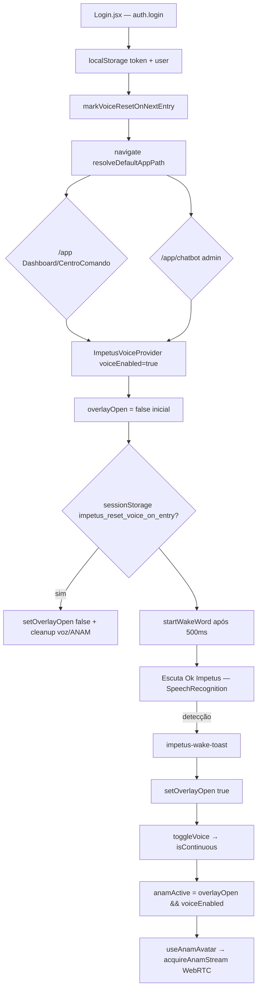

# AUDITORIA — ANAM AUTOSTART, CONSUMO DESNECESSÁRIO E ALERTA SONORO PÓS-SESSÃO

**Classe:** AUDIT (somente diagnóstico — sem alterações de código)  
**Data:** 2026-06-22  
**Escopo:** Fluxo pós-login → overlay/ANAM/WebRTC/microfone → encerramento → áudio residual  
**Ambiente referência:** produção com `ANAM_API_KEY` configurada (`GET /api/anam/public-config` → `enabled: true`)

---

## Resumo executivo

| Pergunta | Resposta |
|----------|----------|
| O overlay/ANAM abre **automaticamente no login** por design? | **Não** — existe reset explícito pós-login |
| Pode abrir **sem intenção do utilizador** na prática? | **Sim** — via wake word (falsos positivos), alertas operacionais por voz, ou atalhos |
| Sessão ANAM/WebRTC no login? | **Não**, desde que `overlayOpen === false` |
| Chamada API ANAM no login? | **Parcial** — `GET /anam/public-config` (cache 120s), **sem** `session-token` |
| Microfone no login? | **Indireto** — wake word via Web Speech API (~500ms após autenticação) |
| Bip pós-sessão (hipótese principal) | **Wake word** reiniciado + possível leak do monitor de barge-in (`getUserMedia` + `setInterval`) |

---

## PARTE A — Fluxo real após login

### Diagrama (código actual)



### 1. Rota após autenticação

| Ficheiro | Comportamento |
|----------|---------------|
| `frontend/src/pages/Login.jsx` L37–46 | Grava token; `markVoiceResetOnNextEntry()`; navega `data.redirect` ou `resolveDefaultAppPath(user)` |
| `frontend/src/utils/defaultAppEntry.js` L25–48 | Liderança/colaborador → `/app`; admin → `/app/chatbot` |
| `frontend/src/pages/Dashboard.jsx` L57–74 | Renderiza `CentroComando` (não abre voz) |

**Conclusão:** a rota prevista é **dashboard** (ou chatbot admin), **não** uma rota ANAM dedicada.

### 2. Quem dispara o overlay?

| Disparador | Ficheiro | Linha | Condição |
|------------|----------|-------|----------|
| Wake word | `ImpetusVoiceProvider.jsx` | 251–258 | Evento `impetus-wake-toast` |
| Alertas operacionais | `ImpetusVoiceProvider.jsx` | 334–377 | `tick()` imediato + intervalo 95s; `setOverlayOpen(true)` após falar alerta |
| Bloco sensível (chat voz) | `ImpetusVoiceProvider.jsx` | 105–107 | `onSensitiveBlock` do `useVoiceEngine` |
| Modo contínuo + user initiated | `ImpetusVoiceProvider.jsx` | 379–388 | `isContinuous && impetus_voice_user_initiated === '1'` |
| Atalho Alt+Shift+V | `ImpetusVoiceProvider.jsx` | 319–331 | Teclado |
| `openOverlay` / `toggleVoice` (UI) | `ImpetusVoiceProvider.jsx` | 463–474 | Sidebar Layout, avatar overlay |
| Retry ANAM | `ImpetusVoiceProvider.jsx` | 186–189 | Reabre overlay 320ms após fechar |
| Float button | `ImpetusVoiceProvider.jsx` | 548 | `visible={false}` — **inactivo** |

**Reset pós-login (anti-autostart):**

```406:428:frontend/src/voice/ImpetusVoiceProvider.jsx
  /** Após login: não manter overlay Anam/Realtime aberto — utilizador entra no dashboard ou IA texto. */
  useEffect(() => {
    ...
    shouldReset = sessionStorage.getItem('impetus_reset_voice_on_entry') === '1';
    ...
    setOverlayOpen(false);
    if (voiceStateRef.current.isContinuous) {
      void closeLiveSession();
    } else {
      stopSpeaking(); stopVoiceCapture(); stopAnamStreamNow();
    }
  }, [voiceEnabled, location.pathname, ...]);
```

**Conclusão:** o código **intencionalmente evita** overlay persistente após login. Se o utilizador vê ANAM ao entrar, a causa é um **disparador downstream** (wake word, alerta, ou sessão contínua residual), não o `navigate()` do login.

---

## PARTE B — Quem inicia a ANAM

| Camada | Ficheiro | Condição | Acção |
|--------|----------|----------|-------|
| Provider | `ImpetusVoiceProvider.jsx` L167 | `anamActive = overlayOpen && voiceEnabled` | Prop `active` do hook |
| Hook | `useAnamAvatar.js` L181–314 | `ANAM_UI_ENABLED && active` | `refreshConfig` → `acquireAnamStream` |
| Singleton | `anamSessionSingleton.js` L520+ | `acquireAnamStream({ mountEl })` | `anam.prepareSession`, `anam.createSessionToken`, `createClient`, WebRTC |

**Prefetch sem sessão (login):**

```175:178:frontend/src/hooks/useAnamAvatar.js
  useEffect(() => {
    if (!ANAM_UI_ENABLED) return undefined;
    void refreshConfig();  // GET /api/anam/public-config apenas
  }, [refreshConfig]);
```

**Conclusão:** **ANAM WebRTC só inicia quando o overlay está aberto.** Não há `startAnam()` autónomo no bootstrap.

---

## PARTE C — Quem inicia WebRTC

| Passo | Ficheiro | Função |
|-------|----------|--------|
| 1 | `useAnamAvatar.js` L228–229 | `acquireAnamStream({ mountEl })` |
| 2 | `anamSessionSingleton.js` L434–440 | `anam.createSessionToken()` + `createClient(sessionToken)` |
| 3 | SDK `@anam-ai/js-sdk` | Streaming vídeo/áudio WebRTC para `#impetus-anam-shared-video` |

**Gatilho único no frontend:** overlay aberto → slot avatar montado → hook activo.

---

## PARTE D — Quem solicita microfone

| Momento | Mecanismo | Ficheiro | getUserMedia? |
|---------|-----------|----------|---------------|
| Pós-login (escuta wake) | `WakeWordDetector` + Web Speech API | `wakeWordDetector.js` | **Não directo** — browser gere mic para SR |
| Após «Ok Impetus» | `toggleVoice()` | `useVoiceEngine.js` L1526–1527 | **Sim** (permite, para logo `track.stop()`) |
| Modo contínuo não-Anam | `runContinuousLoop` / `recordUntilSilence` | `useVoiceEngine.js` L391, L1316 | **Sim** |
| Barge-in durante TTS | `monitorBargeinDuringTts` | `useVoiceEngine.js` L792 | **Sim** (stream separado) |
| ANAM activa | SDK Anam `disableInputAudio: false` | `anamSessionSingleton.js` L440 | **Sim** (via WebRTC) |

**Wake word activo ~500ms após login:**

```261:272:frontend/src/voice/ImpetusVoiceProvider.jsx
  useEffect(() => {
    if (!voiceEnabled || !wakePhraseAvailable) {
      stopWakeWordRef.current();
      return;
    }
    const t = setTimeout(() => startWakeWordRef.current(), 500);
    ...
  }, [voiceEnabled, wakePhraseAvailable]);
```

---

## PARTE E — Consumo de recursos ANAM

| Recurso | Ao abrir app (overlay fechado) | Ao abrir overlay |
|---------|-------------------------------|------------------|
| Sessão ANAM / session-token | **NÃO** | **SIM** (`createSessionToken`) |
| WebRTC | **NÃO** | **SIM** |
| Cobrança/licenciamento Anam Lab | **NÃO** (só config) | **SIM** (sessão streaming) |
| `GET /anam/public-config` | **SIM** (1× / cache 120s) | **SIM** (revalidação no connect) |
| Avatar carregado | **NÃO** (componente overlay `open=false`) | **SIM** |
| Microfone wake word | **SIM** (SpeechRecognition passivo) | **SIM** (+ WebRTC se ANAM activa) |

**Config produção:** `VITE_ANAM_PRIMARY` default `true` → modo voz primário é ANAM (`useVoiceEngine.js` L41–44).

---

## PARTE F — Wake word «Ok Impetus»

| Pergunta | Resposta |
|----------|----------|
| Existe mecanismo? | **Sim** — `WakeWordDetector` (`wakeWordDetector.js`) |
| Está activo? | **Sim**, se `voiceEnabled && wakePhraseAvailable` (HTTPS + SpeechRecognition) |
| Funcional? | **Sim**, mas com **risco elevado de falso positivo** |
| Ignorado por autostart? | **Não** — é o **principal** autostart de sessão completa |
| Sessão deveria iniciar só após wake word? | **Arquitectura original: sim** — código alinha, excepto alertas P1–P3 e acções manuais |

### Fluxo wake word → ANAM

```1989:2015:frontend/src/hooks/useVoiceEngine.js
    w = new WakeWordDetector(() => {
      ...
      playBeep();
      window.dispatchEvent(new CustomEvent('impetus-wake-toast', ...));
      await toggleVoiceRef.current?.();  // isContinuous + getUserMedia
    });
```

```251:256:frontend/src/voice/ImpetusVoiceProvider.jsx
    const onWake = () => {
      markVoiceUserInitiated();
      setOverlayOpen(true);  // overlay ANAM
    };
```

### Falsos positivos identificados (auditoria estática)

Em `wakeWordDetector.js` L60–78, a lista inclui **`'impetus'` isolado** e variantes fonéticas amplas. Qualquer fragmento de transcrição contendo «impetus» dispara sessão completa **sem** frase «Ok Impetus» estrita.

---

## PARTE G — Diagnóstico do bip intermitente pós-sessão

### Sintoma relatado

- Bip repetitivo no smartphone após encerrar sessão  
- Para com ruído ambiente; volta no silêncio  
- Padrão compatível com **VAD / SpeechRecognition / monitorização RMS**

### Encerramento actual (`closeLiveSession`)

```390:404:frontend/src/voice/ImpetusVoiceProvider.jsx
  const closeLiveSession = useCallback(() => {
    stopSpeaking();
    if (voiceStateRef.current.isContinuous) void engineToggleVoice();
    stopVoiceCapture();
    setOverlayOpen(false);
    stopAnamStreamNow();  // ANAM SDK stopStreaming, srcObject=null
  }, [...]);
```

### Checklist técnico (código)

| Item | Após encerramento | Evidência no código |
|------|-------------------|---------------------|
| **mediaStream.active (barge-in)** | **Pode permanecer true** | `stopSpeaking()` **não** chama `bargeMonitorCleanupRef` (L844–886). Cleanup só em `src.onended` do TTS (L1120–1126) |
| **track.stop() (barge-in)** | **Pode não executar** | Idem — leak se sessão fechada durante TTS/barge-in |
| **AudioContext.close() (barge-in)** | **Pode não executar** | `monitorBargeinDuringTts` fecha ctx no `stop()` interno — não invocado por `stopSpeaking` |
| **VAD setInterval (barge-in)** | **Pode continuar** | `intervalId` 30ms em L805 — só limpo no `stop()` do monitor |
| **AudioContext (lip-sync TTS)** | Cancelado se `src.onended` | `requestAnimationFrame` cancelado em onended; abort via `stopSpeaking` sem cancelar RAF explícito em todos os caminhos |
| **peerConnection.close()** | Delegado ao SDK | `client.stopStreaming()` em `stopAnamStreamNow` L576 |
| **Wake word SpeechRecognition** | **Reinicia** | Provider L274–284: 800ms após `isContinuous` false → `startWakeWord()` |
| **Wake loop no silêncio** | **Activo** | `onerror no-speech` → restart 120ms (`wakeWordDetector.js` L104) |
| **playBeep()** | Uma vez por wake | Oscillator 880Hz 80ms — **não** explica bip contínuo |

### Hipótese principal (mobile)

1. Utilizador encerra overlay → ANAM para → `isContinuous` false  
2. Provider **religa wake word** (~800ms)  
3. Chrome mobile reinicia `SpeechRecognition` em ciclo (`onend` / `no-speech`)  
4. Sistema emite bips/indicador de mic; **silêncio acelera reinícios**; **ruído reduz eventos no-speech**

### Hipótese secundária

- Stream de **barge-in** (`monitorBargeinDuringTts`) não libertado se `closeLiveSession` ocorrer durante resposta TTS (alertas por voz abrem overlay + fala).

### ANAM áudio

- Elemento `#impetus-anam-shared-audio` — `pause()` + `srcObject=null` em `stopAnamStreamNow`  
- Vídeo com `muted={false}` no slot — depende do SDK libertar tracks

---

## PARTE H — Mobile vs Desktop

| Aspecto | Mobile (≤767px) | Desktop |
|---------|------------------|---------|
| Overlay | Mesmo `ImpetusVoiceProvider` | Idem |
| Wake word | SR mobile — reinícios frequentes, perm. mic implícita | SR desktop — comportamento mais estável |
| HTTPS | Obrigatório para wake (`isSecureContext`) | Idem |
| HTTP / IP local | `wakePhraseIssue='insecure'` → **sem wake word**; overlay só manual | Idem |
| UI status ANAM | Pills compactas MOBILE-ANAM | Layout legado |
| Bip pós-sessão | **Reportado** | Não observado ainda |
| ANAM autostart | Mesma lógica `overlayOpen` | Idem |

**Divergência relevante:** mobile Safari/Chrome gerem SpeechRecognition e indicadores de microfone de forma mais agressiva → alinha com bip intermitente pós-sessão.

---

## PARTE I — AutoStart: inventário de useEffect/listeners

| # | Ficheiro | Linhas | Executa | Condição |
|---|----------|--------|---------|----------|
| 1 | `ImpetusVoiceProvider.jsx` | 261–272 | `startWakeWord()` | `voiceEnabled` + 500ms delay |
| 2 | `ImpetusVoiceProvider.jsx` | 251–258 | Listener wake → overlay | Sempre com token |
| 3 | `ImpetusVoiceProvider.jsx` | 334–377 | Poll alertas + overlay | `voiceEnabled && alertsEnabled`; **`tick()` imediato** |
| 4 | `ImpetusVoiceProvider.jsx` | 379–388 | Overlay se contínuo | `impetus_voice_user_initiated` |
| 5 | `ImpetusVoiceProvider.jsx` | 406–429 | **Fecha** overlay pós-login | `impetus_reset_voice_on_entry` |
| 6 | `useAnamAvatar.js` | 175–178 | `refreshConfig()` | Montagem provider (sem WebRTC) |
| 7 | `useAnamAvatar.js` | 181–314 | `acquireAnamStream` | **`overlayOpen && voiceEnabled`** |
| 8 | `useVoiceEngine.js` | 1980–2020 | WakeWordDetector | Chamado por (1) |

**Não encontrado:** `initializeAnam()` ou `connectAnam()` no bootstrap fora do overlay.

---

## PARTE J — Correções recomendadas (para tarefa futura — NÃO implementadas)

### P0 — Autostart / consumo

1. **Endurecer wake word:** remover `'impetus'` isolado; exigir prefixo «ok/oi/hey» + debounce 2–3s  
2. **Alertas por voz:** não chamar `setOverlayOpen(true)` automaticamente; notificação silenciosa ou badge  
3. **Separar prefetch:** adiar `refreshConfig()` até primeira intenção de voz (wake ou clique)  
4. **Telemetria:** log `window.__IMPETUS_VOICE_AUTOSTART_REASON__` com origem (wake|alert|shortcut|manual)

### P0 — Bip pós-sessão

1. **`stopSpeaking()`:** invocar sempre `bargeMonitorCleanupRef.current?.()`  
2. **`closeLiveSession()`:** `stopWakeWord()` antes de cleanup; só religar wake após confirmação explícita ou delay maior  
3. **Mobile:** avaliar desactivar SR contínuo em background; usar Push-to-talk como fallback  
4. **Teste:** após close, assert `navigator.mediaDevices.enumerateDevices` + `MediaStreamTrack.readyState === 'ended'`

### P1 — Arquitectura alinhada ao plano original

1. Documentar state machine: `IDLE (wake only) → WAKE_DETECTED → OVERLAY + ANAM → CLOSED → IDLE`  
2. Garantir `impetus_voice_user_initiated` não setado por alertas automáticos  
3. Audit E2E: login → 30s sem overlay → wake manual → overlay → close → 60s sem bip

---

## Anexo — Respostas directas ETAPA 3

| Pergunta | Resposta |
|----------|----------|
| Criação automática de sessão ANAM ao abrir app? | **NÃO** (overlay fechado) |
| Chamada API ANAM? | **SIM** — apenas `public-config` (leve) |
| Abertura WebRTC? | **NÃO** sem overlay |
| Captura de microfone? | **SIM** — wake word SpeechRecognition (~500ms pós-login) |
| Cobrança/licenciamento consumido? | **NÃO** sem overlay; **SIM** após overlay + connect |

---

**Estado:** auditoria concluída — aguarda tarefa de correção separada (FIX), sem alterações aplicadas nesta entrega.
