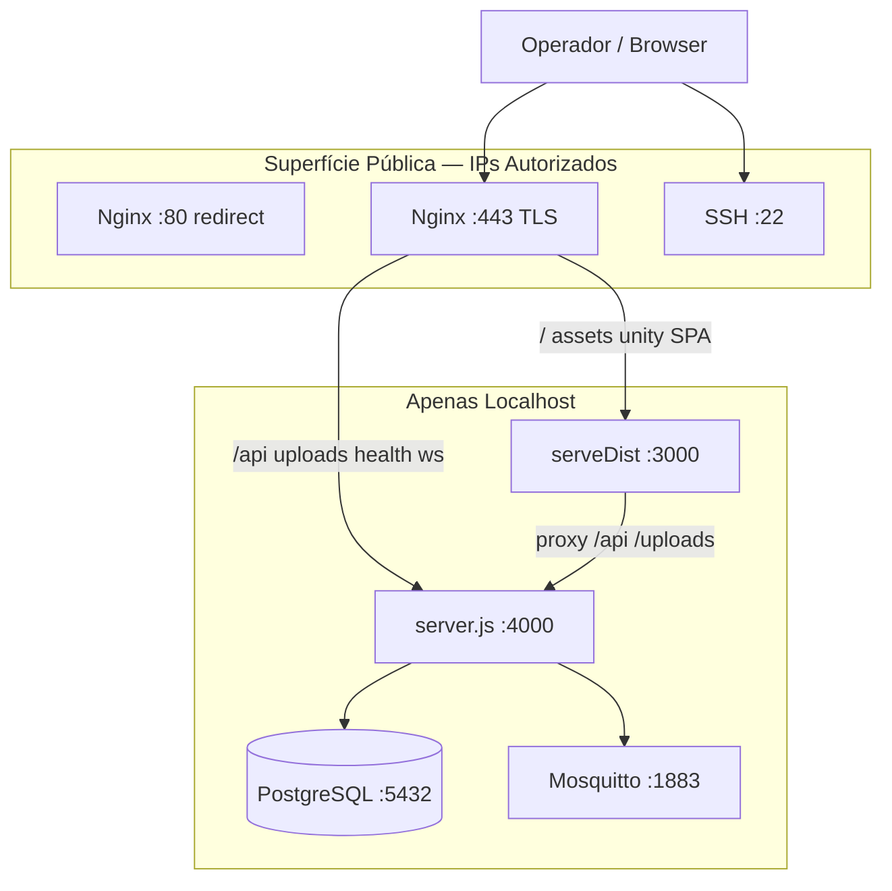

# SECURITY_ATTACK_SURFACE — Superfície Pública IMPETUS

**Certificação:** SECURITY-BASELINE-01  
**Congelado:** 2026-07-03T21:30:00Z  
**Host:** `srv1422313.hstgr.cloud` / `72.61.221.152`

---

## Resposta directa

> **Qual é exactamente a superfície pública do IMPETUS hoje?**

A superfície pública é **exclusivamente Nginx nas portas 80 e 443**, restrita por UFW aos **dois ranges de operadores autorizados** (170.246.0.0/16, 186.225.0.0/16 + IPv6 equivalentes). Tudo o resto é localhost ou negado.

**Não há exposição directa** de Node (:3000, :4000), PostgreSQL (:5432) ou MQTT (:1883) à Internet.

---

## Portas — visibilidade externa vs interna

| Porta | Bind | Serviço | Público? | UFW |
|-------|------|---------|----------|-----|
| **443** | 0.0.0.0 | Nginx HTTPS | **Sim** (IPs autorizados) | ALLOW operadores |
| **80** | 0.0.0.0 | Nginx HTTP→301 HTTPS | **Sim** (IPs autorizados) | ALLOW operadores |
| **22** | 0.0.0.0 | SSH | **Sim** (IPs autorizados) | ALLOW operadores |
| 3000 | 127.0.0.1 | Express serveDist (frontend) | **Não** | DENY Anywhere |
| 4000 | 127.0.0.1 | Express backend | **Não** | DENY Anywhere |
| 5432 | 127.0.0.1 | PostgreSQL | **Não** | default deny |
| 1883 | 127.0.0.1 | Mosquitto MQTT | **Não** | default deny |
| 53 | 127.0.0.53 | systemd-resolved | **Não** | — |

Evidência: `listening-ports.snapshot.txt`, `ufw.snapshot.txt`

---

## Endpoints HTTP públicos (via Nginx → upstream)

### Proxy → Backend (127.0.0.1:4000)

| Path prefix | Função | Auth |
|-------------|--------|------|
| `/api/*` | REST API (150 mount paths) | Maioria `requireAuth` |
| `/api/auth/*` | Login, MFA, tokens | Público (rate limit 10r/m) |
| `/uploads/*` | Ficheiros upload (avatars, chat) | Middleware seguro |
| `/health` | Health check | Público (detalhes limitados) |
| `/socket.io/*` | WebSocket Socket.IO | Sessão/token |
| `/impetus-realtime/*` | WebSocket realtime OpenAI | Auth |

### Proxy → Frontend (127.0.0.1:3000)

| Path prefix | Função | Auth |
|-------------|--------|------|
| `/` | SPA React (index.html fallback rotas UI) | Público |
| `/assets/*` | Bundles JS/CSS minificados (hash) | Público |
| `/unity/*` | WebGL ManuIA viewer | Público (paths validados) |

### Bloqueados explicitamente (HARDENING-01)

Paths de scanner (`.env`, `server.js`, `docker-compose*`, extensões sensíveis, `.map`) → **404 nginx**, nunca fallback SPA.

---

## APIs REST — inventário

- **150 mount paths** únicos em `server.js` (`useRoute`)
- Lista completa: `api-mount-paths.txt`
- Exemplos representativos:
  - `/api/auth`, `/api/dashboard`, `/api/action-runtime`
  - `/api/aioi/*` (governance, compliance, baseline)
  - `/api/cognitive-*`, `/api/workflow-engine`
  - `/api/webhook`, `/api/webhooks/asaas`
  - `/api/admin/*`, `/api/impetus-admin`

**286 declarações `useRoute`** no source (inclui condicionais ManuIA, duplicados legacy).

---

## WebSockets

| Endpoint | Upstream | Uso |
|----------|----------|-----|
| `/socket.io/` | backend:4000 | Chat, voz, avatar lipsync |
| `/impetus-realtime/` | backend:4000 | Proxy OpenAI realtime |

---

## Assets públicos servidos

| Tipo | Localização | Tamanho aprox. |
|------|-------------|----------------|
| SPA index | `frontend/dist/index.html` | 655 B |
| JS/CSS bundles | `frontend/dist/assets/*` | **107 MB** total, 347 ficheiros |
| Unity WebGL | `frontend/dist/unity/manu-ia-viewer/` | Incluído no dist |
| Uploads | `/uploads/` via backend | Variável (filesystem) |

**Nota de risco baseline:** bundles minificados expõem superfície client-side (rotas UI, chamadas API). Backend source **não** é servido via HTTP.

---

## Downloads públicos

- `/uploads/*` — ficheiros previamente uploaded (guarda auth no backend)
- `/assets/*` — bundles estáticos
- Sem endpoint de download de código-fonte, Git, `.env`, backups

---

## Proxies em cadeia

```
Cliente (IPs autorizados)
    → Nginx :443 (TLS, rate limits, hardening)
        → /api/*     → Express backend :4000
        → /uploads/* → Express backend :4000
        → /socket.io → Express backend :4000
        → /          → Express serveDist :3000
            → /api (proxy interno) → :4000
            → /uploads (proxy)     → :4000
```

---

## Superfície negativa (explicitamente fechada)

| Vector | Estado |
|--------|--------|
| `.git` exposure | 404/444 |
| Dotfiles `.env*` | 404 |
| Backend direct :4000 | UFW DENY |
| Frontend direct :3000 | UFW DENY |
| PostgreSQL | localhost only |
| Docker containers | nenhum activo |
| Redis | não instalado / não listening |

---

## IPs bloqueados (UFW DENY)

`3.19.29.56`, `216.238.69.243`, `35.153.53.215`, `27.79.3.161`, `171.231.186.160`, `134.122.102.174`

---

## Diagrama superfície pública


