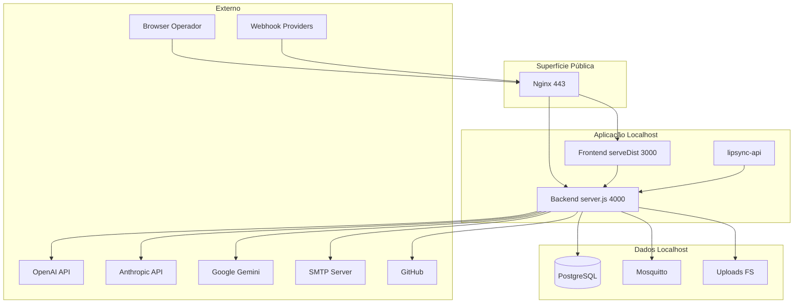

# SECURITY_COMMUNICATION_MATRIX — Fluxos de Comunicação

**Certificação:** SECURITY-BASELINE-01

---

## Matriz principal

| Origem | Destino | Protocolo | Porta | Auth | Público | Dados |
|--------|---------|-----------|-------|------|---------|-------|
| Browser | Nginx | HTTPS | 443 | TLS | Sim* | HTTP/WSS |
| Nginx | Backend | HTTP | 4000 | — | Não | API/WS |
| Nginx | Frontend | HTTP | 3000 | — | Não | SPA/assets |
| Frontend | Backend | HTTP proxy | 4000 | JWT/session | Não | API |
| Backend | PostgreSQL | TCP/SQL | 5432 | DB user/pass | Não | Todos dados |
| Backend | OpenAI | HTTPS | 443 ext | API key | Não | LLM, TTS, Realtime |
| Backend | Anthropic | HTTPS | 443 ext | API key | Não | Claude API |
| Backend | Google/Gemini | HTTPS | 443 ext | API key | Não | Gemini, Vertex |
| Backend | SMTP | STARTTLS | 587 ext | SMTP creds | Não | Email transacional |
| Backend | Mosquitto | MQTT | 1883 | Config | Não | Telemetria industrial |
| Backend | Webhooks inbound | HTTPS | 443 | Secrets/headers | Sim* | Asaas, integrações |
| Backend | GitHub | HTTPS | 443 ext | Token | Não | CI/workflows |
| Backend | Edge agents | HTTPS/MQTT | var | EDGE_TOKEN | Não | Pilotos edge |
| lipsync-api | Backend | HTTP | 4000 | Internal | Não | Avatar lipsync |
| Operador | SSH | SSH | 22 | Password | Sim* | Admin shell |

\* Restrito UFW aos IPs autorizados

---

## Frontend ⇄ Backend

```
Browser
  → GET/POST /api/* (via Nginx ou serveDist proxy)
  → Authorization: Bearer <JWT>
  → WebSocket /socket.io (upgrade)
  → WebSocket /impetus-realtime (OpenAI proxy)
  → GET /uploads/* (ficheiros estáticos auth)
```

**CORS:** validado em Express via `ALLOWED_ORIGINS`.

---

## Backend ⇄ Banco de dados

- **Engine:** PostgreSQL 14+ (localhost)
- **Pool:** DB_POOL_MAX=20 (config)
- **RLS:** tenant context middleware activo
- **Migrations:** `backend/scripts/run-all-migrations.js`

---

## Backend ⇄ IA (providers)

| Provider | Env vars | Serviços backend |
|----------|----------|------------------|
| OpenAI | OPENAI_API_KEY, OPENAI_* | Chat, TTS, Realtime, embeddings |
| Anthropic | ANTHROPIC_API_KEY | Claude routes |
| Google/Gemini | GEMINI_API_KEY, Vertex config | Gemini, TTS Google |
| ElevenLabs | ELEVEN_API_KEY | Voz (se configurado) |
| D-ID / ANAM | D_ID_API_KEY, ANAM_API_KEY | Avatar |

Health probe: `/health` → `aiIntegrationsHealthService` (status up/down, sem keys).

---

## Backend ⇄ SMTP

- Vars: SMTP_HOST, SMTP_PORT, SMTP_USER, SMTP_PASS
- Uso: notificações, alertas, onboarding
- Lab SMTP PM2: **stopped** (baseline)

---

## Webhooks

| Endpoint | Direcção | Auth |
|----------|---------|------|
| `/api/webhook` | Inbound | X-Webhook-Secret / signatures |
| `/api/webhooks/asaas` | Inbound | Asaas signature |

---

## Fila / Redis / Storage

| Componente | Estado baseline |
|------------|-----------------|
| Redis | **Não activo** (sem listener 6379) |
| Filas | In-process / PostgreSQL outbox patterns |
| Uploads | Filesystem `IMPETUS_HOME/uploads` |
| Object storage cloud | Via SDKs se configurado (S3-compatible vars) |

---

## Cloud / Externo

| Destino | Propósito |
|---------|-----------|
| AWS/GCP/Azure APIs | IA, TTS, storage (conforme .env) |
| Asaas | Billing webhooks |
| GitHub | Workflow token, cert drift |
| Cloudflare | CDN/proxy (real-ip headers) |

---

## Diagrama completo



---

## Trust boundaries

| Boundary | Controlo |
|----------|----------|
| Internet → Nginx | UFW + TLS + rate limits |
| Nginx → App | localhost only |
| App → DB | localhost + credentials |
| App → IA | outbound HTTPS + API keys |
| App → Webhooks | signature validation |
