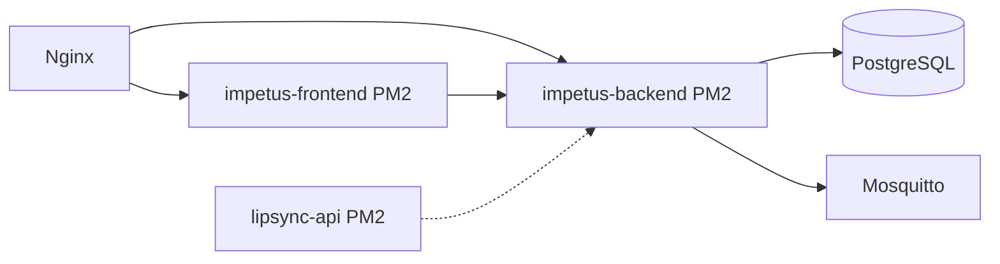

# SECURITY_PROCESS_BASELINE — Inventário de Processos

**Certificação:** SECURITY-BASELINE-01  
**Snapshot:** `pm2-processes.snapshot.json`, `listening-ports.snapshot.txt`

---

## PM2 — processos registados

| Name | PID | Status | Script | Owner | Restarts | Criticidade |
|------|-----|--------|--------|-------|----------|-------------|
| **impetus-backend** | 4027145 | online | `backend/src/server.js` | root | 528 | P0 |
| **impetus-frontend** | 4114349 | online | `npm run preview:prod` | root | 229 | P0 |
| **lipsync-api** | — | online | `lipsync/lipsync_api.py` | root | 1 | P1 |
| pm2-logrotate | 3885526 | online | pm2-logrotate module | root | 4 | P2 |
| impetus-lab-modbus | 0 | stopped | industrial-lab-modbus-server.py | root | 0 | P3 lab |
| impetus-lab-opcua | 0 | stopped | industrial-lab-opcua-server.js | root | 22 | P3 lab |
| impetus-edge-agent-lab | 0 | stopped | edge-agent-physical-lab.js | root | 4 | P3 lab |
| impetus-lab-oidc | 0 | stopped | industrial-lab-oidc-provider.js | root | 12 | P3 lab |
| impetus-lab-smtp | 0 | stopped | industrial-lab-smtp.js | root | 54 | P3 lab |

### impetus-backend — detalhe

| Campo | Valor |
|-------|-------|
| Created | 2026-07-02T21:42:35Z |
| Uptime baseline | ~22h+ |
| CWD | `/var/www/impetus-completa/backend` |
| Restart policy | autorestart, max_memory_restart 1G |
| Listen | 127.0.0.1:4000 |
| Dependências | PostgreSQL, .env, node_modules |

### impetus-frontend — detalhe

| Campo | Valor |
|-------|-------|
| CWD | `/var/www/impetus-completa/frontend` |
| Listen | 127.0.0.1:3000 |
| Dependências | frontend/dist build |

---

## Systemd / serviços OS

| Serviço | PID | Porta | Função |
|---------|-----|-------|--------|
| nginx | 3575186+ | 80, 443 | Reverse proxy |
| sshd | 1609928 | 22 | SSH |
| postgres | 4030612 | 5432 | BD IMPETUS |
| mosquitto | 161668 | 1883 | MQTT industrial |
| systemd-resolved | 2045484 | 53 | DNS local |

---

## Cron

| Schedule | Comando | Owner |
|----------|---------|-------|
| `*/15 * * * *` | `/usr/local/bin/impetus-disk-monitor.sh` | root |

**Política:** alerta disco only — não apaga ficheiros.

---

## Systemd timers (OS — não IMPETUS)

| Timer | Função |
|-------|--------|
| logrotate.timer | Rotação logs sistema |
| snap.certbot.renew.timer | Renovação TLS |
| apt-daily.timer | Updates |

Nenhum timer IMPETUS custom except cron disk monitor.

---

## Subprocessos / workers (backend runtime)

Workers PM2 separados **não activos** em produção baseline (lab stopped).

Workers internos Node (in-process): schedulers, machine monitoring — booted via `server.js` (Event Governance / runtime congelado — não alterado nesta certificação).

---

## Comunicações inter-processo

| De | Para | Protocolo |
|----|------|-----------|
| nginx | impetus-backend | HTTP proxy localhost |
| nginx | impetus-frontend | HTTP proxy localhost |
| serveDist | impetus-backend | HTTP proxy localhost |
| impetus-backend | postgres | TCP 5432 |
| impetus-backend | mosquitto | MQTT 1883 |
| lipsync-api | impetus-backend | HTTP (interno) |
| Cursor/IDE node | — | localhost ephemeral ports |

---

## Diagrama processos

