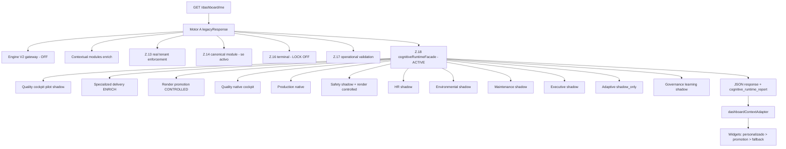
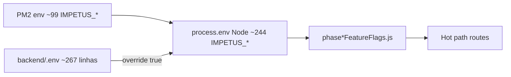

# Auditoria LIVE — PM2 / Runtime Cognitivo Real (IMPETUS)

**Data:** 2026-05-23  
**Modo:** read-only — sem alteração de PM2, `.env`, flags ou código  
**Host auditado:** servidor com PM2 online (`impetus-backend`, `impetus-frontend`, `lipsync-api`)  
**Complemento:** [`enterprise-shadow-runtime-audit.md`](./enterprise-shadow-runtime-audit.md) (análise estática)

---

## Resumo executivo

O processo **vivo** `impetus-backend` (PID observado: **4026602**, ~**143 MB**, **201** restarts históricos, **13h** uptime na amostra) **não carrega o stack cognitivo Z.18–Z.29 apenas via PM2**. O PM2 injeta **~99** variáveis `IMPETUS_*` (bootstrap de governança + domínios quality/environment/safety). O Node, ao arrancar, executa `dotenv` com **`override: true`** sobre `backend/.env` e passa a **~244** variáveis `IMPETUS_*` — incluindo todo o stack Z (enrich, render, cockpits, adaptive, learning).

**Evidência de execução real (logs PM2):** em pedidos a `/dashboard/me`, o sistema emite `ADAPTIVE_ORCHESTRATION_APPLIED` (Z.28), `GOVERNANCE_LEARNING_APPLIED` (Z.29), `SEMANTIC_GENERICITY_DETECTED` (Z.18) e milhares de eventos `shadow_only: true`.

**Veredicto (secção 8):** o PM2 hoje corre um **runtime híbrido** — Motor A / personalizado dominam a percepção de UI em muitos perfis, mas o **hot path do dashboard executa a facade cognitiva** com **enrich + render promotion activos** (quality/production) e **domínios industriais quality V5 activos** via flags PM2; governança terminal e canais KPI/Summary/Chat governance estão **desligados** no env efectivo.

---

## 1. PM2 — processos e saúde

| Processo | ID PM2 | Estado | Uptime (amostra) | Restarts | Memória | Script |
|----------|--------|--------|------------------|----------|---------|--------|
| `impetus-backend` | 3 | online | ~13h | **201** | ~143 MB | `backend/src/server.js` |
| `impetus-frontend` | 2 | online | ~17h | 108 | ~63 MB | `npm run preview:prod` |
| `lipsync-api` | 1 | online | 44d | 0 | ~27 MB | Python lipsync |

**Observações PM2:**
- `NODE_ENV=development` no backend (não `production`).
- Processo backend criado após `npm run governance:bootstrap-deploy` (lifecycle PM2 regista `governance:bootstrap-deploy`).
- Métricas HTTP PM2 (amostra): P95 **~245 ms**, média **~41 ms**, heap **~94%** de utilização (pressão moderada, não crítica na amostra).
- **Não existe** `ecosystem.config.js` na raiz do repo; processos foram registados manualmente / via bootstrap — risco de **env drift** entre máquinas.

---

## 2. Flags reais: PM2 vs `.env` vs Node efectivo

### 2.1 Mecanismo de carga (hot path de configuração)

```5:7:backend/src/server.js
require('dotenv').config();
const path = require('path');
require('dotenv').config({ path: path.join(__dirname, '../.env'), override: true });
```

**Ordem efectiva:** variáveis PM2 → **sobrescritas** por `backend/.env` (`override: true`).

**Implicação:** `pm2 env 3` e `/proc/PID/environ` **não representam** o runtime cognitivo Z; representam apenas o ambiente **no fork**. O Node em memória lê `.env` depois.

### 2.2 Matriz de divergência (amostra crítica)

| Variável | PM2 (`pm2 env 3`) | Node efectivo (dotenv + flags) | Divergência |
|----------|-------------------|--------------------------------|-------------|
| `IMPETUS_COGNITIVE_RUNTIME` | ausente | `off` | PM2 omite; .env governa |
| `IMPETUS_SEMANTIC_DELIVERY_OBSERVABILITY` | ausente | **`on`** | **DRIFT PM2** — facade activa |
| `IMPETUS_SPECIALIZED_DELIVERY_ENRICH` | ausente | **`enrich`** | **DRIFT PM2** |
| `IMPETUS_QUALITY_COCKPIT_PILOT` | ausente | `shadow` | DRIFT PM2 |
| `IMPETUS_COGNITIVE_RENDER_PROMOTION` | ausente | **`controlled`** | DRIFT PM2 |
| `IMPETUS_SPECIALIZED_COCKPIT_RUNTIME` | ausente | **`quality_native`** | DRIFT PM2 |
| `IMPETUS_PRODUCTION_COGNITIVE_RUNTIME` | ausente | **`production_native`** | DRIFT PM2 |
| `IMPETUS_SAFETY_COGNITIVE_RUNTIME` | ausente | `shadow` | DRIFT PM2 |
| `IMPETUS_ADAPTIVE_ORCHESTRATION` | ausente | `shadow` | DRIFT PM2 |
| `IMPETUS_GOVERNANCE_LEARNING` | ausente | `shadow` | DRIFT PM2 |
| `IMPETUS_TERMINAL_GOVERNANCE` | ausente | **`off`** | DRIFT PM2 |
| `IMPETUS_KPI_GOVERNANCE` | ausente | `off` | DRIFT PM2 |
| `IMPETUS_KPI_RUNTIME_ENFORCEMENT` | ausente | **`on`** | DRIFT PM2 |
| `IMPETUS_QUALITY_COGNITIVE_RUNTIME_ENABLED` | **`true`** | **`true`** | **MATCH** (domínio quality V5) |
| `IMPETUS_CONTEXTUAL_MODULES` | **`enrich`** | **`enrich`** | MATCH |
| `IMPETUS_DASHBOARD_ENGINE_V2` | **`off`** | **`off`** | MATCH |
| `IMPETUS_PIPELINE_AUTHORITY_CONSOLIDATION_MODE` | **`partial_authority`** | **`partial_authority`** | MATCH |

**Contagens:** PM2 **99** chaves `IMPETUS_*` · dotenv **244** chaves `IMPETUS_*` · **~145 flags só existem no ficheiro `.env`**.

### 2.3 Flags “eternas” / inconsistentes detectadas LIVE

| Problema | Evidência LIVE |
|---------|----------------|
| **Dupla família quality** | PM2: `IMPETUS_QUALITY_*_ENABLED=true` (V5). Dotenv: stack Z `shadow`/`enrich`/`quality_native` em paralelo. |
| **Environment naming** | PM2: `IMPETUS_ENVIRONMENT_COGNITIVE_RUNTIME_ENABLED=true`. Dotenv cockpit: `IMPETUS_ENVIRONMENTAL_COGNITIVE_RUNTIME=shadow`. **Dois sistemas de flag.** |
| **Governança terminal off com observability on** | `IMPETUS_TERMINAL_GOVERNANCE=off`, `IMPETUS_TERMINAL_GOVERNANCE_OBSERVABILITY=on` → estágios correm em modo observação. |
| **KPI enforcement sem KPI governance** | `IMPETUS_KPI_RUNTIME_ENFORCEMENT=on`, `IMPETUS_KPI_GOVERNANCE=off` → enforcement parcial. |
| **Facade “off” mas activa** | `IMPETUS_COGNITIVE_RUNTIME=off` + `IMPETUS_SEMANTIC_DELIVERY_OBSERVABILITY=on` → `applyCognitiveFoundationToDashboard` **executa**. |

### 2.4 Snapshot resolvido (mesmo código do worker após dotenv)

Execução local com `dotenv` + `getCognitiveRuntimeStatus()` (equivalente ao worker):

| Sinal | Valor LIVE |
|-------|------------|
| `semantic_observability` | **true** → facade Z.18 **activa** |
| `quality_cockpit_shadow` | **true** |
| `specialized_delivery_mode` | **enrich** |
| `render_promotion_mode` | **controlled** |
| `quality_native_cockpit` | **true** |
| `production` (ZP0) | **production_native** |
| `safety/hr/env/maint/exec` cognitive runtime | **shadow** |
| `multi_domain_foundation` | **shadow** |
| `adaptive_orchestration` | **shadow** (modo) |
| `registry delivery_active` | **false** |
| `pipeline_mode` | **partial_authority** |
| `terminal_governance` | **false** |
| `kpi_runtime_enforcement` | **true** |
| `chat_alignment` | **false** |

---

## 3. Runtimes realmente activos no hot path

### 3.1 Mapa de execução real (`GET /dashboard/me`)



### 3.2 Quem governa vs observa vs regista (LIVE)

| Camada | Executa? | Governa UI? | Evidência |
|--------|---------|-------------|-----------|
| Motor A (`dashboardProfiles`, KPIs SQL) | **Sim** | **Sim** (baseline) | Sempre primeiro em `legacyResponse` |
| Engine V2 | Não (flag off) | Não | `IMPETUS_DASHBOARD_ENGINE_V2=off` |
| Contextual modules | **Sim** (`enrich`) | **Sim** (sidebar união) | PM2 + logs `CONTEXTUAL_MODULES` |
| `domains/quality` V5 | **Sim** | Parcial (APIs/telemetria) | PM2 `IMPETUS_QUALITY_COGNITIVE_RUNTIME_ENABLED=true` |
| Facade Z.18–Z.29 | **Sim** | **Parcial** (campos promoted / specialized) | Logs Z.18/Z.28/Z.29 |
| Terminal governance Z.16 | Código corre | **Não** (`governance_locked: false`) | `IMPETUS_TERMINAL_GOVERNANCE=off` |
| KPI governance canal | **Não** | Não | `IMPETUS_KPI_GOVERNANCE=off` |
| KPI runtime enforcement | **Sim** | Parcial | `IMPETUS_KPI_RUNTIME_ENFORCEMENT=on` |
| Adaptive Z.28 | **Sim** | **Não** (shadow) | Logs + `shadow_only: true` |
| Learning Z.29 | **Sim** | **Não** (shadow) | Logs + metadata no payload |
| Pipeline authority | **Sim** | Parcial | `partial_authority` |

---

## 4. Shadow real vs shadow teórico (evidência de logs)

Contagens em `/root/.pm2/logs/impetus-backend-out.log` (ficheiro completo, ~293k linhas):

| Evento | Ocorrências | Interpretação LIVE |
|--------|-------------|-------------------|
| `shadow_only` (global) | **12 245** | Maioria dos estágios de governança/validação em modo observação |
| `ADAPTIVE_ORCHESTRATION_APPLIED` | **145** | Z.28 **corre** em produção |
| `GOVERNANCE_LEARNING_APPLIED` | **145** | Z.29 **corre** em produção |
| `SEMANTIC_GENERICITY_DETECTED` | **368** | Z.18 detecta genericidade (ex.: `manager_quality`) |

**Amostra recente (2026-05-23T16:24:26Z, tenant real):**
- Perfil: `manager_quality`, domínio `quality`.
- `GOVERNANCE_FATIGUE_DETECTED`, `RUNTIME_OVERGOVERNANCE_DETECTED`, `OBSERVABILITY_SATURATION_DETECTED` — todos `shadow_only: true`.
- `PUBLICATION_LEAKAGE_DETECTED` (módulos manuia/hr/safety no eixo quality) — `shadow_only: true` (deteta, não bloqueia).
- Imediatamente a seguir: `ADAPTIVE_ORCHESTRATION_APPLIED`, `GOVERNANCE_LEARNING_APPLIED`.

**Conclusão shadow LIVE:** o sistema **calcula e telemetria** muito mais do que **bloqueia ou substitui**; enrich/render são a excepção activa em quality.

---

## 5. Cockpits por domínio — runtime LIVE

| Domínio | Flag cockpit (dotenv) | Flag domínio V5 (PM2) | Estado LIVE | Delivery UI |
|---------|----------------------|------------------------|-------------|-------------|
| **Quality** | pilot `shadow`, enrich **on**, render **controlled**, cockpit **quality_native** | `IMPETUS_QUALITY_COGNITIVE_RUNTIME_ENABLED=true` (+ dezenas `QUALITY_*_ENABLED`) | **HYBRID** | Enrich KPI + `widgets_promoted` / `specialized_cockpit_runtime` quando gates Z.22/Z.23 passam; Motor A ainda presente |
| **Production** | `IMPETUS_PRODUCTION_COGNITIVE_RUNTIME=production_native` | (via dotenv) | **ACTIVE** | `production_cognitive_runtime` no payload; FE tem `productionCockpitResolver` |
| **Safety** | `IMPETUS_SAFETY_COGNITIVE_RUNTIME=shadow`, render **controlled** | `IMPETUS_SAFETY_*_ENABLED=true`, `ACTIVATION_STAGE=shadow` | **SHADOW + ENRICH** | Piloto calcula; consolidação muitas vezes preview; FE `safetyCockpitResolver` |
| **HR** | `shadow`, `SST_NATIVE`/`HR` pilot em dotenv | Parcial em PM2 | **SHADOW** | Observação + campos opcionais |
| **Environmental** | `IMPETUS_ENVIRONMENTAL_COGNITIVE_RUNTIME=shadow` | `IMPETUS_ENVIRONMENT_COGNITIVE_RUNTIME_ENABLED=true` | **HYBRID** | Domínio V5 activo; cockpit Z em shadow |
| **Maintenance** | `shadow`, render controlled | ZM1 flags em dotenv | **SHADOW** | Preview / telemetria |
| **Executive** | `shadow`, boardroom pilot | — | **SHADOW** | Render pode promover; runtime consolidation preview |

---

## 6. Chat Impetus LIVE

| Capacidade | LIVE |
|------------|------|
| `CHAT_ENABLE_CONSOLIDATED` | **true** (PM2) |
| `UNIFIED_DECISION_ENGINE` | **unset/false** |
| `IMPETUS_CHAT_GOVERNANCE` | **off** (dotenv) |
| `IMPETUS_CHAT_ALIGNMENT_RUNTIME` | **false** |
| `MEMORY_BINDING_ENABLED` | default **true** (código; não em PM2) |
| `OPERATIONAL_MEMORY_ENABLED` | unset |
| Orchestrator fallback | **9** ocorrências históricas em `impetus-backend-error.log` (baixo volume vs tráfego) |

**Inferência LIVE:** chat é **LLM directo + memory binding**; sem conselho unificado nem governança de chat activa.

---

## 7. Frontend — o que o React consome de facto

`dashboardContextAdapter.js` define prioridade:

- Com base estrutural completa: **personalizado → engine_v2 → layout cargo → cognitive_render_promotion**.
- `specialized_cockpit_runtime` só ganha se `consolidation_applied === true` e `widgets_promoted.length > 0`.

**Implicação LIVE:** mesmo com Z.22/Z.23 activos no backend, utilizadores com **layout personalizado** podem **não ver** widgets cognitivos promovidos — o runtime cognitivo **enriquece JSON** mas a UI **prefere Motor B/personalizado**.

Resolvers existem em `frontend/src/cognitiveRuntime/domains/*` — ligados a `meData`, não ao blob `cognitive_runtime_report` isolado.

---

## 8. Governança real (executa ou só código?)

| Mecanismo | Flag LIVE | Executa no hot path? |
|-----------|-----------|----------------------|
| Terminal lock Z.16 | `off` | **Não** — `runGovernanceTerminalStage` retorna `applied: false`, `governance_locked: false` |
| Anti-leakage / publication | observability | **Detecta** (`PUBLICATION_LEAKAGE_DETECTED`, `shadow_only`) — **não bloqueia** |
| KPI governance canal | `off` | **Não** |
| KPI runtime enforcement | **`on`** | **Sim** (canal separado) |
| Summary governance | `off` | **Não** |
| Chat governance | `off` | **Não** |
| Real tenant Z.13 | conforme piloto | **Sim** (stack dashboard) |
| Bootstrap shadow observation | PM2 parcial | **Sim** (logs `shadow_only`) |

---

## 9. Z.28 Adaptive orchestration LIVE

| Pergunta | Resposta LIVE |
|----------|---------------|
| Corre? | **Sim** — 145 eventos `ADAPTIVE_ORCHESTRATION_APPLIED` |
| Só observa? | **Sim** — `IMPETUS_ADAPTIVE_ORCHESTRATION=shadow`, `auto_mutation: false` nos logs |
| Influencia delivery? | **Não** de forma autoritativa — adiciona `adaptive_orchestration` ao payload |
| Fatigue / usefulness? | **Sim** — `GOVERNANCE_FATIGUE_DETECTED`, `adaptation_recommended: true` em logs |

---

## 10. Z.29 Governance learning LIVE

| Pergunta | Resposta LIVE |
|----------|---------------|
| Corre? | **Sim** — 145 eventos `GOVERNANCE_LEARNING_APPLIED` |
| Persiste? | **Em memória** no serviço (`store.snapshots`); sem `IMPETUS_COGNITIVE_PERSISTENCE_ENABLED` |
| Usado para decisão? | **Não** — `auto_mutation: false`, modo shadow |
| Colecta? | **Sim** — `patterns: 1` típico por request em amostra |

---

## 11. Performance LIVE (amostra PM2)

| Métrica | Valor |
|---------|-------|
| Heap usado | ~60 MB / ~63 MB total (~95%) |
| Event loop p95 | ~1.7 ms |
| HTTP p95 | ~245 ms |
| HTTP média | ~41 ms |
| Pressão cognitiva (logs) | `pressure: 0.387`, `fatigue: 0.79` — **shadow_only**, sem throttle activo |

**Overhead cognitivo:** stack Z completo no `/dashboard/me` adiciona múltiplas camadas síncronas/await por request; logs indicam **supervisão saturada** (`OBSERVABILITY_SATURATION_DETECTED`) em modo observação — risco de latência sob carga, não evidenciado como outage na amostra.

---

## 12. Memória operacional LIVE

| Camada | LIVE |
|--------|------|
| `operationalMemoryBindingService` | **Activo** (default `MEMORY_BINDING_ENABLED !== false`) |
| `IMPETUS_COGNITIVE_PERSISTENCE_ENABLED` | **false** / ausente |
| Timeline cognitiva enterprise | **Não** |
| Cross-session chat | **Parcial** (facts/tasks se BD populada) |

---

## 13. Inferência real LIVE

| Tipo | Onde (processo vivo) |
|------|----------------------|
| **Inferência LLM** | Chat, Registro Inteligente, Cadastrar com IA, Pró-Ação, painéis Claude/OpenAI |
| **Enrich operacional** | Z.21 quality (`enrich`), contextual modules (`enrich`), quality V5 engines (flags PM2 true) |
| **Formatação** | KPIs Motor A, health scores, `cognitive_runtime_report` |
| **Telemetry only** | Z.28, Z.29, maior parte Z.0–Z.17 com `shadow_only: true` |

---

## 14. Cross-module LIVE

| Ligação | Real no processo vivo? |
|---------|------------------------|
| Dashboard facade ↔ quality V5 | **Parcial** — PM2 activa V5; bridge Z.20 em `shadow` no dotenv |
| Chat ↔ memory binding | **Sim** |
| Chat ↔ cockpit blocks | **Não** |
| Registro ↔ event backbone | **Parcial** — `IMPETUS_INDUSTRIAL_EVENTS_ENABLED=true` em PM2 |
| Contextual modules ↔ sidebar | **Sim** (`enrich`) |

---

## 15. Matriz runtime real (código vs PM2 vs Node efectivo)

| Módulo | Código (default) | PM2 inject | Node efectivo | Divergência | Risco |
|--------|------------------|------------|---------------|-------------|-------|
| Facade Z.18 | off | omit | **on** (via semantic obs) | Alta | Operadores olham PM2 e concluem “off” |
| Quality enrich Z.21 | off | omit | **enrich** | Alta | Entrega real invisível no PM2 |
| Render Z.22 | off | omit | **controlled** | Alta | Widgets promoted sem reload PM2 `--update-env` das flags Z |
| domains/quality V5 | off | **true** | **true** | Baixa | Stack industrial activo |
| Engine V2 | off | off | off | Nenhuma | — |
| Terminal gov | off | omit | off | Média | Leakage detectada mas não bloqueada |
| Adaptive Z.28 | off | omit | shadow **runs** | Média | Custo CPU por request |
| Pipeline | shadow | **partial_authority** | partial_authority | Média | Mais autoridade que doc default |
| Chat unified | off | off | off | Nenhuma | — |

---

## 16. Mapa de flags reais (resumo)



**Ignoradas pelo operador PM2:** quase todo o stack Z.18–Z.29 (só no `.env`).

**Sobrescritas de risco:** editar `.env` sem `pm2 reload --update-env` ainda afecta o worker **no próximo restart** via dotenv; PM2 dump permanece desactualizado.

---

## 17. Auditoria de fallback LIVE

| Fluxo | Dominância LIVE |
|-------|-----------------|
| Dashboard widgets | **Legacy/personalizado** quando layout existe |
| KPIs quality | **Híbrido** — enrich activo + SQL Motor A |
| Engine V2 | **Fallback total** (off) |
| Chat orchestrator | **Fallback ocasional** (9 erros históricos) |
| Cockpit domains shadow | **Fallback gracioso** (empty feed / legacy KPIs) |
| Shadow masking | **Alta** — relatório cognitivo rico em JSON, UI pode ignorar |

---

## 18. Veredicto final

### O PM2 hoje está rodando:

## **Runtime híbrido com cockpit cognitivo parcial activo**

**Não é** “legacy dominante puro”: o processo **executa** `cognitiveRuntimeFacade`, adaptive learning, quality V5, contextual enrich e pipeline `partial_authority` — comprovado por logs e resolução de flags pós-dotenv.

**Não é** “enterprise cognitive runtime real” pleno porque:
1. **PM2 não reflecte** ~60% das flags cognitivas (drift operacional).
2. **Terminal / KPI / Summary / Chat governance** estão **off** no env efectivo.
3. **Z.28/Z.29 e multi-domain** correm em **shadow** (telemetria, sem mutação autoritativa).
4. O **frontend prioriza personalizado** sobre promoção cognitiva na maioria dos utilizadores com layout.
5. **12k+ eventos `shadow_only`** no log — arquitectura de observação >> arquitectura de comando.

**Justificação técnica:** O worker Node efectivo ≠ `pm2 env`. Com `IMPETUS_SEMANTIC_DELIVERY_OBSERVABILITY=on`, a facade corre em cada `/dashboard/me` (logs Z.18/Z.28/Z.29 em requests reais `manager_quality`). Com `IMPETUS_SPECIALIZED_DELIVERY_ENRICH=enrich` e `IMPETUS_COGNITIVE_RENDER_PROMOTION=controlled`, o backend **muta** KPIs e pode promover widgets — mas `IMPETUS_TERMINAL_GOVERNANCE=off` impede lock final, e o adapter React pode descartar essa camada. PM2 activa simultaneamente `IMPETUS_QUALITY_COGNITIVE_RUNTIME_ENABLED=true`, criando **dois runtimes quality** (V5 + Z stack) sem convergência única na UI.

---

## 19. Recomendações operacionais (auditoria apenas — não executadas)

1. **Fonte de verdade:** documentar que runtime cognitivo Z vive em `backend/.env`, não no dump PM2.
2. **Diagnóstico vivo:** expor `GET /api/internal/.../runtime-flags` (read-only) com snapshot pós-dotenv — evita confusão com `pm2 env`.
3. **Alinhar reload:** após mudanças Z, `pm2 reload impetus-backend --update-env` **e** validar `.env` (override domina).
4. **Reduzir fadiga:** 7 validadores + facade + V5 no mesmo request — considerar amostragem (fora do âmbito desta auditoria).

---

## 20. Metodologia desta auditoria

- `pm2 list`, `pm2 describe impetus-backend`, `pm2 env 3`, `pm2 jlist`
- Comparação programática PM2 vs `dotenv` (`backend/.env`)
- `getCognitiveRuntimeStatus()` e módulos `phase*FeatureFlags` com env efectivo
- Análise de `/root/.pm2/logs/impetus-backend-out.log` (contagens e amostras)
- `curl` `/api/health` (backend online)
- Leitura de `dashboardContextAdapter.js` e `server.js`
- Cruzamento com [`enterprise-shadow-runtime-audit.md`](./enterprise-shadow-runtime-audit.md)

---

*Auditoria LIVE concluída sem alteração de processos, variáveis ou código.*
