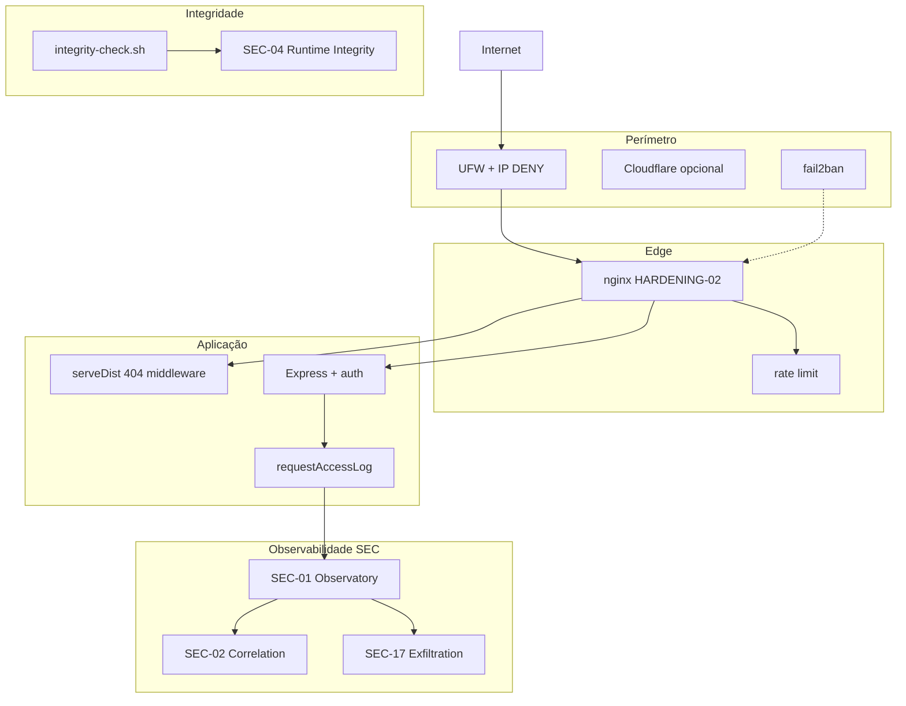

# INCIDENT_ARCHITECTURE_IMPACT — Impacto Arquitectural

**Programa:** INCIDENT-KNOWLEDGE-BASE-01  
**Data:** 2026-07-04  
**Princípio:** Event Governance, ECO, Cognitive Core e Enterprise Baseline **não foram alterados** pelos incidentes nem pelo programa SEC

---

## Superfície de ataque — antes vs depois

### Antes dos incidentes (pré-HARDENING-01)

```
Internet
    → Nginx :443 (TLS)
        → /api/* → Express :4000
        → /      → serveDist :3000
            → fallback SPA para QUALQUER path desconhecido (~1020 bytes)
    → SSH :22 (password root)
    → UFW: 3000/4000 DENY; HTTP/HTTPS restrito
```

**Vectores expostos:**

| Vector | Estado pré-incidente |
|--------|---------------------|
| Fallback SPA para `/server.js`, `/.env` | **VULNERÁVEL** — HTTP 200 enganoso |
| Dotfiles `.env` | Parcialmente bloqueados nginx |
| Backend direct :4000 | Bloqueado UFW |
| Bundles `dist/` | Públicos por desenho (107 MB) |
| PM2 dump segredos | Exposto localmente |
| Integridade filesystem | Sem monitorização |

### Após HARDENING-01 + 02 + SEC-20

```
Internet
    → Nginx :443
        → HARDENING locations: 403/404 paths scanner
        → rate limit 10r/s
        → impetus_detailed logging
        → /api/* → Express :4000
        → /      → serveDist (middleware 404 scanner)
    → fail2ban: sshd, impetus-nginx-scan
    → UFW: DENY IPs scanners + ranges operadores
    → SEC-01→20 (flags OFF, audit endpoints)
```

---

## Componentes arquitecturais afectados

| Componente | Impacto incidente | Alteração pós-incidente |
|------------|-------------------|------------------------|
| **Nginx** | Config apagada (symlink órfão) no pico | Restaurada + hardening |
| **serveDist.cjs** | Fallback SPA perigoso | Middleware 404 pré-fallback |
| **Express backend** | Sem alteração funcional | `requestAccessLog` aditivo |
| **PM2** | Código em memória durante deleção | `pm2-secure-restart.sh` |
| **PostgreSQL** | Não afectado por scan | — |
| **Git** | Íntegro; working tree degradado | Procedimento recovery |
| **Blueprint docs** | Apagados do disco | Restaurados HARDENING-01 |
| **Event Governance** | **Não alterado** | — |
| **ECO** | **Não alterado** | — |
| **Cognitive Core** | **Não alterado** | — |
| **Enterprise Baseline** | **Não alterado** | — |

---

## Novos subsistemas (aditivos)

| Subsistema | Path | Acoplamento |
|------------|------|-------------|
| securityObservatory | `backend/src/securityObservatory/` | Middleware passivo + audit |
| securityCorrelation | `backend/src/securityCorrelation/` | Subscreve SEC-01 bus |
| securityThreatIntelligence | `backend/src/securityThreatIntelligence/` | Enriquece SEC-02 |
| securityRuntimeIntegrity | `backend/src/securityRuntimeIntegrity/` | Validators independentes |
| securityExfiltrationDetection | `backend/src/securityExfiltrationDetection/` | SEC-17 consultivo |
| securityCertificationV2 | `backend/src/securityCertificationV2/` | SEC-20 consolidação |

**Padrão:** feature flags OFF, endpoints `/api/audit/security-*`, zero interferência runtime negócio.

---

## Diagrama de defesa em profundidade (estado actual)



---

## Impacto nos activos estratégicos

| Activo | Risco pré-incidente | Risco pós-HARDENING | Notas |
|--------|--------------------|--------------------|-------|
| Código-fonte backend | Médio (SPA fallback) | **Baixo** | Não servido HTTP |
| Blueprint Vol. 00–10 | Alto (deleção) | Médio | Restaurado; não HTTP |
| Credenciais `.env` | Alto (404 mas PM2 dump) | Médio | chmod 600; rotação pendente |
| Bundles frontend | Médio (público) | Médio | Inerente ao SPA |
| Lógica cognitiva (motores) | Baixo HTTP | Baixo | Backend only |
| Certificações EG/ECO | Nenhum | Nenhum | Congeladas |

---

## Proposta futura (não implementada)

`IMPETUS_SECURITY_HARDENING_V1_ARCHITECTURE.md` — 14 camadas, SH-01→08, módulo `impetusSelfProtection/`:

| Fase | Capacidade | ROI pós-incidente |
|------|------------|-------------------|
| SH-01 | File Integrity Monitor | **Alto** — deleção recorrente |
| SH-02 | Self-healing git-signed | Médio |
| SH-03→08 | Deception, egress, healing | Longo prazo |

---

## Invariantes arquitecturais preservados

1. Multi-tenant SaaS híbrido (CERT-ONPREM-FORENSICS-01)
2. Event Backbone industrial por tenant
3. Pipeline auth → tenantIsolation → handlers
4. Separação portal IMPETUS Admin vs tenant
5. Flags industriais `IMPETUS_INDUSTRIAL_*` inalteradas
6. Sequências EG, ECO congeladas independentemente de SEC

---

*Impacto arquitectural — sem alteração funcional de negócio.*
