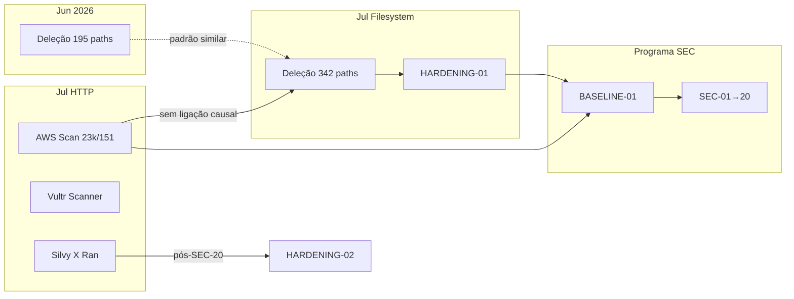

# INCIDENT_TECHNICAL_ANALYSIS — Análise Técnica por Incidente

**Programa:** INCIDENT-KNOWLEDGE-BASE-01  
**Data:** 2026-07-04  
**Modo:** Consolidação forense read-only

---

## Incidente 01 — Deleção filesystem (Jun/2026) {#incidente-01}

**ID:** INC-2026-06-04-FS-01  
**Fonte canónica:** `backend/docs/WORKING_TREE_FORENSIC_REPORT.md` (GIT-FORENSIC-02)

### Como aconteceu

Remoção física **selectiva** de 195 paths em `backend/src` e `frontend/src`. O Git em HEAD permaneceu íntegro — os ficheiros existiam no repositório mas não no disco.

### Causa

| Hipótese | Plausibilidade | Estado |
|----------|----------------|--------|
| H1 — Remoção/sobrescrita filesystem ~02:09 UTC | **Alta** | **Mais provável** |
| H2 — Commit `7ea6cb2b8` apagou disco | Baixa | **Descartada** (só índice `impetus_complete/`) |
| H3 — `git checkout`/`reset`/`clean` | Baixa | **Improvável** (reflog sem entrada) |
| H4 — Comprometimento malicioso SSH | Desconhecida | **Sem evidência conclusiva** |

**Causa determinada:** **INCONCLUSIVO** — vector exacto não identificado (histórico shell incompleto; possível acção via Cursor Agent ou sincronização de workspace).

### Impacto

- `backend/src/server.js` ausente (entrypoint PM2)
- 84 paths em `frontend/src/features/`
- 40 paths em `backend/src/services/`
- Módulos cognitivos, dashboard, voz, Anam afectados
- PM2 continuou online com código em memória desde arranque 2026-06-03 22:54 UTC

### Evidências

- mtime coerente `backend/src`, `frontend/src`, `routes/`, `services/` → 2026-06-04 ~02:08–02:09 UTC
- `git ls-files` ∩ disco: 195 em falta
- `deploy_backups/20260601_2259/` alinhado com HEAD (fonte de restauro válida)
- Reflog 2026-06-04: apenas commit 13:44 — sem checkout/reset

### Investigação

- ENV-FORENSIC-02: divergência PM2 `DB_PASSWORD` após GIT-RECOVERY-03 (incidente operacional separado)
- LOGIN-FORENSIC-01: credenciais PostgreSQL após reload PM2

### Hipóteses descartadas

- Commit Git como causa da deleção no disco
- `git rm --cached impetus_complete` afectando paths oficiais
- Apagamento total da árvore (`rm -rf` completo)

### Lições aprendidas

- PM2 pode mascarar perda de ficheiros (código em memória)
- Git é fonte canónica de restauro — não `impetus_complete/` legado
- Necessidade de integridade contínua (posteriormente SEC-04)

### Correcções realizadas

- Documentação forense GIT-FORENSIC-02
- Procedimento `git checkout HEAD -- <paths>` documentado
- Recuperação parcial antes de HARDENING-01 (Jul/2026)

---

## Incidente 02 — Campanha AWS (Ohio) {#incidente-02-aws}

**ID:** INC-2026-07-AWS-01  
**Fontes:** FORENSICS-EXFILTRATION-01, `SEC_01_REPORT.md`, `SEC_01_CLASSIFICATION_RULES.md`, nginx logs

### Identificação do atacante

| Campo | Valor |
|-------|-------|
| IP principal | `3.19.29.56` |
| ASN | AS16509 (Amazon.com) |
| Região | us-east-2 (Ohio) |
| Provider | AWS EC2 (`CLOUD_SCANNER`) |
| IPs adicionais | `35.153.53.215` (1× `GET /.env` → 444); `216.238.69.243` (**zero logs** neste host) |

### Volume e taxa

| Métrica | Campanha ampla (Gustavo) | Scan IP isolado (logs) |
|---------|--------------------------|------------------------|
| Requests | ~23.000 | 151 |
| Duração | ~3 h (23:04→02:05) | ~2 min (02:04:40→02:06:39) |
| Taxa média | ~127/min (~2,1/s) | ~75/min |
| IPs únicos | Múltiplos (campanha) | 1 |

### User-Agent e classificação

- Padrão scanner automatizado / bot
- Classificações SEC-01: `CREDENTIAL_SCAN`, `ENUMERATION`, `BACKGROUND_INTERNET_NOISE`, `GENERIC_SCANNER`
- User-Agent `Silvy X Ran` é **campanha distinta posterior** (Incidente 05)

### Cronologia (Jul/03)

| UTC | Evento |
|-----|--------|
| 02:04:40 | Início scan `3.19.29.56` |
| 02:04–02:06 | 151 requests — wordlist credenciais/configs |
| 02:06:39 | Fim scan concentrado |

Timeline marcos campanha ampla: 23:04, 23:18, 23:41, 00:19, 01:07, 02:05

### Enumeração e credential scan

Paths testados (amostra):

- `/.env`, `/backend/.env`, `/frontend/.env`
- `/server.js`, `/docker-compose.yml`, `/package.json`
- `/secrets.json`, `/config/master.key`
- `/api/config`, `/api/env`
- `/.git/config`

### Respostas HTTP

| Código | Significado | Contagem (3.19.29.56) |
|--------|-------------|----------------------|
| 404 | Bloqueio dotfiles / path inexistente | Maioria `.env` |
| 200 | **Fallback SPA** — sempre **1020 bytes** | 79 |
| 403 | Bloqueio parcial (pós-evolução) | Variável |
| 444 | Conexão fechada (nginx) | `35.153.53.215` |

### Fallback SPA — falso positivo crítico

| Request | Bytes reais no disco | Bytes no log | Conclusão |
|---------|---------------------|--------------|-----------|
| `GET /server.js` | 94 712 | **1020** | HTML SPA, não código |
| `GET /docker-compose.yml` | N/A | **1020** | Fallback |
| `GET /.env` | 43 770 (existe) | **404** | **Bloqueado** nginx |

**Prova decisiva:** uniformidade de 1020 bytes em 79 paths diferentes prova que o atacante **não leu ficheiros reais**.

### Análise forense

- Total egress `3.19.29.56`: **93 824 bytes (~92 KB)**
- Downloads >10 KB: **0**
- HTTP 206 (range): **0**
- `.git` via HTTP: **404/444**
- Git clone/fetch: **sem evidência**

### Conclusões

| Pergunta | Resposta |
|----------|----------|
| Reconhecimento? | **SIM** — confirmado |
| Credential scan? | **SIM** — tentativas múltiplas |
| Leitura de código? | **NÃO** — evidência HTTP |
| Exfiltração? | **NÃO** — confiança alta (HTTP) |
| Targeted ao IMPETUS? | **INCONCLUSIVO** — padrão industry-wide |

### Limitações

- Logs nginx podem ter rotação — campanha 23k pode abranger `access.log.1`
- Sem netflow/IDS na época
- Geolocalização IP é inferência de região cloud, não atacante humano

### Incertezas

- Volume exacto 23.000 vs 151 isolado: campanha multi-IP não totalmente correlacionada em logs preservados
- Identidade do operador do scanner: **desconhecida** (bot automatizado)

### Probabilidade de exfiltração

| Vector | Probabilidade |
|--------|---------------|
| HTTP código-fonte | **Muito baixa** (~0% com evidência actual) |
| HTTP credenciais | **Muito baixa** (todos 404) |
| HTTP Git | **Muito baixa** |

### Probabilidade de reprodução do produto

| Com base no scan HTTP | **Muito baixa** |
| Bundles públicos (se descarregados por outros) | **Parcial** — só superfície client-side |
| Documentação enterprise | **Não obtida via HTTP** |

### Vantagem competitiva

**Impacto mínimo comprovado via scan AWS** — ~92 KB de HTML repetido, zero lógica backend, zero `.env`, zero Blueprint.

---

## Incidente 03 — Segundo scanner (Vultr / México) {#incidente-03-vultr}

**ID:** INC-2026-07-VULTR-01  
**Fontes:** `SEC_03_REPORT.md`, `SEC_03_CAMPAIGN_ANALYSIS.md`, `providerRegistry.js`

### Identificação

| Campo | Valor |
|-------|-------|
| Provider | Vultr (`CLOUD_SCANNER`) |
| Prefixos IP | `45.32.`, `45.33.`, `45.76.`, `45.77.`, `139.28.`, `149.28.`, `149.248.` |
| IP exemplo (testes SEC-03) | `45.32.100.10` |
| Geolocalização | Infraestrutura Vultr (frequentemente nós México/LATAM) |

### Diferenças vs AWS Ohio

| Aspecto | AWS (3.19.29.56) | Vultr (45.32.x) |
|---------|------------------|-----------------|
| ASN | AS16509 | AS20473 (Vultr) |
| Região | us-east-2 | Variável (LATAM possível) |
| Volume documentado | 151–23.000 | Não quantificado em logs isolados |
| Evidência logs Jul/03 | Sim (IP AWS) | Classificação SEC-03 (testes + TI) |

### Semelhanças

- Classificação `CLOUD_SCANNER`
- Padrão credential scan + enumeração
- Internet background noise / varredura automatizada
- Mesmos paths-alvo (`.env`, docker, configs)

### Campanha — mesma que AWS?

**Regra Gustavo (SEC-03):** dois ASNs cloud diferentes **não implica** dois hackers nem mesma campanha.

| Avaliação SEC-03 | Resultado |
|------------------|-----------|
| Mesmo ASN dias distintos | `historical occurred_before` |
| Dois ASNs diferentes | Campanhas **não confirmadas** como mesma |
| Nível evidência | **Possible** ou **Unknown** |

### O que sabemos

- Vultr scanners são reconhecidos pelo provider registry SEC-03
- Padrão comportamental alinhado a cloud scanner genérico
- Testes SEC-03 validam classificação `CLOUD_SCANNER` + `provider: vultr`

### O que não sabemos

- Janela temporal exacta do scan Vultr nos logs nginx preservados
- Volume de requests do IP Vultr específico
- Motivação (targeted vs background noise)
- Ligação causal com deleção filesystem

---

## Incidente 04 — Deleção filesystem (Jul/2026) {#incidente-04-deleção}

**ID:** INC-2026-07-03-FS-02  
**Fontes:** INCIDENT-FORENSICS-CRITICAL-01, FORENSICS-EXFILTRATION-01, `HARDENING-01_REPORT.md`

### Como aconteceu

Remoção física selectiva de ~342 paths Git rastreados entre **14:32:15–14:32:19 UTC**, seguida de restauro parcial **14:36:17–14:36:18 UTC** via Cursor Agent (`git checkout HEAD`).

### Causa

| Factor | Evidência |
|--------|-----------|
| SSH root autorizado | `170.246.208.159` (14:30, 14:31), `186.225.70.212` (14:32) |
| Comando destrutivo capturado | **Não** — bash_history sem entrada datada |
| Cursor Agent | Detectou ~342 ficheiros; executou restauro ~14:45 |
| Comprometimento externo | **Sem evidência** — apenas IPs autorizados |

**Causa provável:** erro operacional local correlacionado temporalmente com SSH autorizado — **recorrência** do padrão Jun/2026.

### Impacto

| Métrica | Valor |
|---------|-------|
| Pico | ~342 paths ausentes |
| Pós-auditoria forense | 56 paths em falta |
| `backend/src`+`frontend/src` | Restaurados antes da auditoria |
| PM2 | Online 17h+ sem restart |
| Docs Blueprint Vol. 00–10 | Apagados (parcialmente em falta) |
| Scripts certificação | 20+ paths em `backend/scripts/audit/` |

### 342 → 56 → 0 ficheiros

1. **Pico:** ~342 paths `git ls-files` ausentes no disco
2. **Restauro Cursor (~14:36):** `backend/src`, `frontend/src` recuperados
3. **Auditoria 15:10:** 56 paths ainda em falta
4. **HARDENING-01:** `git checkout HEAD -- $(git ls-files --deleted)` → **0 deleted**

### Timeline SSH + filesystem

```
14:30:19  SSH 170.246.208.159 (sessão 4074602)
14:31:43  SSH 170.246.208.159 (sessão 4075369)
14:32:15  mtime exclusão scripts/, backend/scripts/audit/
14:32:48  SSH 186.225.70.212 (sessão 4076556)
14:36:17  mtime restauro backend/src/
14:45     Cursor Agent git checkout (transcript b1c1917a)
```

### PM2 e working tree

| Campo | Valor |
|-------|-------|
| Uptime no incidente | ~17h (desde 2026-07-02 21:42) |
| Restarts no dia | **0** |
| FD `(deleted)` | **0** |
| `server.js` pós-restauro | MD5 = HEAD Git |
| Fragilidade | `.env` ausente, `vite.config.js` ausente até HARDENING-01 |

### Evidências

- `stat` mtime pastas
- `auth.log` SSH
- `git ls-files --deleted`
- Transcripts Cursor `b1c1917a`, `88c672c4`
- PM2 `created at`, `pm2.log`

### Recuperação

```bash
git checkout HEAD -- $(git ls-files --deleted)
```

**HARDENING-01 resultado:** 56 ficheiros restaurados; Blueprint 11/11; scripts audit 18/18.

### Ligação ao scan AWS

| Factor | Valor |
|--------|-------|
| Delta temporal | **+12h28m** após scan HTTP |
| Canal | SSH vs HTTP |
| Evidência causal | **Nenhuma** |

### Exfiltração via SSH

**INCONCLUSIVO** — root activo durante deleção; sem auditd/netflow; padrão de **deleção** inconsistente com exfiltração bem-sucedida (atacante que copia tende a manter, não apagar Blueprint).

---

## Incidente 05 — Campanha Silvy X Ran {#incidente-05-silvy}

**ID:** INC-2026-07-SILVY-01  
**Fonte:** `INCIDENT-HARDENING-SILVY-RAN.md`

### Perfil

| Campo | Valor |
|-------|-------|
| User-Agent | `Silvy X Ran` |
| Paths | ~151 (`.env`, credenciais cloud, Docker, CLIs cloud) |
| Resultado | 404/403 — nenhum ficheiro real |
| Lacunas reveladas | `.env` 644; nginx HARDENING-02 pendente; fail2ban ausente |

### Resposta

- HARDENING-02 (403 paths sensíveis)
- `chmod 600` `.env`
- fail2ban jails `impetus-nginx-scan`, `nginx-limit-req`
- UFW bloqueios: `3.19.29.56`, `170.64.137.227`, `195.178.110.199`, + lista histórica
- `.gitleaks.toml`, `audit-periodic.sh`

---

## Matriz de correlação entre incidentes



---

*Análise técnica congelada em INCIDENT-KNOWLEDGE-BASE-01.*
