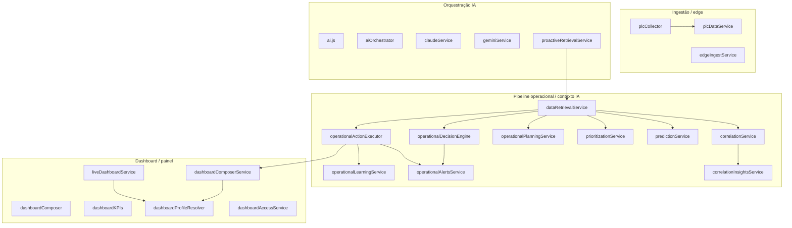

# Mapa de arquitectura — serviços backend (`src/services`)

Documento vivo para **controlo consciente da complexidade**: dependências internas, sobreposições de nome/responsabilidade, e sugestões de consolidação.  
Âmbito: **`backend/src/services`** (~200+ ficheiros `.js`, incluindo subpastas `manuiaApp/`, `plcAdapters/`, `realtimePresence/`, `kms/`).

---

## 1. Como usar este mapa

| Acção | Quando |
|--------|--------|
| **Antes de criar um serviço novo** | Procurar domínio na secção 3 e dependências na 4. |
| **Antes de duplicar lógica** | Ver secção 5 (duplicações / homónimos). |
| **Refactor incremental** | Seguir prioridades na secção 6, sem “big bang”. |

---

## 2. Visão por camadas (resumo)

*(Diagrama simplificado: muitos serviços ligam a `ai.js`, `db`, `documentContext` e políticas — ver secções seguintes.)*

---

## 3. Domínios e responsabilidades (inventário agrupado)

### 3.1 Operacional, correlação e plano

| Serviço | Responsabilidade principal |
|---------|----------------------------|
| `dataRetrievalService` | Orquestra `retrieveContextualData`: repositórios + plano + decisões + execução segura de acções. |
| `correlationService` | Correlaciona utilizadores, máquinas, eventos (base do “estado operacional”). |
| `correlationInsightsService` | Insights derivados da correlação (+ histórico temporal opcional). |
| `predictionService` | Riscos / predição a partir de eventos e correlação. |
| `prioritizationService` | Priorização de riscos (usa aprendizagem operacional). |
| `operationalPlanningService` | Gera `operational_plan` e insights temporais/heurísticos. |
| `operationalDecisionEngine` | Avalia plano → gatilhos, alertas lógicos, recomendações; persiste alertas + learning (assíncrono). |
| `operationalActionExecutor` | Efeitos seguros: mensagens, tarefas, alertas SQL, traços learning, interações dashboard. |
| `operationalAlertsService` | CRUD/check de alertas `operational_alerts`; dedupe motor de decisão. |
| `operationalLearningService` | Resumos e outcomes de aprendizagem operacional (volume grande). |
| `operationalInsightsService` | Insights operacionais agregados (consumo por outros módulos). |
| `operationalForecastingService` / `operationalForecastingAI` | Previsão ligada a mapa industrial, custos, leakage. |
| `operationalAnomalyDetectionService` | Deteção de anomalias (worker dedicado no `package.json`). |
| `operationalRealtimeCoordinator` | Coordenação de fluxos tempo-real operacionais. |
| `industrialOperationalMapService` | Mapa industrial; liga a `operationalKnowledgeMapService`, `machineBrainService`. |
| `operationalKnowledgeMapService` | Grafo de conhecimento operacional. |
| `machineBrainService` | “Cérebro” por máquina / contexto de ativo. |
| `machineMonitoringService` | Monitorização de máquinas. |

### 3.2 Dashboard, KPIs e personalização

| Serviço | Responsabilidade principal |
|---------|----------------------------|
| `liveDashboardService` | Snapshot ao vivo (tarefas, alertas, PLC, etc.). |
| `dashboardComposerService` | **Payload do dashboard inteligente**: perfil, permissões, personalização, gravação de uso em BD. |
| `dashboardComposer` | **Composição de superfície “live”** a partir de `eventEngine` / `relevanceEngine` (blocos UI). |
| `dashboardKPIs` | Cálculo/agregação de KPIs; liga a `productionRealtimeService`, filtros. |
| `dashboardProfileResolver` | Resolve configuração de dashboard por utilizador/papel. |
| `dashboardAccessService` | Regras de acesso ao dashboard. |
| `hierarchicalFilter` | Filtros hierárquicos reutilizados em KPIs e proação. |
| `dashboardPersonalizadoService` / `dashboardMaintenanceService` / `dashboardOnboardingService` | Camadas de personalização, manutenção e onboarding. |
| `dashboardWidgetRegistry`, `dashboardInsightBuilder`, `dashboardAlertBuilder`, `dashboardFallbackBuilder`, `dashboardVisibility`, `dashboardPersonalizationEngine` | Peças do pipeline de widgets/insights. |
| `smartPanelCommandService` | Comandos de painel inteligente (usa `dashboardComposerService`). |

**Nota:** `dashboardComposer` ≠ `dashboardComposerService` (homónimo intencionalmente distinto — ver secção 5).

### 3.3 IA, chat e voz

| Serviço | Responsabilidade principal |
|---------|----------------------------|
| `ai.js` | Núcleo de chamadas ao modelo + contexto (`documentContext`); billing opcional. |
| `aiOrchestrator` | Escolha entre `ai`, `claudeService`, `geminiService`. |
| `aiProviderService` | Abstracção de fornecedor. |
| `claudeService` / `geminiService` | Integrações específicas (tokens, billing). |
| `chatService` / `chatAIService` / `multimodalChatService` | Chat e multimodal. |
| `impetusVoiceChatService` / `openaiVozService` / `voiceTtsService` / `googleTtsCore` | Voz e TTS. |
| `impetusAIGovernancePolicy` | Política e prompts de sistema (constantes / guardrails). |
| `smartSummary` | Resumos inteligentes com perfil e insights. |
| `manuiaLiveAssistanceService` | Assistência ao vivo ManuIA. |
| `pulseAI` / `pulseService` / `pulseOperationalSnapshot` | Pulse e snapshots operacionais com IA. |

### 3.4 Política, compliance e incidentes

| Serviço | Responsabilidade principal |
|---------|----------------------------|
| `policyLayer` | Gate de políticas (ex.: análise operacional autónoma). |
| `policyEngineService` / `policyEnforcementService` / `policyHardeningService` | Motor, enforcement e regras endurecidas. |
| `aiPolicyService` | Políticas de IA persistidas. |
| `complianceDecisionService` / `complianceAnonymizerService` / `complianceReportingService` | Decisões, anonymização, relatórios. |
| `aiComplianceEngine` / `adaptiveGovernanceEngine` | Motores de compliance e governação adaptativa. |
| `humanValidationClosureService` | Fecho de validação humana (HITL). |
| `aiIncidentService` | Ciclo de vida de incidentes de IA (criação, listagens admin). |
| `aiIncidentGovernanceService` | Métricas e listagens para portal de governação. |
| `governanceAlertService` | Alertas / webhooks de governação (usa incidentes). |
| `aiPromptGuardService` / `aiEgressGuardService` / `aiComplaintDetectionService` / `aiComplaintChatBridge` | Guardas e reclamações ligadas a incidentes. |
| `aiAnalyticsService` | Telemetria / analytics de chamadas IA; liga incidentes. |

### 3.5 Sessão e contexto unificado

| Serviço | Responsabilidade principal |
|---------|----------------------------|
| `unifiedSessionContextService` | **Fachada única**: combina memória TTL + PostgreSQL. |
| `contextSessionService` | Estado multi-turn em **memória** (TTL, sanitização). |
| `sessionContextService` | Cache quente + **persistência** via repositório. |

Não são redundantes: são **camadas** (fachada → RAM → BD).

### 3.6 Armazém, logística, qualidade, RH

| Serviço | Responsabilidade principal |
|---------|----------------------------|
| `warehouseService` | Operações de armazém (dados base). |
| `warehouseIntelligenceService` | IA / perfis inteligentes de armazém (consume `warehouseService`, eventos ManuIA). |
| `logisticsIntelligenceService` | Inteligência logística. |
| `qualityIntelligenceService` | Qualidade + lotes (pattern semelhante aos outros “*Intelligence*”). |
| `hrIntelligenceService` | RH (carregamento opcional em `centralIndustryAIService`). |
| `rawMaterialLotDetectionService` | Lotes matéria-prima (referenciado por TPM/qualidade/proação). |

### 3.7 ManuIA (`services/manuiaApp/`)

| Serviço | Responsabilidade principal |
|---------|----------------------------|
| `manuiaAppRepository` | Acesso a dados ManuIA. |
| `manuiaAvailabilityService` / `manuiaAlertDecisionService` | Disponibilidade e decisão de alertas. |
| `manuiaAiSummaryService` | Resumos. |
| `manuiaWebPushService` | Push web. |
| `manuiaInboxIngestService` / `manuiaEventDispatchService` | Ingestão inbox e dispatch de eventos. |
| `manuiaRecipientResolverService` | Resolução de destinatários. |

Vários serviços “enterprise” disparam `manuiaEventDispatchService` de forma lazy (`require` dentro de função).

### 3.8 PLC / edge

| Serviço | Responsabilidade principal |
|---------|----------------------------|
| `plcCollector` / `plcDataService` / `plcAi` | Recolha, persistência e IA sobre PLC. |
| `plcAdapters/adapterFactory` + `modbusAdapter` / `opcuaAdapter` / `restAdapter` | Adaptadores de protocolo. |

### 3.9 Billing, Nexus, integrações

| Serviço | Responsabilidade principal |
|---------|----------------------------|
| `nexusWalletService` / `billingTokenService` / `asaasService` | Carteira, tokens, Asaas. |
| `mesErpIntegrationService` | MES/ERP. |
| `emailService` / `unifiedMessagingService` / `appCommunicationService` | Mensagens e comunicação. |

### 3.10 Decisão (genérica vs operacional)

| Serviço | Responsabilidade principal |
|---------|----------------------------|
| `decisionEngineService` | **Decisão ética/ponderada** entre opções com scores e `humanRisk` (ex.: rota indústria central). |
| `operationalDecisionEngine` | **Decisão sobre plano operacional** (gatilhos, alertas, recomendações, persistência). |

Nomes parecidos, **domínios diferentes** — unificação só com cautela (risco de misturar ética HITL com OM).

---

## 4. Dependências recorrentes (hubs)

| Módulo | Papel |
|--------|--------|
| `ai.js` | Hub de LLM; muitos serviços dependem dele. |
| `documentContext.js` | Contexto documental para prompts. |
| `../db` (via serviços) | PostgreSQL. |
| `dashboardProfileResolver` + `dashboardAccessService` | ParDashboard / permissões. |
| `userContext` | Utilizador corrente e escopo. |
| `strategicLearningService` | Traços leves assíncronos (decisões / motor operacional). |
| `operationalLearningService` | Aprendizagem operacional pesada / outcomes. |
| `governanceAlertService` | Encadeamento com `aiIncidentService`. |

---

## 5. Duplicações, homónimos e risco de complexidade

| Padrão | Observação |
|--------|------------|
| **`*IntelligenceService`** (warehouse, logistics, quality, hr, …) | Estrutura paralela: bom para equipas por domínio; risco de copy-paste em dispatch ManuIA / `ai` — candidato a **classe base ou helper** partilhado (ex.: “dispatch opcional + perfil dashboard”). |
| **`dashboardComposer` vs `dashboardComposerService`** | **Homónimo crítico**: primeiro compõe **eventos→blocos**; segundo compõe **perfil+BD+uso**. Sugestão: renomear para `liveDashboardBlockComposer` / `dashboardIntelligencePayloadService` em refactor futuro. |
| **`decisionEngineService` vs `operationalDecisionEngine`** | Dois “motores de decisão”; semântica diferente — **manter separados**; documentar no README de serviços. |
| **Sessão: 3 ficheiros** | Já há fachada (`unifiedSessionContextService`); evitar novos acessos directos a `contextSessionService` fora da fachada. |
| **`policy*` + `compliance*` + `ai*Governance*`** | Superfície grande; risco de regras dispersas — ver unificação em “camada de policy única” (secção 6). |
| **ManuIA: `require` lazy repetido** | O mesmo padrão aparece em vários `*Intelligence*` e `plcDataService`; extrair helper `safeRequireManuiaDispatch()` reduz linhas e erros. |

---

## 6. Serviços “redundantes” e sugestão de unificação

Prioridade = impacto na claridade / manutenção, não urgência operacional.

| Prioridade | Sugestão | Benefício |
|------------|----------|-----------|
| **P1** | Renomear (`dashboardComposer` ou `dashboardComposerService`) para eliminar homónimo. | Menos onboarding errado, menos bugs de import. |
| **P2** | Extrair **adapter comum** para serviços `*IntelligenceService`* que repetem `ai` + `manuiaEventDispatchService`. | Menos duplicação, comportamento consistente. |
| **P2** | Centralizar documentação de **política** (`policyLayer` + `policyEngineService` + README curto “ordem de avaliação”). | Reduz decisões contraditórias entre módulos. |
| **P3** | Avaliar fusão **observability + aiAnalytics** apenas se métricas/traces convergirem (hoje com propósitos ligados mas não idênticos). | Só após auditoria de chamadas. |
| **Evitar** | Fundir `operationalDecisionEngine` com `decisionEngineService`. | Mistura ética/HITL com plano OM. |

---

## 7. Checklist para novos contributos

1. O domínio já existe na tabela da secção 3?  
2. O hub `ai.js` / `dataRetrievalService` já expõe o hook necessário?  
3. Há homónimo de nome com responsabilidade diferente?  
4. Dependências novas introduzem ciclo (serviço A→B→A)? Usar `require` lazy ou mover para repositório.  
5. Para alertas persistentes: preferir **`operationalAlertsService`** em vez de novo módulo SQL.

---

## 8. Manutenção deste ficheiro

- **Actualizar** quando se criar serviço transversal ou se renomear compositores (`dashboardComposer*`).  
- **Revisão sugerida**: a cada release maior ou quando `src/services` crescer >10% em ficheiros.

---

*Gerado como base para governação de complexidade; ajustar linhas de inventário quando módulos forem deprecados ou fundidos.*
