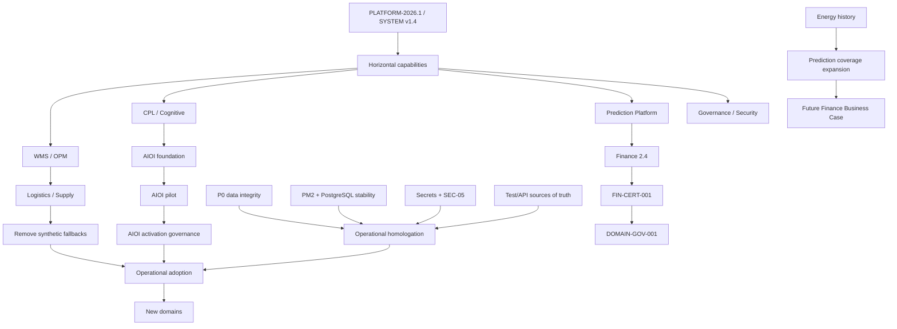

# ENT-AUD-002 — Dependency Graph

## Bloqueios

- Novos domínios dependem do fechamento P0/P1 e homologação operacional.
- AIOI activation depende de piloto, governança, queue precedence e observabilidade.
- Prediction energética depende de histórico energético certificado; não bloqueia Wave 1.
- Supply business activation depende de decisão explícita de flags e readiness externo.
- Projetos verticais futuros dependem de Business Case e Capability Reuse Checklist.

## Dependências a evitar

- domínio → motor preditivo próprio;
- UI → dados sintéticos como fallback;
- certificado → suposição automática de runtime ativo;
- roadmap antigo → decisão sem reconciliação com baseline atual;
- código frontend → segredo ou decisão de autorização.

